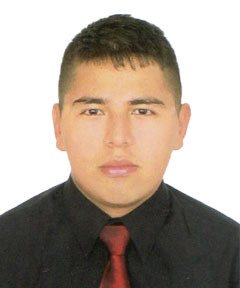

# Capítulo I: Introducción

El presente capítulo introduce el contexto general del proyecto **QualiTrack**, una solución tecnológica desarrollada por la startup **IoTech** y orientada a mejorar el monitoreo y control de las condiciones ambientales en laboratorios y almacenes farmacéuticos.

En este tipo de instalaciones es necesario mantener condiciones adecuadas para proteger los procesos, materias primas, insumos y productos almacenados. Sin embargo, cuando la supervisión depende principalmente de revisiones manuales o de sistemas que trabajan de manera independiente, una variación importante en factores como la temperatura o la humedad puede no ser detectada o atendida oportunamente.

Frente a esta situación, QualiTrack propone integrar dispositivos IoT capaces de medir continuamente las condiciones del ambiente y actuar automáticamente cuando se detecten valores fuera de los rangos establecidos. Para ello, se plantea el uso de sensores que permitan obtener información como temperatura, humedad y calidad del aire, junto con actuadores capaces de ejecutar acciones como activar ventilación, abrir una compuerta o generar alertas visuales y sonoras.

La información obtenida por los dispositivos será procesada y posteriormente registrada en la plataforma QualiTrack, permitiendo que los responsables de laboratorios y almacenes puedan consultar el estado de las diferentes áreas, revisar mediciones anteriores, recibir alertas y conocer las acciones realizadas por los dispositivos.

De esta manera, el proyecto busca evolucionar QualiTrack hacia una solución IoT que combine monitoreo, respuesta automática y gestión de información, contribuyendo a reducir la dependencia de controles manuales y mejorar la trazabilidad de las condiciones ambientales dentro de instalaciones farmacéuticas.

### 1.1. Startup Profile

En esta sección se presenta el perfil de **IoTech**, startup responsable del desarrollo de QualiTrack. Se describen su propósito, enfoque tecnológico, misión y visión, así como los perfiles de los integrantes que participan en el desarrollo del proyecto.

IoTech busca desarrollar soluciones tecnológicas que permitan conectar el mundo físico con plataformas digitales, utilizando dispositivos IoT para obtener información del entorno, procesarla y generar acciones que permitan responder ante diferentes situaciones.

Dentro de este enfoque, la startup desarrolla QualiTrack como una solución dirigida al sector farmacéutico, buscando mejorar la manera en que laboratorios y almacenes supervisan las condiciones de sus instalaciones y mantienen un registro de los eventos que ocurren en ellas.

#### 1.1.1. Descripción de la Startup

**IoTech** es una startup tecnológica dedicada al desarrollo de soluciones basadas en Internet of Things (IoT) para organizaciones de diferentes industrias. Su enfoque se centra en integrar dispositivos inteligentes, sensores, conectividad, software y procesamiento de datos para apoyar la supervisión, control y automatización de procesos que requieren información constante y respuestas oportunas.

La startup desarrolla soluciones capaces de recopilar información del entorno en tiempo real, procesarla y convertirla en datos útiles para las organizaciones. 

Además del monitoreo, IoTech busca que sus sistemas puedan responder automáticamente ante determinadas condiciones mediante dispositivos conectados, permitiendo ejecutar acciones previamente definidas y reducir la dependencia de intervenciones exclusivamente manuales.

Sus soluciones integran dispositivos IoT con servicios backend, aplicaciones web y móviles, permitiendo centralizar la información, registrar eventos y acciones ejecutadas, facilitar la trazabilidad de los procesos y apoyar la toma de decisiones. 

IoTech busca desarrollar tecnologías confiables y adaptables a las necesidades particulares de cada organización, especialmente en procesos donde el monitoreo continuo, la precisión de los datos y la capacidad de respuesta son importantes para mantener la eficiencia y calidad de las operaciones.

##### Misión

Desarrollar soluciones IoT que ayuden a las organizaciones a monitorear, controlar y automatizar sus procesos mediante la integración de dispositivos conectados, software y datos, facilitando la detección de situaciones relevantes, la ejecución de respuestas oportunas y una mejor toma de decisiones.

##### Visión

Ser una startup tecnológica reconocida en Latinoamérica por el desarrollo de soluciones IoT innovadoras, confiables y adaptables que permitan a organizaciones de diferentes industrias mejorar la supervisión, automatización y gestión de sus procesos.

#### 1.1.2. Perfiles de integrantes del equipo

<table border="1" width="100%">

  <tr>
    <td width="140" valign="top" align="center">
      
    </td>
    <td valign="top">
      <strong>Billy Jake Ruiz Madrid - (U202116401)</strong> - Ingeniería de Software  
      Tengo 22 años, soy una persona tranquila, colaborativa y adaptable. Me gusta trabajar en equipo, aportando ideas y soluciones. Cuento con conocimientos en C++, Python y desarrollo de software, y siempre busco formas de hacer las cosas de manera eficiente. Además, me interesa seguir aprendiendo nuevas tecnologías y aplicar mis conocimientos en el desarrollo de soluciones que aporten valor al proyecto.
    </td>
  </tr>

  <tr>
    <td width="140" height="150" valign="top" align="center">
        
    </td>
    <td valign="top">
      <strong>Vitaly Baca Camargo Arturo - (u20231c426)</strong> - Ingeniería de Software  
      Tengo 21 años y soy una persona tranquila, colaborativa y adaptable. Me gusta trabajar en equipo, aportar ideas y buscar soluciones eficientes a los problemas que se presentan. Cuento con conocimientos en desarrollo Backend utilizando Java y Node.js, así como en desarrollo móvil con Flutter y Kotlin. También tengo conocimientos en diseño UX/UI y en Domain-Driven Design (DDD), lo que me permite tener una visión más completa del desarrollo de software. Me interesa seguir aprendiendo nuevas tecnologías y aplicar mis conocimientos para desarrollar soluciones eficientes que aporten valor a cada proyecto.
    </td>
  </tr>

  <tr>
    <td width="140" height="150" valign="top" align="center">
      
    </td>
    <td valign="top">
      <strong>Fabrizio Alexander Cutiri Agüero - (U201914181)</strong> - Ingeniería de Software  
      Soy estudiante de Ingeniería de Software, responsable, puntual y con facilidad para adaptarme a diferentes situaciones y entornos de trabajo. Me apasiona la tecnología y disfruto diseñar y desarrollar soluciones innovadoras que ayuden a resolver problemas reales. Cuento con conocimientos en arquitectura de software, tanto en monolito como microservicios, aplico el enfoque Domain-Driven Design y desarrollo de aplicaciones web y móviles, abarcando tanto frontend como backend. Me interesa seguir fortaleciendo mis habilidades técnicas, aprender nuevas tecnologías y participar en proyectos donde pueda aplicar buenas prácticas de desarrollo y aportar soluciones de valor para las personas y organizaciones.
    </td>
  </tr>

  <tr>
    <td width="140" height="150" valign="top" align="center">
      <!-- Foto del integrante -->
    </td>
    <td valign="top">
      <strong>[Nombres y Apellidos] - ([Código UPC])</strong> - Ingeniería de Software  
      [Descripción del integrante]
    </td>
  </tr>

  <tr>
    <td width="140" height="150" valign="top" align="center">
      <!-- Foto del integrante -->
    </td>
    <td valign="top">
      <strong>[Nombres y Apellidos] - ([Código UPC])</strong> - Ingeniería de Software  
      [Descripción del integrante]
    </td>
  </tr>

  <tr>
    <td width="140" height="150" valign="top" align="center">
      <!-- Foto del integrante -->
    </td>
    <td valign="top">
      <strong>[Nombres y Apellidos] - ([Código UPC])</strong> - Ingeniería de Software  
      [Descripción del integrante]
    </td>
  </tr>

  <tr>
    <td width="140" height="150" valign="top" align="center">
      <!-- Foto del integrante -->
    </td>
    <td valign="top">
      <strong>[Nombres y Apellidos] - ([Código UPC])</strong> - Ingeniería de Software  
      [Descripción del integrante]
    </td>
  </tr>

  <tr>
    <td width="140" height="150" valign="top" align="center">
      <!-- Foto del integrante -->
    </td>
    <td valign="top">
      <strong>[Nombres y Apellidos] - ([Código UPC])</strong> - Ingeniería de Software  
      [Descripción del integrante]
    </td>
  </tr>

</table>

### 1.2. Solution Profile

#### 1.2.1. Antecedentes y problemáticas

**1. ANTECEDENTES**

La industria farmacéutica requiere altos niveles de control y supervisión debido a que cualquier desviación durante la fabricación, análisis o almacenamiento de un producto puede afectar su calidad, seguridad y eficacia. En el Perú, la Dirección General de Medicamentos, Insumos y Drogas (DIGEMID) es la autoridad sanitaria encargada de regular, vigilar y fiscalizar los productos farmacéuticos y los establecimientos involucrados en estos procesos. Como parte de estas exigencias, los establecimientos deben cumplir con las Buenas Prácticas de Manufactura (BPM) y, cuando corresponda, con las Buenas Prácticas de Almacenamiento (BPA), las cuales contemplan aspectos relacionados con el control de procesos, equipos, condiciones ambientales, documentación y trazabilidad.

La relevancia de estos controles puede observarse en las actividades de fiscalización realizadas por DIGEMID. Entre noviembre de 2025 y mayo de 2026 se evaluaron 51 laboratorios farmacéuticos mediante inspecciones internacionales. De estos, 20 obtuvieron la certificación de Buenas Prácticas de Manufactura, mientras que 21 no alcanzaron la certificación, 3 presentaron observaciones parciales y 7 desistieron del proceso. Por lo tanto, el 41,2 % de los laboratorios evaluados no alcanzó la certificación y, considerando también las observaciones parciales y desistimientos, el 60,8 % no culminó dicha evaluación obteniéndola **(DIGEMID, 2026)**.

Asimismo, en julio de 2026 DIGEMID reunió a representantes de 120 laboratorios nacionales, entre ellos 43 fabricantes de productos farmacéuticos, para abordar las principales observaciones y oportunidades de mejora encontradas durante las actividades de inspección, certificación y vigilancia realizadas desde 2025. Entre los aspectos analizados estuvieron el control de calidad, la calificación de equipos y el aseguramiento de la calidad, demostrando que el fortalecimiento de los procesos de control continúa siendo una necesidad vigente en el sector **(DIGEMID, 2026)**.

Dentro de este contexto, una parte importante de las operaciones farmacéuticas requiere supervisar variables y condiciones que deben mantenerse dentro de determinados parámetros. Estas pueden incluir temperatura, humedad, presión u otras variables dependiendo del área, equipo o proceso involucrado. Cuando su supervisión depende de revisiones periódicas, registros manuales o sistemas independientes, pueden producirse retrasos entre la aparición de una desviación, su detección y la ejecución de una acción correctiva.

**2. PROBLEMÁTICA**

La problemática se centra en las dificultades para supervisar continuamente variables críticas, detectar oportunamente condiciones fuera de los parámetros establecidos y actuar ante ellas, además de mantener un registro centralizado y trazable de las mediciones, incidencias y acciones realizadas.

**Riesgo de errores humanos en registros críticos:** Cuando variables como temperatura, humedad, presión o pH son revisadas y posteriormente transcritas de manera manual, existe la posibilidad de errores de registro, omisiones o información ingresada fuera del momento en que ocurrió la actividad. Estas inconsistencias dificultan comprobar posteriormente las condiciones reales bajo las cuales se desarrolló determinado proceso.

**Detección tardía de desviaciones:** Cuando el control depende de revisiones periódicas, una desviación puede producirse entre una verificación y otra sin ser detectada inmediatamente. Esto genera un intervalo durante el cual una condición puede permanecer fuera de los parámetros esperados antes de que el personal tenga conocimiento de ella.

**Dependencia de la intervención humana para responder:** La detección de una desviación tampoco garantiza necesariamente una respuesta inmediata. En procesos donde los equipos de monitoreo y los mecanismos capaces de modificar las condiciones funcionan de manera independiente, una persona debe identificar el problema y posteriormente ejecutar la acción correspondiente. Por ello, la problemática no comprende únicamente la capacidad de supervisar una variable, sino también el tiempo que transcurre entre la detección de una situación anómala y la ejecución de una acción para responder ante ella.

**Trazabilidad fragmentada de la información:** Cuando las mediciones, incidencias y acciones correctivas se registran en diferentes medios, resulta más difícil reconstruir cronológicamente un evento. El personal puede tener que consultar diferentes fuentes para determinar qué variable presentó una desviación, cuándo ocurrió, cuánto tiempo permaneció fuera del rango esperado y qué acciones se realizaron. Esta fragmentación también incrementa el esfuerzo necesario para recuperar y relacionar la información solicitada durante revisiones internas, investigaciones de desviaciones, auditorías o inspecciones regulatorias.

**Análisis 5W + 2H**

**What (¿Qué problema existe?)**

Los laboratorios farmacéuticos presentan dificultades para supervisar continuamente variables críticas  en determinadas áreas, detectar oportunamente condiciones fuera de los parámetros establecidos y ejecutar respuestas ante ellas. Además, las mediciones, incidencias y acciones realizadas pueden quedar distribuidas entre distintos registros, dificultando su trazabilidad.

**Why (¿Por qué es un problema?)**

Porque determinados procesos y productos requieren mantenerse bajo condiciones controladas. Una desviación que no sea detectada o atendida oportunamente puede prolongar la exposición a condiciones inadecuadas y generar posteriormente la necesidad de investigar lo ocurrido y determinar sus posibles consecuencias.

**Who (¿Quiénes se encuentran afectados?)**

El problema afecta directamente a los operarios y técnicos encargados de supervisar equipos y condiciones del entorno; a los analistas de control de calidad, responsables de verificar parámetros y resultados; y al personal de Aseguramiento de la Calidad (Quality Assurance), encargado de revisar desviaciones, verificar el cumplimiento de los procedimientos y mantener la documentación asociada.

También afecta a supervisores, jefes de producción, responsables de almacén y responsables técnicos o directores técnicos, quienes necesitan disponer de información confiable para supervisar las operaciones, investigar incidencias y sustentar el cumplimiento de los procedimientos durante auditorías e inspecciones.

**When (¿Cuándo ocurre?)**

La problemática puede presentarse durante las actividades que requieren mantener variables dentro de determinados parámetros, especialmente en áreas de producción, control de calidad, esterilización y almacenamiento.

El riesgo aumenta entre una revisión manual y la siguiente, cuando una desviación puede producirse sin ser detectada inmediatamente, y también después de una incidencia, cuando es necesario determinar cuándo ocurrió, cuánto tiempo duró y qué medidas fueron tomadas.

**Where (¿Dónde ocurre?)**

Se presenta principalmente en áreas de producción y fabricación, laboratorios de control de calidad, zonas de esterilización, cámaras o ambientes con condiciones controladas y almacenes de materias primas, insumos y productos farmacéuticos.

Estas áreas pueden requerir la supervisión de diferentes variables según las características del proceso, los equipos utilizados o las condiciones necesarias para conservar adecuadamente los productos.

**How (¿Cómo se manifiesta?)**

El problema se manifiesta mediante revisiones periódicas de equipos o instrumentos, transcripción manual de mediciones, registros almacenados en diferentes medios y ausencia de una relación directa entre la detección de una desviación y los mecanismos capaces de responder ante ella.

Como consecuencia, pueden presentarse errores u omisiones en los registros, detecciones tardías, dependencia de la disponibilidad del personal para atender incidencias y dificultades para reconstruir posteriormente lo sucedido.

**How much (¿Cuánto afecta el problema?)**

La magnitud de las dificultades relacionadas con el cumplimiento de las Buenas Prácticas puede observarse en las inspecciones realizadas por DIGEMID: de los 51 laboratorios evaluados entre noviembre de 2025 y mayo de 2026, solo 20 obtuvieron la certificación correspondiente en dicha evaluación **(DIGEMID, 2026)**.

Un caso de mayor impacto sobre el mercado peruano se produjo en 2025, cuando el Ministerio de Salud identificó 239 productos farmacéuticos cuyos laboratorios fabricantes no habían aprobado las inspecciones de Buenas Prácticas de Manufactura realizadas por DIGEMID. Como consecuencia de la revisión, se dispuso inicialmente la suspensión del registro sanitario de 57 productos y se anunció el retiro del registro de un segundo grupo de 50 productos **(Andina, 2025)**.

Si bien estos resultados no significan que los incumplimientos hayan sido causados específicamente por fallas en el monitoreo de temperatura, humedad u otras variables, permiten evidenciar las consecuencias que pueden alcanzar las deficiencias en el cumplimiento de los controles requeridos dentro de la industria farmacéutica.

#### 1.2.2. Lean UX Process

##### 1.2.2.1. Lean UX Problem Statements

##### 1.2.2.2. Lean UX Assumptions

##### 1.2.2.3. Lean UX Hypothesis Statements

##### 1.2.2.4. Lean UX Canvas

### 1.3. Segmentos objetivo
