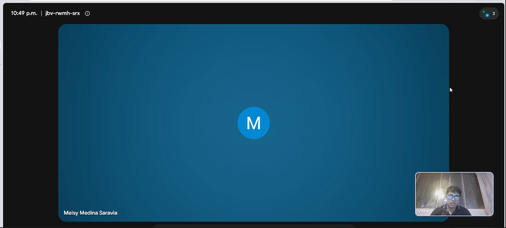

# Capítulo II: Requirements Elicitation & Analysis

## 2.1. Competidores

Tener en cuenta el entorno competitivo es importante para identificar nuestros puntos fuertes y debiles frente a competidores. Este análisis permite identificar cómo nuestros competidores gestionan los procesos de calidad en los laboratorios farmaceuticos con o sin usar dispositivos IoT y qué limitaciones presentan sus soluciones existentes.

En esta etapa, se analizan distintos tipos de competidores con el objetivo de entender sus fortalezas y debilidades, y así posicionar a QualiTrack como una propuesta que responda de manera más efectiva a las necesidades reales del sector.

### 2.1.1. Análisis competitivo

Para desarrollar una solución realmente útil, es fundamental comprender el entorno competitivo y las alternativas que actualmente utilizan los laboratorios farmacéuticos para la gestión de la calidad. Este análisis permite identificar no solo cómo se gestionan hoy estos procesos, sino también las principales limitaciones de las soluciones existentes.

En esta etapa, se analizan distintos tipos de competidores con el objetivo de entender sus fortalezas, debilidades y enfoques de mercado, y así definir con claridad el posicionamiento de QualiTrack como una solución diferenciada dentro del sector farmacéutico.

A continuación, se presenta una comparación de los principales competidores considerando su propuesta de valor, mercado objetivo y características generales. Este análisis permite evidenciar que, mientras las soluciones existentes se orientan a grandes corporaciones o dependen de procesos manuales, QualiTrack se posiciona como una alternativa especializada, accesible y centrada en la automatización del aseguramiento de la calidad mediante integración IoT y trazabilidad digital, especialmente pensada para laboratorios pequeños, medianos y entidades públicas de la región.

<table border="1" cellpadding="10" cellspacing="0" style="margin-left: auto; margin-right: auto; font-family: sans-serif;">
<tr>
<th colspan="6">Panorama del análisis competitivo</th>
</tr>
<tr>
<td colspan="2" rowspan="2"><b>¿Por qué llevar a cabo este análisis?</b></td>
<td colspan="4">¿Cómo se posiciona QualiTrack frente a sus competidores en cuanto a fortalezas, debilidades, oportunidades y su propuesta de valor dentro del mercado de gestión de calidad farmacéutica?</td>
</tr>
<tr>
<td colspan="4">Es una propuesta que posiciona a QualiTrack como una plataforma SaaS orientada a la gestión de calidad farmacéutica, incorporando integración IoT para automatizar la captura de datos, realizar cambios de las variables de entorno del laboratorio en tiempo real, mejorar la trazabilidad y asegurar el cumplimiento normativo frente a otras soluciones del mercado.</td>
</tr>
<tr>
<td colspan="2" style="text-align: center;"><b>Competidores</b></td>
<td style="text-align: center; vertical-align: middle;">
<b>QualiTrack</b>

</td>
<td style="text-align: center; vertical-align: middle;">
<b>Elemental Machines</b>

</td>
<td style="text-align: center; vertical-align: middle;">
<b>LabWare (LIMS)</b>

</td>
<td style="text-align: center; vertical-align: middle;">
<b>Métodos tradicionales</b>

</td>
</tr>
<tr>
<td rowspan="2"><b>Perfil</b></td>
<td>Overview</td>
<td>Plataforma SaaS enfocada en la gestión de calidad farmacéutica con integración IoT y trazabilidad en tiempo real.</td>
<td>Plataforma de monitoreo IoT para laboratorios y plantas de manufactura en ciencias de la vida, combinando sensores propios con software de análisis.</td>
<td>Software especializado en gestión de la información de laboratorios (LIMS).</td>
<td>Alternativa más extendida entre laboratorios farmacéuticos pequeños y medianos. Registros en papel y hojas de cálculo (Excel).</td>
</tr>
<tr>
<td>Ventaja competitiva</td>
<td>Integración de dispositivos IoT con un enfoque en normativas locales, control fuera del area de trabajo y un modelo SaaS accesible.</td>
<td>Integración propia de hardware y software con analítica predictiva basada en Inteligencia Artificial.</td>
<td>Especialización en procesos de laboratorio (Cuaderno electrónico, aplicación móvil, analítica y sistema de ejecución de laboratorio).</td>
<td>Muy bajo costo y facilidad de uso, incluso para el nuevo personal.</td>
</tr>
<tr>
<td rowspan="2"><b>Perfil de Marketing</b></td>
<td>Mercado objetivo</td>
<td>Laboratorios pequeños, medianos y entidades públicas en LATAM.</td>
<td>Laboratorios de investigación y grandes farmacéuticas en EE.UU.</td>
<td>Laboratorios medianos a grandes y multinacionales de varias industrias.</td>
<td>Opción por defecto en laboratorios pequeños y algunas entidades públicas.</td>
</tr>
<tr>
<td>Estrategias de marketing</td>
<td>Venta B2B, enfoque en cumplimiento regulatorio y precios accesibles.</td>
<td>Muestra de casos de uso e integraciones con partners del ecosistema de laboratorio y eventos de ciencias de la vida.</td>
<td>Alianzas estratégicas, conferencias y casos de éxito.</td>
<td>Costumbre de algunas organizaciones que no desean adaptar nuevas tecnologías de monitoreo.</td>
</tr>
<tr>
<td rowspan="3"><b>Perfil de Producto</b></td>
<td>Productos & Servicios</td>
<td>Dispositivo IoT multifuncional, plataforma web con dashboards, monitoreo en tiempo real y alertas.</td>
<td>Dispositivos IoT personalizados, plataforma Cloud con alertas y análisis de datos recolectados.</td>
<td>Sistema estructurado de gestión de laboratorio con distintas funcionalidades.</td>
<td>Registros manuales o digitales básicos.</td>
</tr>
<tr>
<td>Precios & Costos</td>
<td>Suscripción SaaS escalable.</td>
<td>Costos elevados de implementación y suscripción.</td>
<td>Licencias costosas dependiendo del tipo de laboratorio e industria.</td>
<td>Muy bajo costo, pero con costos ocultos en tiempo de personal y mayor probabilidad de error humano.</td>
</tr>
<tr>
<td>Canales de distribución</td>
<td>Web, nube e integración con dispositivos IoT.</td>
<td>Venta directa, previa consulta en página web.</td>
<td>Venta directa con oficinas en varios paises.</td>
<td>Uso interno.</td>
</tr>
<tr>
<td rowspan="5"><b>Análisis SWOT</b></td>
</tr>
<tr>
<td>Fortalezas</td>
<td>Integración IoT con respuesta en tiempo real, trazabilidad en tiempo real, accesibilidad SaaS y enfoque en normativas locales.</td>
<td>Producto IoT validado en el sector, fuerte enfoque en cumplimiento de buenas prácticas.</td>
<td>Marca global con mas de 30 años en el negocio, producto altamente configurable en varios entornos.</td>
<td>Ninguna inversión, sin dependencia de proveedores externos.</td>
</tr>
<tr>
<td>Debilidades</td>
<td>Producto nuevo, dependencia de hardware, adopción del usuario.</td>
<td>Orientado a mercados desarrollados, sin presencia comercial ni soporte localizado en Latinoamérica</td>
<td>Costos elevados, larga implementación y baja accesibilidad. Funcionalidad móvil limitada.</td>
<td>Alto riesgo de error y falta de trazabilidad. No permite monitoreo en tiempo real.</td>
</tr>
<tr>
<td>Oportunidades</td>
<td>Crecimiento de digitalización en salud y cumplimiento regulatorio.</td>
<td>Expansión hacia mercados emergentes que buscan monitoreo ambiental.</td>
<td>LabWare SaaS, su nuevo producto, tiene baja barrera de entrada.</td>
<td>Migración hacia soluciones digitales.</td>
</tr>
<tr>
<td>Amenazas</td>
<td>Competidores globales y resistencia al cambio.</td>
<td>Proveedores de sensores IoT de bajo costo y monitoreo básico.</td>
<td>Competencia SaaS más económica y moderna.</td>
<td>Regulaciones que exigen digitalización y control inmediato ante riesgos.</td>
</tr>
</table>

A partir del análisis comparativo, se identifican las siguientes diferencias clave:

- Frente a métodos tradicionales, QualiTrack propone la sustitución del registro manual por una plataforma digital que reduce el error humano y mejora la confiabilidad de la información.
- En comparación con Elemental Machines, QualiTrack evita implementaciones complejas y costosas, ofreciendo un modelo SaaS más accesible y adaptable a laboratorios que no cuentan con infraestructura empresarial avanzada.
- A diferencia de soluciones LIMS como LabWare, QualiTrack se enfoca específicamente en la gestión del aseguramiento de la calidad y el cumplimiento normativo durante la operación productiva, integrando datos en tiempo real desde los dispositivos IoT.

En conjunto, este análisis permite concluir que QualiTrack no compite directamente como un ERP o un LIMS tradicional, sino que ocupa un espacio diferenciado, orientado a resolver una problemática concreta del sector farmacéutico: la digitalización confiable del control de calidad bajo normativas locales a un costo accesible.

### 2.1.2. Estrategias y tácticas frente a competidores

Una vez identificados los actores del mercado y las principales diferencias entre las soluciones existentes, resulta necesario definir cómo QualiTrack puede fortalecer su posicionamiento competitivo y enfrentar los desafíos propios de ingresar a un mercado con opciones consolidadas y prácticas tradicionales ampliamente adoptadas.

Con este objetivo, se emplea la Matriz CAME, la cual permite transformar el análisis FODA en estrategias y acciones concretas. A través de esta herramienta, se plantean tácticas orientadas a potenciar las fortalezas diferenciales de QualiTrack, como la integración IoT, la trazabilidad digital y el enfoque en normativas locales, así como a mitigar debilidades propias de una startup en etapa inicial, como la necesidad de adopción progresiva y validación en el sector.

Las estrategias definidas buscan:
* Aprovechar la creciente necesidad de cumplimiento normativo y digitalización en el sector farmacéutico.
* Comunicar claramente el valor de la automatización y la integridad de datos frente a soluciones manuales o genéricas.
* Reducir la resistencia al cambio mediante interfaces simples, capacitación y acompañamiento.
* Posicionar a QualiTrack como una alternativa especializada y confiable para laboratorios medianos y entidades públicas.

Matriz CAME para el desarrollo de estrategias basadas en el análisis FODA.

| **Análisis FODA cruzado** | **Oportunidades** | **Amenazas** |
|---------------------------|------------------|--------------|
| **Fortalezas (F)** 1. Integración IoT para captura automática de datos con respuesta ante valores anormales en tiempo real. 2. Trazabilidad en tiempo real e inmutable. 3. Enfoque en normativas locales (DIGEMID). 4. Modelo SaaS accesible y escalable. | **Estrategia (FO) — Estrategias Ofensivas** 1. Establecer alianzas con laboratorios e instituciones de salud para implementar pilotos que validen la integración IoT y generen evidencia de reducción de errores. 2. Posicionar a QualiTrack como una solución especializada en cumplimiento normativo en LATAM, destacando su adaptación a DIGEMID. 3. Aprovechar el modelo SaaS para captar laboratorios medianos mediante planes accesibles y escalables. 4. Promover la automatización de procesos como principal ventaja competitiva frente a métodos manuales y sistemas aislados. 5. Impulsar campañas de concientización sobre la importancia de la integridad de datos en la industria farmacéutica. | **Estrategia (FA) — Estrategias Defensivas** 1. Fortalecer la seguridad e integridad de los datos mediante protocolos alineados a estándares regulatorios. 2. Brindar soporte técnico local y capacitación continua para facilitar la adopción del sistema. 3. Comunicar claramente el valor del cumplimiento normativo frente a soluciones genéricas o no especializadas. 4. Diseñar interfaces intuitivas que reduzcan la resistencia al cambio del personal operativo. 5. Difundir resultados de pilotos para generar confianza frente a competidores consolidados. |
| **Debilidades (D)** 1. Producto nuevo en el mercado. 2. Dependencia de integración con hardware (IoT). 3. Resistencia al cambio por parte de usuarios. 4. Limitada presencia inicial en el sector. | **Estrategia (DO) — Reorientación** 1. Implementar programas piloto en laboratorios para validar la propuesta de valor y generar casos de éxito. 2. Ofrecer capacitaciones y acompañamiento para facilitar la transición de procesos manuales a digitales. 3. Desarrollar una arquitectura modular que permita integrar IoT de forma progresiva. 4. Aprovechar la tendencia de digitalización del sector salud para impulsar la adopción del sistema. 5. Generar contenido técnico (casos de estudio, reportes) que respalde la efectividad de la solución. | **Estrategia (DA) — Supervivencia** 1. Reducir barreras de entrada mediante planes de bajo costo inicial y escalabilidad progresiva. 2. Simplificar la implementación técnica para minimizar la complejidad en nuevos clientes. 3. Enfocarse en nichos específicos como laboratorios medianos y sector público donde la competencia es menor. 4. Diferenciarse mediante una experiencia de usuario simple e intuitiva que facilite la adopción. 5. Establecer estrategias de crecimiento progresivo para consolidar presencia en el mercado antes de escalar. |

## 2.2. Entrevistas

Las entrevistas son clave para la metodología de diseño centrado en el usuario al permitirnos recolectar información cualitativa directamente de los actores que enfrentan la problematica identificada. A través del dialogo estructurado, se busca comprender las necesidades, comportamientos, frustaciones y expectativas de los segmentos objetivos, validando o refutando las hipótesis plantadas previamente.

### 2.2.1. Diseño de entrevistas

Teniendo en cuenta la importancia en la información que nos puede proveer los entrevistados, se presentan las preguntas clave para cada segmento objetivo. Para eso se considera dos tipos de preguntas: las personales, orientadas a conocer el perfil del entrevistado y las especificas, las cuales estan enfocadas en los procesos actuales, herramientas utilizadas, desafios operativos y expectativas frente a una solución tecnológica como QualiTrack.

#### **Preguntas Personales – Ambos Segmentos:**

*1.	¿Cuál es su nombre?* 

*2.	¿Qué edad tiene?* 

*3.	¿En qué distrito, provincia o ciudad reside actualmente?* 

*4.	¿Cuál es su cargo o función dentro del laboratorio?* 

*5.	¿Cuántos años de experiencia tiene trabajando en el sector farmacéutico?* 

*6.	¿Cuáles son sus principales responsabilidades dentro de su puesto?* 

*7.	¿Qué dispositivos utiliza normalmente durante su trabajo, como computadora, celular, tablet u otros?* 

*8.	¿En qué situaciones utiliza cada uno de esos dispositivos?* 

*9.	¿Qué canales utiliza normalmente para comunicarse o coordinar con otras personas o áreas?* 

*10.	¿Cuál considera que es su principal objetivo o responsabilidad dentro de su función en el laboratorio?*

*11.	¿Qué situaciones relacionadas con su trabajo suelen generarle mayor dificultad o frustración?*

#### **Segmento 1: Rensponsables de Calidad y Supervisión**

*Preguntas Específicas:*

*1.	De manera general, ¿qué áreas, ambientes o espacios requieren control de condiciones dentro del laboratorio y cómo los denominan normalmente?*

*2.	¿Qué características o condiciones necesitan monitorear en esos espacios y cómo determinan cuáles son los valores o rangos aceptables?*

*3.	¿Cómo realizan actualmente el monitoreo de esas condiciones y qué dispositivos, instrumentos o equipos utilizan?* 

*4.	¿Cómo registran y almacenan las mediciones obtenidas?*

*5.	¿Qué sistemas, aplicaciones, documentos o registros utilizan actualmente para consultar o gestionar la información relacionada con el control de calidad?* 

*6.	¿Con qué frecuencia necesitan realizar, revisar o consultar las mediciones de los ambientes?*

*7.	Cuénteme qué sucede desde que se detecta una condición fuera de los valores aceptables hasta que la situación se considera resuelta.*

*8.	¿Qué términos utilizan para referirse a estas situaciones y existen diferentes niveles de gravedad o prioridad?* 

*9.	¿Quiénes necesitan ser informados cuando ocurre una situación de este tipo y cómo se realiza actualmente esa comunicación?* 

*10.	¿Existen reglas sobre cuánto tiempo puede permanecer una condición fuera de los valores aceptables antes de que sea necesario tomar alguna acción?* 

*11.	¿Quién determina que una situación puede considerarse solucionada o cerrada y qué información debe conservarse sobre lo ocurrido?* 

*12.	¿Qué información suelen necesitar recuperar cuando realizan auditorías, revisiones o verificaciones relacionadas con las condiciones ambientales? 

*13.	¿Qué indicadores utiliza actualmente para evaluar si las condiciones de los ambientes se están manteniendo dentro de los parámetros establecidos?*

*14.	Si tuviera que revisar rápidamente el estado general de los ambientes en un panel, ¿qué indicadores o datos consideraría más importantes visualizar?*

*15.	¿Qué parte del proceso actual de monitoreo, registro o revisión considera más lenta, complicada o propensa a errores?* 

*16.	Para una persona nueva en el área, ¿qué términos, reglas o situaciones particulares debería conocer para entender correctamente cómo realizan el control de las condiciones ambientales?*

#### **Segmento objetivo 2: Personal operativo de laboratorios y almacenes**

*Segmento 2: Personal operativo de laboratorios y almacenes*

*Preguntas Específicas*

*1.	De manera general, ¿cómo se organiza el proceso desde que reciben las materias primas hasta que obtienen un producto terminado?* 

*2.	¿Qué sistemas, aplicaciones, documentos o registros utilizan actualmente para gestionar materias primas, fabricación y trazabilidad?* 

*3.	Cuando reciben una materia prima, ¿cómo la identifican y qué información necesitan registrar sobre ella?* 

*4.	Cuando reciben nuevamente la misma materia prima, ¿cómo diferencian una recepción de otra y qué término utilizan para referirse a esas recepciones?* 

*5.	¿Cómo registran la cantidad recibida y cómo determinan la unidad de medida que corresponde a cada materia prima?* 

*6.	¿Qué información relacionada con proveedor, fechas y estado necesitan conocer antes de que una materia prima pueda utilizarse?*

*7.	¿Qué ocurre cuando una materia prima deja de poder utilizarse, es rechazada o presenta algún problema?* 

*8.	Cuando van a fabricar nuevamente un producto que ya han elaborado antes, ¿cómo identifican esa nueva fabricación y qué nombre utilizan para referirse a ella?* 

*9.	¿Qué información necesitan registrar cuando comienza una nueva fabricación?* 

*10.	¿Cómo registran qué materias primas fueron utilizadas en una fabricación determinada y, si una misma materia prima fue recibida varias veces, cómo identifican cuál de esas recepciones se utilizó?* 

*11.	Si posteriormente se detectara un problema con una materia prima utilizada, ¿cómo identificarían los productos o fabricaciones relacionados y qué ocurriría con ellos?*

*12.	¿Qué información necesitan conservar sobre las personas que participaron en una fabricación y qué roles suelen intervenir?* 

*13.	¿Qué máquinas, equipos o instrumentos utilizan durante la fabricación y cómo identifican dónde se encuentra cada uno?*

*14.	¿Qué estados manejan para los equipos y qué condiciones debe cumplir un equipo antes de poder utilizarse?* 

*15.	¿Cómo gestionan el mantenimiento de los equipos y qué condiciones deben cumplirse para que puedan volver a utilizarse?* 

*16.	¿Qué información necesitan conservar sobre los equipos utilizados en una fabricación?*

*17.	Si posteriormente se detectara una falla en un equipo, ¿cómo identificarían los productos relacionados con ese equipo?* 

*18.	Cuando termina una fabricación, ¿qué información necesitan conservar sobre el producto obtenido y qué estados puede tener hasta considerarse disponible o terminado?* 

*19.	¿Qué información relacionada con materias primas, productos y equipos necesitan consultar con mayor frecuencia?* 

*20.	Para una persona nueva en el área, ¿qué términos, reglas o situaciones excepcionales debería conocer para entender correctamente cómo funciona el proceso?*

### 2.2.2. Registro de entrevistas

En esta sección se presentan los resultados de las entrevistas aplicadas a cada segmento objetivo. Para cada sesión, se incluye: datos del entrevistado, un resumen de las respuestas clave, observaciones del equipo y las principales conclusiones. Este registro sirve como evidencia para orientar las decisiones de diseño y funcionalidades de QualiTrack.

#### **Segmento objetivo 1: Responsables de calidad y supervisión**

<table>
    <colgroup></colgroup>
    <thead>
        <tr>
            <th colspan="2">Entrevista #1 </th>
        </tr>
    </thead>
    <tbody>
        <tr>
            <td>Nombre</td>
            <td>Melsy</td>
        </tr>
        <tr>
            <td>Apellidos</td>
            <td>Medina Saravia</td>
        </tr>
        <tr>
            <td>Edad</td>
            <td>25 años</td>
        </tr>
        <tr>
            <td>Distrito</td>
            <td>Ate</td>
        </tr>
        <tr>
            <td>Evidencia</td>
            <td>

</td>
        </tr>
        <tr>
            <td>Link</td>
            <td></td>
        </tr>
        <tr>
            <td>Timing donde inicia la entrevista </td>
            <td>00:00 min</td>
        </tr>
        <tr>
            <td>Duración de la entrevista </td>
            <td>17:00 min</td>
        </tr>
        <tr>
            <td>Resumen</td>
            <td>
           Missli Medina Sarabia es supervisora de calidad de productos farmacéuticos en la empresa Hyc Pharma. Su principal responsabilidad está relacionada con asegurar que los procesos de manufactura cumplan con los estándares de calidad establecidos, especialmente respecto a las condiciones ambientales de las diferentes áreas y salas de la empresa.
   
La empresa cuenta con diferentes áreas y todas requieren control de condiciones ambientales, principalmente de temperatura, humedad y presión diferencial. Los rangos aceptables dependen del medicamento y de los procedimientos estandarizados para cada proceso. Actualmente, el monitoreo se realiza mediante registros manuales, utilizando formatos establecidos para las diferentes salas y áreas. Durante los procesos de manufactura, las mediciones se realizan aproximadamente cada tres horas, mientras que las áreas que no están en uso cuentan con horarios específicos de registro.
   
Para gestionar la información utilizan principalmente una guía de producción física, que se completa manualmente durante el proceso, además de una guía virtual. También conservan registros históricos de las condiciones ambientales de cada sala, los cuales son utilizados durante auditorías. Sin embargo, uno de los principales problemas identificados es el registro manual, debido a que los operarios no siempre registran las mediciones en el momento correspondiente. En algunos casos, los valores pueden ser registrados posteriormente para completar espacios vacíos, lo que genera dudas sobre si realmente representan la condición que existía en ese momento.
   
Cuando se presenta una condición fuera de los rangos establecidos, se considera una desviación interna, que puede ser ambiental cuando está relacionada con temperatura, humedad o presión diferencial. La situación debe ser comunicada principalmente a la supervisora de calidad, quien puede detener el proceso y asegurar el medicamento mientras se verifica la causa. En caso de que exista una posible falla del instrumento de medición, interviene el personal de mantenimiento para revisar el equipo. La supervisora de calidad finalmente determina, mediante su visto bueno, que la lectura es correcta y que el proceso puede continuar.
   
También destaca la importancia de conservar un historial trazable de las mediciones, especialmente para las auditorías, donde pueden solicitar registros específicos de temperatura o humedad de determinadas salas y fechas. Para evaluar el estado de los ambientes se consideran principalmente los rangos establecidos para cada medicamento, la temperatura, humedad y presión diferencial, siendo esta última importante para evitar la contaminación cruzada. Finalmente, señala que una persona nueva debe conocer correctamente los registros, saber cuándo y dónde realizar cada medición y considerar el factor de corrección correspondiente a cada termohigrómetro, debido a su calibración, para registrar la temperatura real correctamente.
            </td>
        </tr>
    </tbody>
</table>

#### **Segmento objetivo 2: Personal operativo de laboratorios y almacenes**

### 2.2.3. Análisis de entrevistas

## 2.3. Needfinding

### 2.3.1. User Personas

### 2.3.2. User Task Matrix

### 2.3.3. User Journey Mapping

### 2.3.4. Empathy Mapping

### 2.4. Big Picture Event Storming

## 2.5. Ubiquitous Language
