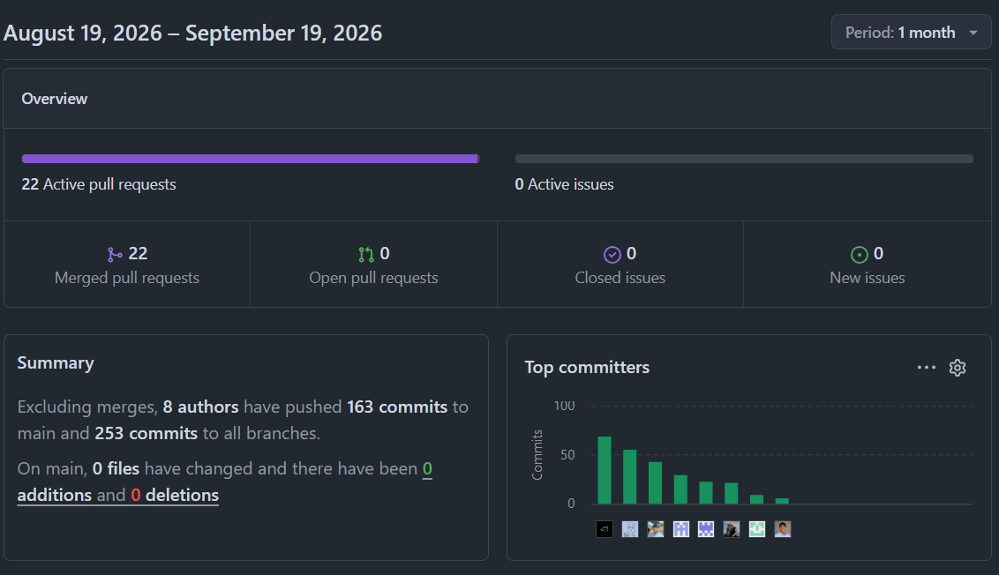
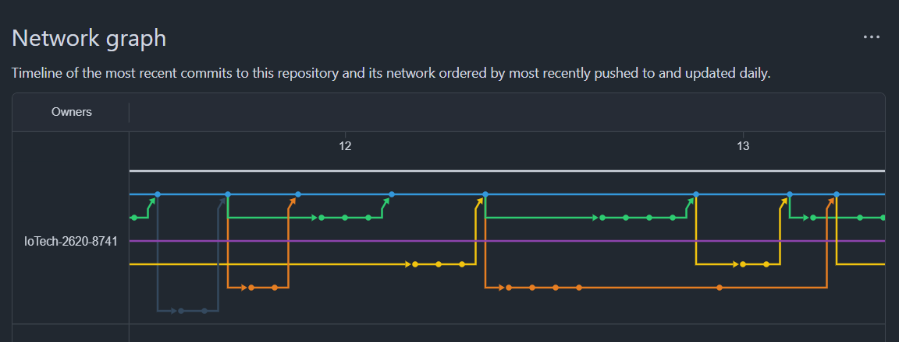

## Project Report Collaboration Insights

**Link de los repositorios de la organización:** https://github.com/IoTech-2620-8741
**Link del repositorio del Informe:** https://github.com/IoTech-2620-8741/qualitrack-report

---

### Reporte de colaboración de la entrega del AV1

Durante esta primera etapa de elaboración del informe, el equipo IoTech centró sus esfuerzos en la construcción progresiva del documento del proyecto QualiTrack, abarcando la definición del problema, la investigación con usuarios (análisis de competidores, entrevistas y needfinding), el diseño de la solución (Big Picture Event Storming, Ubiquitous Language, User Stories, Impact Mapping y Product Backlog) y la documentación de la arquitectura (Domain-Driven Design a nivel estratégico y táctico, incluyendo el Context Mapping y la definición de los Bounded Contexts).

El trabajo se realizó de manera iterativa, evidenciado en los commits del repositorio, donde cada integrante contribuyó en distintas secciones mediante ramas de feature por sección. Esta dinámica permitió la creación, mejora y corrección continua de contenidos, así como la revisión cruzada de los aportes entre compañeros de equipo.

**Billy Jake Ruiz Madrid**

Billy estuvo a cargo de revisar y consolidar los requisitos de QualiTrack, refinando las User Stories para que mantuvieran responsabilidades acotadas y criterios de aceptación verificables. Por su parte, condujo la elaboración del Tactical-Level Domain-Driven Design y se ocupó de alinear la documentación con el Web Application y el Cloud REST API, tomando como referencia los Bounded Contexts definidos para la solución.

**Vitaly Baca Camargo Arturo**

Vitaly se encargó de preparar, documentar y analizar las entrevistas aplicadas a los segmentos objetivo, ordenando evidencias, resultados y conclusiones. Adicionalmente, impulsó la construcción del Big Picture EventStorming, representando los procesos vinculados al monitoreo ambiental, la gestión de materias primas, la producción y el control de calidad, y colaboró en la actualización de los User Personas a partir de los hallazgos obtenidos.

**Fabrizio Alexander Cutiri Agüero**

Fabrizio asumió la responsabilidad de elaborar y mantener actualizado el Product Backlog, organizando la priorización y estimación de las historias y dejando registrada su evidencia en Jira. En paralelo, trabajó en el Impact Mapping y en distintos artefactos de UX, como los Empathy Maps y los User Personas, conectando las necesidades detectadas durante la investigación con las funcionalidades propuestas para QualiTrack.

**Dyron Huapaya Galindo**

Dyron tuvo a su cargo la organización y estructuración del reporte del proyecto, manteniendo al día el contenido, el historial de versiones y las distintas secciones documentales. A la par, guió el desarrollo del Design-Level EventStorming, incorporando Domain Events, Commands, Policies, Actors y Read Models, y aportó en el User Journey Mapping y el User Task Matrix durante el Needfinding.

**Henry Jaredt Montes Ramos**

Henry fue el responsable de actualizar el Startup Profile de IoTech, aportando la descripción de la startup, la identidad visual a través del logo y el ordenamiento de la información del equipo. Igualmente, perfeccionó la introducción del proceso Lean UX y colaboró en ajustar la presentación general del reporte a la estructura exigida para la entrega.

**Yaku Mateo Guzmán Cabrejos**

Yaku condujo la elaboración de la sección Software Architecture de QualiTrack empleando el C4 Model y Structurizr. Construyó las vistas System Landscape, System Context, Container y Deployment, definiendo los principales actores, sistemas externos, contenedores, tecnologías, protocolos de comunicación y entornos de despliegue de la solución. Sumado a esto, colaboró en completar la información del Startup Profile del equipo.

**Giovany Smith Torres Apolinario**

Giovany dirigió la definición y ampliación del Ubiquitous Language de QualiTrack, estableciendo los términos comunes vinculados al monitoreo ambiental, la calidad y la trazabilidad. También encabezó la elaboración de los Bounded Context Canvases y del Context Mapping, evaluando alternativas de organización y documentando las relaciones, dependencias y patrones de integración entre los nueve Bounded Contexts del proyecto.

**Franco Mauricio López Roman**

Franco guió el análisis de las entrevistas correspondientes al segmento de personal operativo de laboratorios y almacenes, identificando sus principales dificultades, necesidades y características. Asimismo, actualizó el arquetipo y el User Persona de este segmento, procurando que los resultados del Needfinding reflejaran de forma adecuada la perspectiva del personal operativo dentro de la solución.

A continuación se presentan los gráficos de colaboración que representan la cantidad de commits realizados por cada miembro del equipo en el repositorio del informe.

  
  
<em>Figura: Contribuciones por miembro del equipo IoTech durante el AV1.</em>

**Ramificación del proyecto usando GitFlow:**

El siguiente gráfico muestra la ramificación del repositorio y las visitas
registradas durante la fase AV1, evidenciando el flujo de trabajo colaborativo
del equipo.

  
  
<em>Figura: Network Graph del repositorio qualitrack-report durante el AV1.</em>

---