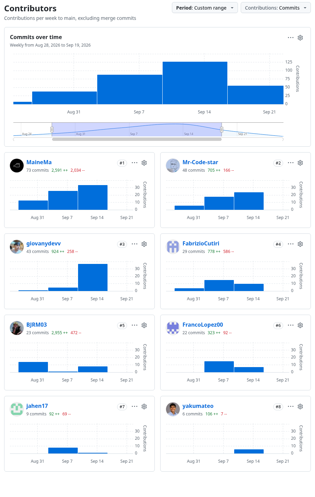
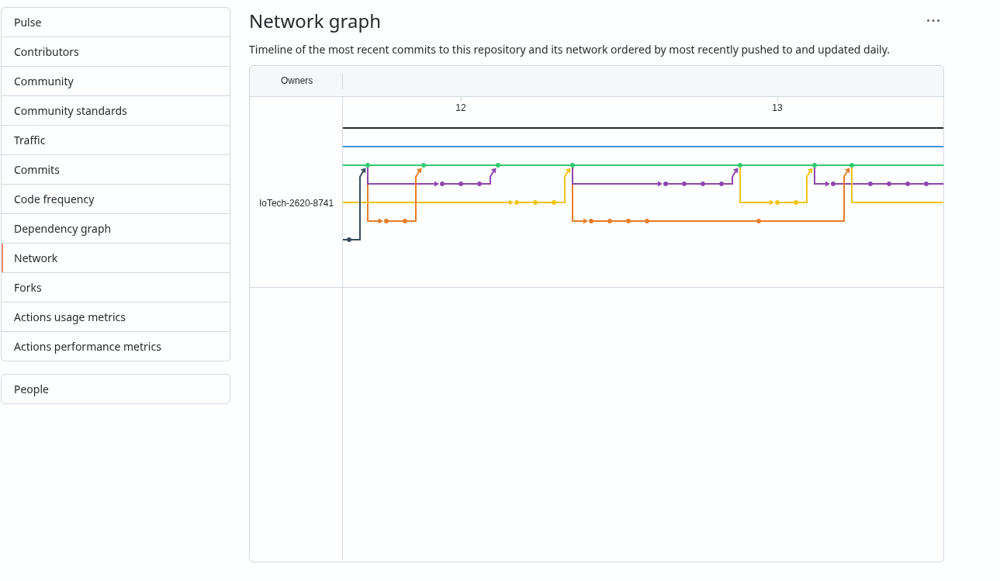
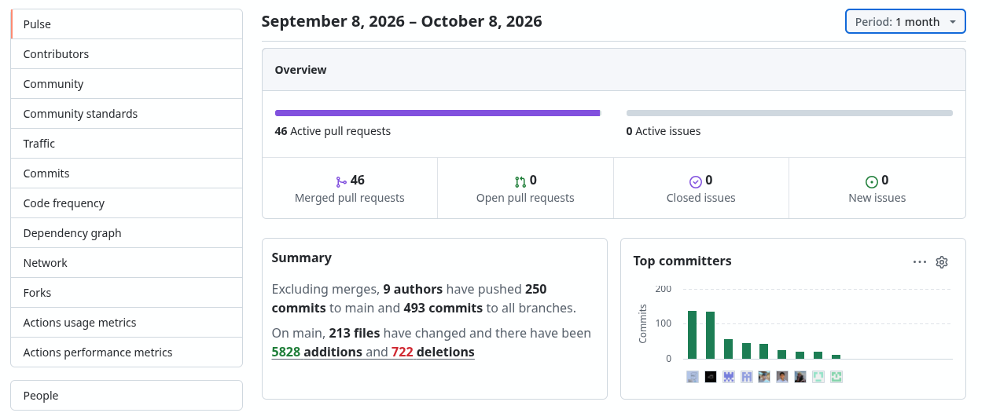
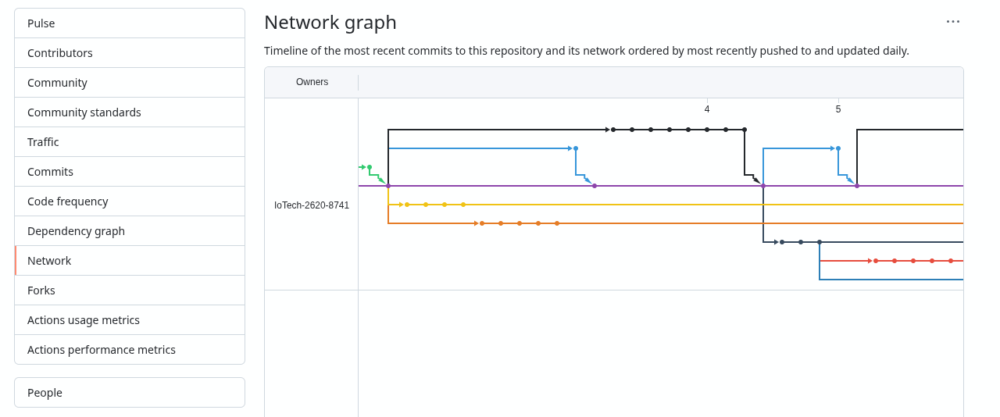

## Project Report Collaboration Insights

**Link de los repositorios de la organización:** [https://github.com/IoTech-2620-8741](https://github.com/IoTech-2620-8741)

**Link del repositorio del Informe:** [https://github.com/IoTech-2620-8741/qualitrack-report](https://github.com/IoTech-2620-8741/qualitrack-report)

---

### Reporte de colaboración de la entrega del AV1

Durante esta primera etapa de elaboración del informe, el equipo IoTech centró sus esfuerzos en la construcción progresiva del documento del proyecto QualiTrack, abarcando la definición del problema, la investigación con usuarios (análisis de competidores, entrevistas y needfinding), el diseño de la solución (Big Picture Event Storming, Ubiquitous Language, User Stories, Impact Mapping y Product Backlog) y la documentación de la arquitectura (Domain-Driven Design a nivel estratégico y táctico, incluyendo el Context Mapping y la definición de los Bounded Contexts).

El trabajo se realizó de manera iterativa, evidenciado en los commits del repositorio, donde cada integrante contribuyó en distintas secciones mediante ramas de feature por sección. Esta dinámica permitió la creación, mejora y corrección continua de contenidos, así como la revisión cruzada de los aportes entre compañeros de equipo.

**Billy Jake Ruiz Madrid**

Billy estuvo a cargo de revisar y consolidar los requisitos de QualiTrack, refinando las User Stories para que mantuvieran responsabilidades acotadas y criterios de aceptación verificables. Por su parte, condujo la elaboración del Tactical-Level Domain-Driven Design y se ocupó de alinear la documentación con el Web Application y el Cloud REST API, tomando como referencia los Bounded Contexts definidos para la solución.

**Vitaly Baca Camargo Arturo**

Vitaly se encargó de preparar, documentar y analizar las entrevistas aplicadas a los segmentos objetivo, ordenando evidencias, resultados y conclusiones. Adicionalmente, impulsó la construcción del Big Picture EventStorming, representando los procesos vinculados al monitoreo ambiental, la gestión de materias primas, la producción y el control de calidad, y colaboró en la actualización de los User Personas a partir de los hallazgos obtenidos.

**Fabrizio Alexander Cutiri Agüero**

Fabrizio asumió la responsabilidad de elaborar y mantener actualizado el Product Backlog, organizando la priorización y estimación de las historias y dejando registrada su evidencia en Jira. En paralelo, trabajó en el Impact Mapping y en distintos artefactos de UX, como los Empathy Maps y los User Personas, conectando las necesidades detectadas durante la investigación con las funcionalidades propuestas para QualiTrack.

**Dyron Huapaya Galindo**

Dyron tuvo a su cargo la organización y estructuración del reporte del proyecto, manteniendo al día el contenido, el historial de versiones y las distintas secciones documentales. A la par, guió el desarrollo del Design-Level EventStorming, incorporando Domain Events, Commands, Policies, Actors y Read Models, y aportó en el User Journey Mapping y el User Task Matrix durante el Needfinding.

**Henry Jaredt Montes Ramos**

Henry fue el responsable de actualizar el Startup Profile de IoTech, aportando la descripción de la startup, la identidad visual a través del logo y el ordenamiento de la información del equipo. Igualmente, perfeccionó la introducción del proceso Lean UX y colaboró en ajustar la presentación general del reporte a la estructura exigida para la entrega.

**Yaku Mateo Guzmán Cabrejos**

Yaku condujo la elaboración de la sección Software Architecture de QualiTrack empleando el C4 Model y Structurizr. Construyó las vistas System Landscape, System Context, Container y Deployment, definiendo los principales actores, sistemas externos, contenedores, tecnologías, protocolos de comunicación y entornos de despliegue de la solución. Sumado a esto, colaboró en completar la información del Startup Profile del equipo.

**Giovany Smith Torres Apolinario**

Giovany dirigió la definición y ampliación del Ubiquitous Language de QualiTrack, estableciendo los términos comunes vinculados al monitoreo ambiental, la calidad y la trazabilidad. También encabezó la elaboración de los Bounded Context Canvases y del Context Mapping, evaluando alternativas de organización y documentando las relaciones, dependencias y patrones de integración entre los nueve Bounded Contexts del proyecto.

**Franco Mauricio López Roman**

Franco guió el análisis de las entrevistas correspondientes al segmento de personal operativo de laboratorios y almacenes, identificando sus principales dificultades, necesidades y características. Asimismo, actualizó el arquetipo y el User Persona de este segmento, procurando que los resultados del Needfinding reflejaran de forma adecuada la perspectiva del personal operativo dentro de la solución.

A continuación se presentan los gráficos de colaboración que representan la cantidad de commits realizados por cada miembro del equipo en el repositorio del informe.

*Figura: Contribuciones por miembro del equipo IoTech durante el AV1.*

**Ramificación del proyecto usando GitFlow:**

El siguiente gráfico muestra la ramificación del repositorio y las visitas
registradas durante la fase AV1, evidenciando el flujo de trabajo colaborativo
del equipo.

*Figura: Network Graph del repositorio qualitrack-report durante el AV1.*

---

### Reporte de colaboración de la entrega del TB1

Durante esta segunda etapa de elaboración del informe, el equio IoTech centro su tiempo en realizar las correcciones en las secciones anteriores y en realizar los avances del capitulo 5 y 6. Estos avances incluyen la guia de estilos para desarrollo UX y UI, reportes de la arquitectura de información de Qualitrack, diseños del Landing Page y Web Application, diseño de nuestros nodos/dispositivos IoT, convenciones para el desarrollo de software y reporte del primer sprint realizado junto con los reportes de avances y reportes de despliegue del producto.

El trabajo se realizó de manera iterativa, evidenciado en los commits del repositorio, donde cada integrante contribuyó en distintas secciones mediante ramas de feature por sección.

**Billy Jake Ruiz Madrid**

Billy continuó refinando las User Stories y la especificación de requisitos del Capítulo III, corrigiendo responsabilidades y criterios de aceptación, y completó la sección de Tactical-Level Domain-Driven Design con sus diagramas de componentes. Además, documentó la ejecución del Sprint 1 en el Capítulo VI, incorporando las evidencias del despliegue y la ejecución de la Landing Page, la Web Application, la documentación de servicios y las pruebas.

**Vitaly Baca Camargo Arturo**

Vitaly completó el análisis de las entrevistas, incorporando los resúmenes de cada entrevistado, el análisis comparativo entre segmentos, los canales de comunicación y los dispositivos utilizados. Además, desarrolló el Big Picture EventStorming y amplió el Strategic-Level DDD con los Aggregates, Commands, Read Models, Policies, Actors, sistemas externos y pivotal points. En el Capítulo V, elaboró el diseño de la Landing Page, los mock-ups y wireframes de la Web Application, los User Flow Diagrams (rutas exitosas y con error) y la sección de Applications Prototyping con los videos de los prototipos.

**Fabrizio Alexander Cutiri Agüero**

Fabrizio actualizó el Product Backlog y su evidencia en Jira, corrigiendo la priorización y estimación e incorporando nuevas historias de usuario. También actualizó los Empathy Maps, el Impact Mapping y los User Personas del Capítulo II. En el Capítulo VI, redactó la Software Configuration Management, que abarca el Source Code Management con GitFlow, Conventional Commits y Semantic Versioning, la configuración del entorno de desarrollo, la configuración del despliegue con su diagrama y las convenciones de estilo de código para las distintas aplicaciones.

**Dyron Huapaya Galindo**

Dyron mantuvo la estructura y el historial de versiones del reporte, integró los capítulos y los ajustes de formato para el PDF, y actualizó la sección de conclusiones, recomendaciones y bibliografía. Además, incorporó los Domain Message Flows con Domain Storytelling, completó el Design-Level EventStorming con sus Commands, Policies, Actors y Read Models, y corrigió los User Journey Maps del Needfinding. En los Capítulos V y VI, estructuró las secciones de UX/UI, IoT Device Design y arquitectura de información, y documentó paso a paso el despliegue del backend con su base de datos y del frontend del Sprint 1 en Azure.

**Henry Jaredt Montes Ramos**

Henry completó el Startup Profile de IoTech con su perfil, el logo y la descripción de la startup, y simplificó la introducción del Lean UX. Asimismo, alineó la carátula del reporte con la plantilla del curso, mejoró las imágenes de los Domain Message Flows y de los diagramas del Capítulo IV, y aportó los wireframes y mock-ups de la Landing Page.

**Yaku Mateo Guzmán Cabrejos**

Yaku redactó la sección Software Architecture con las vistas System Landscape, System Context, Container y Deployment del C4 Model, y las actualizó para incluir los contenedores de la Web Application y la SPA y el despliegue en Microsoft Azure. Además, amplió el Tactical-Level DDD con los diagramas de clases de la capa de dominio de cada Bounded Context, ajustados al modelo del backend, e incorporó el Bounded Context de Profile Management y su perfil en el Startup Profile.

**Giovany Smith Torres Apolinario**

Giovany amplió el Ubiquitous Language con los términos de monitoreo ambiental, calidad y trazabilidad, e incorporó los conceptos del EventStorming. También elaboró los Bounded Context Canvases priorizados y el Context Mapping, comparando los candidate context maps, seleccionando el mapa final y documentando las relaciones entre los Bounded Contexts. En el Capítulo VI, registró la planificación del Sprint 1, con sus responsables y colaboradores por aspecto.

**Franco Mauricio López Roman**

Franco consolidó el análisis de las entrevistas al personal operativo de laboratorios y almacenes, documentando sus dificultades y necesidades, y corrigió el arquetipo y el User Persona del segmento. En el Capítulo V, elaboró el diseño UX/UI de la aplicación móvil, con los wireframes, wireflows, task flows y mock-ups de las pantallas principales: dashboard, telemetría, alertas, lotes, inventario, producto farmacéutico y suscripción.

**Adrian Alonso Quiroz Caceres**

Adrian se incorporó al equipo y se registró como nuevo integrante en la carátula, el README y el Startup Profile. Redactó la descripción del Capítulo V y la sección de Information Architecture, con los sistemas de organización, etiquetado, navegación y búsqueda y las etiquetas SEO y meta tags. También elaboró las guías de estilo generales, web, móvil e IoT, con las imágenes de los dispositivos de monitoreo.

A continuación se presenta el resumen de actividad del repositorio del informe correspondiente al periodo del 8 de septiembre al 8 de octubre de 2026, el cual abarca el desarrollo de la entrega TB1.

*Figura: Contribuciones por miembro del equipo IoTech durante el TB1.*

**Ramificación del proyecto usando GitFlow:**

El siguiente gráfico muestra la ramificación del repositorio durante la fase TB1. Se observa la rama principal (en morado) de la que parten varias ramas de feature, cada una con sus commits, que luego se integran nuevamente mediante merges, evidenciando el flujo de trabajo colaborativo del equipo.

*Figura: Network Graph del repositorio qualitrack-report durante el TB1.*

---