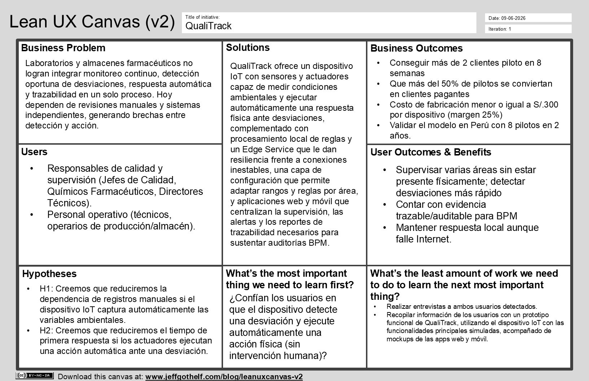

### 1.2. Solution Profile

#### 1.2.1. Antecedentes y problemáticas

**1. ANTECEDENTES**

La industria farmacéutica requiere altos niveles de control y supervisión debido a que cualquier desviación durante la fabricación, análisis o almacenamiento de un producto puede afectar su calidad, seguridad y eficacia. En el Perú, la Dirección General de Medicamentos, Insumos y Drogas (DIGEMID) es la autoridad sanitaria encargada de regular, vigilar y fiscalizar los productos farmacéuticos y los establecimientos involucrados en estos procesos. Como parte de estas exigencias, los establecimientos deben cumplir con las Buenas Prácticas de Manufactura (BPM) y, cuando corresponda, con las Buenas Prácticas de Almacenamiento (BPA), las cuales contemplan aspectos relacionados con el control de procesos, equipos, condiciones ambientales, documentación y trazabilidad.

La relevancia de estos controles puede observarse en las actividades de fiscalización realizadas por DIGEMID. Entre noviembre de 2025 y mayo de 2026 se evaluaron 51 laboratorios farmacéuticos mediante inspecciones internacionales. De estos, 20 obtuvieron la certificación de Buenas Prácticas de Manufactura, mientras que 21 no alcanzaron la certificación, 3 presentaron observaciones parciales y 7 desistieron del proceso. Por lo tanto, el 41,2 % de los laboratorios evaluados no alcanzó la certificación y, considerando también las observaciones parciales y desistimientos, el 60,8 % no culminó dicha evaluación obteniéndola **(DIGEMID, 2026)**.

Asimismo, en julio de 2026 DIGEMID reunió a representantes de 120 laboratorios nacionales, entre ellos 43 fabricantes de productos farmacéuticos, para abordar las principales observaciones y oportunidades de mejora encontradas durante las actividades de inspección, certificación y vigilancia realizadas desde 2025. Entre los aspectos analizados estuvieron el control de calidad, la calificación de equipos y el aseguramiento de la calidad, demostrando que el fortalecimiento de los procesos de control continúa siendo una necesidad vigente en el sector **(DIGEMID, 2026)**.

Dentro de este contexto, una parte importante de las operaciones farmacéuticas requiere supervisar variables y condiciones que deben mantenerse dentro de determinados parámetros. Estas pueden incluir temperatura, humedad, presión u otras variables dependiendo del área, equipo o proceso involucrado. Cuando su supervisión depende de revisiones periódicas, registros manuales o sistemas independientes, pueden producirse retrasos entre la aparición de una desviación, su detección y la ejecución de una acción correctiva.

**2. PROBLEMÁTICA**

La problemática se centra en las dificultades para supervisar continuamente variables críticas, detectar oportunamente condiciones fuera de los parámetros establecidos y actuar ante ellas, además de mantener un registro centralizado y trazable de las mediciones, incidencias y acciones realizadas.

**Riesgo de errores humanos en registros críticos:** Cuando variables como temperatura, humedad, presión o pH son revisadas y posteriormente transcritas de manera manual, existe la posibilidad de errores de registro, omisiones o información ingresada fuera del momento en que ocurrió la actividad. Estas inconsistencias dificultan comprobar posteriormente las condiciones reales bajo las cuales se desarrolló determinado proceso.

**Detección tardía de desviaciones:** Cuando el control depende de revisiones periódicas, una desviación puede producirse entre una verificación y otra sin ser detectada inmediatamente. Esto genera un intervalo durante el cual una condición puede permanecer fuera de los parámetros esperados antes de que el personal tenga conocimiento de ella.

**Dependencia de la intervención humana para responder:** La detección de una desviación tampoco garantiza necesariamente una respuesta inmediata. En procesos donde los equipos de monitoreo y los mecanismos capaces de modificar las condiciones funcionan de manera independiente, una persona debe identificar el problema y posteriormente ejecutar la acción correspondiente. Por ello, la problemática no comprende únicamente la capacidad de supervisar una variable, sino también el tiempo que transcurre entre la detección de una situación anómala y la ejecución de una acción para responder ante ella.

**Trazabilidad fragmentada de la información:** Cuando las mediciones, incidencias y acciones correctivas se registran en diferentes medios, resulta más difícil reconstruir cronológicamente un evento. El personal puede tener que consultar diferentes fuentes para determinar qué variable presentó una desviación, cuándo ocurrió, cuánto tiempo permaneció fuera del rango esperado y qué acciones se realizaron. Esta fragmentación también incrementa el esfuerzo necesario para recuperar y relacionar la información solicitada durante revisiones internas, investigaciones de desviaciones, auditorías o inspecciones regulatorias.

**Análisis 5W + 2H**

**What (¿Qué problema existe?)**

Los laboratorios farmacéuticos presentan dificultades para supervisar continuamente variables críticas en determinadas áreas, detectar oportunamente condiciones fuera de los parámetros establecidos y ejecutar respuestas ante ellas. Además, las mediciones, incidencias y acciones realizadas pueden quedar distribuidas entre distintos registros, dificultando su trazabilidad.

**Why (¿Por qué es un problema?)**

Porque determinados procesos y productos requieren mantenerse bajo condiciones controladas. Una desviación que no sea detectada o atendida oportunamente puede prolongar la exposición a condiciones inadecuadas y generar posteriormente la necesidad de investigar lo ocurrido y determinar sus posibles consecuencias.

**Who (¿Quiénes se encuentran afectados?)**

El problema afecta directamente a los operarios y técnicos encargados de supervisar equipos y condiciones del entorno; a los analistas de control de calidad, responsables de verificar parámetros y resultados; y al personal de Aseguramiento de la Calidad (Quality Assurance), encargado de revisar desviaciones, verificar el cumplimiento de los procedimientos y mantener la documentación asociada.

También afecta a supervisores, jefes de producción, responsables de almacén y responsables técnicos o directores técnicos, quienes necesitan disponer de información confiable para supervisar las operaciones, investigar incidencias y sustentar el cumplimiento de los procedimientos durante auditorías e inspecciones.

**When (¿Cuándo ocurre?)**

La problemática puede presentarse durante las actividades que requieren mantener variables dentro de determinados parámetros, especialmente en áreas de producción, control de calidad, esterilización y almacenamiento.

El riesgo aumenta entre una revisión manual y la siguiente, cuando una desviación puede producirse sin ser detectada inmediatamente, y también después de una incidencia, cuando es necesario determinar cuándo ocurrió, cuánto tiempo duró y qué medidas fueron tomadas.

**Where (¿Dónde ocurre?)**

Se presenta principalmente en áreas de producción y fabricación, laboratorios de control de calidad, zonas de esterilización, cámaras o ambientes con condiciones controladas y almacenes de materias primas, insumos y productos farmacéuticos.

Estas áreas pueden requerir la supervisión de diferentes variables según las características del proceso, los equipos utilizados o las condiciones necesarias para conservar adecuadamente los productos.

**How (¿Cómo se manifiesta?)**

El problema se manifiesta mediante revisiones periódicas de equipos o instrumentos, transcripción manual de mediciones, registros almacenados en diferentes medios y ausencia de una relación directa entre la detección de una desviación y los mecanismos capaces de responder ante ella.

Como consecuencia, pueden presentarse errores u omisiones en los registros, detecciones tardías, dependencia de la disponibilidad del personal para atender incidencias y dificultades para reconstruir posteriormente lo sucedido.

**How much (¿Cuánto afecta el problema?)**

La magnitud de las dificultades relacionadas con el cumplimiento de las Buenas Prácticas puede observarse en las inspecciones realizadas por DIGEMID: de los 51 laboratorios evaluados entre noviembre de 2025 y mayo de 2026, solo 20 obtuvieron la certificación correspondiente en dicha evaluación **(DIGEMID, 2026)**.

Un caso de mayor impacto sobre el mercado peruano se produjo en 2025, cuando el Ministerio de Salud identificó 239 productos farmacéuticos cuyos laboratorios fabricantes no habían aprobado las inspecciones de Buenas Prácticas de Manufactura realizadas por DIGEMID. Como consecuencia de la revisión, se dispuso inicialmente la suspensión del registro sanitario de 57 productos y se anunció el retiro del registro de un segundo grupo de 50 productos **(Andina, 2025)**.

Si bien estos resultados no significan que los incumplimientos hayan sido causados específicamente por fallas en el monitoreo de temperatura, humedad u otras variables, permiten evidenciar las consecuencias que pueden alcanzar las deficiencias en el cumplimiento de los controles requeridos dentro de la industria farmacéutica.

### 1.2.2. Lean UX Process

El Lean UX es un enfoque que permite comprender las necesidades de los usuarios y validar progresivamente las propuestas planteadas para atender un problema.

Para QualiTrack, este proceso permite orientar la propuesta de solución a las necesidades identificadas en laboratorios y almacenes farmacéuticos, considerando las características de los usuarios y del contexto en el que desarrollan sus actividades.

A partir de este enfoque se definen el Problem Statement, los Assumptions, las Hypothesis Statements y el Lean UX Canvas que orientan la propuesta del producto.

#### 1.2.2.1. Lean UX Problem Statements

Para definir el problema de negocio de QualiTrack se utiliza el enfoque de **Brand New Initiative**, considerando el estado actual del dominio, los segmentos involucrados, las necesidades que todavía no son atendidas adecuadamente, la estrategia propuesta y los resultados que permitirán evaluar posteriormente el éxito de la iniciativa.

**Problem Statement**

El estado actual del monitoreo y control de condiciones ambientales en laboratorios y almacenes farmacéuticos se encuentra enfocado principalmente en responsables de calidad y supervisión, así como en personal operativo, quienes deben verificar que variables como temperatura, humedad y otras condiciones relevantes se mantengan dentro de los parámetros definidos para cada área. En determinados escenarios, estas actividades pueden depender de revisiones periódicas, registros manuales o sistemas que funcionan de manera independiente.

Las soluciones y métodos existentes no siempre permiten integrar en un mismo proceso el monitoreo continuo de las condiciones ambientales, la detección inmediata de desviaciones, la ejecución automática de una respuesta física y el registro trazable de todo lo ocurrido. Esto puede generar un intervalo entre la aparición de una condición inadecuada, su identificación y la acción realizada para atenderla.

**QualiTrack** busca atender esta brecha mediante una solución IoT que permita monitorear continuamente las condiciones de laboratorios y almacenes farmacéuticos y responder automáticamente ante determinados eventos. Los dispositivos utilizarán sensores para obtener información del ambiente y actuadores para ejecutar acciones previamente configuradas, como activar ventilación, abrir una compuerta o generar una alarma. Las mediciones y acciones serán registradas y posteriormente estarán disponibles para su consulta y análisis desde QualiTrack.

Nuestro enfoque inicial estará dirigido a responsables de calidad y supervisión, así como al personal operativo de laboratorios y almacenes farmacéuticos en el Perú, especialmente en organizaciones que todavía dependen de controles manuales o de sistemas de monitoreo poco integrados.

Sabremos que la iniciativa está avanzando satisfactoriamente cuando, durante las pruebas y pilotos, observemos una reducción del tiempo necesario para detectar y responder ante desviaciones ambientales, una disminución de los registros manuales y una mayor disponibilidad de información trazable sobre las mediciones, alertas y acciones realizadas.

#### 1.2.2.2. Lean UX Assumptions

Los assumptions representan las creencias que el equipo considera razonables en esta etapa del proyecto, pero que todavía necesitan ser contrastadas mediante investigación, entrevistas, prototipos y pruebas con usuarios.

Para QualiTrack se consideran cinco categorías de assumptions: Business Assumptions, Business Outcome Assumptions, User Assumptions, User Outcome and Benefit Assumptions y Feature Assumptions.

**Business Assumptions**

* Creemos que un modelo de suscripción mensual nos permitirá generar ingresos predecibles y facilitar la adopción inicial al reducir la inversión de entrada para el laboratorio.
* Creemos que el costo de fabricación y despliegue del dispositivo IoT por área monitoreada es lo suficientemente bajo frente al valor percibido (reducción de errores, cumplimiento BPM, trazabilidad) como para sostener un margen viable en laboratorios pequeños y medianos.
* Creemos que la ausencia de una solución IoT especializada y accesible para el sector farmacéutico peruano (frente a sistemas manuales o software existente) nos da una ventana de oportunidad para posicionarnos como referente antes de que aparezca competencia directa.
* Creemos que contamos con la capacidad de producir y ensamblar los dispositivos IoT en volúmenes suficientes para atender a los primeros laboratorios piloto sin comprometer los tiempos de entrega.
* Creemos que un modelo de servicio escalable permitirá que organizaciones con diferentes cantidades de áreas y dispositivos puedan adoptar QualiTrack progresivamente.
* Creemos que iniciar la propuesta en el sector farmacéutico peruano permitirá validar la solución antes de considerar su expansión hacia otros mercados de Latinoamérica.

**Business Outcome Assumptions**

* Creemos que el modelo de suscripción mensual logrará que al menos el 50% de los pilotos se conviertan en clientes pagantes debido a la facilidad de pago.
* Creemos que podremos mantener el costo de fabricación y despliegue del dispositivo IoT menor o igual a S/. 300, obteniendo una ganancia del 25%.
* Creemos que podremos conseguir al menos 2 clientes en el sector farmaceutico peruano antes de que aparezca una solución IoT competidora en el país.
* Creemos que podremos fabricar y entregar al menos 2 dispositivos IoT dentro de un plazo de 8 semanas para los laboratorios pilotos.
* Creemos que al menos el 50% de los clientes ampliará el número de áreas y dispositivos conectados mediante el servicio escalable en un plazo de 6 meses.
* Creemos que podremos validar el modelo de negocio en Perú con al menos 8 piltoso exitosos, lo que nos permitirá expandir el negocio hacia otros paises, todo en un plazo de 2 años.

**User Assumptions**

* Creemos que los responsables de calidad y supervisión son quienes conocen el estado de las distintas áreas del laboratorio mediante verificaciones presenciales periódicas.
* Creemos que los responsables de calidad son quienes revisan registros y bitácoras manuales para determinar cuándo ocurrió una desviación y qué acciones fueron realizadas.
* Creemos que los responsables de calidad son quienes tienen criterio técnico para definir los parámetros permitidos de las variables de entorno, de acuerdo con las necesidades de cada área.
* Creemos que el personal operativo es quien identifica visualmente o de forma manual si las condiciones del área son normales, de advertencia o críticas revisando instrumentos físicos en el área.
* Creemos que el personal operativo es quien está presente fisicamente y es quien responde a las alertas de condiciones del ambiente que están fuera de rango.
* Creemos que los laboratorios y almacenes donde operan los responsables de calidad y el personal operativo suelen tener una conectividad a Internet baja e inestable.
* Creemos que los responsables de calidad no permanecen todo el tiempo dentro de todas las instalaciones que supervisan, sino que dividen su tiempo en supervisar varias áreas.

**User Outcome and Benefit Assumptions**

* Creemos que los responsables de calidad podrán supervisar las condiciones ambientales de varias áreas desde un mismo sistema, y que el beneficio que obtienen es reducir el tiempo dedicado a verificaciones presenciales al dividir su atención entre múltiples áreas.
* Creemos que los responsables de calidad podrán identificar con mayor rapidez cuándo y dónde ocurrió una desviación, y que el beneficio que obtienen es reducir el tiempo y esfuerzo que hoy invierten revisando registros y bitácoras manuales.
* Creemos que los responsables de calidad podrán conocer qué acciones fueron ejecutadas automáticamente por cada dispositivo, junto con el resto del historial de una desviación, y que el beneficio que obtienen es contar con evidencia trazable y auditable para sustentar el cumplimiento BPM ante inspecciones.
* Creemos que los responsables de calidad podrán consultar mediciones históricas y eventos relacionados con una desviación en un solo lugar, y que el beneficio que obtienen es evitar la dispersión de la información que hoy manejan en múltiples registros independientes.
* Creemos que el personal operativo podrá conocer de manera inmediata el estado del área en el que trabaja, y que el beneficio que obtiene es dejar de depender de la revisión manual para saber si las condiciones son adecuadas.
* Creemos que el personal operativo podrá recibir una advertencia local cuando una condición requiera su atención, y que el beneficio que obtiene es reaccionar con mayor rapidez frente a una desviación, sin depender de la inspección presencial constante.
* Creemos que el personal operativo podrá contar con una primera respuesta automática ante determinadas desviaciones, y que el beneficio que obtiene es ganar tiempo de reacción cuando no pueda actuar de inmediato estando presente en el área.
* Creemos que los responsables de calidad y el personal operativo podrán conservar la continuidad del monitoreo y de las acciones locales aun cuando exista una interrupción temporal de conexión con la nube, y que el beneficio que obtienen es no perder capacidad de reacción ni datos críticos durante una conección a Internet inestable.
* Creemos que los responsables de calidad podrán configurar y ajustar los parámetros permitidos por cada área desde el sistema, y que el beneficio que obtienen es aplicar su criterio técnico directamente para calibrar los rangos aceptables.

**Feature Assumptions**

**FA01. Dispositivo IoT de monitoreo ambiental:**  
Creemos que un dispositivo equipado con sensores para medir temperatura, humedad y otras condiciones ambientales permitirá obtener información continua de las áreas supervisadas y reducir la dependencia de registros manuales.

**FA02. Control automático mediante actuadores:**  
Creemos que incorporar actuadores como ventiladores, servomotores, indicadores luminosos y alarmas permitirá ejecutar una respuesta inmediata cuando el dispositivo detecte condiciones de advertencia o críticas.

**FA03. Procesamiento local de reglas:**  
Creemos que permitir que el microcontrolador evalúe localmente las mediciones y las compare con los parámetros configurados permitirá mantener la capacidad de respuesta aun cuando no exista conexión temporal con Internet.

**FA04. Edge Service con almacenamiento temporal:**  
Creemos que un servicio Edge capaz de recibir y almacenar temporalmente las mediciones permitirá evitar la pérdida de información durante interrupciones de comunicación con la plataforma central.

**FA05. Configuración de parámetros y respuestas automáticas:**  
Creemos que permitir a los responsables definir rangos ambientales y las acciones asociadas a cada nivel de condición facilitará la adaptación del dispositivo a diferentes áreas de laboratorio o almacén.

**FA06. Monitoreo web con historial y alertas:**  
Creemos que una aplicación web que centralice mediciones, estados, alertas y acciones realizadas facilitará la supervisión y trazabilidad de las áreas monitoreadas.

**FA07. Aplicación móvil y notificaciones:**  
Creemos que una aplicación móvil capaz de mostrar el estado de las áreas y recibir alertas permitirá que los responsables se mantengan informados aun cuando no se encuentren físicamente en las instalaciones.

**FA08. Trazabilidad y reportes ambientales:**  
Creemos que conservar cronológicamente las mediciones, desviaciones, alertas, acciones automáticas y atenciones realizadas facilitará la revisión de incidentes y la elaboración de reportes para procesos internos de calidad.

#### 1.2.2.3. Lean UX Hypothesis Statements

Los Hypothesis Statements relacionan los resultados esperados del negocio con los usuarios, los beneficios que desean alcanzar y las funcionalidades propuestas. Cada hipótesis parte de uno de los Feature Assumptions definidos anteriormente y deberá ser validada posteriormente mediante investigación y experimentación.

**Hipótesis 1 — Dispositivo IoT de monitoreo ambiental**

**Creemos que** lograremos reducir la dependencia de registros ambientales manuales **si** los responsables de calidad y el personal operativo **alcanzan** acceso continuo a mediciones confiables de las condiciones del área **con** un dispositivo IoT que capture automáticamente las variables ambientales.

**Hipótesis 2 — Control automático mediante actuadores**

**Creemos que** lograremos reducir el tiempo necesario para ejecutar una primera respuesta ante una desviación **si** el personal operativo **alcanza** una respuesta inmediata ante condiciones de advertencia o críticas **con** actuadores controlados automáticamente por el dispositivo IoT.

**Hipótesis 3 — Procesamiento local de reglas**

**Creemos que** lograremos mantener la capacidad básica de respuesta ante interrupciones de conectividad **si** el personal operativo **alcanza** continuidad en la detección y atención inicial de desviaciones **con** reglas almacenadas y procesadas localmente por el microcontrolador.

**Hipótesis 4 — Edge Service con almacenamiento temporal**

**Creemos que** lograremos disminuir la pérdida de registros producida por interrupciones temporales de Internet **si** los responsables de calidad **alcanzan** continuidad en el historial de mediciones **con** un Edge Service que almacene temporalmente la información y la sincronice posteriormente.

**Hipótesis 5 — Configuración de parámetros y respuestas automáticas**

**Creemos que** lograremos adaptar QualiTrack a diferentes áreas de laboratorios y almacenes **si** los responsables de calidad **alcanzan** la capacidad de establecer las condiciones aceptables y las respuestas requeridas para cada área **con** una configuración de rangos y reglas de actuación asociadas a los dispositivos.

**Hipótesis 6 — Monitoreo web con historial y alertas**

**Creemos que** lograremos reducir el tiempo necesario para identificar y reconstruir una desviación **si** los responsables de calidad **alcanzan** acceso centralizado a las condiciones actuales e históricas de las áreas **con** una aplicación web que reúna mediciones, estados, alertas y acciones ejecutadas.

**Hipótesis 7 — Aplicación móvil y notificaciones**

**Creemos que** lograremos mejorar la atención oportuna de las alertas relevantes **si** los responsables de calidad **alcanzan** acceso remoto al estado de las áreas y a los eventos importantes **con** una aplicación móvil que proporcione monitoreo y notificaciones.

**Hipótesis 8 — Trazabilidad y reportes ambientales**

**Creemos que** lograremos disminuir el esfuerzo necesario para revisar eventos ambientales **si** los responsables de calidad **alcanzan** una reconstrucción clara de lo sucedido durante una desviación **con** un historial trazable y reportes que relacionen mediciones, alertas, acciones automáticas y atenciones realizadas.

#### 1.2.2.4. Lean UX Canvas

El Lean UX Canvas permite organizar visualmente el problema de negocio, los resultados esperados, los usuarios, los beneficios que buscan obtener, las soluciones propuestas, las hipótesis y los principales aspectos que deben validarse.

Para QualiTrack, el contenido del Lean UX Canvas se estructura de la siguiente manera:

| Sección | Contenido |
|---|---|
| **1. Business Problem** | En laboratorios y almacenes farmacéuticos pueden existir dificultades para monitorear continuamente las condiciones ambientales, detectar desviaciones oportunamente, ejecutar respuestas inmediatas y mantener una trazabilidad centralizada de las mediciones y acciones realizadas. |
| **2. Business Outcomes** | Reducir el tiempo de respuesta ante desviaciones; disminuir registros manuales; aumentar la cantidad de eventos ambientales registrados de manera trazable; facilitar la supervisión de varias áreas y obtener interés de organizaciones para realizar pilotos de QualiTrack. |
| **3. Users** | Responsables de calidad y supervisión; personal operativo de laboratorios y almacenes farmacéuticos. |
| **4. User Outcomes & Benefits** | Supervisar áreas de manera más rápida; conocer el estado actual del ambiente; identificar desviaciones; recibir alertas oportunamente; disponer de una primera respuesta automática; consultar históricos; conocer qué acciones ejecutó el dispositivo y disponer de información trazable. |
| **5. Solutions** | Dispositivo IoT con sensores; actuadores; procesamiento local en el microcontrolador; Edge Service; configuración de rangos y reglas; aplicación web; aplicación móvil; notificaciones y reportes ambientales. |
| **6. Hypotheses** | Las ocho hipótesis definidas a partir de los Feature Assumptions FA01 a FA08. |
| **7. What's the most important thing we need to learn first?** | Determinar si los usuarios consideran útil y confiable que el dispositivo detecte una desviación y ejecute automáticamente una acción física; validar qué variables necesitan monitorear, qué acciones esperan que se ejecuten y qué nivel de control desean conservar sobre dichas acciones. |
| **8. What's the least amount of work we need to do to learn the next most important thing?** | Realizar entrevistas con los segmentos objetivo y construir un prototipo funcional con un microcontrolador, sensores y actuadores que permita simular condiciones normales, de advertencia y críticas. Complementar la prueba con prototipos de las aplicaciones web y móvil para evaluar la comprensión de mediciones, alertas y acciones ejecutadas. |

**Lean UX Canvas de QualiTrack**

