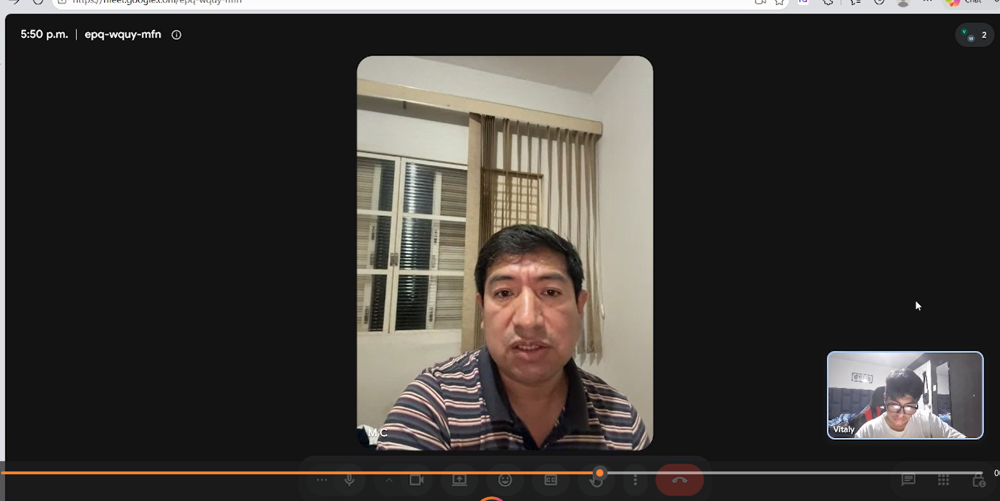
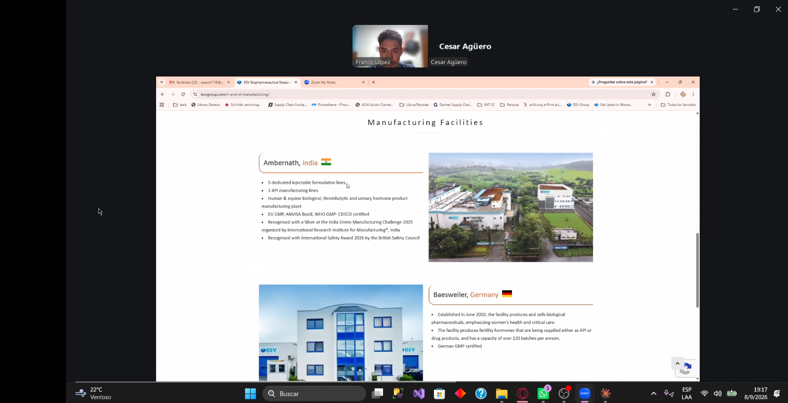
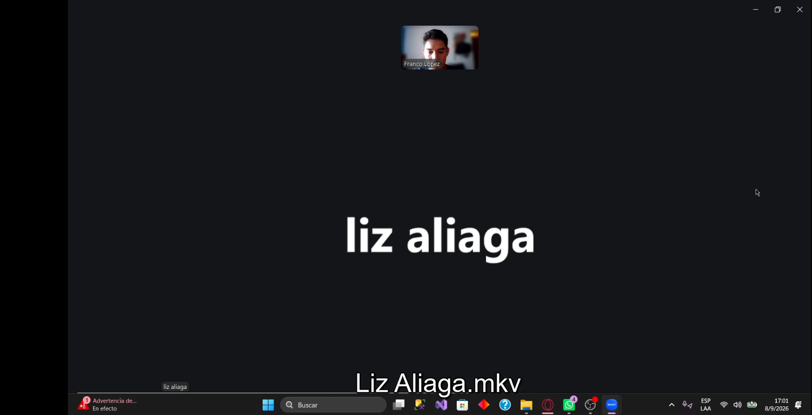
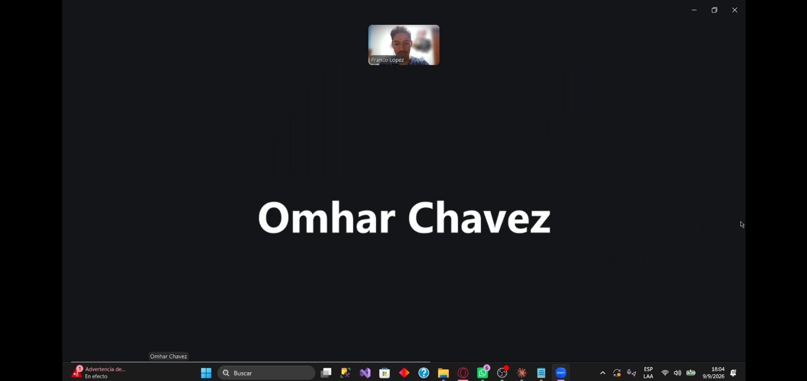

## 2.2. Entrevistas

Las entrevistas son clave para la metodología de diseño centrado en el usuario al permitirnos recolectar información cualitativa directamente de los actores que enfrentan la problematica identificada. A través del dialogo estructurado, se busca comprender las necesidades, comportamientos, frustaciones y expectativas de los segmentos objetivos, validando o refutando las hipótesis plantadas previamente.

### 2.2.1. Diseño de entrevistas

Teniendo en cuenta la importancia en la información que nos puede proveer los entrevistados, se presentan las preguntas clave para cada segmento objetivo. Para eso se considera dos tipos de preguntas: las personales, orientadas a conocer el perfil del entrevistado y las especificas, las cuales estan enfocadas en los procesos actuales, herramientas utilizadas, desafios operativos y expectativas frente a una solución tecnológica como QualiTrack.

#### **Preguntas Personales – Ambos Segmentos:**

*1.	¿Cuál es su nombre?* 

*2.	¿Qué edad tiene?* 

*3.	¿En qué distrito, provincia o ciudad reside actualmente?* 

*4.	¿Cuál es su cargo o función dentro del laboratorio?* 

*5.	¿Cuántos años de experiencia tiene trabajando en el sector farmacéutico?* 

*6.	¿Cuáles son sus principales responsabilidades dentro de su puesto?* 

*7.	¿Qué dispositivos utiliza normalmente durante su trabajo, como computadora, celular, tablet u otros?* 

*8.	¿En qué situaciones utiliza cada uno de esos dispositivos?* 

*9.	¿Qué canales utiliza normalmente para comunicarse o coordinar con otras personas o áreas?* 

*10.	¿Cuál considera que es su principal objetivo o responsabilidad dentro de su función en el laboratorio?*

*11.	¿Qué situaciones relacionadas con su trabajo suelen generarle mayor dificultad o frustración?*

#### **Segmento 1: Rensponsables de Calidad y Supervisión**

*Preguntas Específicas:*

*1.	De manera general, ¿qué áreas, ambientes o espacios requieren control de condiciones dentro del laboratorio y cómo los denominan normalmente?*

*2.	¿Qué características o condiciones necesitan monitorear en esos espacios y cómo determinan cuáles son los valores o rangos aceptables?*

*3.	¿Cómo realizan actualmente el monitoreo de esas condiciones y qué dispositivos, instrumentos o equipos utilizan?* 

*4.	¿Cómo registran y almacenan las mediciones obtenidas?*

*5.	¿Qué sistemas, aplicaciones, documentos o registros utilizan actualmente para consultar o gestionar la información relacionada con el control de calidad?* 

*6.	¿Con qué frecuencia necesitan realizar, revisar o consultar las mediciones de los ambientes?*

*7.	Cuénteme qué sucede desde que se detecta una condición fuera de los valores aceptables hasta que la situación se considera resuelta.*

*8.	¿Qué términos utilizan para referirse a estas situaciones y existen diferentes niveles de gravedad o prioridad?* 

*9.	¿Quiénes necesitan ser informados cuando ocurre una situación de este tipo y cómo se realiza actualmente esa comunicación?* 

*10.	¿Existen reglas sobre cuánto tiempo puede permanecer una condición fuera de los valores aceptables antes de que sea necesario tomar alguna acción?* 

*11.	¿Quién determina que una situación puede considerarse solucionada o cerrada y qué información debe conservarse sobre lo ocurrido?* 

*12.	¿Qué información suelen necesitar recuperar cuando realizan auditorías, revisiones o verificaciones relacionadas con las condiciones ambientales?*

*13.	¿Qué indicadores utiliza actualmente para evaluar si las condiciones de los ambientes se están manteniendo dentro de los parámetros establecidos?*

*14.	Si tuviera que revisar rápidamente el estado general de los ambientes en un panel, ¿qué indicadores o datos consideraría más importantes visualizar?*

*15.	¿Qué parte del proceso actual de monitoreo, registro o revisión considera más lenta, complicada o propensa a errores?* 

*16.	Para una persona nueva en el área, ¿qué términos, reglas o situaciones particulares debería conocer para entender correctamente cómo realizan el control de las condiciones ambientales?*

#### **Segmento objetivo 2: Personal operativo de laboratorios y almacenes**

*Segmento 2: Personal operativo de laboratorios y almacenes*

*Preguntas Específicas*

*1.	De manera general, ¿cómo se organiza el proceso desde que reciben las materias primas hasta que obtienen un producto terminado?* 

*2.	¿Qué sistemas, aplicaciones, documentos o registros utilizan actualmente para gestionar materias primas, fabricación y trazabilidad?* 

*3.	Cuando reciben una materia prima, ¿cómo la identifican y qué información necesitan registrar sobre ella?* 

*4.	Cuando reciben nuevamente la misma materia prima, ¿cómo diferencian una recepción de otra y qué término utilizan para referirse a esas recepciones?* 

*5.	¿Cómo registran la cantidad recibida y cómo determinan la unidad de medida que corresponde a cada materia prima?* 

*6.	¿Qué información relacionada con proveedor, fechas y estado necesitan conocer antes de que una materia prima pueda utilizarse?*

*7.	¿Qué ocurre cuando una materia prima deja de poder utilizarse, es rechazada o presenta algún problema?* 

*8.	Cuando van a fabricar nuevamente un producto que ya han elaborado antes, ¿cómo identifican esa nueva fabricación y qué nombre utilizan para referirse a ella?* 

*9.	¿Qué información necesitan registrar cuando comienza una nueva fabricación?* 

*10.	¿Cómo registran qué materias primas fueron utilizadas en una fabricación determinada y, si una misma materia prima fue recibida varias veces, cómo identifican cuál de esas recepciones se utilizó?* 

*11.	Si posteriormente se detectara un problema con una materia prima utilizada, ¿cómo identificarían los productos o fabricaciones relacionados y qué ocurriría con ellos?*

*12.	¿Qué información necesitan conservar sobre las personas que participaron en una fabricación y qué roles suelen intervenir?* 

*13.	¿Qué máquinas, equipos o instrumentos utilizan durante la fabricación y cómo identifican dónde se encuentra cada uno?*

*14.	¿Qué estados manejan para los equipos y qué condiciones debe cumplir un equipo antes de poder utilizarse?* 

*15.	¿Cómo gestionan el mantenimiento de los equipos y qué condiciones deben cumplirse para que puedan volver a utilizarse?* 

*16.	¿Qué información necesitan conservar sobre los equipos utilizados en una fabricación?*

*17.	Si posteriormente se detectara una falla en un equipo, ¿cómo identificarían los productos relacionados con ese equipo?* 

*18.	Cuando termina una fabricación, ¿qué información necesitan conservar sobre el producto obtenido y qué estados puede tener hasta considerarse disponible o terminado?* 

*19.	¿Qué información relacionada con materias primas, productos y equipos necesitan consultar con mayor frecuencia?* 

*20.	Para una persona nueva en el área, ¿qué términos, reglas o situaciones excepcionales debería conocer para entender correctamente cómo funciona el proceso?*

### 2.2.2. Registro de entrevistas

En esta sección se presentan los resultados de las entrevistas aplicadas a cada segmento objetivo. Para cada sesión, se incluye: datos del entrevistado, un resumen de las respuestas clave, observaciones del equipo y las principales conclusiones. Este registro sirve como evidencia para orientar las decisiones de diseño y funcionalidades de QualiTrack.

#### **Segmento objetivo 1: Responsables de calidad y supervisión**

<table>
    <colgroup></colgroup>
    <thead>
        <tr>
            <th colspan="2">Entrevista #1 </th>
        </tr>
    </thead>
    <tbody>
        <tr>
            <td>Nombre</td>
            <td>Melsy</td>
        </tr>
        <tr>
            <td>Apellidos</td>
            <td>Medina Saravia</td>
        </tr>
        <tr>
            <td>Edad</td>
            <td>25 años</td>
        </tr>
        <tr>
            <td>Distrito</td>
            <td>Ate</td>
        </tr>
        <tr>
            <td>Evidencia</td>
            <td>

</td>
        </tr>
        <tr>
            <td>Link</td>
            <td></td>
        </tr>
        <tr>
            <td>Timing donde inicia la entrevista </td>
            <td>00:00 min</td>
        </tr>
        <tr>
            <td>Duración de la entrevista </td>
            <td>17:00 min</td>
        </tr>
        <tr>
            <td>Resumen</td>
            <td>
           Missli Medina Sarabia es supervisora de calidad de productos farmacéuticos en la empresa Hyc Pharma. Su principal responsabilidad está relacionada con asegurar que los procesos de manufactura cumplan con los estándares de calidad establecidos, especialmente respecto a las condiciones ambientales de las diferentes áreas y salas de la empresa. La empresa cuenta con diferentes áreas y todas requieren control de condiciones ambientales, principalmente de temperatura, humedad y presión diferencial. Los rangos aceptables dependen del medicamento y de los procedimientos estandarizados para cada proceso. Actualmente, el monitoreo se realiza mediante registros manuales, utilizando formatos establecidos para las diferentes salas y áreas. Durante los procesos de manufactura, las mediciones se realizan aproximadamente cada tres horas, mientras que las áreas que no están en uso cuentan con horarios específicos de registro. Para gestionar la información utilizan principalmente una guía de producción física, que se completa manualmente durante el proceso, además de una guía virtual. También conservan registros históricos de las condiciones ambientales de cada sala, los cuales son utilizados durante auditorías. Sin embargo, uno de los principales problemas identificados es el registro manual, debido a que los operarios no siempre registran las mediciones en el momento correspondiente. En algunos casos, los valores pueden ser registrados posteriormente para completar espacios vacíos, lo que genera dudas sobre si realmente representan la condición que existía en ese momento. Cuando se presenta una condición fuera de los rangos establecidos, se considera una desviación interna, que puede ser ambiental cuando está relacionada con temperatura, humedad o presión diferencial. La situación debe ser comunicada principalmente a la supervisora de calidad, quien puede detener el proceso y asegurar el medicamento mientras se verifica la causa. En caso de que exista una posible falla del instrumento de medición, interviene el personal de mantenimiento para revisar el equipo. La supervisora de calidad finalmente determina, mediante su visto bueno, que la lectura es correcta y que el proceso puede continuar.También destaca la importancia de conservar un historial trazable de las mediciones, especialmente para las auditorías, donde pueden solicitar registros específicos de temperatura o humedad de determinadas salas y fechas. Para evaluar el estado de los ambientes se consideran principalmente los rangos establecidos para cada medicamento, la temperatura, humedad y presión diferencial, siendo esta última importante para evitar la contaminación cruzada. Finalmente, señala que una persona nueva debe conocer correctamente los registros, saber cuándo y dónde realizar cada medición y considerar el factor de corrección correspondiente a cada termohigrómetro, debido a su calibración, para registrar la temperatura real correctamente.
            </td>
        </tr>
    </tbody>
</table>

<table>
    <colgroup></colgroup>
    <thead>
        <tr>
            <th colspan="2">Entrevista #2 </th>
        </tr>
    </thead>
    <tbody>
        <tr>
            <td>Nombre</td>
            <td>Mario</td>
        </tr>
        <tr>
            <td>Apellidos</td>
            <td>Baca</td>
        </tr>
        <tr>
            <td>Edad</td>
            <td>40 años</td>
        </tr>
   <tr>
    <td>Ubicación</td>
    <td>São Paulo, Brasil</td>
</tr>
        <tr>
            <td>Evidencia</td>
            <td>

</td>
        </tr>
        <tr>
            <td>Link</td>
            <td></td>
        </tr>
        <tr>
            <td>Timing donde inicia la entrevista </td>
            <td>17:00 min</td>
        </tr>
        <tr>
            <td>Duración de la entrevista </td>
            <td>33:00 min</td>
        </tr>
        <tr>
            <td>Resumen</td>
            <td>
Mario Baca trabaja como supervisor de productos farmacéuticos en CDB – Diagnostics Center Brazil, São Paulo, Brasil. Sus principales responsabilidades están relacionadas con la supervisión de las condiciones ambientales y el cumplimiento de los parámetros establecidos en las diferentes áreas del laboratorio. Las áreas que requieren mayor control son almacenamiento, producción, acondicionamiento y espacios donde se mantienen productos pendientes de evaluación. Se monitorean principalmente temperatura y humedad, y en determinadas áreas también presión diferencial, utilizando termohigrómetros y equipos de medición. Los valores aceptables dependen de las características del producto y de los procedimientos definidos para cada área. Actualmente, las mediciones se registran mediante formatos de control y archivos Excel, lo que genera una importante carga de trabajo manual y dificulta consultar la información al encontrarse distribuida en diferentes registros. Cuando se detecta una condición fuera de rango, primero se confirma la medición y luego se evalúa su impacto; dependiendo de la situación, se puede detener temporalmente la actividad, investigar la causa y aplicar las medidas correspondientes antes de continuar. Estas situaciones se consideran desviaciones y su prioridad depende del impacto y duración. El responsable de calidad verifica que la condición haya sido corregida y que se conserve información sobre el valor encontrado, rango permitido, fecha, hora, área afectada y acciones realizadas. Para auditorías se consultan principalmente los registros históricos de las áreas y las desviaciones ocurridas. El principal problema identificado es la revisión manual de registros y archivos Excel, además del riesgo de que algunas mediciones sean registradas posteriormente, generando dudas sobre la exactitud de los datos.
            </td>
        </tr>
    </tbody>
</table>

#### **Segmento objetivo 2: Personal operativo de laboratorios y almacenes**
 <table>
    <colgroup></colgroup>
    <thead>
        <tr>
            <th colspan="2">Entrevista #1 </th>
        </tr>
    </thead>
    <tbody>
        <tr>
            <td>Nombre</td>
            <td> César  </td>
        </tr>
        <tr>
            <td>Apellidos</td>
            <td>Agüero</td>
        </tr>
        <tr>
            <td>Edad</td>
            <td>38 años</td>
        </tr>
        <tr>
            <td>Distrito</td>
            <td>Cercado de Lima</td>
        </tr>
        <tr>
            <td>Evidencia</td>
            <td>

</td>
        </tr>
        <tr>
            <td>Link</td>
            <td></td>
        </tr>
        <tr>
            <td>Timing donde inicia la entrevista </td>
            <td>00:00 min</td>
        </tr>
        <tr>
            <td>Duración de la entrevista </td>
            <td>26:03 min</td>
        </tr>
        <tr>
            <td>Resumen</td>
            <td>
                César Agüero, de 38 años con 14 años de experiencia en farmacéutica, es Country Manager de Barat Ceronat Vaccines (transnacional de origen indio) con responsabilidad sobre 4 países: Perú, Bolivia, Chile y Honduras. Gestiona aspectos comerciales, operativos, regulatorios, financieros, de marketing, ventas y legales.
                Utiliza múltiples dispositivos en Microsoft Teams como canal oficial, aunque identifica un problema crítico: falta de seguimiento efectivo de acuerdos de reuniones y pérdida de trazabilidad en responsabilidades.
                El flujo productivo comienza con recepción de materias primas en almacén especializado bajo condiciones específicas con monitoreo continuo. Opera líneas de sólidos y líquidos estériles, algunas automatizadas y otras semi-automatizadas. Incluye controles de calidad en cada etapa: liberación de tanda, envasado, rotulado y control final. Los sistemas utilizados son: Data Master File que centraliza información de materias primas con certificados y especificaciones en repositorio digital, y Sistema virtual de gestión de producción basado en Buenas Prácticas de Manufactura con integrity, visibilidad 360, trazabilidad total. Completamente digitalizado desde el año anterior, eliminando progresivamente el papel.
                La compañía no puede cambiar de materia prima ni proveedor: existe un proceso obligatorio previo de selección y calificación que incluye inspección, auditoría y verificación de licencias. Solo trabaja con fabricantes licenciados. Cada materia prima se identifica por lote y código de recepción con unidades de medida estandarizadas. Si hay problema en recepción, se rechaza completamente sin registrar. El sistema rastrea exactamente qué materias primas específicas fueron utilizadas en cada fabricación. Si posteriormente se detecta un problema, es posible identificar todos los productos y fabricaciones afectadas para acciones correctivas precisas.
                Cada producto se verifica contra especificaciones aprobadas con tests obligatorios según farmacopea o parámetros críticos internos. Se fabrica solo cuando hay pedido y se libera inmediatamente para despacho, sin inventario. La información consultada más frecuentemente es sobre disponibilidad de materias primas, especialmente aquellas de un único fabricante mundial. Para personal nuevo, es absolutamente obligatorio conocer GMP; sin esto, no se ubicará en el contexto. La compañía usa señalización visual explícita porque prefiere comunicación visual clara sobre avisos escritos.
            </td>
        </tr>
    </tbody>
</table>

<table>
    <colgroup></colgroup>
    <thead>
        <tr>
            <th colspan="2">Entrevista #2 </th>
        </tr>
    </thead>
    <tbody>
        <tr>
            <td>Nombre</td>
            <td>Liz</td>
        </tr>
        <tr>
            <td>Apellidos</td>
            <td>Aliaga</td>
        </tr>
        <tr>
            <td>Edad</td>
            <td>45 años</td>
        </tr>
        <tr>
            <td>Distrito</td>
            <td>Jesús Maria</td>
        </tr>
        <tr>
            <td>Evidencia</td>
            <td>

</td>
        </tr>
        <tr>
            <td>Link</td>
            <td></td>
        </tr>
        <tr>
            <td>Timing donde inicia la entrevista </td>
            <td>00:00 min</td>
        </tr>
        <tr>
            <td>Duración de la entrevista </td>
            <td>16:30 min</td>
        </tr>
        <tr>
            <td>Resumen</td>
            <td>
                Liz Aliaga, de 45 años y 20 años de experiencia en sector farmacéutico, trabaja en un hospital público de Jesús María, Lima, a cargo de 1,900 medicamentos. Sus tres responsabilidades principales son: velar que el paciente reciba medicamentos efectivos y seguros, mantener medicamentos en condiciones adecuadas según normativa regulatoria, garantizar correcta administración como bienes del Estado. A diferencia de laboratorios de producción, no recibe materias primas sino medicamentos terminados con certificado. Los medicamentos llegan por licitación y compras institucionales a través de 26 farmacias del hospital. Utiliza computadoras, tablas de control, termómetros, hidroxicóticos y cadenas de frío. Comunica por correos electrónicos y teléfono (WhatsApp no oficial). Reporta no tener dificultades ni frustraciones.
                Cada medicamento ingresa con documentación completa: ficha técnica, buenas prácticas de manufactura, certificados del país de origen, registro de Dijaní, y controles de la empresa productora. Liz verifica cumplimiento de todos requisitos según normativa. Para diferenciar recepciones del mismo medicamento, utiliza sistema "FIFO Peso": si recibe lote hoy, es el primero a distribuir; si llega otro mañana, entra en segundo lugar. Información de proveedor, fechas y estado viene determinada por procesos de compra y licitación donde se especifica cuándo ingresa, qué documentación trae y qué requisitos cumple. Todos los productos tienen mismos requisitos estandarizados.
                Liz realiza checklist riguroso: si encuentra envase dañado, caja humedecida, blisters con comprimidos partidos o con cambio de color, devuelve todo el lote. Para cantidades grandes, utiliza sistemas de muestreo: toma una cajita de cada lado. Si identifica problema, devuelve toda remesa. Medicamentos rechazados se registran en libro con lote, fecha y código. Si proveedor reenvía, debe ser con otro lote diferente, también registrado. Garantiza trazabilidad completa: problema con lote específico nunca vuelve a ser aceptado.
                Información de medicamentos consultada frecuentemente: estabilidad, protección de luz, cadena de frío. Valida detalles como "si producto es oxidado, solo reconstituyese en cloruro para mantener estabilidad". Como usuario del hospital, no necesita conocer toda cadena de personal de producción. Lo que valida es información en documentos y caja: farmacéutico que produjo y director técnico que aseguró calidad. En plantas de producción: químicos farmacéuticos certifican insumos, producción, control de calidad, más director técnico.
           </td>
        </tr>
    </tbody>
</table>

<table>
    <colgroup></colgroup>
    <thead>
        <tr>
            <th colspan="2">Entrevista #3 </th>
        </tr>
    </thead>
    <tbody>
        <tr>
            <td>Nombre</td>
            <td>Ohmar</td>
        </tr>
        <tr>
            <td>Apellidos</td>
            <td>Chavez</td>
        </tr>
        <tr>
            <td>Edad</td>
            <td>42 años</td>
        </tr>
        <tr>
            <td>Distrito</td>
            <td>San Isidro</td>
        </tr>
        <tr>
            <td>Evidencia</td>
            <td>

</td>
        </tr>
        <tr>
            <td>Link</td>
            <td></td>
        </tr>
        <tr>
            <td>Timing donde inicia la entrevista </td>
            <td>00:00 min</td>
        </tr>
        <tr>
            <td>Duración de la entrevista </td>
            <td>24:47 min</td>
        </tr>
        <tr>
            <td>Resumen</td>
            <td>
                Omar Chávez, de 42 años y 15 años de experiencia, es formulador de Investigación y Desarrollo en un laboratorio. Su principal responsabilidad es desarrollo de productos nuevos, desde conceptualización hasta viabilidad comercial. Su mayor frustración es cuando un desarrollo no es transferible a lote comercial. Utiliza computadoras, celulares, tablets, radio y RPC para comunicaciones. Utiliza SAP como sistema de gestión. Su trabajo es fundamental en etapa inicial del ciclo de vida del medicamento, validando que productos puedan escalar a producción comercial.
                El proceso sigue secuencia rigurosa: análisis de formulación estándar, ensayos para verificar estabilidad y características físico-químicas y farmacotécnicas, verificación analítica, estresamiento para garantizar estabilidad en forma y nivel físico-químico, generación de pilotos, estudios de estabilidad acelerada y largo plazo, tras validación, entrada a fabricación comercial. Diseñado para garantizar que solo productos con estabilidad y viabilidad demostradas lleguen a producción. Todo es respaldado en Buenas Prácticas de Manufactura.
                Materias primas se identifican por codificación interna (know-how confidencial). Unidades de medida varían: kilogramos, gramos, litros, onzas, unidades, frascos según empresa y producto. Antes de usar materia prima: requisito mínimo es certificado de análisis. Dependiendo empresa/insumo, también solicitan: ficha técnica, ficha de seguridad, certificado de metales pesados, ruta de síntesis, MOA, ROT, ruta de análisis. Algunas empresas solo necesitan COA para iniciar desarrollo. Materias primas con problemas entran a "desmedro".
                Todo equipo debe cumplir calificación: instalación, operación y desempeño. Nomenclatura de equipos es propia de cada empresa. Área de mantenimiento garantiza condiciones óptimas durante tiempo. Información de equipos permite trazabilidad: software logueado en tiempo real, voucher de registro temporal, huella digital. Si equipo falla durante fabricación, proceso se detiene por completo; no puede continuarse sin garantizar 100% óptimo. Falla detectada después de fabricación: no hay remedio posible.
                Toda etapa de manufactura es documentada: desde dispensación hasta producto final. Se mantiene registro de todo personal participante, obligatorio GMP. Estados de productos varían según empresa. Flujo es secuencial pero simultáneo entre áreas: dispensación, fabricación, control de calidad interactúan en orden lógico sin predominio. Para personal nuevo: GMP es requisito fundamental. Industria es altamente especializada con múltiples subáreas. Químicos farmacéuticos requieren expertise específica en su subárea especializada.
            </td>
        </tr>
    </tbody>
</table>

### 2.2.3. Análisis de entrevistas
