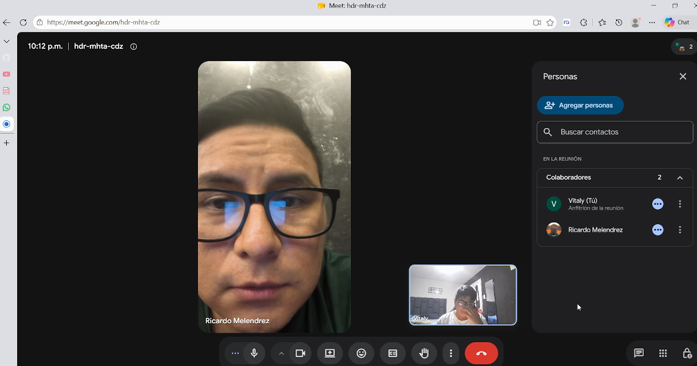
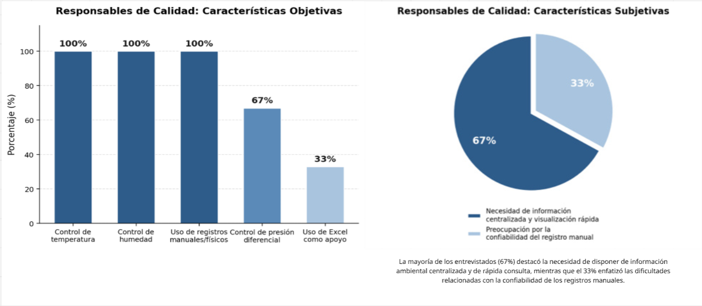
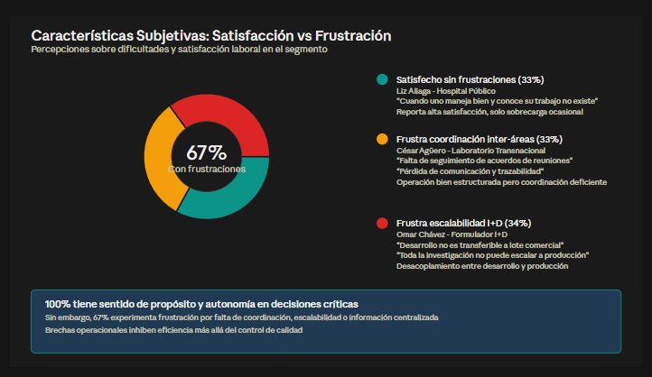

## 2.2. Entrevistas

Las entrevistas son clave para la metodología de diseño centrado en el usuario al permitirnos recolectar información cualitativa directamente de los actores que enfrentan la problematica identif[...]

### 2.2.1. Diseño de entrevistas

Teniendo en cuenta la importancia en la información que nos puede proveer los entrevistados, se presentan las preguntas clave para cada segmento objetivo. Para eso se considera dos tipos de pregun[...]

#### **Preguntas Personales – Ambos Segmentos:**

*1.	¿Cuál es su nombre?* 

*2.	¿Qué edad tiene?* 

*3.	¿En qué distrito, provincia o ciudad reside actualmente?* 

*4.	¿Cuál es su cargo o función dentro del laboratorio?* 

*5.	¿Cuántos años de experiencia tiene trabajando en el sector farmacéutico?* 

*6.	¿Cuáles son sus principales responsabilidades dentro de su puesto?* 

*7.	¿Qué dispositivos utiliza normalmente durante su trabajo, como computadora, celular, tablet u otros?* 

*8.	¿En qué situaciones utiliza cada uno de esos dispositivos?* 

*9.	¿Qué canales utiliza normalmente para comunicarse o coordinar con otras personas o áreas?* 

*10.	¿Cuál considera que es su principal objetivo o responsabilidad dentro de su función en el laboratorio?*

*11.	¿Qué situaciones relacionadas con su trabajo suelen generarle mayor dificultad o frustración?*

#### **Segmento 1: Rensponsables de Calidad y Supervisión**

*Preguntas Específicas:*

*1.	De manera general, ¿qué áreas, ambientes o espacios requieren control de condiciones dentro del laboratorio y cómo los denominan normalmente?*

*2.	¿Qué características o condiciones necesitan monitorear en esos espacios y cómo determinan cuáles son los valores o rangos aceptables?*

*3.	¿Cómo realizan actualmente el monitoreo de esas condiciones y qué dispositivos, instrumentos o equipos utilizan?* 

*4.	¿Cómo registran y almacenan las mediciones obtenidas?*

*5.	¿Qué sistemas, aplicaciones, documentos o registros utilizan actualmente para consultar o gestionar la información relacionada con el control de calidad?* 

*6.	¿Con qué frecuencia necesitan realizar, revisar o consultar las mediciones de los ambientes?*

*7.	Cuénteme qué sucede desde que se detecta una condición fuera de los valores aceptables hasta que la situación se considera resuelta.*

*8.	¿Qué términos utilizan para referirse a estas situaciones y existen diferentes niveles de gravedad o prioridad?* 

*9.	¿Quiénes necesitan ser informados cuando ocurre una situación de este tipo y cómo se realiza actualmente esa comunicación?* 

*10.	¿Existen reglas sobre cuánto tiempo puede permanecer una condición fuera de los valores aceptables antes de que sea necesario tomar alguna acción?* 

*11.	¿Quién determina que una situación puede considerarse solucionada o cerrada y qué información debe conservarse sobre lo ocurrido?* 

*12.	¿Qué información suelen necesitar recuperar cuando realizan auditorías, revisiones o verificaciones relacionadas con las condiciones ambientales?*

*13.	¿Qué indicadores utiliza actualmente para evaluar si las condiciones de los ambientes se están manteniendo dentro de los parámetros establecidos?*

*14.	Si tuviera que revisar rápidamente el estado general de los ambientes en un panel, ¿qué indicadores o datos consideraría más importantes visualizar?*

*15.	¿Qué parte del proceso actual de monitoreo, registro o revisión considera más lenta, complicada o propensa a errores?* 

*16.	Para una persona nueva en el área, ¿qué términos, reglas o situaciones particulares debería conocer para entender correctamente cómo realizan el control de las condiciones ambientales?*

#### **Segmento objetivo 2: Personal operativo de laboratorios y almacenes**

*Segmento 2: Personal operativo de laboratorios y almacenes*

*Preguntas Específicas*

*1.	De manera general, ¿cómo se organiza el proceso desde que reciben las materias primas hasta que obtienen un producto terminado?* 

*2.	¿Qué sistemas, aplicaciones, documentos o registros utilizan actualmente para gestionar materias primas, fabricación y trazabilidad?* 

*3.	Cuando reciben una materia prima, ¿cómo la identifican y qué información necesitan registrar sobre ella?* 

*4.	Cuando reciben nuevamente la misma materia prima, ¿cómo diferencian una recepción de otra y qué término utilizan para referirse a esas recepciones?* 

*5.	¿Cómo registran la cantidad recibida y cómo determinan la unidad de medida que corresponde a cada materia prima?* 

*6.	¿Qué información relacionada con proveedor, fechas y estado necesitan conocer antes de que una materia prima pueda utilizarse?*

*7.	¿Qué ocurre cuando una materia prima deja de poder utilizarse, es rechazada o presenta algún problema?* 

*8.	Cuando van a fabricar nuevamente un producto que ya han elaborado antes, ¿cómo identifican esa nueva fabricación y qué nombre utilizan para referirse a ella?* 

*9.	¿Qué información necesitan registrar cuando comienza una nueva fabricación?* 

*10.	¿Cómo registran qué materias primas fueron utilizadas en una fabricación determinada y, si una misma materia prima fue recibida varias veces, cómo identifican cuál de esas recepciones s[...]

*11.	Si posteriormente se detectara un problema con una materia prima utilizada, ¿cómo identificarían los productos o fabricaciones relacionados y qué ocurriría con ellos?*

*12.	¿Qué información necesitan conservar sobre las personas que participaron en una fabricación y qué roles suelen intervenir?* 

*13.	¿Qué máquinas, equipos o instrumentos utilizan durante la fabricación y cómo identifican dónde se encuentra cada uno?*

*14.	¿Qué estados manejan para los equipos y qué condiciones debe cumplir un equipo antes de poder utilizarse?* 

*15.	¿Cómo gestionan el mantenimiento de los equipos y qué condiciones deben cumplirse para que puedan volver a utilizarse?* 

*16.	¿Qué información necesitan conservar sobre los equipos utilizados en una fabricación?*

*17.	Si posteriormente se detectara una falla en un equipo, ¿cómo identificarían los productos relacionados con ese equipo?* 

*18.	Cuando termina una fabricación, ¿qué información necesitan conservar sobre el producto obtenido y qué estados puede tener hasta considerarse disponible o terminado?* 

*19.	¿Qué información relacionada con materias primas, productos y equipos necesitan consultar con mayor frecuencia?* 

*20.	Para una persona nueva en el área, ¿qué términos, reglas o situaciones excepcionales debería conocer para entender correctamente cómo funciona el proceso?*

### 2.2.2. Registro de entrevistas

En esta sección se presentan los resultados de las entrevistas aplicadas a cada segmento objetivo. Para cada sesión, se incluye: datos del entrevistado, un resumen de las respuestas clave, obse[...]

#### **Segmento objetivo 1: Responsables de calidad y supervisión**

<table>
    <colgroup></colgroup>
    <thead>
        <tr>
            <th colspan="2">Entrevista #1 </th>
        </tr>
    </thead>
    <tbody>
        <tr>
            <td>Nombre</td>
            <td>Melsy</td>
        </tr>
        <tr>
            <td>Apellidos</td>
            <td>Medina Saravia</td>
        </tr>
        <tr>
            <td>Edad</td>
            <td>25 años</td>
        </tr>
        <tr>
            <td>Distrito</td>
            <td>Ate</td>
        </tr>
        <tr>
            <td>Evidencia</td>
            <td style="text-align: left;">
                

            </td>
        </tr>
        <tr>
            <td>Link</td>
            <td>
            <a href="https://shorturl.at/beplR" target="_blank">
                https://shorturl.at/beplR
            </a>
        </td>
        </tr>
        <tr>
            <td>Timing donde inicia la entrevista </td>
            <td>00:00 min</td>
        </tr>
        <tr>
            <td>Duración de la entrevista </td>
            <td>11:47 min</td>
        </tr>
        <tr>
            <td>Resumen</td>
            <td>
          Missli Medina Sarabia es supervisora de calidad de productos farmacéuticos en Hyc Pharma. Su principal responsabilidad es asegurar que los procesos de manufactura cumplan con los está[...]
            </td>
        </tr>
    </tbody>
</table>

<table>
    <colgroup></colgroup>
    <thead>
        <tr>
            <th colspan="2">Entrevista #2 </th>
        </tr>
    </thead>
    <tbody>
        <tr>
            <td>Nombre</td>
            <td>Ricardo</td>
        </tr>
        <tr>
            <td>Apellidos</td>
            <td>Melendrez</td>
        </tr>
        <tr>
            <td>Edad</td>
            <td>44 años</td>
        </tr>
        <tr>
            <td>Distrito</td>
            <td>Chorrillos</td>
        </tr>
        <tr>
            <td>Evidencia</td>
            <td style="text-align: left;">
                

            </td>
        </tr>
        <tr>
            <td>Link</td>
            <td>
            <a href="https://shorturl.at/beplR" target="_blank">
                https://shorturl.at/beplR
            </a>
            </td>
        </tr>
        <tr>
            <td>Timing donde inicia la entrevista </td>
            <td>11: 47 min</td>
        </tr>
        <tr>
            <td>Duración de la entrevista </td>
            <td>22:36 min</td>
        </tr>
        <tr>
            <td>Resumen</td>
            <td>
Ricardo Melendrez, analista de control de calidad de productos farmacéuticos, trabaja en el área de estabilidades de un laboratorio. En su trabajo supervisa principalmente las condiciones de te[...]
            </td>
        </tr>
    </tbody>
</table>

<table>
    <colgroup></colgroup>
    <thead>
        <tr>
            <th colspan="2">Entrevista #3 </th>
        </tr>
    </thead>
    <tbody>
        <tr>
            <td>Nombre</td>
            <td>Mario</td>
        </tr>
        <tr>
            <td>Apellidos</td>
            <td>Baca</td>
        </tr>
        <tr>
            <td>Edad</td>
            <td>40 años</td>
        </tr>
    <tr>
     <td>Ubicación</td>
     <td>São Paulo, Brasil</td>
 </tr>
        <tr>
            <td>Evidencia</td>
            <td style="text-align: left;">
                

            </td>
        </tr>
        <tr>
            <td>Link</td>
            <td><a href="https://shorturl.at/beplR" target="_blank">
                https://shorturl.at/beplR
            </a>
            </td>
        </tr>
        <tr>
            <td>Timing donde inicia la entrevista </td>
            <td>22:36 min</td>
        </tr>
        <tr>
            <td>Duración de la entrevista </td>
            <td>36:28 min</td>
        </tr>
        <tr>
            <td>Resumen</td>
            <td>
Mario Baca trabaja como supervisor de productos farmacéuticos en CDB – Diagnostics Center Brazil, São Paulo, Brasil. Sus principales responsabilidades están relacionadas con la supervisión [...]
            </td>
        </tr>
    </tbody>
</table>

#### **Segmento objetivo 2: Personal operativo de laboratorios y almacenes**
 <table>
    <colgroup></colgroup>
    <thead>
        <tr>
            <th colspan="2">Entrevista #1 </th>
        </tr>
    </thead>
    <tbody>
        <tr>
            <td>Nombre</td>
            <td> César  </td>
        </tr>
        <tr>
            <td>Apellidos</td>
            <td>Agüero</td>
        </tr>
        <tr>
            <td>Edad</td>
            <td>38 años</td>
        </tr>
        <tr>
            <td>Distrito</td>
            <td>Cercado de Lima</td>
        </tr>
        <tr>
            <td>Evidencia</td>
            <td style="text-align: left;">
                

            </td>
        </tr>
        <tr>
            <td>Link</td>
            <td>
                <a href="https://shorturl.at/beplR" target="_blank">
                https://shorturl.at/beplR
            </a>
            </td>
        </tr>
        <tr>
            <td>Timing donde inicia la entrevista </td>
            <td>36:28 min</td>
        </tr>
        <tr>
            <td>Duración de la entrevista </td>
            <td>41:25 min</td>
        </tr>
        <tr>
            <td>Resumen</td>
            <td>
                César Agüero, de 38 años con 14 años de experiencia en farmacéutica, es Country Manager de Barat Ceronat Vaccines (transnacional de origen indio) con responsabilidad sobre 4 [...]
                Utiliza múltiples dispositivos en Microsoft Teams como canal oficial, aunque identifica un problema crítico: falta de seguimiento efectivo de acuerdos de reuniones y pérdida de[...]
                El flujo productivo comienza con recepción de materias primas en almacén especializado bajo condiciones específicas con monitoreo continuo. Opera líneas de sólidos y líquido[...]
                La compañía no puede cambiar de materia prima ni proveedor: existe un proceso obligatorio previo de selección y calificación que incluye inspección, auditoría y verificació[...]
                Cada producto se verifica contra especificaciones aprobadas con tests obligatorios según farmacopea o parámetros críticos internos. Se fabrica solo cuando hay pedido y se liber[...]
            </td>
        </tr>
    </tbody>
</table>

<table>
    <colgroup></colgroup>
    <thead>
        <tr>
            <th colspan="2">Entrevista #2 </th>
        </tr>
    </thead>
    <tbody>
        <tr>
            <td>Nombre</td>
            <td>Liz</td>
        </tr>
        <tr>
            <td>Apellidos</td>
            <td>Aliaga</td>
        </tr>
        <tr>
            <td>Edad</td>
            <td>45 años</td>
        </tr>
        <tr>
            <td>Distrito</td>
            <td>Jesús Maria</td>
        </tr>
        <tr>
            <td>Evidencia</td>
            <td style="text-align: left;">
                

            </td>
        </tr>
        <tr>
            <td>Link</td>
            <td>
                <a href="https://shorturl.at/beplR" target="_blank">
                https://shorturl.at/beplR
            </a>
            </td>
        </tr>
        <tr>
            <td>Timing donde inicia la entrevista </td>
            <td>41:25 min</td>
        </tr>
        <tr>
            <td>Duración de la entrevista </td>
            <td>45:57 min</td>
        </tr>
        <tr>
            <td>Resumen</td>
            <td>
                Liz Aliaga, de 45 años y 20 años de experiencia en sector farmacéutico, trabaja en un hospital público de Jesús María, Lima, a cargo de 1,900 medicamentos. Sus tres responsa[...]
                Cada medicamento ingresa con documentación completa: ficha técnica, buenas prácticas de manufactura, certificados del país de origen, registro de Dijaní, y controles de la em[...]
                Liz realiza checklist riguroso: si encuentra envase dañado, caja humedecida, blisters con comprimidos partidos o con cambio de color, devuelve todo el lote. Para cantidades grand[...]
                Información de medicamentos consultada frecuentemente: estabilidad, protección de luz, cadena de frío. Valida detalles como "si producto es oxidado, solo reconstituyese en clor[...]
            </td>
        </tr>
    </tbody>
</table>

<table>
    <colgroup></colgroup>
    <thead>
        <tr>
            <th colspan="2">Entrevista #3 </th>
        </tr>
    </thead>
    <tbody>
        <tr>
            <td>Nombre</td>
            <td>Ohmar</td>
        </tr>
        <tr>
            <td>Apellidos</td>
            <td>Chavez</td>
        </tr>
        <tr>
            <td>Edad</td>
            <td>42 años</td>
        </tr>
        <tr>
            <td>Distrito</td>
            <td>San Isidro</td>
        </tr>
        <tr>
            <td>Evidencia</td>
            <td style="text-align: left;">
                

            </td>
        </tr>
        <tr>
            <td>Link</td>
            <td>
                <a href="https://shorturl.at/beplR" target="_blank">
                https://shorturl.at/beplR
            </a>
            </td>
        </tr>
        <tr>
            <td>Timing donde inicia la entrevista </td>
            <td>45:57 min</td>
        </tr>
        <tr>
            <td>Duración de la entrevista </td>
            <td>51:24 min s</td>
        </tr>
        <tr>
            <td>Resumen</td>
            <td>
                Omar Chávez, de 42 años y 15 años de experiencia, es formulador de Investigación y Desarrollo en un laboratorio. Su principal responsabilidad es desarrollo de productos nuevos[...]
                El proceso sigue secuencia rigurosa: análisis de formulación estándar, ensayos para verificar estabilidad y características físico-químicas y farmacotécnicas, verificación[...]
                Materias primas se identifican por codificación interna (know-how confidencial). Unidades de medida varían: kilogramos, gramos, litros, onzas, unidades, frascos según empresa y[...]
                Todo equipo debe cumplir calificación: instalación, operación y desempeño. Nomenclatura de equipos es propia de cada empresa. Área de mantenimiento garantiza condiciones ópt[...]
                Toda etapa de manufactura es documentada: desde dispensación hasta producto final. Se mantiene registro de todo personal participante, obligatorio GMP. Estados de productos varí[...]
            </td>
        </tr>
    </tbody>
</table>

### 2.2.3. Análisis de entrevistas

En esta sección se presenta el análisis detallado de la información recolectada de las entrevistas. Para cada segmento, se explican primero los hallazgos estadísticos objetivos y subjetivos, [...]

**Segmento 1: Responsables de calidad y supervisión**

**Análisis de Características Objetivas y Subjetivas:**

El análisis de las entrevistas evidencia que la supervisión de las condiciones ambientales constituye una actividad fundamental en los procesos de calidad farmacéutica. El 100% de los entrevis[...]

Respecto a la gestión de la información, el 100% de los entrevistados utiliza registros manuales o físicos para documentar las mediciones ambientales. Asimismo, un 33% complementa estos regist[...]

A nivel subjetivo, el 67% de los entrevistados manifestó dificultades relacionadas con el registro y gestión manual de las mediciones, principalmente por registros realizados posteriormente a l[...]

En conjunto, se observa que el responsable de calidad busca mantener las condiciones ambientales dentro de los parámetros establecidos, detectar oportunamente las desviaciones y disponer de info[...]

 

 

**Segmento 2: Personal operativo de laboratorios y almacenes**

**Análisis de Características Objetivas y Subjetivas:**

El análisis de las entrevistas evidencia que el control de condiciones ambientales constituye una actividad fundamental en los procesos de calidad farmacéutica. El 100% de los entrevistados ver[...]
evidenciando que la información puede encontrarse distribuida entre diferentes medios y formatos. 
 
A nivel subjetivo, el análisis revela dificultades relacionadas con la gestión manual de información y falta de visibilidad centralizada de procesos. El 67% de los entrevistados manifestó dif[...]
 
En conjunto, se observa que el Personal Operativo busca mantener las condiciones ambientales dentro de los parámetros establecidos para detectar oportunamente las desviaciones y disponer de info[...]

##### Análisis Comparativo

##### Contrastación de Segmentos:

El análisis comparativo de ambos segmentos permite identificar que tanto los responsables de calidad y supervisión como el personal operativo de laboratorios y almacenes participan en procesos [...]

Sin embargo, se observan diferencias en el tipo de información que gestionan y en sus principales necesidades. El Segmento 1 se concentra principalmente en la supervisión de las condiciones amb[...]

Respecto a las dificultades, en el Segmento 1 destaca la dependencia de registros manuales y la necesidad de disponer de una visualización centralizada de las condiciones ambientales. En el Segm[...]

En cuanto al uso de tecnología, ambos segmentos presentan una oportunidad de mejora, aunque con diferentes enfoques. Mientras el Segmento 1 requiere principalmente automatizar y centralizar el m[...]

##### Conclusiones y Definición de Arquetipos

A partir del análisis realizado, se definen los siguientes perfiles de usuario (User Personas):

*Arquetipo: "El Supervisor de Calidad"*

**Característica principal:** Responsable de controlar las condiciones ambientales de las áreas y tomar decisiones ante posibles desviaciones.

**Necesidad principal:** Contar con información confiable, organizada y accesible sobre las condiciones ambientales de las áreas para facilitar la supervisión, detectar desviaciones y consulta[...]

**Principal dificultad:** La dependencia de registros manuales y físicos, que puede dificultar el seguimiento oportuno y la revisión de la información.

*Arquetipo: "El técnico de control de calidad"*

**Característica principal:** Encargado de la supervisión de de las buenas prácticas profesionales durante la elaboración, almacenado y dispensación del producto.

**Necesidad principal:** Mantener una clara trazabilidad de las materias primas, productos y procesos involucrados en el negocio para facilitar su correcto arbitraje según las normas profesional[...]

**Principal dificultad:** Ante grandes producciones se dificulta la trazabilidad de cada producto junto a su lote y respectivas características de elaboración.
