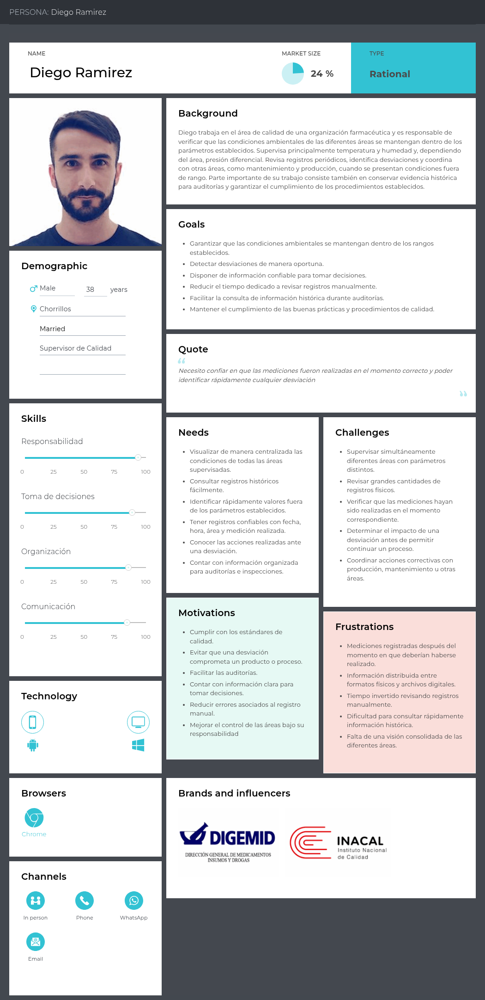
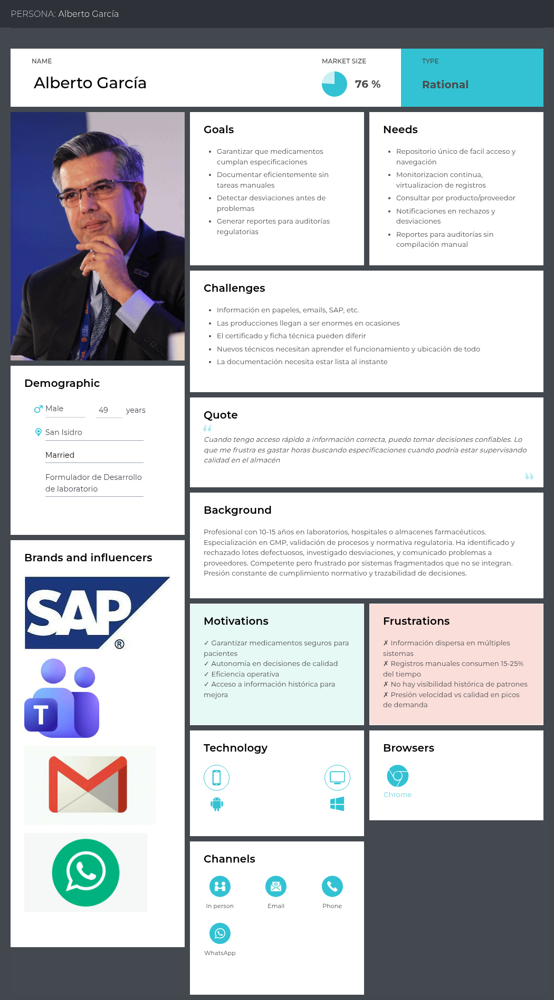
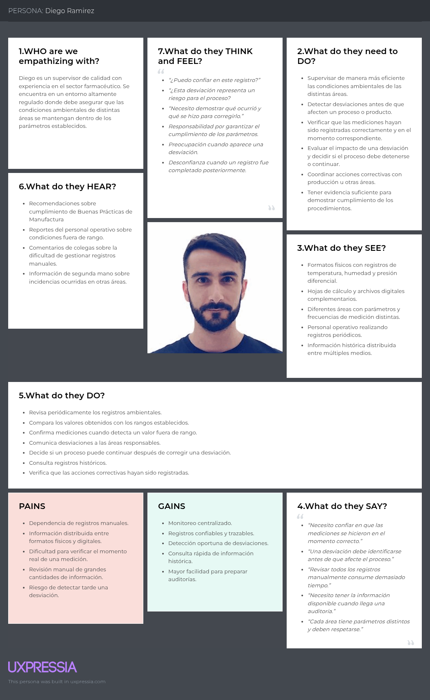
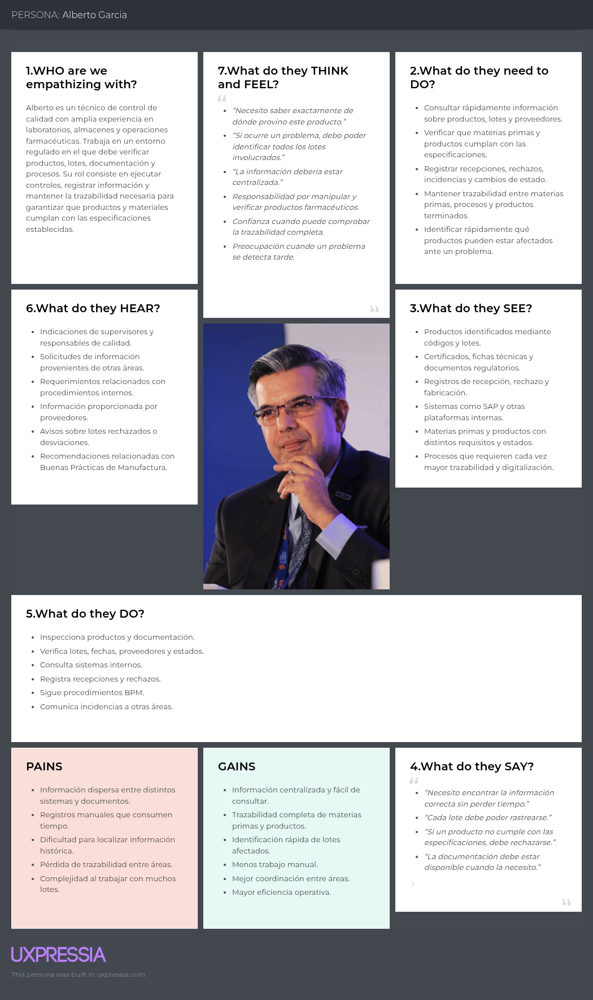

## 2.3. Needfinding

### 2.3.1. User Personas

En esta sección se presentan los User Personas definidos para QualiTrack a partir de la información recopilada durante las entrevistas realizadas a los segmentos de Responsables de Calidad y Supervisión, y Personal Operativo de laboratorios y almacenes. Estos perfiles sintetizan sus principales características, objetivos, necesidades, motivaciones, frustraciones y comportamientos, permitiendo comprender mejor a los usuarios objetivo y orientar el diseño de la solución hacia sus necesidades reales.

**Segmento 1: Responsables de calidad y supervisión**

Para este segmento se elaboró el User Persona Diego Ramírez, representante de los responsables de calidad y supervisión. Se consideraron factores como su responsabilidad en el control de condiciones ambientales y su participación en la gestión de desviaciones. Sus principales frustraciones están relacionadas con la dependencia de registros manuales, la dispersión de información y la dificultad para verificar que las mediciones se hayan realizado oportunamente. Asimismo, se tomó en cuenta su necesidad de contar con información centralizada, confiable e histórica que facilite la supervisión, la toma de decisiones y la preparación ante auditorías.

**Segmento 2: Personal operativo de laboratorios y almacenes**

Para este segmento se elaboró el User Persona Alberto García, representante del personal operativo de laboratorios y almacenes. Se consideraron factores como su amplia experiencia en el sector farmacéutico, su conocimiento de Buenas Prácticas de Manufactura y su responsabilidad en la verificación de productos, documentación y procesos de calidad. Sus principales dificultades se relacionan con la información distribuida en múltiples sistemas, el tiempo destinado a registros manuales y la necesidad de acceder rápidamente a especificaciones e información histórica. Asimismo, se tomó en cuenta su motivación por garantizar medicamentos seguros, mantener la trazabilidad y mejorar la eficiencia operativa mediante herramientas que centralicen la información, faciliten la supervisión y apoyen la generación de reportes para auditorías.

### 2.3.2. User Task Matrix

En esta sección se presenta el User Task Matrix, que concentra las tareas que los User Persona (Diego Ramírez, representante del Segmento 1: Responsables de calidad y supervisión; y Alberto García, representante del Segmento 2: Personal operativo de laboratorios y almacenes) realizan para cumplir sus objetivos dentro del laboratorio o almacén. El cuadro presenta, para cada User Persona, la frecuencia y la importancia asociadas a cada tarea identificada.

<table>
  <thead>
    <tr>
      <th rowspan="2">Tarea</th>
      <th colspan="2">Diego Ramírez</th>
      <th colspan="2">Alberto García</th>
    </tr>
    <tr>
      <th>Frecuencia</th>
      <th>Importancia</th>
      <th>Frecuencia</th>
      <th>Importancia</th>
    </tr>
  </thead>
  <tbody>
    <tr>
      <td>Monitorear/verificar las condiciones ambientales del área de trabajo (temperatura, humedad, presión)</td>
      <td>Casi siempre</td>
      <td>Alta</td>
      <td>Siempre</td>
      <td>Media</td>
    </tr>
    <tr>
      <td>Detectar y responder ante una desviación o alerta ambiental</td>
      <td>A veces</td>
      <td>Alta</td>
      <td>A veces</td>
      <td>Alta</td>
    </tr>
    <tr>
      <td>Registrar y consultar la información de un lote</td>
      <td>A veces</td>
      <td>Alta</td>
      <td>Siempre</td>
      <td>Alta</td>
    </tr>
    <tr>
      <td>Definir o actualizar los rangos y parámetros ambientales aceptables por área</td>
      <td>Ocasionalmente</td>
      <td>Alta</td>
      <td>No aplica</td>
      <td>No aplica</td>
    </tr>
    <tr>
      <td>Consultar el historial de mediciones y desviaciones para auditorías o revisiones</td>
      <td>A veces</td>
      <td>Alta</td>
      <td>No aplica</td>
      <td>No aplica</td>
    </tr>
    <tr>
      <td>Elaborar reportes o consolidados de información de calidad</td>
      <td>A veces</td>
      <td>Alta</td>
      <td>No aplica</td>
      <td>No aplica</td>
    </tr>
    <tr>
      <td>Recepcionar y verificar materias primas al ingresar al almacén/laboratorio</td>
      <td>No aplica</td>
      <td>No aplica</td>
      <td>Siempre</td>
      <td>Alta</td>
    </tr>
    <tr>
      <td>Comunicar o escalar una condición anómala al responsable de calidad</td>
      <td>No aplica</td>
      <td>No aplica</td>
      <td>Ocasionalmente</td>
      <td>Alta</td>
    </tr>
    <tr>
      <td>Consultar especificaciones técnicas o disponibilidad de materias primas antes de utilizarlas</td>
      <td>No aplica</td>
      <td>No aplica</td>
      <td>Siempre</td>
      <td>Media</td>
    </tr>
  </tbody>
</table>

Del análisis del cuadro se observa que, para Diego Ramírez, la tarea con mayor frecuencia e importancia combinadas es monitorear las condiciones ambientales de las áreas a su cargo, dado que constituye la base de su rol de supervisión y se repite varias veces al día. Para Alberto García, las tareas con mayor frecuencia e importancia son la recepción y verificación de materias primas, y el registro de la información de las materias primas, pues ambas ocurren de forma constante durante su trabajo y determinan la calidad del producto.

**Coincidencias entre los User Persona:**
 
- Monitoreo y verificación de las condiciones ambientales del área de trabajo.
- Detección y respuesta ante una desviación o alerta ambiental.
- Verificación y calificación del estado de un equipo antes de utilizarlo.
- Registro y consulta de la trazabilidad de una fabricación o lote.

**Diferencias entre los User Persona:**
- Diego Ramírez se encarga de definir y actualizar los rangos y parámetros aceptables, consultar el historial para auditorías, y elaborar reportes o consolidados de información de calidad, ya que son tareas propias de su rol de supervisión.
- Alberto García se encarga de recepcionar y verificar materias primas o insumos, comunicar una condición anómala, y consultar especificaciones técnicas de materias primas, ya que el tiene que manipular los insumos y productos.

### 2.3.3. User Journey Mapping

En esta sección se presentan los User Journey Maps correspondientes a ambos segmentos objetivo, representan el recorrido que actualmente realiza cada usuario para cumplir su objetivo, sin que exista una solución. Permite identificar las etapas, puntos de contacto, dificultades y emociones que atraviesa cada usuario a lo largo de su recorrido.

### 2.3.4. Empathy Mapping

En esta sección se presentan los Empathy Maps correspondientes a ambos segmentos objetivo de QualiTrack. Estos artefactos permiten profundizar en sus comportamientos, necesidades, percepciones, preocupaciones y expectativas a partir de la información obtenida en las entrevistas y los User Persona definidos. Su elaboración facilita una comprensión más completa del contexto de cada usuario y sirve como base para orientar las funcionalidades de la solución hacia sus necesidades reales.

**Segmento 1: Responsables de calidad y supervisión**

**Segmento 2: Personal operativo de laboratorios y almacenes**

