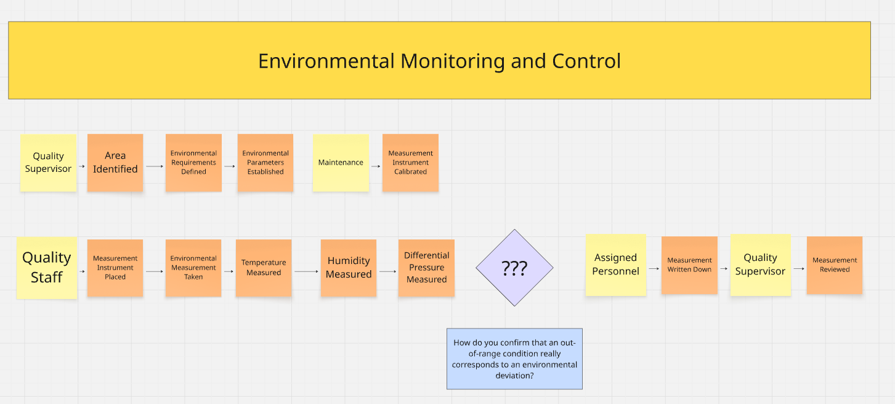
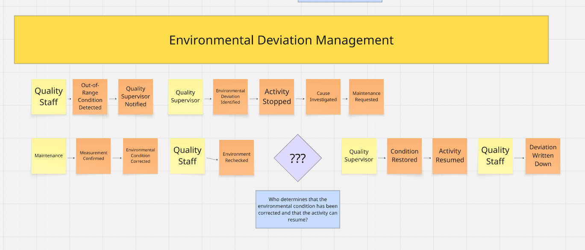
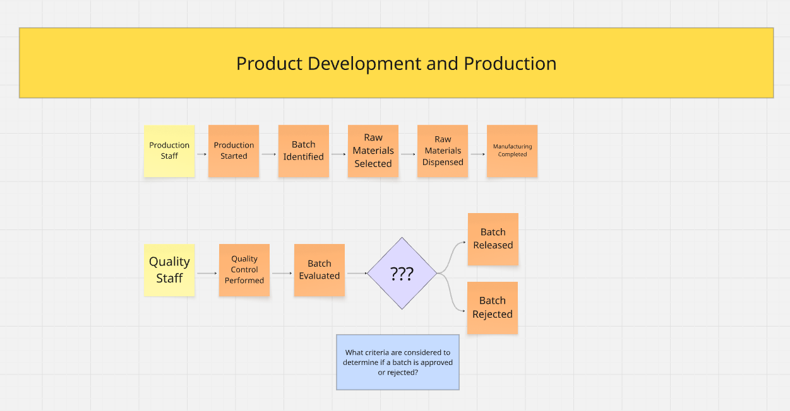
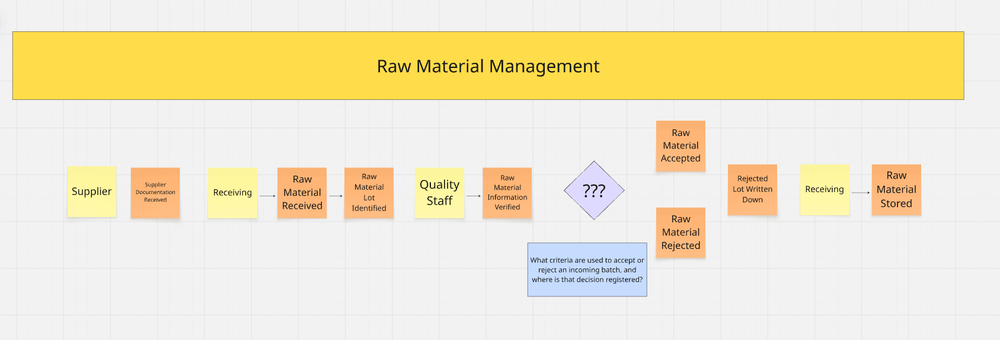
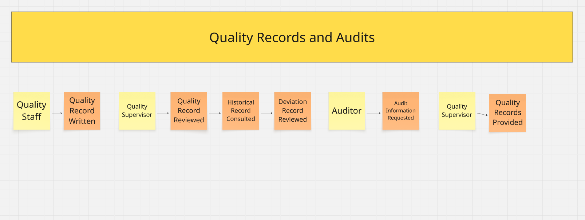
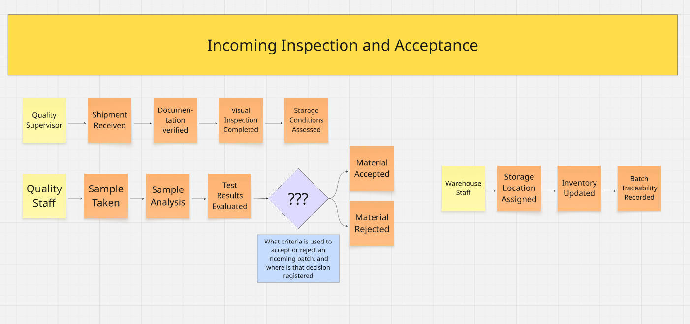
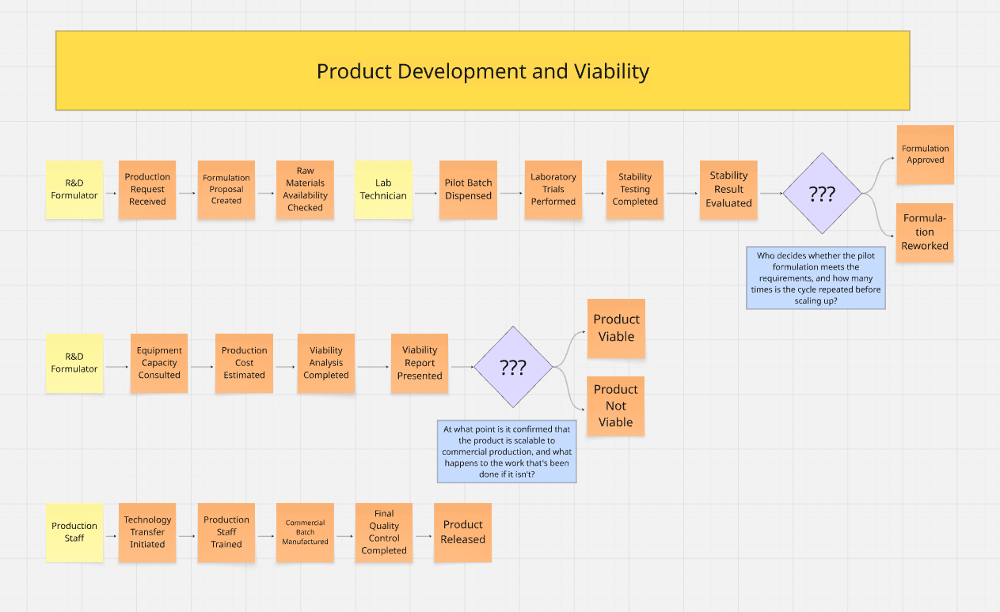
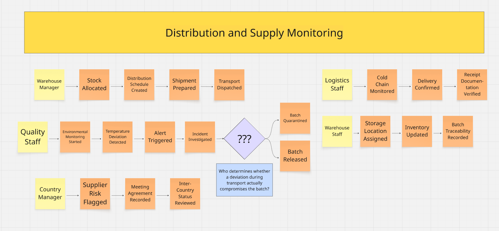

### 2.4. Big Picture Event Storming

El Big Picture Event Storming nos ayuda a explorar los eventos relacionados con los laboratorios. Se empezó colocando eventos de dominio relacionados sin importar el orden. Luego, se formaron líneas de tiempo que ayuden a denotar una secuencia de eventos de dominio que posea coherencia con el negocio y sus relaciones con otros eventos. Finalmente, se identificaron los actores que interactúan en el negocio y los puntos de dolor. A continuación, se adjuntan las capturas de pantalla de cada paso realizado para diagramar el Big Picture Event Storming del proyecto: 

**Step 1 - Free Exploracion**

  

 

En esta primera etapa, el equipo realizó una exploración libre de los eventos relevantes del dominio. Los eventos fueron identificados sin establecer inicialmente un orden específico, buscando recoger los diferentes acontecimientos que forman parte de las actividades de gestión de calidad de los productos farmacéuticos dentro de los laboratorios.

Durante esta exploración se identificaron eventos relacionados con la **recepción y gestión de materias primas**, **inspección y aceptación de materiales**, **producción y evaluación de lotes**, **desarrollo y viabilidad de productos**, **monitoreo de condiciones ambientales**, **tratamiento de desviaciones**, **distribución y seguimiento de suministros**, **gestión de registros de calidad** y **auditorías**.

**Paso 2: Structured organization**

En la segunda etapa, los eventos identificados fueron organizados cronológicamente y agrupados en flujos que representan diferentes procesos del dominio. Asimismo, se incorporaron los actores responsables de los eventos para representar las responsabilidades dentro de cada proceso

De acuerdo con la guía, los actores se representan mediante tarjetas amarillas y permiten identificar quién desencadena o participa en cada evento, mientras que los Hot Spots se utilizan para señalar preguntas, dudas o situaciones críticas que requieren una posterior profundización.

Como resultado de esta organización, se establecieron los siguientes ocho flujos principales:

a) **Environmental Monitoring and Control**

  

 

Este flujo representa las actividades relacionadas con el establecimiento y monitoreo de las condiciones ambientales de las áreas. El proceso inicia con la participación del Quality Supervisor, quien identifica el área y establece los requerimientos y parámetros ambientales que deben cumplirse. Posteriormente, Maintenance interviene para realizar la calibración del instrumento de medición.

Luego, el Quality Staff coloca el instrumento y realiza las mediciones ambientales correspondientes, considerando temperatura, humedad y presión diferencial. Una vez obtenidos los valores, el Assigned Personnel registra las mediciones, para que finalmente el Quality Supervisor revise los registros obtenidos.

El Hot Spot identificado plantea la siguiente incertidumbre:

*“How do you confirm that an out-of-range condition really corresponds to an environmental deviation?”*

Este punto resulta relevante porque, ante una medición que se encuentra fuera de los parámetros establecidos, es necesario confirmar que el valor obtenido corresponde realmente a una desviación y no a un problema relacionado con la medición o el instrumento encargado de medir el ambiente. Esto coincide con lo señalado en las entrevistas, donde se menciona la necesidad de verificar la lectura y el instrumento antes de determinar cómo proceder ante una condición fuera de rango.

b) **Environmental Deviation Management**

  

 

Este flujo representa el proceso que se desarrolla cuando se identifica una condición ambiental fuera de los parámetros establecidos. El proceso inicia cuando el Quality Staff detecta una condición fuera de rango y notifica al Quality Supervisor. A partir de ello, el supervisor identifica la desviación ambiental, detiene la actividad y se inicia la investigación de la causa, solicitando la intervención de Maintenance.

Posteriormente, Maintenance confirma la medición y corrige la condición ambiental. Una vez realizada la corrección, el Quality Staff vuelve a verificar el ambiente mediante una nueva medición. En este punto se presenta el Hot Spot, relacionado con la determinación de cuándo la condición puede considerarse restablecida y cuándo es posible continuar con la actividad.

Finalmente, el Quality Supervisor determina el restablecimiento de la condición y se reanuda la actividad. El Quality Staff registra la desviación ocurrida.

El Hot Spot identificado plantea la siguiente incertidumbre:

*“Who determines that the environmental condition has been corrected and that the activity can resume?”*

Este Hot Spot se ubica después de Environment Rechecked porque, una vez corregida la condición y realizada la nueva verificación, existe una decisión sobre si las condiciones son adecuadas para restablecer la condición y reanudar la actividad. Esta situación es consistente con las entrevistas, donde se señala que, ante una condición fuera de rango, se verifica nuevamente la medición y la continuidad de la actividad depende de la confirmación de que las condiciones hayan vuelto a los parámetros establecidos.

c) **Product Development and Production**

  

 

Este flujo representa las actividades relacionadas con la producción y evaluación de un lote. El proceso inicia con el Production Staff, quien comienza la producción, identifica el lote, selecciona las materias primas necesarias y realiza su dispensación para posteriormente completar la fabricación.

Una vez finalizada la fabricación, interviene el Quality Staff, quien realiza el control de calidad y evalúa el lote obtenido. A partir de esta evaluación se presenta una decisión sobre el resultado del lote, pudiendo ser liberado o rechazado.

El Hot Spot identificado plantea la siguiente incertidumbre:

*“What criteria are considered to determine if a batch is approved or rejected?”*

El Hot Spot se ubica después de Batch Evaluated, ya que en este punto surge la incertidumbre respecto a los criterios utilizados para determinar si el lote puede ser liberado o debe ser rechazado.

Este punto permite profundizar posteriormente en los criterios y condiciones que intervienen en la decisión de aceptación del lote, sin asumir todavía una solución tecnológica

d) **Raw Material Management**

  

 

Este flujo representa el proceso mediante el cual las materias primas son recibidas, identificadas, verificadas y almacenadas antes de ser utilizadas en los procesos de producción. El proceso comienza con la participación del Supplier, quien proporciona la documentación asociada a la materia prima. Posteriormente, el área de Receiving recibe físicamente la materia prima y registra su identificación mediante el lote y código de recepción. Luego, Quality Staff verifica la información y documentación necesaria para determinar si la materia prima cumple con los requisitos establecidos.

Como resultado de esta verificación, la materia prima puede ser aceptada o rechazada. Cuando es rechazada, se registra la información del lote correspondiente. Finalmente, las materias primas aceptadas son almacenadas bajo las condiciones establecidas para su posterior utilización. En las entrevistas se señala que las materias primas se identifican por lote y que, antes de utilizarse, deben contar con información técnica que respalde su uso, como el certificado de análisis.

El Hot Spot identificado plantea la siguiente incertidumbre:

*“What criteria are used to accept or reject an incoming batch, and where is that decision registered?”*

Este punto es importante porque las entrevistas muestran que existen criterios y verificaciones antes de utilizar una materia prima, pero los criterios específicos pueden depender de los procedimientos y requisitos de cada organización. César, por ejemplo, señala que existe un proceso previo de selección y calificación de proveedores y materias primas, mientras que Ohmar menciona que el certificado de análisis es necesario para respaldar técnicamente el uso de un insumo.

e) **Quality Records and Audits**

  

 

Este flujo representa las actividades relacionadas con la generación, revisión y consulta de los registros de calidad, así como la atención de solicitudes de información durante una auditoría. El proceso inicia con el Quality Staff, quien registra la información correspondiente en un registro de calidad. Posteriormente, el Quality Supervisor revisa dicho registro y consulta los registros históricos y de desviaciones cuando necesita información sobre eventos o controles realizados anteriormente.

Cuando se realiza una auditoría, el Auditor solicita la información necesaria y el Quality Supervisor proporciona los registros de calidad requeridos.

f) **Incoming Inspection and Acceptance**

 

Este flujo representa las actividades de verificación técnica que se realizan sobre un material recibido antes de habilitarlo para su uso. A diferencia del flujo de gestión de materias primas, centrado en la recepción documental e identificación por lote, aquí el material ya identificado es sometido a inspección física y analítica.

El proceso inicia con el Quality Supervisor, quien recibe el envío, verifica la documentación asociada y realiza la inspección visual del empaque, evaluando además las condiciones de almacenamiento con las que el material fue transportado. Posteriormente, el Quality Staff toma la muestra correspondiente, realiza el análisis de laboratorio y evalúa los resultados obtenidos frente a las especificaciones establecidas. A partir de esta evaluación se presenta una decisión sobre el material, pudiendo ser aceptado o rechazado.

Cuando el material es aceptado, el Warehouse Staff asigna la ubicación de almacenamiento, actualiza el inventario y registra la trazabilidad del lote para su posterior consulta.

El Hot Spot se ubica después de Test Results Evaluated porque en ese punto existe una decisión sobre la suficiencia de la evidencia técnica disponible. Esta situación es consistente con las entrevistas, donde se menciona que el uso de un insumo debe estar respaldado por información técnica como el certificado de análisis, y que la consulta de las especificaciones asociadas a un producto puede tomar un tiempo considerable debido a que dicha información se encuentra distribuida en distintos medios y formatos.

g) **Product Development and Viability**

 

Este flujo representa el proceso que antecede a la fabricación de un lote comercial, desde la solicitud de un nuevo producto hasta la confirmación de que dicho producto puede ser trasladado a producción. Complementa al flujo de Product Development and Production, que se inicia una vez que el producto ya se encuentra habilitado para fabricarse.

El proceso inicia con el R&D Formulator, quien recibe la solicitud del producto, elabora la propuesta de formulación, consulta la disponibilidad de las materias primas necesarias y define las especificaciones técnicas correspondientes. A continuación, el Lab Technician realiza la dispensación del lote piloto, ejecuta los ensayos de laboratorio y las pruebas de estabilidad, y evalúa los resultados obtenidos. En este punto se presenta una decisión sobre la formulación, la cual puede ser aprobada o devuelta para su reformulación.

Una vez aprobada la formulación, el R&D Formulator consulta la capacidad de los equipos de producción y estima el costo del producto a escala comercial, elaborando el análisis de viabilidad y presentando el informe correspondiente. A partir de este informe se presenta una segunda decisión, en la que el producto puede resultar viable o no viable. Cuando el producto resulta viable, el Production Staff inicia la transferencia de tecnología, capacita al personal, fabrica el lote comercial, completa el control de calidad final y libera el producto.

El Hot Spot se ubica después de Viability Report Presented porque es en ese momento donde se concentra la información sobre capacidad de equipos y costos, de la cual depende que el desarrollo pueda continuar o deba reiniciarse. Esta situación es consistente con las entrevistas, donde se señala que una de las principales dificultades del desarrollo de productos es que la formulación obtenida no resulte transferible a un lote comercial, y que las restricciones asociadas a los equipos y al costo se conocen en etapas avanzadas del desarrollo.

h) **Distribution and Supply Monitoring**

 

Este flujo representa las actividades relacionadas con la distribución de los productos liberados y el seguimiento de las condiciones y del suministro asociados a dicha distribución.

El proceso inicia con el Warehouse Manager, quien asigna el stock disponible, elabora el programa de distribución, prepara el envío y despacha el transporte. Durante el traslado, el Logistics Staff realiza el monitoreo de la cadena de frío, confirma la entrega y verifica la documentación de recepción en el destino. Posteriormente, el Quality Staff inicia el monitoreo ambiental del producto recibido; cuando se detecta una desviación de temperatura se genera la alerta correspondiente y se investiga el incidente. A partir de esta investigación se presenta una decisión sobre el lote, el cual puede ser puesto en cuarentena o liberado.

En paralelo, el Country Manager registra los riesgos asociados a proveedores, documenta los acuerdos establecidos en las reuniones de coordinación y revisa el estado del suministro entre los distintos países a su cargo.

El Hot Spot se ubica después de Incident Investigated porque, una vez conocida la magnitud y duración de la desviación, existe una decisión sobre la aptitud del producto para continuar en la cadena de distribución. Esta situación es consistente con las entrevistas, donde se menciona la dificultad de mantener el seguimiento de los acuerdos y de la información entre áreas y países, así como la dependencia de proveedores únicos, condiciones que inciden en la rapidez con la que se puede tomar y comunicar esta decisión.
