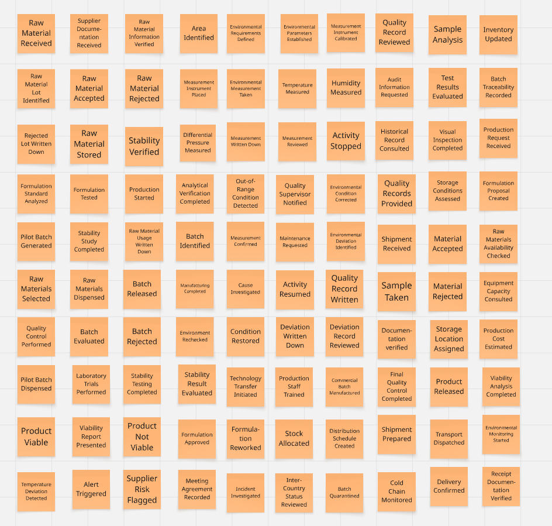

### 2.4. Big Picture Event Storming

El Big Picture Event Storming nos ayuda a explorar los eventos relacionados con los laboratorios. Se empezó colocando eventos de dominio relacionados sin importar el orden. Luego, se formaron líneas de tiempo que ayuden a denotar una secuencia de eventos de dominio que posea coherencia con el negocio y sus relaciones con otros eventos. Finalmente, se identificaron los actores que interactúan en el negocio y los puntos de dolor. A continuación, se adjuntan las capturas de pantalla de cada paso realizado para diagramar el Big Picture Event Storming del proyecto: 

**Step 1 - Free Exploracion**

  

 

En esta primera etapa, el equipo realizó una exploración libre de los eventos relevantes del dominio. Los eventos fueron identificados sin establecer inicialmente un orden específico, buscando recoger los diferentes acontecimientos que forman parte de las actividades de gestión de calidad de los productos farmacéuticos dentro de los laboratorios.

Durante esta exploración se identificaron eventos relacionados con la **recepción y gestión de materias primas**, **inspección y aceptación de materiales**, **producción y evaluación de lotes**, **desarrollo y viabilidad de productos**, **monitoreo de condiciones ambientales**, **tratamiento de desviaciones**, **distribución y seguimiento de suministros**, **gestión de registros de calidad** y **auditorías**.

**Paso 2: Structured organization**

En la segunda etapa, los eventos identificados fueron organizados cronológicamente y agrupados en flujos que representan diferentes procesos del dominio. Asimismo, se incorporaron los actores responsables de los eventos para representar las responsabilidades dentro de cada proceso

De acuerdo con la guía, los actores se representan mediante tarjetas amarillas y permiten identificar quién desencadena o participa en cada evento, mientras que los Hot Spots se utilizan para señalar preguntas, dudas o situaciones críticas que requieren una posterior profundización.

Como resultado de esta organización, se establecieron los siguientes ocho flujos principales:

a) **Environmental Monitoring and Control**

  

 

Este flujo representa las actividades relacionadas con el establecimiento y monitoreo de las condiciones ambientales de las áreas. El proceso inicia con la participación del Quality Supervisor, quien identifica el área y establece los requerimientos y parámetros ambientales que deben cumplirse. Posteriormente, Maintenance interviene para realizar la calibración del instrumento de medición.

Luego, el Quality Staff coloca el instrumento y realiza las mediciones ambientales correspondientes, considerando temperatura, humedad y presión diferencial. Una vez obtenidos los valores, el Assigned Personnel registra las mediciones, para que finalmente el Quality Supervisor revise los registros obtenidos.

El Hot Spot identificado plantea la siguiente incertidumbre:

*How do you confirm that an out-of-range condition really corresponds to an environmental deviation?*

Este punto resulta relevante porque, ante una medición que se encuentra fuera de los parámetros establecidos, es necesario confirmar que el valor obtenido corresponde realmente a una desviación y no a un problema relacionado con la medición o el instrumento encargado de medir el ambiente. Esto coincide con lo señalado en las entrevistas, donde se menciona la necesidad de verificar la lectura y el instrumento antes de determinar cómo proceder ante una condición fuera de rango.
