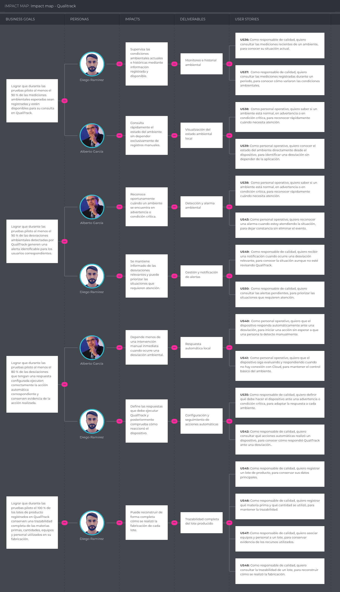

## 3.2. Impact Mapping

En esta sección se presenta el Impact Mapping de QualiTrack, elaborado a partir de los objetivos de negocio, los segmentos de usuario definidos y las principales User Stories del producto. Este análisis permite relacionar los resultados que se esperan alcanzar con los cambios de comportamiento de los usuarios y con las funcionalidades que contribuyen directamente a dichos objetivos, facilitando la priorización de las capacidades de mayor valor para la solución.

