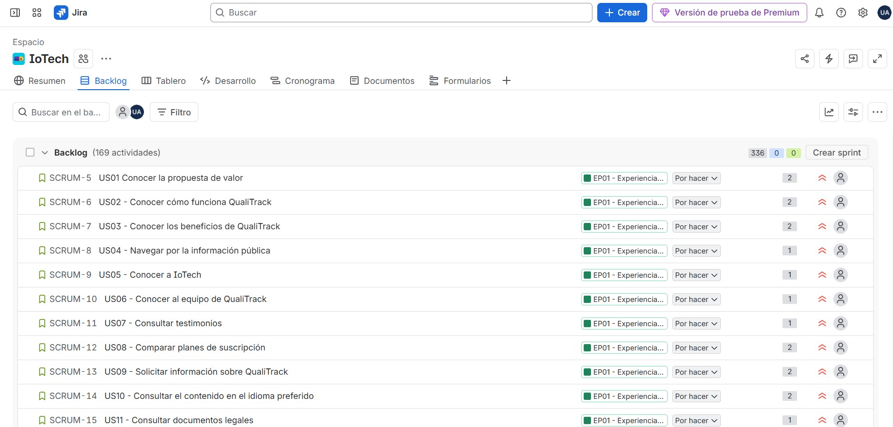

## 3.3. Product Backlog

El Product Backlog de QualiTrack reúne las User Stories (US), Technical Stories (TS) y Maker Stories (MS) definidas para el proyecto, ordenadas de acuerdo con el valor que aportan a la solución. Se priorizan inicialmente las historias relacionadas con el Landing Page, seguidas por las funcionalidades asociadas a los principales procesos de QualiTrack, como la trazabilidad de materias primas y productos, el monitoreo ambiental mediante dispositivos IoT y la gestión de desviaciones. Las demás funcionalidades complementarias se incorporan posteriormente según su relevancia. Para la estimación del esfuerzo se utilizaron Story Points de 1, 2 y 3.

| # Orden | User Story ID | Título                                                                   | Descripción                                                                                                                                                                           | Story Points |
| :------ | :------------ | :----------------------------------------------------------------------- | :------------------------------------------------------------------------------------------------------------------------------------------------------------------------------------ | :----------- |
| 1       | US01          | Conocer la propuesta de valor                                            | Como visitante, quiero conocer qué problema resuelve QualiTrack, para decidir si deseo seguir evaluando la solución.                                                                  | 2            |
| 2       | US02          | Conocer cómo funciona QualiTrack                                         | Como visitante, quiero comprender cómo funciona QualiTrack, para saber cómo monitorea las condiciones ambientales y responde ante una desviación.                                     | 2            |
| 3       | US03          | Conocer los beneficios de QualiTrack                                     | Como visitante, quiero conocer los beneficios de QualiTrack, para evaluar si puede mejorar la supervisión y trazabilidad de mi organización.                                          | 2            |
| 4       | US04          | Navegar por la información pública                                       | Como visitante, quiero acceder a las diferentes secciones del sitio público, para encontrar rápidamente la información que necesito.                                                  | 1            |
| 5       | US05          | Conocer a IoTech                                                         | Como visitante, quiero conocer la startup IoTech, para saber qué organización desarrolla QualiTrack.                                                                                  | 1            |
| 6       | US06          | Conocer al equipo de QualiTrack                                          | Como visitante, quiero conocer a las personas que desarrollan QualiTrack, para identificar al equipo responsable del producto.                                                        | 1            |
| 7       | US07          | Consultar testimonios                                                    | Como visitante, quiero conocer testimonios reales relacionados con QualiTrack, para contar con una referencia adicional antes de decidir si utilizar la solución.                     | 1            |
| 8       | US08          | Comparar planes de suscripción                                           | Como visitante, quiero comparar los planes disponibles de QualiTrack, para identificar cuál se ajusta mejor a las necesidades de mi organización.                                     | 2            |
| 9       | US09          | Solicitar información sobre QualiTrack                                   | Como visitante, quiero enviar una consulta al equipo de QualiTrack, para resolver dudas antes de decidir si utilizar la solución.                                                     | 2            |
| 10      | US10          | Consultar el contenido en el idioma preferido                            | Como visitante, quiero consultar la información pública en español o inglés, para comprender el contenido en el idioma que prefiera.                                                  | 2            |
| 11      | US11          | Consultar documentos legales                                             | Como visitante, quiero consultar los Términos de Servicio y la Política de Privacidad, para conocer las condiciones aplicables antes de utilizar QualiTrack.                          | 1            |
| 12      | US12          | Acceder a la aplicación web                                              | Como visitante, quiero acceder a la aplicación web de QualiTrack, para iniciar el uso de la plataforma desde el navegador.                                                            | 1            |
| 13      | US13          | Acceder a la distribución de la aplicación móvil                         | Como visitante, quiero acceder al punto de distribución de la aplicación móvil, para instalar QualiTrack en un dispositivo compatible.                                                | 1            |
| 14      | TS01          | Publicar el Landing Page                                                 | Como Developer, quiero publicar el Landing Page en un entorno accesible mediante HTTPS, para que los visitantes puedan consultar la información pública de QualiTrack.                | 2            |
| 15      | TS02          | Aplicar internacionalización al Landing Page                             | Como Developer, quiero aplicar soporte de idiomas al Landing Page, para presentar el contenido en inglés y español.                                                                   | 2            |
| 16      | TS03          | Aplicar accesibilidad básica al Landing Page                             | Como Developer, quiero aplicar elementos básicos de accesibilidad al Landing Page, para facilitar el uso del contenido por diferentes visitantes.                                     | 2            |
| 17      | US34          | Registrar una materia prima                                              | Como responsable de calidad, quiero registrar una materia prima, para identificarla y utilizarla posteriormente en el control de inventario y trazabilidad.                           | 2            |
| 18      | US35          | Consultar materias primas                                                | Como responsable de calidad, quiero consultar las materias primas registradas, para conocer los insumos disponibles en el catálogo.                                                   | 1            |
| 19      | US36          | Registrar un lote de materia prima                                       | Como responsable de calidad, quiero registrar cada lote recibido de una materia prima, para conocer su cantidad, procedencia y vencimiento.                                           | 2            |
| 20      | US37          | Consultar lotes de materia prima                                         | Como responsable de calidad, quiero consultar los lotes de una materia prima, para conocer sus cantidades, estados y fechas de vencimiento.                                           | 1            |
| 21      | US38          | Cambiar el estado de un lote de materia prima                            | Como responsable de calidad, quiero indicar si un lote está disponible, observado o rechazado, para controlar si puede utilizarse en una fabricación.                                 | 2            |
| 22      | US39          | Consultar el stock disponible                                            | Como responsable de calidad, quiero consultar la cantidad utilizable de cada materia prima, para planificar su uso.                                                                   | 2            |
| 23      | US40          | Identificar materias primas con stock bajo                               | Como responsable de calidad, quiero identificar materias primas con stock por debajo del mínimo definido, para planificar su reposición.                                              | 2            |
| 24      | US41          | Identificar lotes próximos a vencer                                      | Como responsable de calidad, quiero identificar los lotes próximos a vencer, para tomar acciones antes de que dejen de ser utilizables.                                               | 2            |
| 25      | TS21          | Registrar una materia prima mediante la API                              | Como Developer, quiero registrar una materia prima mediante la API, para integrar el alta de insumos en las aplicaciones.                                                             | 2            |
| 26      | TS22          | Consultar materias primas mediante la API                                | Como Developer, quiero consultar las materias primas mediante la API, para mostrar el catálogo de insumos.                                                                            | 1            |
| 27      | TS23          | Registrar un lote de materia prima mediante la API                       | Como Developer, quiero registrar un lote de materia prima mediante la API, para integrar nuevas recepciones al inventario.                                                            | 2            |
| 28      | TS24          | Consultar lotes de materia prima mediante la API                         | Como Developer, quiero consultar lotes de materia prima mediante la API, para mostrar cantidades, estados y vencimientos.                                                             | 1            |
| 29      | TS25          | Cambiar el estado de un lote mediante la API                             | Como Developer, quiero cambiar el estado de un lote de materia prima mediante la API, para controlar si puede utilizarse.                                                             | 2            |
| 30      | TS26          | Calcular el stock utilizable mediante la API                             | Como Developer, quiero consultar el stock utilizable calculado desde los lotes disponibles, para evitar mantener cantidades estáticas separadas de la información real.               | 3            |
| 31      | TS27          | Consultar materias primas con stock bajo mediante la API                 | Como Developer, quiero consultar materias primas con stock bajo mediante la API, para mostrar los insumos que requieren reposición.                                                   | 2            |
| 32      | TS28          | Consultar lotes próximos a vencer mediante la API                        | Como Developer, quiero consultar lotes próximos a vencer mediante la API, para mostrar los registros que requieren atención.                                                          | 2            |
| 33      | US58          | Registrar un producto                                                    | Como responsable de calidad, quiero registrar un producto farmacéutico, para identificarlo y crear posteriormente sus lotes de fabricación.                                           | 2            |
| 34      | US59          | Consultar productos                                                      | Como responsable de calidad, quiero consultar los productos registrados, para conocer cuáles pueden utilizarse al registrar una fabricación.                                          | 1            |
| 35      | US60          | Registrar un lote de producto                                            | Como responsable de calidad, quiero registrar una fabricación específica de un producto, para conservar su identificación y datos principales.                                        | 2            |
| 36      | US61          | Consultar un lote de producto                                            | Como responsable de calidad, quiero consultar la información de un lote de producto, para revisar los datos registrados de esa fabricación.                                           | 1            |
| 37      | US62          | Registrar el consumo de materia prima                                    | Como responsable de calidad, quiero registrar el lote de materia prima y la cantidad utilizada en una fabricación, para descontar el stock correcto y mantener la trazabilidad.       | 3            |
| 38      | US63          | Asociar un equipo con un lote de producto                                | Como responsable de calidad, quiero asociar los equipos utilizados con un lote de producto, para conservar evidencia de los equipos que participaron en la fabricación.               | 2            |
| 39      | US64          | Asociar personal con un lote de producto                                 | Como responsable de calidad, quiero asociar al personal que participó en una fabricación, para conservar evidencia de las personas relacionadas con el lote.                          | 2            |
| 40      | US65          | Consultar la trazabilidad de un lote                                     | Como responsable de calidad, quiero consultar los recursos relacionados con un lote fabricado, para reconstruir qué materias primas, equipos y personas participaron.                 | 3            |
| 41      | TS53          | Registrar un producto mediante la API                                    | Como Developer, quiero registrar un producto mediante la API, para integrar el alta del catálogo de productos.                                                                        | 2            |
| 42      | TS54          | Consultar productos mediante la API                                      | Como Developer, quiero consultar productos mediante la API, para mostrar el catálogo disponible.                                                                                      | 1            |
| 43      | TS55          | Registrar un lote de producto mediante la API                            | Como Developer, quiero registrar un lote de producto mediante la API, para integrar nuevas fabricaciones.                                                                             | 2            |
| 44      | TS56          | Consultar lotes de producto mediante la API                              | Como Developer, quiero consultar lotes de producto mediante la API, para recuperar la información de las fabricaciones registradas.                                                   | 1            |
| 45      | TS57          | Registrar consumo de materia prima mediante la API                       | Como Developer, quiero registrar el consumo de un lote de materia prima mediante la API, para actualizar el inventario y la trazabilidad de fabricación.                              | 3            |
| 46      | TS58          | Asociar equipos con un lote mediante la API                              | Como Developer, quiero asociar equipos con un lote de producto mediante la API, para conservar los equipos utilizados en la fabricación.                                              | 2            |
| 47      | TS59          | Asociar personal con un lote mediante la API                             | Como Developer, quiero asociar personal con un lote de producto mediante la API, para conservar las personas relacionadas con la fabricación.                                         | 2            |
| 48      | TS60          | Consultar trazabilidad de lotes mediante la API                          | Como Developer, quiero consultar la trazabilidad de un lote mediante la API, para obtener sus materias primas, equipos y personal relacionados.                                       | 3            |
| 49      | US72          | Identificar lotes afectados por una materia prima no utilizable          | Como responsable de calidad, quiero identificar qué lotes de producto utilizaron una materia prima observada o rechazada, para evaluar el posible impacto.                            | 3            |
| 50      | TS67          | Consultar lotes afectados por trazabilidad                               | Como Developer, quiero consultar qué lotes de producto están relacionados con un lote de materia prima, para apoyar la evaluación de impacto.                                         | 2            |
| 51      | US27          | Registrar el laboratorio o almacén                                       | Como responsable de calidad, quiero registrar el laboratorio o almacén de mi organización, para comenzar a configurar QualiTrack.                                                     | 2            |
| 52      | US30          | Registrar un ambiente                                                    | Como responsable de calidad, quiero registrar un ambiente dentro del laboratorio o almacén, para organizar los equipos, dispositivos y mediciones según su ubicación.                 | 2            |
| 53      | US33          | Registrar personal                                                       | Como responsable de calidad, quiero registrar al personal relacionado con las operaciones, para identificar posteriormente a las personas que participan en la trazabilidad.          | 2            |
| 54      | TS13          | Registrar una instalación mediante la API                                | Como Developer, quiero registrar un laboratorio o almacén mediante la API, para integrar la configuración inicial en las aplicaciones.                                                | 2            |
| 55      | TS16          | Registrar un ambiente mediante la API                                    | Como Developer, quiero registrar un ambiente mediante la API, para integrar nuevas zonas de monitoreo en las aplicaciones.                                                            | 2            |
| 56      | TS19          | Registrar personal mediante la API                                       | Como Developer, quiero registrar personal mediante la API, para relacionar personas con las operaciones de trazabilidad.                                                              | 2            |
| 57      | US28          | Consultar la información del laboratorio o almacén                       | Como responsable de calidad, quiero consultar los datos de mi laboratorio o almacén, para revisar la información registrada.                                                          | 1            |
| 58      | US31          | Consultar los ambientes registrados                                      | Como responsable de calidad, quiero consultar los ambientes del laboratorio o almacén, para conocer las zonas disponibles para supervisión.                                           | 1            |
| 59      | TS14          | Consultar una instalación mediante la API                                | Como Developer, quiero consultar un laboratorio o almacén mediante la API, para recuperar su información desde las aplicaciones.                                                      | 1            |
| 60      | TS17          | Consultar ambientes mediante la API                                      | Como Developer, quiero consultar los ambientes de una instalación mediante la API, para mostrar sus zonas registradas.                                                                | 1            |
| 61      | TS20          | Consultar personal mediante la API                                       | Como Developer, quiero consultar el personal registrado mediante la API, para utilizarlo en las funciones de trazabilidad.                                                            | 1            |
| 62      | US29          | Actualizar la información del laboratorio o almacén                      | Como responsable de calidad, quiero actualizar los datos generales de mi laboratorio o almacén, para mantener su información vigente.                                                 | 2            |
| 63      | US32          | Actualizar un ambiente                                                   | Como responsable de calidad, quiero actualizar la información de un ambiente, para mantener correctamente identificada la zona monitoreada.                                           | 2            |
| 64      | TS15          | Actualizar una instalación mediante la API                               | Como Developer, quiero actualizar un laboratorio o almacén mediante la API, para mantener su información vigente.                                                                     | 2            |
| 65      | TS18          | Actualizar un ambiente mediante la API                                   | Como Developer, quiero actualizar un ambiente mediante la API, para mantener vigente la información de la zona monitoreada.                                                           | 2            |
| 66      | US42          | Registrar un equipo                                                      | Como responsable de calidad, quiero registrar un equipo del laboratorio o almacén, para identificarlo dentro de las operaciones de QualiTrack.                                        | 2            |
| 67      | US43          | Consultar equipos                                                        | Como responsable de calidad, quiero consultar los equipos registrados, para conocer su información y estado actual.                                                                   | 1            |
| 68      | US44          | Asociar un equipo con un ambiente                                        | Como responsable de calidad, quiero asociar un equipo con el ambiente donde se encuentra, para conocer su ubicación dentro de la instalación.                                         | 2            |
| 69      | US45          | Actualizar el estado operativo de un equipo                              | Como responsable de calidad, quiero indicar si un equipo está disponible, en mantenimiento o fuera de servicio, para evitar utilizar recursos no disponibles.                         | 2            |
| 70      | TS29          | Registrar un equipo mediante la API                                      | Como Developer, quiero registrar un equipo mediante la API, para integrar el alta de equipos en las aplicaciones.                                                                     | 2            |
| 71      | TS30          | Consultar equipos mediante la API                                        | Como Developer, quiero consultar equipos mediante la API, para mostrar su información y estado.                                                                                       | 1            |
| 72      | TS31          | Asociar un equipo con un ambiente mediante la API                        | Como Developer, quiero asociar un equipo con un ambiente mediante la API, para conservar su ubicación.                                                                                | 2            |
| 73      | TS32          | Actualizar el estado de un equipo mediante la API                        | Como Developer, quiero actualizar el estado operativo de un equipo mediante la API, para reflejar si está disponible, en mantenimiento o fuera de servicio.                           | 2            |
| 74      | US48          | Registrar un dispositivo IoT                                             | Como responsable de calidad, quiero registrar un dispositivo IoT, para identificarlo antes de utilizarlo en el monitoreo ambiental.                                                   | 2            |
| 75      | US49          | Asociar un dispositivo IoT con un ambiente                               | Como responsable de calidad, quiero asociar un dispositivo IoT con el ambiente que debe monitorear, para relacionar correctamente sus mediciones.                                     | 2            |
| 76      | US50          | Consultar el estado de conexión de un dispositivo IoT                    | Como responsable de calidad, quiero conocer si un dispositivo IoT está comunicándose con QualiTrack, para detectar equipos que requieren revisión.                                    | 2            |
| 77      | TS35          | Registrar dispositivos IoT mediante la API                               | Como Developer, quiero registrar dispositivos IoT mediante la API, para identificarlos antes de su integración con Edge.                                                              | 2            |
| 78      | TS36          | Asociar dispositivos IoT con ambientes mediante la API                   | Como Developer, quiero asociar un dispositivo con un ambiente mediante la API, para relacionar sus mediciones con la ubicación correcta.                                              | 2            |
| 79      | TS37          | Consultar el estado de conexión de dispositivos mediante la API          | Como Developer, quiero consultar el estado de conexión de los dispositivos mediante la API, para mostrar su disponibilidad en las aplicaciones.                                       | 2            |
| 80      | MS01          | Leer temperatura y humedad con el dispositivo                            | Como maker, quiero obtener lecturas de temperatura y humedad desde el sensor ambiental, para validar que el dispositivo puede medir las condiciones principales del ambiente.         | 2            |
| 81      | MS02          | Leer el indicador de gases/VOC                                           | Como maker, quiero obtener el indicador de gases/VOC disponible en el sensor ambiental, para incluir una referencia adicional de la condición del ambiente.                           | 2            |
| 82      | MS10          | Enviar telemetría al Edge API                                            | Como maker, quiero enviar las mediciones del dispositivo al Edge API mediante HTTP, para que la información quede disponible para almacenamiento y sincronización.                    | 2            |
| 83      | TS46          | Recibir telemetría en el Edge API                                        | Como Developer, quiero recibir mediciones desde el dispositivo mediante el RESTful Edge API, para almacenarlas localmente antes de sincronizarlas con Cloud.                          | 2            |
| 84      | TS40          | Recibir telemetría sincronizada desde Edge                               | Como Developer, quiero recibir en Cloud las mediciones sincronizadas desde Edge, para centralizar la telemetría de los dispositivos.                                                  | 3            |
| 85      | US53          | Consultar las mediciones ambientales actuales                            | Como responsable de calidad, quiero consultar las mediciones más recientes de un ambiente, para conocer sus condiciones actuales.                                                     | 2            |
| 86      | TS42          | Consultar el estado ambiental mediante la API                            | Como Developer, quiero consultar el estado ambiental vigente mediante la API, para mostrar la situación actual en las aplicaciones.                                                   | 2            |
| 87      | US54          | Consultar el estado ambiental actual                                     | Como responsable de calidad, quiero conocer si un ambiente está normal, en advertencia o crítico, para identificar rápidamente cuándo necesita atención.                              | 2            |
| 88      | US55          | Consultar el historial de mediciones                                     | Como responsable de calidad, quiero consultar las mediciones de un ambiente durante un periodo, para analizar cómo cambiaron sus condiciones.                                         | 2            |
| 89      | TS43          | Consultar el historial de telemetría mediante la API                     | Como Developer, quiero consultar mediciones históricas mediante la API, para integrar análisis por ambiente y periodo.                                                                | 2            |
| 90      | US51          | Configurar rangos ambientales                                            | Como responsable de calidad, quiero definir los rangos permitidos para una variable ambiental, para que QualiTrack pueda identificar condiciones normales, de advertencia y críticas. | 2            |
| 91      | TS38          | Guardar rangos ambientales mediante la API                               | Como Developer, quiero guardar los rangos ambientales mediante la API, para que las aplicaciones puedan configurar los límites de monitoreo.                                          | 2            |
| 92      | US52          | Configurar una respuesta automática                                      | Como responsable de calidad, quiero relacionar una condición ambiental con una acción automática, para definir cómo debe responder el dispositivo ante esa situación.                 | 3            |
| 93      | TS39          | Guardar reglas de actuación mediante la API                              | Como Developer, quiero guardar reglas de actuación mediante la API, para relacionar condiciones ambientales con acciones automáticas.                                                 | 3            |
| 94      | MS03          | Mostrar las mediciones en la pantalla del dispositivo                    | Como maker, quiero mostrar las mediciones ambientales actuales en la pantalla del dispositivo, para poder verificar su funcionamiento directamente en campo.                          | 2            |
| 95      | MS04          | Indicar el estado ambiental con una señal visual                         | Como maker, quiero representar el estado normal, de advertencia o crítico mediante una señal visual, para que el personal pueda reconocer la condición sin consultar la aplicación.   | 2            |
| 96      | MS05          | Activar el ventilador automáticamente                                    | Como maker, quiero controlar el ventilador desde la aplicación embebida, para ejecutar la acción configurada cuando una condición ambiental lo requiere.                              | 3            |
| 97      | MS06          | Controlar la compuerta con el servomotor                                 | Como maker, quiero controlar una compuerta mediante el servomotor, para representar una acción automática de ventilación.                                                             | 3            |
| 98      | MS07          | Activar la alarma sonora en una condición crítica                        | Como maker, quiero controlar el buzzer ante una condición crítica, para emitir una señal sonora cuando la situación requiere atención inmediata.                                      | 2            |
| 99      | US56          | Consultar el historial de acciones automáticas                           | Como responsable de calidad, quiero consultar las acciones automáticas ejecutadas por un dispositivo, para conocer cómo respondió QualiTrack ante las desviaciones.                   | 2            |
| 100     | MS11          | Enviar eventos de actuación al Edge API                                  | Como maker, quiero enviar a Edge los eventos producidos cuando cambia un actuador, para mantener trazabilidad de las acciones realizadas por el dispositivo.                          | 2            |
| 101     | TS47          | Recibir eventos de actuación en el Edge API                              | Como Developer, quiero recibir los eventos de actuación del dispositivo mediante el Edge API, para conservar localmente las acciones realizadas.                                      | 2            |
| 102     | TS41          | Recibir eventos de actuación desde Edge                                  | Como Developer, quiero recibir en Cloud los eventos de actuación sincronizados desde Edge, para conservar la trazabilidad de las acciones realizadas por los dispositivos.            | 2            |
| 103     | TS44          | Consultar eventos de actuación mediante la API                           | Como Developer, quiero consultar eventos de actuación mediante la API, para mostrar el historial de respuestas automáticas.                                                           | 2            |
| 104     | US57          | Reconocer una alarma local                                               | Como personal operativo, quiero reconocer una alarma desde el dispositivo, para dejar constancia de que la situación está siendo atendida.                                            | 2            |
| 105     | MS08          | Reconocer una alarma mediante un botón físico                            | Como maker, quiero implementar un botón físico para reconocer una alarma activa, para permitir que el personal indique localmente que está atendiendo la situación.                   | 2            |
| 106     | TS45          | Autenticar dispositivos en Edge                                          | Como Developer, quiero validar la identidad de cada dispositivo antes de aceptar sus solicitudes en Edge, para impedir el envío de información desde dispositivos no registrados.     | 2            |
| 107     | MS09          | Autenticar el dispositivo con Edge                                       | Como maker, quiero que el dispositivo se autentique con el Edge API, para enviar información únicamente después de ser reconocido por el servicio local.                              | 2            |
| 108     | TS48          | Entregar configuración al dispositivo desde Edge                         | Como Developer, quiero exponer desde Edge la configuración vigente del dispositivo, para que la aplicación embebida pueda obtener sus rangos y reglas.                                | 2            |
| 109     | MS12          | Obtener la configuración desde Edge                                      | Como maker, quiero que el dispositivo obtenga desde Edge los rangos y reglas vigentes, para evaluar las mediciones con la configuración asignada.                                     | 2            |
| 110     | TS49          | Conservar registros pendientes en Edge                                   | Como Developer, quiero conservar en SQLite los registros pendientes de sincronización, para evitar pérdida de información cuando Cloud no está disponible.                            | 2            |
| 111     | TS50          | Sincronizar telemetría pendiente con Cloud                               | Como Developer, quiero sincronizar desde Edge las mediciones pendientes con Cloud, para centralizar la telemetría cuando existe conectividad.                                         | 3            |
| 112     | TS51          | Sincronizar eventos de actuación pendientes con Cloud                    | Como Developer, quiero sincronizar desde Edge los eventos de actuación pendientes con Cloud, para centralizar la trazabilidad de acciones.                                            | 3            |
| 113     | TS52          | Sincronizar configuraciones de Cloud hacia Edge                          | Como Developer, quiero obtener desde Cloud las configuraciones vigentes, para mantener en Edge una copia disponible para los dispositivos.                                            | 3            |
| 114     | MS13          | Mantener el control local sin Internet                                   | Como maker, quiero que el dispositivo siga evaluando y actuando cuando la conexión a Cloud no está disponible, para mantener el control básico del ambiente.                          | 3            |
| 115     | TS61          | Crear alertas a partir de desviaciones                                   | Como Developer, quiero generar una alerta cuando Cloud confirma una desviación que cumple las reglas configuradas, para iniciar su ciclo de atención.                                 | 3            |
| 116     | US68          | Consultar alertas activas                                                | Como responsable de calidad, quiero consultar las alertas que todavía requieren atención, para priorizar las situaciones pendientes.                                                  | 1            |
| 117     | US69          | Consultar el detalle de una alerta                                       | Como responsable de calidad, quiero conocer qué originó una alerta y qué acciones automáticas se realizaron, para entender lo ocurrido.                                               | 2            |
| 118     | US70          | Registrar que una alerta está siendo atendida                            | Como responsable de calidad, quiero indicar que una alerta está siendo atendida, para dejar constancia de quién inició su atención y cuándo.                                          | 2            |
| 119     | US71          | Cerrar una alerta resuelta                                               | Como responsable de calidad, quiero registrar la resolución de una alerta, para conservar evidencia de cómo y cuándo finalizó la desviación.                                          | 2            |
| 120     | TS62          | Consultar alertas mediante la API                                        | Como Developer, quiero consultar alertas mediante la API, para integrar su lista y detalle en las aplicaciones.                                                                       | 2            |
| 121     | TS63          | Registrar atención de una alerta mediante la API                         | Como Developer, quiero registrar el inicio de atención de una alerta mediante la API, para conservar quién comenzó a atenderla.                                                       | 2            |
| 122     | TS64          | Registrar resolución de una alerta mediante la API                       | Como Developer, quiero registrar la resolución de una alerta mediante la API, para completar su ciclo de vida.                                                                        | 2            |
| 123     | US66          | Recibir una notificación push por una desviación                         | Como responsable de calidad, quiero recibir una notificación push cuando se genera una alerta relevante, para conocer la situación aunque no esté revisando QualiTrack.               | 2            |
| 124     | US67          | Recibir un correo ante una desviación crítica                            | Como responsable de calidad, quiero recibir un correo cuando se genera una alerta crítica, para contar con un aviso adicional de una situación importante.                            | 2            |
| 125     | TS65          | Enviar notificaciones push de alertas                                    | Como Developer, quiero integrar el servicio de notificaciones push, para avisar a los responsables cuando una alerta cumple las reglas de notificación móvil.                         | 3            |
| 126     | TS66          | Enviar correos de alertas críticas                                       | Como Developer, quiero integrar el servicio de correo, para avisar a los responsables cuando una alerta crítica requiere este canal.                                                  | 3            |
| 127     | US73          | Consultar condiciones ambientales desde el móvil                         | Como responsable de calidad, quiero consultar desde el móvil el estado actual de un ambiente, para supervisarlo cuando estoy fuera de la instalación.                                 | 2            |
| 128     | US74          | Consultar alertas desde el móvil                                         | Como responsable de calidad, quiero consultar las alertas desde la aplicación móvil, para revisar situaciones pendientes mientras me encuentro fuera de la instalación.               | 2            |
| 129     | US75          | Consultar el registro de auditoría                                       | Como responsable de calidad, quiero consultar las operaciones relevantes registradas por QualiTrack, para conocer qué ocurrió, quién realizó la acción y cuándo sucedió.              | 2            |
| 130     | US76          | Consultar un resumen de mediciones ambientales                           | Como responsable de calidad, quiero consultar el promedio, mínimo y máximo de las mediciones de un periodo, para resumir el comportamiento ambiental.                                 | 2            |
| 131     | US77          | Consultar indicadores de desviaciones                                    | Como responsable de calidad, quiero consultar el tiempo dentro de rango y la cantidad de desviaciones de un periodo, para evaluar la estabilidad ambiental.                           | 3            |
| 132     | US78          | Generar un reporte ambiental                                             | Como responsable de calidad, quiero generar un reporte ambiental de un periodo, para revisar de forma consolidada las mediciones, desviaciones, alertas y acciones registradas.       | 3            |
| 133     | US79          | Generar un reporte de trazabilidad de lote                               | Como responsable de calidad, quiero generar un reporte de trazabilidad de un lote de producto, para conservar evidencia de los recursos utilizados en su fabricación.                 | 3            |
| 134     | US80          | Generar un reporte de inventario                                         | Como responsable de calidad, quiero generar un reporte de inventario, para revisar las materias primas, lotes y cantidades registradas.                                               | 2            |
| 135     | US81          | Generar un reporte de mantenimiento                                      | Como responsable de calidad, quiero generar un reporte de mantenimiento, para revisar las intervenciones registradas sobre los equipos.                                               | 2            |
| 136     | TS68          | Consultar auditoría mediante la API                                      | Como Developer, quiero consultar registros de auditoría mediante la API, para integrar la trazabilidad de acciones en las aplicaciones.                                               | 2            |
| 137     | TS69          | Calcular resumen estadístico ambiental                                   | Como Developer, quiero calcular promedio, mínimo y máximo a partir de las mediciones persistidas, para ofrecer un resumen cuantitativo del periodo.                                   | 2            |
| 138     | TS70          | Calcular indicadores de desviaciones                                     | Como Developer, quiero calcular tiempo dentro de rango y cantidad de desviaciones, para ofrecer indicadores ambientales del periodo.                                                  | 3            |
| 139     | TS71          | Generar reporte ambiental con datos persistidos                          | Como Developer, quiero generar un reporte ambiental a partir de mediciones, desviaciones, alertas y actuaciones registradas, para entregar información consolidada.                   | 3            |
| 140     | TS72          | Generar reporte de trazabilidad de lote                                  | Como Developer, quiero generar un reporte de trazabilidad a partir de las relaciones registradas de un lote, para entregar evidencia de fabricación.                                  | 3            |
| 141     | TS73          | Generar reporte de inventario                                            | Como Developer, quiero generar un reporte de inventario a partir de materias primas y lotes persistidos, para entregar información consolidada del stock.                             | 2            |
| 142     | TS74          | Generar reporte de mantenimiento                                         | Como Developer, quiero generar un reporte de mantenimiento a partir de las intervenciones persistidas, para entregar el historial consolidado de los equipos.                         | 2            |
| 143     | TS75          | Exportar reportes en formato PDF                                         | Como Developer, quiero exportar un reporte generado a PDF, para permitir que los usuarios conserven una copia del documento.                                                          | 2            |
| 144     | US46          | Registrar un mantenimiento                                               | Como responsable de calidad, quiero registrar un mantenimiento realizado a un equipo, para conservar evidencia de la intervención.                                                    | 2            |
| 145     | US47          | Consultar el historial de mantenimiento                                  | Como responsable de calidad, quiero consultar los mantenimientos de un equipo, para conocer las intervenciones realizadas anteriormente.                                              | 1            |
| 146     | TS33          | Registrar un mantenimiento mediante la API                               | Como Developer, quiero registrar un mantenimiento mediante la API, para conservar la intervención realizada sobre un equipo.                                                          | 2            |
| 147     | TS34          | Consultar mantenimientos mediante la API                                 | Como Developer, quiero consultar el historial de mantenimiento mediante la API, para mostrar las intervenciones registradas.                                                          | 1            |
| 148     | US19          | Seleccionar un plan                                                      | Como usuario autenticado, quiero seleccionar un plan disponible, para indicar qué modalidad deseo contratar.                                                                          | 1            |
| 149     | US20          | Completar el pago de la suscripción                                      | Como usuario autenticado, quiero completar el pago del plan seleccionado, para activar mi suscripción a QualiTrack.                                                                   | 3            |
| 150     | US21          | Consultar el estado de la suscripción                                    | Como usuario con suscripción, quiero consultar el plan contratado y su vigencia, para conocer el estado actual de mi servicio.                                                        | 1            |
| 151     | US22          | Consultar el historial de pagos                                          | Como usuario con suscripción, quiero consultar los pagos registrados de mi cuenta, para revisar mi historial de facturación.                                                          | 1            |
| 152     | US23          | Cancelar la renovación de la suscripción                                 | Como usuario con una suscripción activa, quiero cancelar su renovación, para evitar nuevos cobros al finalizar el periodo contratado.                                                 | 2            |
| 153     | US24          | Continuar hacia la contratación cuando no existe una suscripción activa  | Como usuario autenticado sin suscripción activa, quiero continuar con la selección de un plan, para completar el requisito pendiente de mi cuenta.                                    | 2            |
| 154     | US25          | Continuar hacia el registro de la instalación                            | Como usuario autenticado con suscripción activa, quiero registrar mi laboratorio o almacén si todavía no existe, para completar la configuración inicial.                             | 2            |
| 155     | US26          | Acceder a las funciones operativas con la configuración inicial completa | Como usuario autenticado con suscripción e instalación registradas, quiero acceder a las funciones operativas, para comenzar a utilizar QualiTrack.                                   | 2            |
| 156     | TS09          | Crear una sesión de pago                                                 | Como Developer, quiero crear una sesión de pago con el proveedor externo, para iniciar la contratación de un plan sin almacenar datos sensibles de pago.                              | 3            |
| 157     | TS10          | Procesar confirmaciones del proveedor de pagos                           | Como Developer, quiero procesar los eventos enviados por el proveedor de pagos, para actualizar el estado de las suscripciones.                                                       | 3            |
| 158     | TS11          | Consultar la suscripción mediante la API                                 | Como Developer, quiero consultar la suscripción vigente mediante la API, para que las aplicaciones conozcan el estado del servicio contratado.                                        | 1            |
| 159     | TS12          | Cancelar la renovación mediante la API                                   | Como Developer, quiero cancelar la renovación de una suscripción mediante la API, para integrar esta operación en las aplicaciones.                                                   | 2            |
| 160     | US14          | Crear una cuenta                                                         | Como visitante, quiero crear una cuenta en QualiTrack, para poder iniciar sesión y continuar con la contratación del servicio.                                                        | 2            |
| 161     | US15          | Iniciar sesión                                                           | Como usuario registrado, quiero iniciar sesión con mis credenciales, para acceder al flujo correspondiente al estado de mi cuenta.                                                    | 2            |
| 162     | US16          | Solicitar recuperación de contraseña                                     | Como usuario registrado, quiero solicitar la recuperación de mi contraseña, para iniciar el proceso de recuperación de acceso a mi cuenta.                                            | 2            |
| 163     | US17          | Restablecer la contraseña                                                | Como usuario registrado, quiero establecer una nueva contraseña mediante una solicitud de recuperación válida, para volver a acceder a mi cuenta.                                     | 2            |
| 164     | US18          | Cerrar sesión                                                            | Como usuario autenticado, quiero cerrar mi sesión, para impedir que otra persona continúe utilizando mi acceso.                                                                       | 1            |
| 165     | TS04          | Registrar usuarios mediante la API                                       | Como Developer, quiero registrar usuarios mediante la API, para integrar la creación de cuentas en las aplicaciones de QualiTrack.                                                    | 2            |
| 166     | TS05          | Autenticar usuarios mediante la API                                      | Como Developer, quiero autenticar usuarios mediante la API, para obtener una sesión válida para las aplicaciones de QualiTrack.                                                       | 2            |
| 167     | TS06          | Solicitar recuperación de contraseña mediante la API                     | Como Developer, quiero iniciar la recuperación de contraseña mediante la API, para que las aplicaciones puedan solicitar el restablecimiento de acceso.                               | 2            |
| 168     | TS07          | Confirmar restablecimiento de contraseña mediante la API                 | Como Developer, quiero confirmar una solicitud de recuperación y registrar una nueva contraseña mediante la API, para completar el restablecimiento de acceso.                        | 2            |
| 169     | TS08          | Validar permisos por rol                                                 | Como Developer, quiero validar los permisos del usuario antes de ejecutar una operación protegida, para impedir acciones no autorizadas.                                              | 3            |

**Evidencia del Product Backlog:**

**Enlace público al Product Backlog:**

> [Product Backlog - Jira](https://iotech-2620.atlassian.net/jira/software/projects/SCRUM/boards/1/backlog?atlOrigin=eyJpIjoiMzRhZDg1MzEwMzliNGNjYThlNTcyMDMzNWI0MzUyYTciLCJwIjoiaiJ9)
