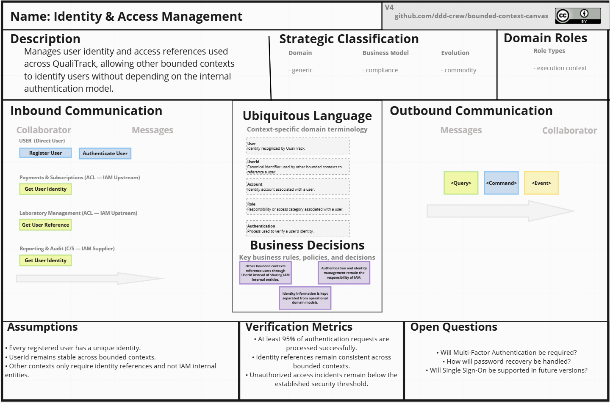
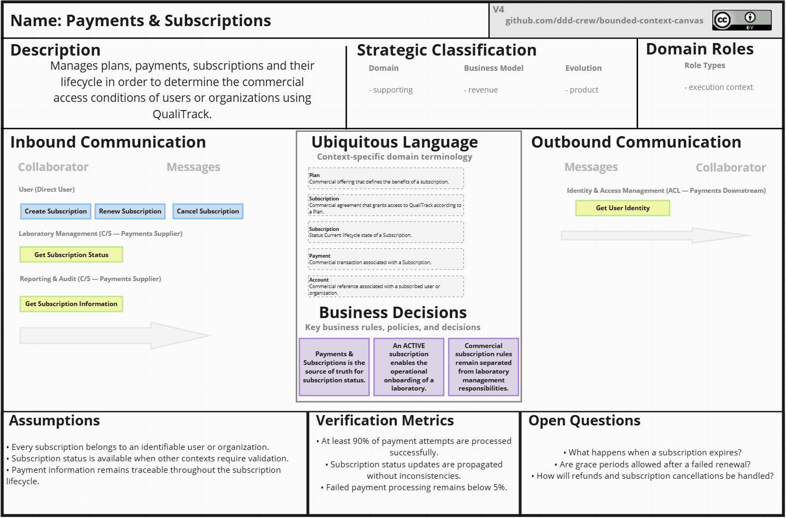
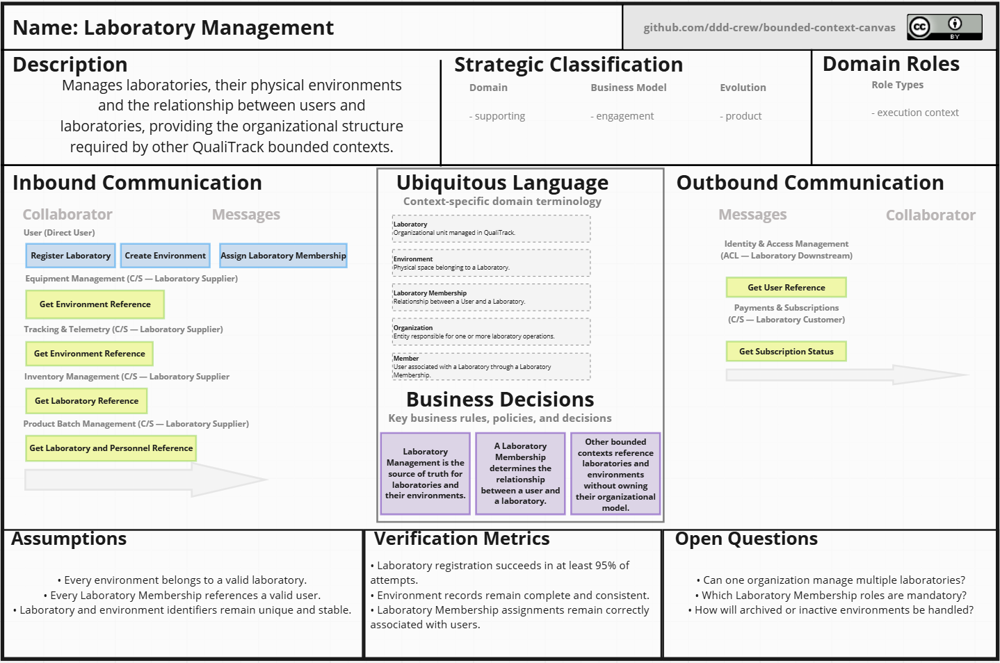
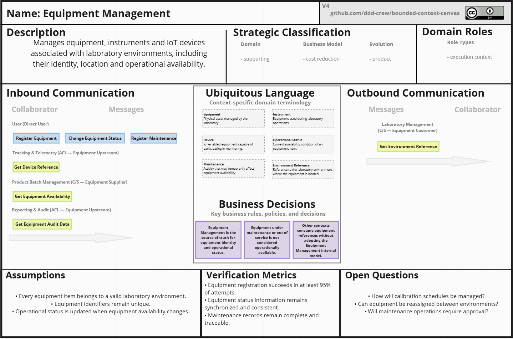
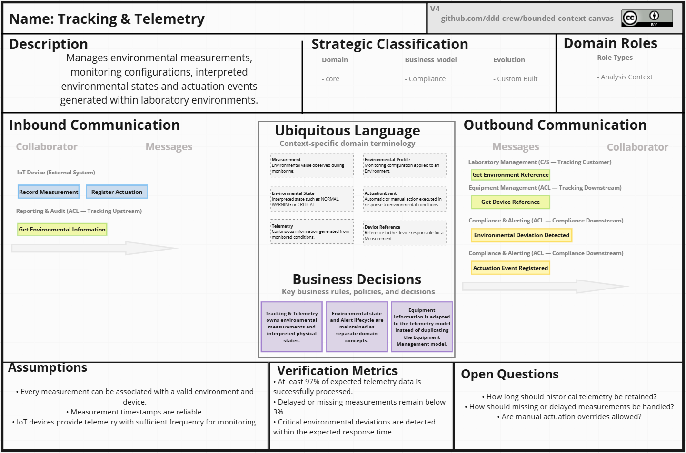
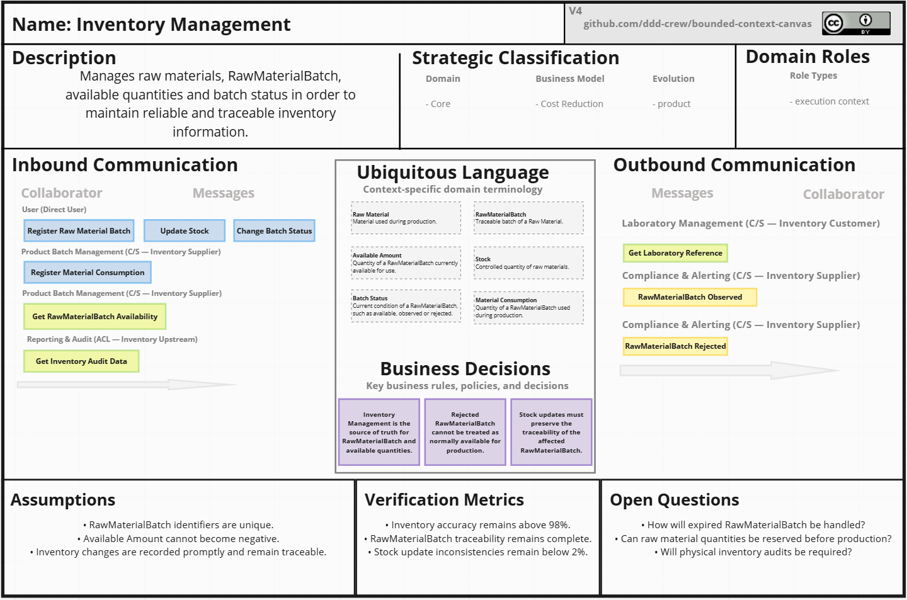

## 4.1. Strategic-Level Domain-Driven Design. 
En esta sección se aborda el enfoque de Strategic-Level Domain-Driven Design, 
el cual permite definir una vision clara del dominio de la plataforma QualiTrack, identificar los contextos delimitados y establecer las relaciones entre ellos. Se incluyen los siguientes subtemas:
### 4.1.1. Design-Level EventStorming.

El EventStorming es una técnica de modelado colaborativa que permite descubrir y comprender el dominio de la plataforma QualiTrack, identificar los eventos del dominio, 
los comandos, actores, politicas, modelo de lectura, sistemas externos y agregados. Este enfo permite definir los contextos delimitados y establecer las relaciones entre ellos. Se incluyen los siguientes pasos:

**Paso 1: Event**

**Paso 2: Timelines**

**Paso 3: Pivotal Points**

**Paso 4: Commands**

**Paso 5: Policies and Actors**

#### 4.1.1.1 Candidate Context Discovery. 
#### 4.1.1.2 Domain Message Flows Modeling. 
#### 4.1.1.3 Bounded Context Canvases.  
### 4.1.2. Context Mapping.

En esta sección se presenta el proceso de elaboración del **Context Map de QualiTrack**, mediante el cual se representan las relaciones estructurales existentes entre los distintos Bounded Contexts identificados en el dominio.

El análisis permite establecer las responsabilidades de cada contexto, las direcciones de dependencia **Upstream/Downstream** y los patrones de relación de **Domain-Driven Design (DDD)** utilizados para mantener la autonomía de sus respectivos modelos.

El proceso de Context Mapping se desarrolló a partir de la información obtenida durante el análisis estratégico del dominio, considerando las responsabilidades de negocio, el Ubiquitous Language, las principales decisiones del dominio y las necesidades de colaboración identificadas para cada Bounded Context.

A partir de esta información se evaluaron diferentes alternativas de organización de las capacidades del negocio. Para cada alternativa se consideró la posibilidad de combinar, separar o distribuir determinadas capabilities, utilizando como criterios principales la cohesión del dominio, el nivel de acoplamiento entre contextos, la autonomía de sus modelos y la posible duplicación de responsabilidades.

Como resultado del análisis se identificaron los siguientes Bounded Contexts:

- Identity & Access Management (IAM)
- Payments & Subscriptions
- Laboratory Management
- Equipment Management
- Tracking & Telemetry
- Inventory Management
- Product Batch Management
- Compliance & Alerting
- Reporting & Audit

---

#### Bounded Context Analysis

Antes de establecer las relaciones del Context Map, cada Bounded Context fue analizado individualmente mediante un **Bounded Context Canvas**.

Este artefacto permitió representar el propósito de cada contexto, su clasificación estratégica, sus roles dentro del dominio, las comunicaciones entrantes y salientes, su Ubiquitous Language, las principales decisiones de negocio, los supuestos considerados, las métricas de verificación y las preguntas abiertas.

El análisis individual de los contextos permitió establecer límites claros entre las diferentes responsabilidades del dominio antes de definir sus relaciones dentro del Context Map.

---
##### Identity & Access Management (IAM) Context - Canvas

Identity & Access Management administra la identidad utilizada por los diferentes contextos de QualiTrack.

Su principal responsabilidad consiste en mantener separados los conceptos relacionados con identidad y autenticación respecto de los modelos específicos utilizados por los demás dominios.

Otros Bounded Contexts utilizan únicamente referencias como `UserId` para identificar usuarios sin incorporar directamente las entidades internas de IAM.

---

##### Payments & Subscriptions Context - Canvas

Payments & Subscriptions administra los planes, pagos, suscripciones y estados relacionados con la relación comercial entre los usuarios u organizaciones y QualiTrack.

Este contexto mantiene separadas las reglas comerciales de las responsabilidades operativas del laboratorio y actúa como fuente de verdad respecto al estado de las suscripciones.

---

##### Laboratory Management Context - Canvas

Laboratory Management administra los laboratorios, sus ambientes físicos y la relación existente entre los usuarios y la organización mediante conceptos como `Laboratory Membership`.

Este contexto proporciona la estructura organizacional utilizada como referencia por otros dominios sin transferirles la responsabilidad de administrar laboratorios y ambientes.

---

##### Equipment Management Context - Canvas

Equipment Management administra los equipos, instrumentos y dispositivos IoT registrados dentro de los laboratorios, incluyendo su identidad, ubicación y estado operativo.

Otros Bounded Contexts utilizan referencias de los equipos cuando requieren relacionarlos con procesos de telemetría, fabricación o reporting, sin asumir la responsabilidad de administrar dichos activos.

---

##### Tracking & Telemetry Context - Canvas

Tracking & Telemetry administra las mediciones ambientales, configuraciones de monitoreo, estados interpretados y actuaciones asociadas a los dispositivos IoT.

Este contexto representa el estado físico observado dentro de los ambientes mediante conceptos como `Measurement`, `Environmental Profile`, estados `NORMAL`, `WARNING` o `CRITICAL` y `ActuationEvent`.

---

##### Inventory Management Context - Canvas

Inventory Management administra las materias primas, `RawMaterialBatch`, cantidades disponibles, stock y estados asociados con los lotes de materia prima.

Este contexto constituye la fuente de verdad respecto a la disponibilidad y estado de los materiales utilizados durante los procesos de fabricación.

---
### 4.1.3. Software Architecture. 

#### 4.1.3.1. Software Architecture System Landscape Diagram. 

#### 4.1.3.2. Software Architecture Context Level Diagrams. 

#### 4.1.3.3. Software Architecture Container Level Diagrams. 

#### 4.1.3.4. Software Architecture Deployment Diagrams. 
