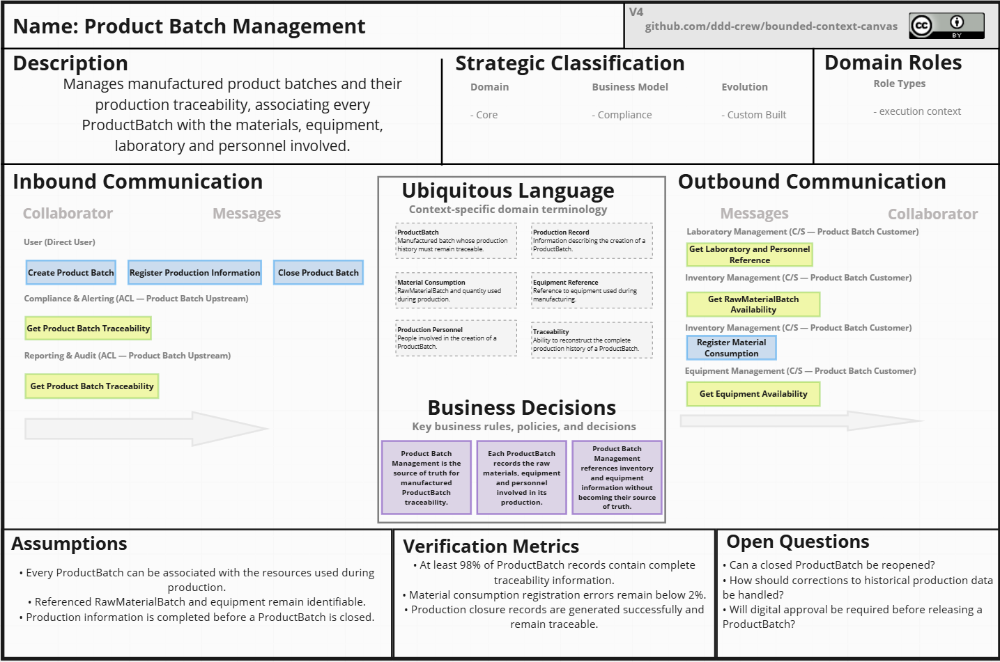
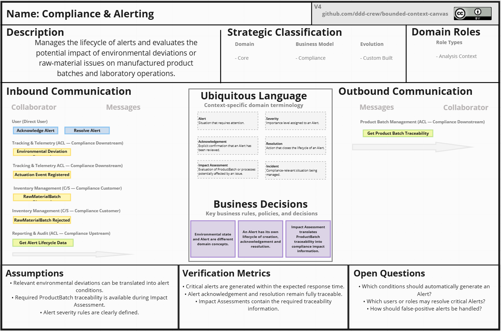
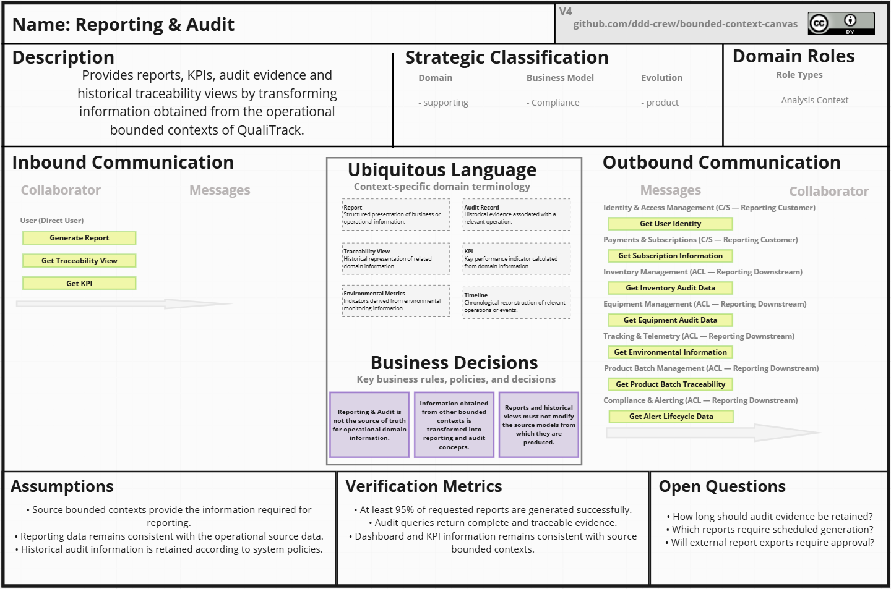
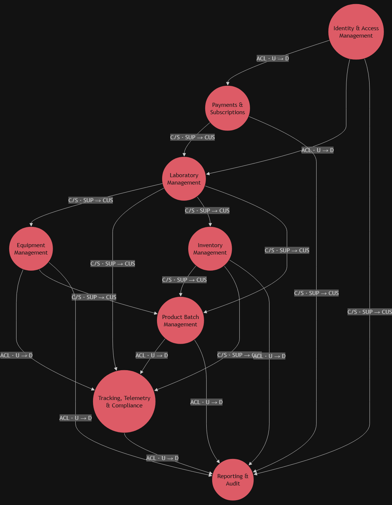
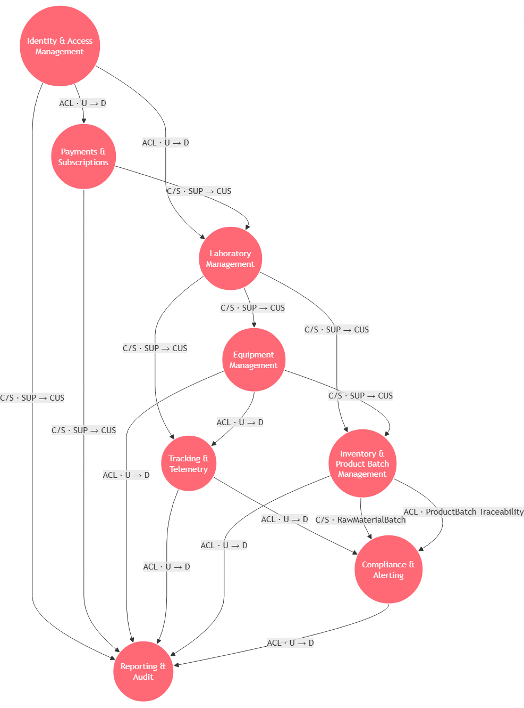
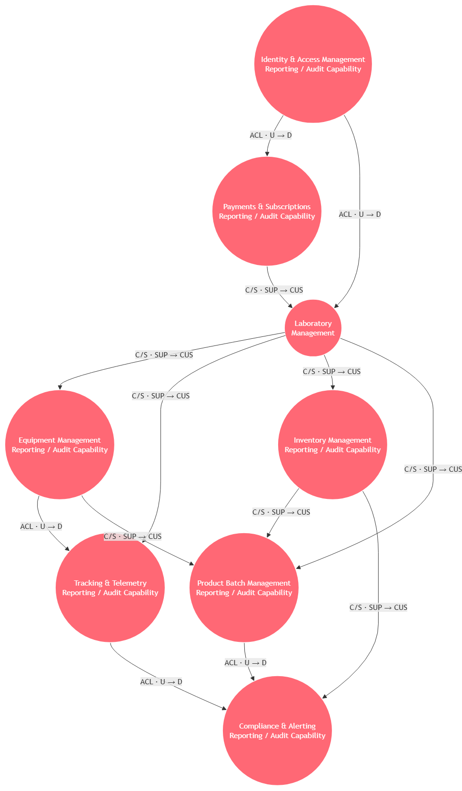
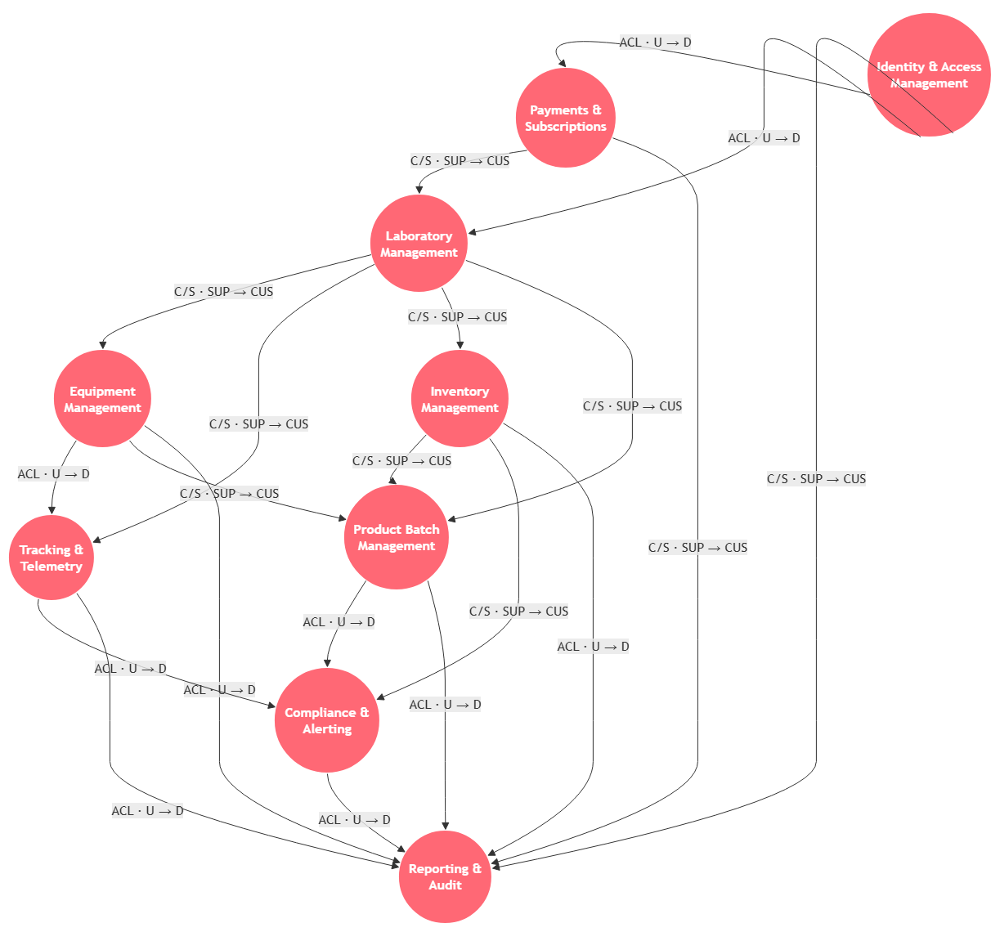
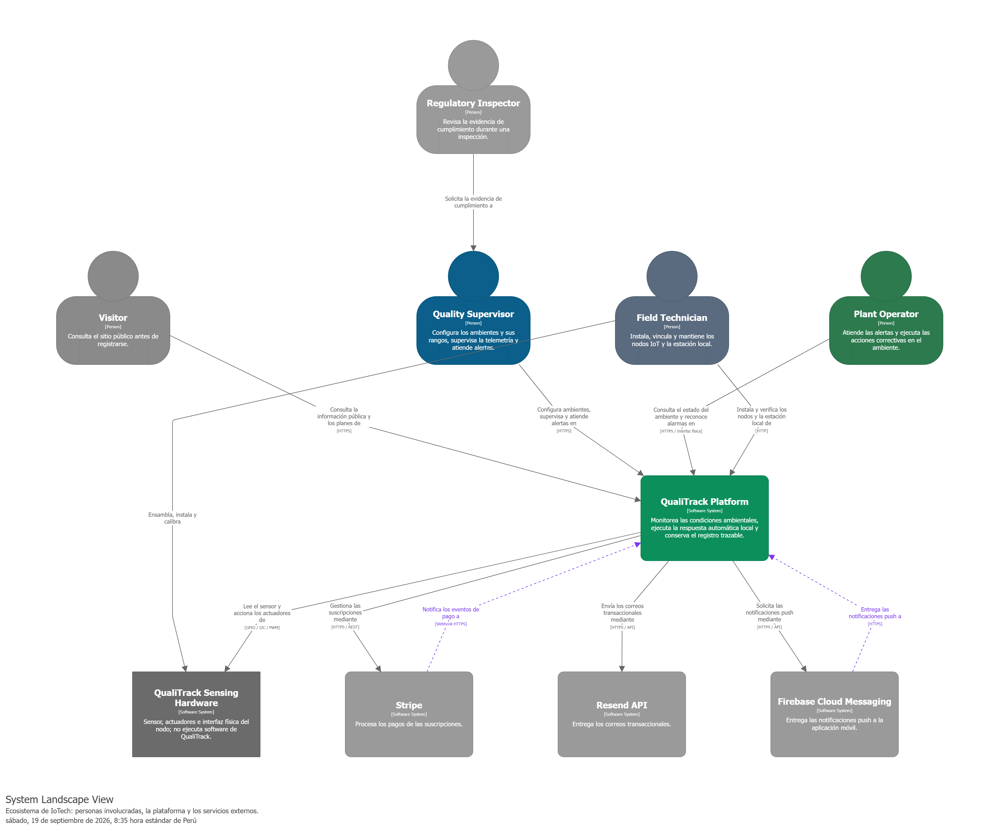

## 4.1. Strategic-Level Domain-Driven Design. 
En esta sección se aborda el enfoque de Strategic-Level Domain-Driven Design, 
el cual permite definir una vision clara del dominio de la plataforma QualiTrack, identificar los contextos delimitados y establecer las relaciones entre ellos. Se incluyen los siguientes subtemas:
### 4.1.1. Design-Level EventStorming.

El EventStorming es una técnica de modelado colaborativa que permite descubrir y comprender el dominio de la plataforma QualiTrack, identificar los eventos del dominio, 
los comandos, actores, politicas, modelo de lectura, sistemas externos y agregados. Este enfo permite definir los contextos delimitados y establecer las relaciones entre ellos. Se incluyen los siguientes pasos:

**Paso 1: Event**

**Paso 2: Timelines**

**Paso 3: Pivotal Points**

**Paso 4: Commands**

**Paso 5: Policies and Actors**

#### 4.1.1.1 Candidate Context Discovery. 
#### 4.1.1.2 Domain Message Flows Modeling. 
#### 4.1.1.3 Bounded Context Canvases.  

A partir del análisis estratégico del dominio de QualiTrack, se documentaron los Bounded Contexts identificados mediante **Bounded Context Canvases**. Estos artefactos permiten describir individualmente el propósito de cada contexto, su clasificación estratégica, sus roles dentro del dominio, las comunicaciones entrantes y salientes, su Ubiquitous Language, las principales decisiones de negocio, los supuestos considerados, las métricas de verificación y las preguntas abiertas.

Los Bounded Context Canvases se presentan de acuerdo con su prioridad estratégica dentro del dominio. En primer lugar se muestran los contextos que concentran las capacidades principales de QualiTrack, posteriormente aquellos que brindan soporte a dichas capacidades y, finalmente, los contextos correspondientes a capacidades transversales o ampliamente estandarizadas.

El orden definido es el siguiente:

1. Product Batch Management
2. Tracking & Telemetry
3. Compliance & Alerting
4. Inventory Management
5. Laboratory Management
6. Equipment Management
7. Payments & Subscriptions
8. Reporting & Audit
9. Identity & Access Management (IAM)

El orden definido responde a la relevancia estratégica de cada Bounded Context para la propuesta de valor de QualiTrack, priorizando las capacidades directamente relacionadas con la trazabilidad, monitoreo, cumplimiento y control de los procesos del laboratorio.

El orden definido es el siguiente:
---

##### Product Batch Management Context - Canvas

Product Batch Management administra los productos y lotes fabricados, así como la información necesaria para mantener su trazabilidad.

Cada `ProductBatch` puede relacionarse con las materias primas, equipos, laboratorio y personal involucrado durante el proceso de fabricación, manteniendo separadas las responsabilidades pertenecientes a dichos dominios.

---

##### Tracking & Telemetry Context - Canvas

Tracking & Telemetry administra las mediciones ambientales, configuraciones de monitoreo, estados interpretados y actuaciones asociadas a los dispositivos IoT.

Este contexto representa el estado físico observado dentro de los ambientes mediante conceptos como `Measurement`, `Environmental Profile`, estados `NORMAL`, `WARNING` o `CRITICAL` y `ActuationEvent`.

---

##### Compliance & Alerting Context - Canvas

Compliance & Alerting administra el ciclo de vida de las alertas e incidentes identificados dentro de QualiTrack.

El contexto transforma información proveniente de otros dominios en conceptos propios como `Alert`, `Severity`, `Acknowledgement`, `Resolution` e `Impact Assessment`.

De esta manera se mantiene separada la detección física de una condición respecto de su evaluación, seguimiento y resolución.

---

##### Inventory Management Context - Canvas

Inventory Management administra las materias primas, `RawMaterialBatch`, cantidades disponibles, stock y estados asociados con los lotes de materia prima.

Este contexto constituye la fuente de verdad respecto a la disponibilidad y estado de los materiales utilizados durante los procesos de fabricación.

---

##### Laboratory Management Context - Canvas

Laboratory Management administra los laboratorios, sus ambientes físicos y la relación existente entre los usuarios y la organización mediante conceptos como `Laboratory Membership`.

Este contexto proporciona la estructura organizacional utilizada como referencia por otros dominios sin transferirles la responsabilidad de administrar laboratorios y ambientes.

---

##### Equipment Management Context - Canvas

Equipment Management administra los equipos, instrumentos y dispositivos IoT registrados dentro de los laboratorios, incluyendo su identidad, ubicación y estado operativo.

Otros Bounded Contexts utilizan referencias de los equipos cuando requieren relacionarlos con procesos de telemetría, fabricación o reporting, sin asumir la responsabilidad de administrar dichos activos.

---

##### Payments & Subscriptions Context - Canvas

Payments & Subscriptions administra los planes, pagos, suscripciones y estados relacionados con la relación comercial entre los usuarios u organizaciones y QualiTrack.

Este contexto mantiene separadas las reglas comerciales de las responsabilidades operativas del laboratorio y actúa como fuente de verdad respecto al estado de las suscripciones.

---

##### Reporting & Audit Context - Canvas

Reporting & Audit administra reportes, indicadores, información histórica, evidencia de auditoría y vistas de trazabilidad.

Consume información proveniente de distintos Bounded Contexts y la transforma en conceptos propios como `Report`, `Audit Record`, `Traceability View`, `KPI` y `Environmental Metrics`, sin convertirse en una segunda fuente de verdad de los datos operativos.

---

##### Identity & Access Management (IAM) Context - Canvas

Identity & Access Management administra la identidad utilizada por los diferentes contextos de QualiTrack.

Su principal responsabilidad consiste en mantener separados los conceptos relacionados con identidad y autenticación respecto de los modelos específicos utilizados por los demás dominios.

Otros Bounded Contexts utilizan únicamente referencias como `UserId` para identificar usuarios sin incorporar directamente las entidades internas de IAM.

---

### 4.1.2. Context Mapping.

A partir de los Bounded Contexts previamente identificados y documentados en la sección **4.1.1.3. Bounded Context Canvases**, se desarrolló el proceso de **Context Mapping de QualiTrack**, cuyo propósito es representar las relaciones estructurales existentes entre los diferentes contextos del dominio.

El análisis permite establecer las direcciones de dependencia **Upstream/Downstream** y los patrones de relación de **Domain-Driven Design (DDD)** empleados para facilitar la colaboración entre contextos sin comprometer la autonomía de sus respectivos modelos.

El proceso de Context Mapping se desarrolló considerando las responsabilidades de negocio, las capabilities asociadas a cada Bounded Context y las necesidades de colaboración y dependencia identificadas entre los diferentes contextos del dominio.

Antes de definir el Context Map definitivo, se evaluaron diferentes alternativas de organización de las capacidades del negocio. Para ello se analizaron posibles combinaciones, separaciones y redistribuciones de responsabilidades entre Bounded Contexts, considerando principalmente la cohesión del dominio, el nivel de acoplamiento entre contextos, la autonomía de sus modelos y la posible duplicación de capacidades.

Los Bounded Contexts considerados durante este proceso fueron:

- Product Batch Management
- Tracking & Telemetry
- Compliance & Alerting
- Inventory Management
- Laboratory Management
- Equipment Management
- Payments & Subscriptions
- Reporting & Audit
- Identity & Access Management (IAM)

---

#### Context Mapping Design Alternatives

Una vez delimitadas las responsabilidades de cada Bounded Context, se evaluaron distintas alternativas de Context Mapping antes de seleccionar la organización definitiva.

El análisis consideró diferentes escenarios de reorganización de capabilities, buscando determinar si determinadas responsabilidades debían combinarse, mantenerse independientes o distribuirse entre diferentes contextos.

---

##### Candidate Context Map 1 — Integration of Tracking & Telemetry and Compliance & Alerting

**Design Question:** ¿Qué ocurriría si las capabilities relacionadas con la gestión de alertas fueran incorporadas dentro de Tracking & Telemetry?

Esta alternativa surge debido a la estrecha relación existente entre las mediciones ambientales y la generación de alertas.

Tracking & Telemetry identifica estados y desviaciones a partir de las mediciones recibidas, mientras que Compliance & Alerting utiliza esta información para iniciar y administrar el ciclo de vida de una alerta.

La alternativa plantea integrar ambas responsabilidades dentro de un único Bounded Context.

La principal ventaja de esta alternativa sería reducir las comunicaciones necesarias entre ambos contextos, debido a que la detección de una condición ambiental y la gestión de la alerta asociada podrían realizarse dentro del mismo límite.

Sin embargo, esta organización mezclaría dos responsabilidades conceptualmente diferentes.

Tracking & Telemetry representa principalmente el estado físico observado mediante mediciones, configuraciones y actuaciones, mientras que Compliance & Alerting administra el ciclo de vida de incidentes mediante conceptos como `Alert`, `Severity`, `Acknowledgement`, `Resolution` e `Impact Assessment`.

Combinar ambas responsabilidades reduciría la cohesión del modelo y dificultaría que ambos dominios evolucionaran de manera independiente.

Por esta razón, la alternativa fue **rechazada** y se decidió mantener Tracking & Telemetry y Compliance & Alerting como Bounded Contexts independientes.

---

##### Candidate Context Map 2 — Integration of Inventory Management and Product Batch Management

**Design Question:** ¿Qué ocurriría si Inventory Management y Product Batch Management formaran un único Bounded Context?

Esta alternativa se consideró debido a que los procesos de fabricación necesitan conocer las materias primas y `RawMaterialBatch` disponibles, además de registrar las cantidades utilizadas durante la producción.

La integración permitiría simplificar inicialmente determinadas operaciones relacionadas con el consumo de materias primas, debido a que el inventario y los lotes fabricados formarían parte del mismo modelo.

Sin embargo, ambos dominios poseen responsabilidades diferentes.

Inventory Management administra materias primas, `RawMaterialBatch`, cantidades disponibles y estados del inventario, mientras que Product Batch Management administra la fabricación y trazabilidad de los productos terminados.

Integrarlos dentro de un mismo límite produciría un contexto con un alcance demasiado amplio y aumentaría el acoplamiento entre el ciclo de vida del inventario y el ciclo de vida de los productos fabricados.

Por esta razón, la alternativa fue **rechazada** y ambos dominios se conservaron como Bounded Contexts independientes relacionados mediante contratos explícitos de integración.

---

##### Candidate Context Map 3 — Distribution of Reporting & Audit Capabilities

**Design Question:** ¿Qué ocurriría si las capabilities de Reporting & Audit fueran distribuidas entre los demás Bounded Contexts en lugar de mantener un contexto independiente?

Esta alternativa plantea que cada dominio sea responsable tanto de sus operaciones principales como de sus propios mecanismos de reporting, indicadores, información histórica y auditoría.

Por ejemplo, Inventory Management podría generar sus propios reportes de inventario, Tracking & Telemetry sus métricas históricas y Equipment Management sus propios reportes relacionados con los equipos.

La principal ventaja de esta alternativa sería reducir la dependencia hacia un Bounded Context especializado en reporting y auditoría.

Sin embargo, esta organización produciría duplicación de responsabilidades relacionadas con auditoría, generación de indicadores, construcción de reportes y almacenamiento de información histórica.

Además, determinados reportes, indicadores y vistas de trazabilidad requieren información proveniente de múltiples dominios. Distribuir estas capabilities entre los diferentes Bounded Contexts aumentaría la complejidad necesaria para construir una visión consolidada del sistema.

Por estas razones, la alternativa fue **rechazada** y Reporting & Audit se mantuvo como un Bounded Context independiente.

---

#### Comparison of Context Mapping Alternatives

Las alternativas fueron comparadas considerando principalmente la cohesión interna de cada contexto, el nivel de acoplamiento entre los modelos, la autonomía de los dominios y la posible duplicación de responsabilidades.

| Alternative | Main Advantage | Main Disadvantage | Decision |
|---|---|---|---|
| Tracking & Telemetry + Compliance & Alerting | Reduce la comunicación necesaria entre la detección de desviaciones y la administración de alertas. | Mezcla el monitoreo físico con la gestión del ciclo de vida de los incidentes. | Rejected |
| Inventory Management + Product Batch Management | Simplifica determinadas operaciones relacionadas con el consumo de materias primas durante la fabricación. | Mezcla las responsabilidades de inventario con las de fabricación y trazabilidad de productos. | Rejected |
| Distributed Reporting & Audit | Cada contexto puede administrar directamente su propia información analítica. | Genera duplicación de capacidades y dificulta la construcción de información consolidada. | Rejected |
| Independent Bounded Contexts with explicit relationships | Mantiene responsabilidades claramente delimitadas, mayor cohesión y autonomía entre los modelos. | Requiere contratos explícitos de integración entre los diferentes contextos. | **Selected** |

A partir de esta comparación se determinó que mantener los Bounded Contexts independientes y establecer relaciones explícitas entre ellos representa la alternativa que mejor conserva los límites del dominio de QualiTrack.

Esta aproximación permite que cada contexto mantenga autoridad sobre su propio modelo, reduzca la propagación de conceptos internos hacia otros dominios y evolucione de manera independiente mediante contratos de colaboración claramente establecidos.

---

#### Selected Context Map

Como resultado del análisis de alternativas se seleccionó una organización basada en nueve Bounded Contexts independientes.

Cada contexto mantiene la autoridad sobre su propio modelo de dominio y comparte únicamente la información necesaria para colaborar con los demás contextos.

Las relaciones se representan mediante las direcciones **Upstream (U)** y **Downstream (D)**, junto con los patrones **Customer/Supplier** y **Anti-Corruption Layer (ACL)**.

El Context Map seleccionado está conformado por:

- Identity & Access Management
- Payments & Subscriptions
- Laboratory Management
- Equipment Management
- Tracking & Telemetry
- Inventory Management
- Product Batch Management
- Compliance & Alerting
- Reporting & Audit

**Legend:**

- **U:** Upstream
- **D:** Downstream
- **SUP:** Supplier
- **CUS:** Customer
- **C/S:** Customer/Supplier
- **ACL:** Anti-Corruption Layer

La alternativa seleccionada mantiene explícitamente los límites entre los nueve Bounded Contexts y establece las colaboraciones necesarias sin trasladar responsabilidades de dominio entre ellos.

---

#### Analysis of Bounded Context Relationships

A partir del Context Map seleccionado se identificaron las principales relaciones de dependencia e integración existentes entre los diferentes dominios de QualiTrack.

Para cada interacción se establece la dirección Upstream/Downstream y el patrón de Context Mapping correspondiente, procurando mantener la autonomía de cada contexto y evitar que sus modelos internos se propaguen innecesariamente hacia otros dominios.

---

##### Identity & Access Management (IAM) → Payments & Subscriptions

- **Relationship:** Upstream (Identity & Access Management) / Downstream (Payments & Subscriptions)
- **Integration Pattern:** Anti-Corruption Layer (ACL)
- **Description:** Payments & Subscriptions requiere conocer la identidad del usuario para administrar suscripciones. Sin embargo, el contexto comercial no necesita incorporar el modelo interno utilizado por IAM. Por ello, la información de identidad requerida se adapta a referencias propias de Payments & Subscriptions, manteniendo ambos modelos separados.

---

##### Identity & Access Management (IAM) → Laboratory Management

- **Relationship:** Upstream (Identity & Access Management) / Downstream (Laboratory Management)
- **Integration Pattern:** Anti-Corruption Layer (ACL)
- **Description:** Laboratory Management utiliza la identidad proporcionada por IAM para establecer la relación entre un usuario y un laboratorio mediante `Laboratory Membership`. El contexto utiliza únicamente referencias como `UserId`, evitando depender directamente de las entidades internas de IAM.

---

##### Identity & Access Management (IAM) → Reporting & Audit

- **Relationship:** Upstream (Identity & Access Management) / Downstream (Reporting & Audit)
- **Integration Pattern:** Customer/Supplier
- **Description:** IAM actúa como Supplier de la información necesaria para identificar al usuario responsable de una operación. Reporting & Audit actúa como Customer de dicha información para generar evidencia de auditoría sin asumir responsabilidades relacionadas con identidad o autenticación.

---

##### Payments & Subscriptions → Laboratory Management

- **Relationship:** Upstream (Payments & Subscriptions) / Downstream (Laboratory Management)
- **Integration Pattern:** Customer/Supplier
- **Description:** Payments & Subscriptions mantiene el estado de las suscripciones. Laboratory Management utiliza esta información para determinar si se cumplen las condiciones comerciales necesarias para continuar con determinadas operaciones relacionadas con el laboratorio.

---

##### Payments & Subscriptions → Reporting & Audit

- **Relationship:** Upstream (Payments & Subscriptions) / Downstream (Reporting & Audit)
- **Integration Pattern:** Customer/Supplier
- **Description:** Payments & Subscriptions proporciona información relevante asociada con planes, pagos y suscripciones. Reporting & Audit utiliza esta información para mantener evidencia histórica y trazabilidad de las operaciones comerciales.

---

##### Laboratory Management → Equipment Management

- **Relationship:** Upstream (Laboratory Management) / Downstream (Equipment Management)
- **Integration Pattern:** Customer/Supplier
- **Description:** Laboratory Management mantiene la autoridad sobre los ambientes físicos del laboratorio. Equipment Management consume estas referencias para registrar y ubicar equipos, instrumentos y dispositivos IoT.

---

##### Laboratory Management → Tracking & Telemetry

- **Relationship:** Upstream (Laboratory Management) / Downstream (Tracking & Telemetry)
- **Integration Pattern:** Customer/Supplier
- **Description:** Laboratory Management proporciona las referencias de los ambientes en los que se realizan las mediciones. Tracking & Telemetry utiliza dichas referencias para contextualizar la telemetría sin asumir la administración de los espacios físicos.

---

##### Laboratory Management → Inventory Management

- **Relationship:** Upstream (Laboratory Management) / Downstream (Inventory Management)
- **Integration Pattern:** Customer/Supplier
- **Description:** Laboratory Management proporciona las referencias organizacionales necesarias para identificar el laboratorio al que pertenece el inventario. Inventory Management utiliza esta información sin duplicar la estructura organizacional.

---

##### Laboratory Management → Product Batch Management

- **Relationship:** Upstream (Laboratory Management) / Downstream (Product Batch Management)
- **Integration Pattern:** Customer/Supplier
- **Description:** Laboratory Management proporciona las referencias del laboratorio y del personal involucrado. Product Batch Management utiliza esta información para asociar correctamente cada `ProductBatch` con su contexto organizacional.

---

##### Inventory Management → Product Batch Management

- **Relationship:** Upstream (Inventory Management) / Downstream (Product Batch Management)
- **Integration Pattern:** Customer/Supplier
- **Description:** Inventory Management actúa como fuente de verdad de `RawMaterialBatch`, cantidades disponibles y estados. Product Batch Management utiliza esta información para seleccionar los materiales utilizados durante la fabricación y registrar las cantidades consumidas.

---

##### Inventory Management → Compliance & Alerting

- **Relationship:** Upstream (Inventory Management) / Downstream (Compliance & Alerting)
- **Integration Pattern:** Customer/Supplier
- **Description:** Inventory Management comunica cambios relevantes en el estado de un `RawMaterialBatch`, como su observación o rechazo. Compliance & Alerting utiliza esta información para determinar si corresponde iniciar un proceso de evaluación de impacto.

---

##### Inventory Management → Reporting & Audit

- **Relationship:** Upstream (Inventory Management) / Downstream (Reporting & Audit)
- **Integration Pattern:** Anti-Corruption Layer (ACL)
- **Description:** Reporting & Audit consume información relacionada con materias primas, stock y cambios de estado y la transforma hacia conceptos propios de reporting, auditoría y trazabilidad.

---

##### Equipment Management → Tracking & Telemetry

- **Relationship:** Upstream (Equipment Management) / Downstream (Tracking & Telemetry)
- **Integration Pattern:** Anti-Corruption Layer (ACL)
- **Description:** Equipment Management mantiene la identidad y el estado operativo del dispositivo físico. Tracking & Telemetry consume únicamente las referencias requeridas y las adapta a su propio modelo de telemetría.

---

##### Equipment Management → Product Batch Management

- **Relationship:** Upstream (Equipment Management) / Downstream (Product Batch Management)
- **Integration Pattern:** Customer/Supplier
- **Description:** Equipment Management proporciona información sobre los equipos registrados y su disponibilidad. Product Batch Management utiliza esta información para asociar los equipos utilizados durante una fabricación y verificar su estado cuando las reglas del dominio así lo requieren.

---

##### Equipment Management → Reporting & Audit

- **Relationship:** Upstream (Equipment Management) / Downstream (Reporting & Audit)
- **Integration Pattern:** Anti-Corruption Layer (ACL)
- **Description:** Reporting & Audit transforma información relacionada con disponibilidad, mantenimiento y cambios de estado de los equipos hacia conceptos propios de auditoría y reporting, manteniendo Equipment Management como fuente de verdad de dichos activos.

---

##### Tracking & Telemetry → Compliance & Alerting

- **Relationship:** Upstream (Tracking & Telemetry) / Downstream (Compliance & Alerting)
- **Integration Pattern:** Anti-Corruption Layer (ACL)
- **Description:** Tracking & Telemetry identifica estados ambientales como `NORMAL`, `WARNING` o `CRITICAL` y registra `ActuationEvents`. Compliance & Alerting transforma esta información hacia conceptos como `Alert`, `Severity`, `Acknowledgement`, `Resolution` e `Impact Assessment`, evitando que su modelo dependa directamente del modelo utilizado para representar el estado físico del ambiente.

---

##### Tracking & Telemetry → Reporting & Audit

- **Relationship:** Upstream (Tracking & Telemetry) / Downstream (Reporting & Audit)
- **Integration Pattern:** Anti-Corruption Layer (ACL)
- **Description:** Tracking & Telemetry proporciona mediciones, estados y actuaciones. Reporting & Audit transforma esta información en `Environmental Metrics`, KPI, reportes y vistas históricas, evitando depender directamente del modelo interno de telemetría.

---

##### Product Batch Management → Compliance & Alerting

- **Relationship:** Upstream (Product Batch Management) / Downstream (Compliance & Alerting)
- **Integration Pattern:** Anti-Corruption Layer (ACL)
- **Description:** Product Batch Management mantiene la trazabilidad de los lotes fabricados. Compliance & Alerting utiliza esta información para determinar qué `ProductBatch` podrían resultar afectados y transforma dicha trazabilidad hacia su modelo de `Impact Assessment`.

---

##### Product Batch Management → Reporting & Audit

- **Relationship:** Upstream (Product Batch Management) / Downstream (Reporting & Audit)
- **Integration Pattern:** Anti-Corruption Layer (ACL)
- **Description:** Product Batch Management mantiene la información de los productos y lotes fabricados. Reporting & Audit transforma esta información hacia conceptos propios como `Report` y `Traceability View`, sin convertirse en una segunda fuente de verdad de la producción.

---

##### Compliance & Alerting → Reporting & Audit

- **Relationship:** Upstream (Compliance & Alerting) / Downstream (Reporting & Audit)
- **Integration Pattern:** Anti-Corruption Layer (ACL)
- **Description:** Compliance & Alerting administra el ciclo de vida de las alertas. Reporting & Audit transforma dicha información en evidencia histórica, indicadores y reportes sin asumir la responsabilidad de administrar los incidentes.

---

#### Summary of Applied Context Mapping Patterns

A partir de las relaciones establecidas se identificaron dos patrones principales de Context Mapping dentro de QualiTrack.

| Pattern | Relationships |
|---|---|
| **Anti-Corruption Layer (ACL)** | Identity & Access Management → Payments & Subscriptions; Identity & Access Management → Laboratory Management; Inventory Management → Reporting & Audit; Equipment Management → Tracking & Telemetry; Equipment Management → Reporting & Audit; Tracking & Telemetry → Compliance & Alerting; Tracking & Telemetry → Reporting & Audit; Product Batch Management → Compliance & Alerting; Product Batch Management → Reporting & Audit; Compliance & Alerting → Reporting & Audit |
| **Customer/Supplier** | Identity & Access Management → Reporting & Audit; Payments & Subscriptions → Laboratory Management; Payments & Subscriptions → Reporting & Audit; Laboratory Management → Equipment Management; Laboratory Management → Tracking & Telemetry; Laboratory Management → Inventory Management; Laboratory Management → Product Batch Management; Inventory Management → Product Batch Management; Inventory Management → Compliance & Alerting; Equipment Management → Product Batch Management |

**Customer/Supplier** se utiliza cuando un contexto Upstream actúa como Supplier de información o capacidades requeridas explícitamente por un contexto Downstream que actúa como Customer.

El Supplier mantiene la autoridad sobre dicha información y expone un contrato que permite satisfacer las necesidades del Customer sin transferirle la responsabilidad sobre su modelo interno.

**Anti-Corruption Layer (ACL)** se utiliza cuando un contexto Downstream necesita consumir información de otro Bounded Context, pero requiere transformarla hacia conceptos pertenecientes a su propio modelo.

De esta manera se evita que conceptos internos del contexto Upstream se propaguen directamente hacia el modelo del Downstream, preservando la autonomía de cada dominio.

---

#### Considered Context Mapping Patterns

Durante el proceso de diseño también se consideraron los patrones **Conformist** y **Shared Kernel**, además de los patrones finalmente utilizados.

El patrón **Conformist** no fue seleccionado debido a que implicaría que determinados contextos Downstream adoptaran directamente el modelo definido por su contexto Upstream.

Dado que los Bounded Contexts de QualiTrack mantienen responsabilidades y modelos de dominio independientes, se consideró preferible utilizar Anti-Corruption Layer en aquellas relaciones donde resulta necesaria una transformación entre modelos.

El patrón **Shared Kernel** tampoco fue seleccionado como patrón principal de relación entre los Bounded Contexts de negocio. El módulo shared contiene únicamente abstracciones y value objects transversales de alcance reducido, cuya utilización no implica compartir los modelos principales de los contextos.

La introducción de un Shared Kernel aumentaría el nivel de coordinación requerido entre contextos y podría limitar su capacidad de evolucionar de manera independiente.

Por lo tanto, los patrones que mejor representan las relaciones identificadas en el Context Map seleccionado son **Customer/Supplier** y **Anti-Corruption Layer (ACL)**.

---

#### Final Context Mapping Decision

Después de evaluar las distintas alternativas de Context Mapping, se determinó que mantener los nueve Bounded Contexts como unidades independientes representa la aproximación seleccionada para QualiTrack.

La integración de Tracking & Telemetry con Compliance & Alerting fue descartada debido a que mezclaría la representación del estado físico de los ambientes con la administración del ciclo de vida de alertas e incidentes.

Asimismo, la integración de Inventory Management con Product Batch Management fue descartada porque combinaría la administración de materias primas, disponibilidad y estados del inventario con las responsabilidades propias de fabricación y trazabilidad de productos terminados.

Finalmente, distribuir las capabilities de Reporting & Audit entre los demás Bounded Contexts fue descartado debido a que produciría duplicación de responsabilidades y dificultaría la construcción de indicadores, evidencia histórica y vistas de trazabilidad que requieren información proveniente de diferentes dominios.

La alternativa seleccionada mantiene separados **Identity & Access Management, Payments & Subscriptions, Laboratory Management, Equipment Management, Tracking & Telemetry, Inventory Management, Product Batch Management, Compliance & Alerting y Reporting & Audit**.

Las colaboraciones entre estos contextos se establecen mediante relaciones explícitas utilizando principalmente los patrones **Customer/Supplier** y **Anti-Corruption Layer**.

De esta manera, cada Bounded Context conserva la autoridad sobre su propio modelo de dominio, comparte únicamente la información necesaria mediante contratos claramente definidos y puede evolucionar sin introducir dependencias innecesarias sobre los modelos internos de los demás contextos.

El Context Map resultante mantiene una alta cohesión dentro de cada dominio, reduce el acoplamiento entre contextos y preserva una delimitación clara de las responsabilidades de negocio que conforman QualiTrack.

### 4.1.3. Software Architecture. 

En esta sección se presenta la arquitectura de software de QualiTrack documentada mediante el C4 Model propuesto por Simon Brown, utilizando Structurizr DSL como fuente única de verdad. El modelo se define una sola vez en un archivo .dsl versionado en el repositorio de la organización, y a partir de él se generan las vistas que se exportan como imágenes para este informe; el código DSL no forma parte del documento.

#### 4.1.3.1. Software Architecture System Landscape Diagram.

La vista System Landscape presenta el panorama general del ecosistema en el que opera IoTech. A diferencia del Context Diagram, esta vista no se restringe a los elementos conectados directamente con el sistema de interés: incorpora actores y relaciones del entorno del laboratorio farmacéutico que explican cómo se realiza hoy el control de condiciones ambientales y qué dependencias forman parte del panorama operativo, aun cuando no pasen por la plataforma.

##### Personas del ecosistema:

Visitor: persona que consulta el sitio público de IoTech para conocer la propuesta de valor, los planes y los documentos legales antes de registrarse.
Quality Supervisor: responsable de calidad del laboratorio o almacén. Configura los ambientes monitoreados y sus rangos permitidos, supervisa la telemetría, atiende las alertas por desviación y genera la evidencia de trazabilidad.
Plant Operator: operario de planta. Atiende las alertas en sitio y ejecuta las acciones correctivas sobre el ambiente, tanto desde la aplicación móvil como desde la interfaz física del nodo IoT.
Field Technician: técnico de campo de IoTech. Instala, vincula y mantiene los nodos IoT y la estación local, y verifica su estado operativo.
Regulatory Inspector: inspector regulatorio (DIGEMID u organismo equivalente). No es usuario del sistema: solicita la evidencia de cumplimiento al Quality Supervisor durante una inspección. Se incluye en el landscape porque su exigencia es el driver de negocio que justifica el registro trazable.

##### Sistemas del ecosistema:

QualiTrack Platform: sistema de interés. Monitorea las condiciones ambientales, ejecuta la respuesta automática local y conserva el registro trazable de mediciones, desviaciones y acciones correctivas.
Stripe: procesa los pagos de las suscripciones de los laboratorios clientes.
Resend API: entrega los correos transaccionales (activación de cuenta, recuperación de contraseña y aviso de desviación crítica).
Firebase Cloud Messaging: entrega las notificaciones push a la aplicación móvil.
QualiTrack Sensing Hardware: sensor BME680, actuadores e interfaz física del nodo. Se modela como sistema externo porque no ejecuta software de QualiTrack: la Embedded Application lo gobierna a través de GPIO, I2C y PWM, pero el hardware en sí queda fuera del límite del sistema de software.

En conjunto, el landscape muestra que QualiTrack se ubica entre un plano físico (el ambiente monitoreado y su hardware) y un plano de cumplimiento normativo (la evidencia exigida al laboratorio), integrando servicios externos únicamente para capacidades genéricas: cobro, correo y notificación push.

#### 4.1.3.2. Software Architecture Context Level Diagrams. 

#### 4.1.3.3. Software Architecture Container Level Diagrams. 

#### 4.1.3.4. Software Architecture Deployment Diagrams. 
