## 4.2. Tactical-Level Domain-Driven Design.

El diseño táctico traduce las decisiones tomadas en el diseño estratégico de QualiTrack en estructuras concretas de software dentro de cada Bounded Context. En esta sección se describen las clases principales del dominio, las interfaces que exponen sus capacidades, los servicios de aplicación que coordinan los casos de uso y los elementos de infraestructura responsables de la persistencia y de la integración con otros contextos o servicios externos.

Para cada Bounded Context se presenta un diccionario de los principales elementos que participan en su implementación, indicando su propósito, atributos o responsabilidades relevantes y las relaciones que mantienen con otros elementos. También se incluyen los espacios correspondientes a los diagramas de componentes, diagramas de clases del Domain Layer y diagramas de base de datos.

---

### 4.2.1. Bounded Context: Tracking & Telemetry

Tracking & Telemetry es uno de los Bounded Contexts Core de QualiTrack. Recibe las lecturas y las acciones que los dispositivos IoT sincronizan a través del Edge, las evalúa contra el perfil ambiental vigente y conserva el historial que consultan las aplicaciones y los demás contextos. Es el punto de encuentro entre los dispositivos físicos, el servicio Edge y el backend Cloud.

El modelo se organiza alrededor del agregado `EnvironmentalProfile`, que contiene los rangos permitidos y las reglas de actuación, y de las entidades `Measurement` y `ActuationEvent`. Hay dos tipos de perfil: el de un **ambiente**, que se evalúa con las lecturas de su Dispositivo Ambiental (calidad de aire), y el de un **Monitor de Contenedor** (temperatura, humedad y luminosidad, más sus reglas de actuación). Cuando una lectura empeora el estado de una métrica, el contexto publica un evento para que Compliance & Alerting abra o escale la alerta del incidente.

#### 4.2.1.1. Domain Layer.

Esta capa contiene las reglas del monitoreo ambiental. No depende de controladores REST ni de detalles de base de datos.

**`EnvironmentalProfile` — Aggregate Root**

- **Propósito:** representa la configuración ambiental que el responsable de calidad define para un ambiente o para un Monitor de Contenedor, y que el Edge descarga para aplicarla en el dispositivo.
- **Atributos principales:** `id`, `laboratoryId`, `scope` (`ProfileScope`), `environmentId`, `deviceId`, `version`, `thresholds`, `actuationRules`, `updatedBy` y `updatedAt`.
- **Métodos principales:** `forEnvironment`, `forContainerMonitor`, `replaceThresholds`, `replaceActuationRules` y `evaluate`.
- **Reglas:** cada cambio incrementa `version`, de modo que cada lectura queda asociada a la versión del perfil con la que fue evaluada. Un perfil de ambiente solo configura la calidad de aire; uno de contenedor configura temperatura, humedad, luminosidad y reglas de actuación.

**`Measurement` — Entity**

- **Propósito:** lectura producida por un dispositivo IoT y sincronizada desde el Edge.
- **Atributos principales:** `id`, `laboratoryId`, `environmentId`, `equipmentId`, `parameterName`, `value`, `textValue`, `unit`, `measuredAt`, `state`, `thresholdValue`, `profileVersion` y `receivedAt`.
- **Método principal:** `receive`, que construye la lectura con el resultado de evaluarla contra el perfil vigente.
- **Relaciones:** registra el `EnvironmentalState` obtenido y el límite superado, si lo hubo. Las lecturas de texto (etiqueta RFID) y de detección (movimiento) se guardan sin rangos.

**`ActuationEvent` — Entity**

- **Propósito:** acción física que ejecutó un Monitor de Contenedor (ventilación, enfriamiento o servo) y su resultado.
- **Atributos principales:** `id`, `laboratoryId`, `environmentId`, `deviceId`, `action`, `triggerMetric`, `triggerState`, `result`, `occurredAt`, `profileVersion` y `receivedAt`.
- **Método principal:** `record`.

**Value Objects**

- `EnvironmentalThreshold`: límites normal y crítico de una métrica (`normalMin`, `normalMax`, `criticalMin`, `criticalMax`). Exige `criticalMin < normalMin < normalMax < criticalMax` y su método `evaluate` devuelve un `ThresholdEvaluation`.
- `ThresholdEvaluation`: estado resultante (`state`) y límite superado (`exceededLimit`).
- `ActuationRule`: relaciona una métrica y un estado con la acción automática que ejecuta el contenedor.
- `DeviceConnection`: estado de conexión de un dispositivo, calculado a partir de su última comunicación y del `ExpectedCommunicationPeriod`.
- `ExpectedCommunicationPeriod`: tiempo máximo entre dos comunicaciones antes de que el dispositivo pase a requerir revisión.
- Enumeraciones: `MonitoredMetric` (`AIR_QUALITY`, `MOTION`, `TEMPERATURE`, `HUMIDITY`, `LUMINOSITY`, `RFID_TAG`, cada una con su unidad y el tipo de dispositivo que la reporta), `EnvironmentalState` (`NORMAL`, `WARNING`, `CRITICAL`), `ActuationAction` (`VENTILATION_ON/OFF`, `COOLING_ON/OFF`, `SERVO_OPEN/CLOSE`), `ActuationResult` (`EXECUTED`, `FAILED`), `ProfileScope` (`ENVIRONMENT`, `CONTAINER_MONITOR`) y `DeviceConnectionStatus` (`CONNECTED`, `REQUIRES_REVIEW`).

**Comandos principales**

- `UpdateEnvironmentThresholdsCommand`: reemplaza los rangos del perfil de un ambiente (US56, TS42).
- `UpdateContainerMonitorThresholdsCommand`: reemplaza los rangos de temperatura, humedad y luminosidad de un Monitor de Contenedor (US57, US58, TS43, TS44).
- `UpdateActuationRulesCommand`: reemplaza las reglas de actuación de un Monitor de Contenedor (US59, TS45).
- `RecordMeasurementCommand`: registra una lectura sincronizada desde el Edge (TS54, TS55).
- `RecordActuationEventCommand`: registra una acción ejecutada por un Monitor de Contenedor (TS56).

**Queries principales**

- `GetEnvironmentProfileQuery`, `GetContainerMonitorProfileQuery` y `GetDeviceProfileQuery`: obtienen el perfil de un ambiente, de un contenedor o el que aplica un dispositivo (TS57).
- `GetMeasurementsQuery`: lecturas de un dispositivo en un periodo (TS58, TS59).
- `GetActuationEventsQuery`: acciones ejecutadas por un contenedor en un periodo (TS60).
- `GetDeviceConnectionQuery`: estado de conexión de un dispositivo (US55, TS41).

**Eventos de dominio**

- `MeasurementRecordedEvent`: se registró una lectura.
- `EnvironmentalDeviationDetectedEvent`: una lectura empeoró el estado de una métrica (de `NORMAL` a `WARNING`, o a `CRITICAL`).
- `EnvironmentalConditionNormalizedEvent`: una métrica volvió a `NORMAL` después de una desviación.
- `EnvironmentalProfileUpdatedEvent`: cambiaron los rangos o las reglas de un perfil.

**Repository Interfaces**

- `EnvironmentalProfileRepository`.
- `MeasurementRepository`.
- `ActuationEventRepository`.

#### 4.2.1.2. Interface Layer.

La Interface Layer expone Tracking & Telemetry a la Web Application, la Mobile Application y el Edge Service, y traduce las solicitudes a Commands y Queries del Application Layer.

**`EnvironmentTelemetryController`** — `/api/v1/laboratories/{laboratoryId}/environments/{environmentId}`

- `GET /environmental-profile` y `PUT /environmental-profile/thresholds`: consulta y configura el perfil del ambiente.
- `POST /telemetry-measurements` y `GET /telemetry-measurements`: registra (Edge) y consulta las lecturas del Dispositivo Ambiental.

**`ContainerMonitorTelemetryController`** — `.../environments/{environmentId}/container-monitors/{deviceId}`

- `GET /environmental-profile`, `PUT /environmental-profile/thresholds` y `PUT /environmental-profile/actuation-rules`: perfil del Monitor de Contenedor.
- `POST` y `GET /telemetry-measurements`: lecturas del contenedor.
- `POST` y `GET /actuation-events`: acciones ejecutadas por el contenedor.

**`DeviceTrackingController`** — `.../environments/{environmentId}/devices/{deviceId}`

- `GET /telemetry-status`: estado de conexión del dispositivo (TS41).
- `GET /environmental-profile`: perfil vigente que el Edge sincroniza para el dispositivo (TS57).

**Resources y assemblers**

- Resources: `EnvironmentalProfileResource`, `ThresholdResource`, `ActuationRuleResource`, `UpdateThresholdsResource`, `UpdateActuationRulesResource`, `MeasurementResource`, `RecordMeasurementResource`, `ActuationEventResource`, `RecordActuationEventResource` y `DeviceTelemetryStatusResource`.
- Assemblers: `EnvironmentalProfileCommandFromResourceAssembler`, `EnvironmentalProfileResourceFromEntityAssembler`, `RecordMeasurementCommandFromResourceAssembler`, `MeasurementResourceFromEntityAssembler`, `RecordActuationEventCommandFromResourceAssembler`, `ActuationEventResourceFromEntityAssembler` y `TelemetryResponseAssembler`. Los valores inválidos se convierten en respuestas `400` mediante `TrackingRequestValues`.

**`TrackingContextFacade` e integration events**

- La fachada expone a otros contextos las lecturas de un ambiente (`findMeasurements`) y las acciones de un dispositivo o ambiente (`findActuations`, `findEnvironmentActuations`), sin dar acceso a los repositorios.
- Los eventos de integración `MeasurementRecordedIntegrationEvent`, `EnvironmentalDeviationDetectedIntegrationEvent`, `EnvironmentalConditionNormalizedIntegrationEvent` y `EnvironmentalProfileUpdatedIntegrationEvent` son el contrato publicado hacia Compliance & Alerting y Reporting & Audit.

#### 4.2.1.3. Application Layer.

**Command Service**

- `TrackingCommandService` / `TrackingCommandServiceImpl`: actualiza perfiles y registra lecturas y acciones. Al registrar una lectura la evalúa con el perfil vigente, compara el estado con el anterior de esa métrica y publica `EnvironmentalDeviationDetectedEvent` si empeora, o `EnvironmentalConditionNormalizedEvent` si vuelve a `NORMAL`.

**Query Service**

- `TrackingQueryService` / `TrackingQueryServiceImpl`: resuelve perfiles, lecturas, acciones y el estado de conexión del dispositivo.

**Event Handlers**

- `MeasurementRecordedEventHandler`: publica las lecturas registradas para los demás contextos.
- `EnvironmentalDeviationDetectedEventHandler`: entrega la desviación a Compliance & Alerting, que abre o escala la alerta.
- `EnvironmentalConditionNormalizedEventHandler`: entrega la normalización a Compliance & Alerting para registrarla en la alerta abierta.
- `EnvironmentalProfileUpdatedEventHandler`: publica el cambio de perfil para que Reporting & Audit registre quién cambió la configuración.

**ACL**

- `TrackingExternalEquipmentService`: consulta Equipment Management para validar la identidad, el tipo y la ubicación del dispositivo IoT.
- `TrackingContextFacadeImpl`: implementa la fachada del contexto.

#### 4.2.1.4. Infrastructure Layer.

- **Persistence Entities:** `EnvironmentalProfilePersistenceEntity` (con `ThresholdEmbeddable` y `ActuationRuleEmbeddable`), `MeasurementPersistenceEntity` y `ActuationEventPersistenceEntity`.
- **Spring Data JPA Repositories:** `EnvironmentalProfilePersistenceRepository`, `MeasurementPersistenceRepository` y `ActuationEventPersistenceRepository`.
- **Repository Adapters:** `EnvironmentalProfileRepositoryImpl`, `MeasurementRepositoryImpl` y `ActuationEventRepositoryImpl`, que implementan las interfaces del dominio.
- **Persistence Assemblers:** `EnvironmentalProfilePersistenceAssembler`, `MeasurementPersistenceAssembler` y `ActuationEventPersistenceAssembler`.
- **Configuración:** `TrackingConfiguration` define el `ExpectedCommunicationPeriod` usado para decidir cuándo un dispositivo requiere revisión (5 minutos por defecto, configurable con `tracking.devices.expected-communication-period`).

#### 4.2.1.5. Bounded Context Software Architecture Component Level Diagrams.

El diagrama de componentes presenta la posición de **Tracking & Telemetry** dentro del **Cloud REST API** de QualiTrack. Recibe la telemetría del Edge REST API y las consultas de la Single-Page Application y la Mobile Application, resuelve el ambiente de cada dispositivo con Equipment Management y notifica las desviaciones a Compliance & Alerting.

Se utiliza la vista de Structurizr **`Components-Tracking`**, definida sobre el container `Cloud REST API`.

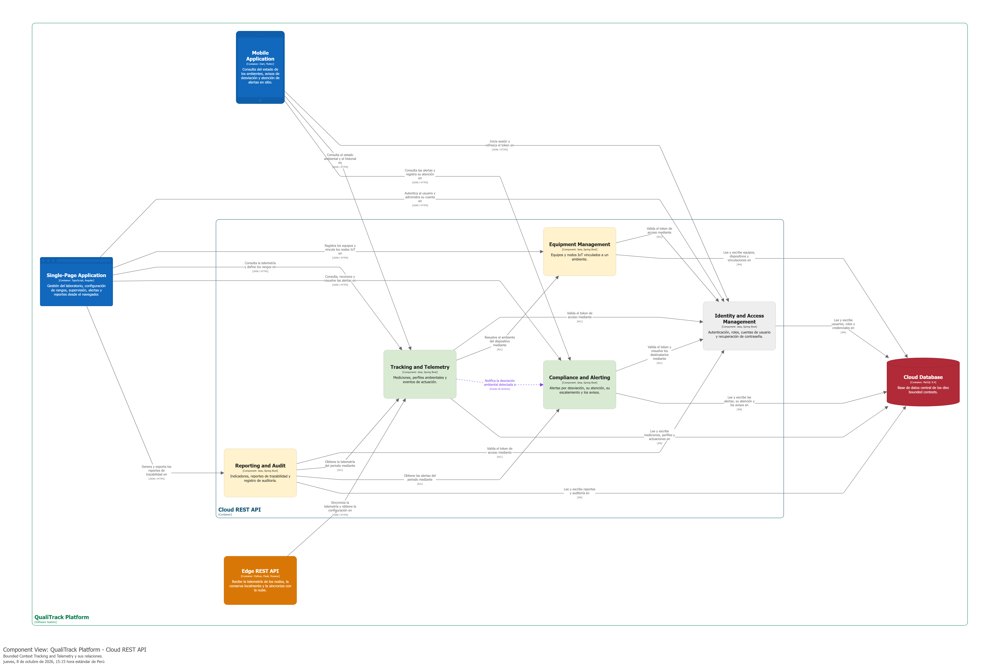

#### 4.2.1.6. Bounded Context Software Architecture Code Level Diagrams.

Los diagramas de nivel de código presentan con mayor detalle la implementación del contexto Tracking & Telemetry: las clases del Domain Layer y el esquema relacional que persiste perfiles, lecturas y acciones.

##### 4.2.1.6.1. Bounded Context Domain Layer Class Diagrams.

El diagrama de clases muestra `EnvironmentalProfile` como Aggregate Root con sus `EnvironmentalThreshold` y `ActuationRule`, las entidades `Measurement` y `ActuationEvent`, los Value Objects y enumeraciones del contexto, y sus Commands, Queries, eventos e interfaces de repositorio.

##### 4.2.1.6.2. Bounded Context Database Design Diagram.

El diagrama de base de datos muestra las tablas de perfiles ambientales, con sus rangos y reglas de actuación, de lecturas y de acciones ejecutadas. Los identificadores de laboratorio, ambiente y dispositivo relacionan la información con Laboratory Management y Equipment Management sin duplicar sus modelos.

---

### 4.2.2. Bounded Context: Compliance & Alerting

Compliance & Alerting es el segundo Bounded Context Core de QualiTrack. Convierte las desviaciones que detecta Tracking & Telemetry en **alertas** que el personal atiende, reconoce y resuelve. Registra los **eventos de cumplimiento** de equipos y lotes, y avisa a las personas del laboratorio con **notificaciones** en la aplicación y **correos** para las alertas críticas, según sus preferencias.

La separación con Tracking & Telemetry se mantiene: la lectura, el estado ambiental y la acción física pertenecen a Tracking & Telemetry, y el ciclo de vida de la alerta pertenece a este contexto. Se maneja **una alerta por incidente**, por dispositivo y métrica. Una nueva desviación del mismo incidente se correlaciona con la alerta abierta y, si empeora, la escala. La alerta sigue abierta hasta que una persona la resuelve, aunque la lectura vuelva a normal.

#### 4.2.2.1. Domain Layer.

**`DeviationAlert` — Aggregate Root**

- **Propósito:** incidente de desviación de un ambiente o de uno de sus contenedores monitoreados, con su atención.
- **Atributos principales:** `id`, `laboratoryId`, `environmentId`, `origin` (`AlertOrigin`), `equipmentId`, `batchId`, `measurementId`, `lastMeasurementId`, `parameterName`, `recordedValue`, `thresholdValue`, `unit`, `severity`, `status`, `deviationCount`, `lastDetectedAt`, `normalizedAt`, `acknowledgedBy`, `acknowledgedAt`, `resolvedBy`, `resolvedAt` y `resolutionNotes`.
- **Métodos principales:** `registerDeviation`, `markNormalized`, `acknowledge`, `resolve`, `isOpen`, `isUnresolved` e `isCritical`.
- **Reglas:** `registerDeviation` acumula las desviaciones del mismo incidente y eleva la severidad cuando la condición empeora. Reconocer una alerta no la resuelve.

**`Notification` — Aggregate Root**

- **Propósito:** aviso que recibe una persona del laboratorio en la campana de la aplicación cuando ocurre algo que ella no hizo: un paso del ciclo de una alerta o una decisión de calidad sobre un lote (US83).
- **Atributos principales:** `id`, `recipientUserId`, `laboratoryId`, `content` (`NotificationContent`), `occurredAt` y `readAt`.
- **Métodos principales:** `markAsRead`, `isRead` y `belongsTo`.

**Entities**

- `ComplianceEvent`: hecho de cumplimiento registrado para un equipo o un lote (`relatedEntityId`, `eventType`, `description`, `timestamp`, `resolvedBy`).
- `NotificationPreference`: canales y severidad mínima con que una persona quiere ser avisada (`userId`, `emailEnabled`, `inAppEnabled`, `minimumSeverity`). Sus métodos `wantsInApp` y `wantsEmail` deciden por cada alerta.

**Value Objects**

- `AlertOrigin`: dónde se originó la alerta, es decir, el ambiente (Dispositivo Ambiental) o un contenedor monitoreado (US86).
- `DeviationRegistration`: resultado de registrar una desviación. Indica si abrió una alerta o se correlacionó con una abierta.
- `DeviationAlertDetail` y `RelatedActuation`: alerta con las acciones que ejecutó su contenedor para la misma métrica durante el incidente (US86).
- `NotificationContent`, `NotificationType` (`ALERT_OPENED`, `ALERT_ESCALATED`, `ALERT_ACKNOWLEDGED`, `ALERT_RESOLVED`, `BATCH_RELEASED`, `BATCH_REJECTED`) y `ComplianceEventSubject`.
- `AlertEmailDelivery`: resultado del envío del correo de una alerta.
- Enumeraciones: `AlertSeverity` (`LOW`, `WARNING`, `CRITICAL`), `AlertStatus` (`UNRESOLVED`, `ACKNOWLEDGED`, `RESOLVED`) y `ComplianceEventType` (creación, reconocimiento, resolución, escalamiento y correo de alertas; desviación repetida y normalizada; liberación, rechazo y bloqueo de lotes; bajo stock; calibración vencida).

**Commands principales**

- `CreateDeviationAlertCommand` (TS73), `AcknowledgeAlertCommand`, `ResolveAlertCommand` y `RecordConditionNormalizedCommand`.
- `SendAlertEmailNotificationCommand` (US84, TS78).
- `PublishNotificationCommand`, `MarkNotificationAsReadCommand` y `MarkAllNotificationsAsReadCommand`.
- `UpdateNotificationPreferenceCommand`.

**Queries principales**

- `GetAlertsQuery` (US85, TS74), `GetAlertByIdQuery` y `GetAlertDetailQuery` (US86).
- `GetComplianceEventsByRelatedEntityIdQuery`.
- `GetNotificationsQuery` y `GetUnreadNotificationCountQuery`.
- `GetNotificationPreferenceByUserIdQuery`.

**Eventos de dominio**

- `DeviationAlertCreatedEvent`, `DeviationAlertEscalatedEvent`, `DeviationAlertAcknowledgedEvent` y `DeviationAlertResolvedEvent`.
- `NotificationPreferenceUpdatedEvent`.

**Repository Interfaces**

- `DeviationAlertRepository`, `NotificationRepository`, `ComplianceEventRepository` y `NotificationPreferenceRepository`.

#### 4.2.2.2. Interface Layer.

**REST controllers** (bajo `/api/v1`)

- `DeviationAlertController`: registra y lista las alertas de un ambiente (`/laboratories/{laboratoryId}/environments/{environmentId}/deviation-alerts`) y consulta su detalle (`GET /deviation-alerts/{alertId}`). Además las reconoce (`POST .../acknowledgements`), las resuelve (`POST .../resolutions`) y envía su aviso por correo (`POST .../email-notifications`).
- `NotificationController` — `/users/me/notifications`: lista los avisos, cuenta los no leídos (`GET /unread-count`) y los marca como leídos (`POST /{notificationId}/read-receipts` y `POST /read-receipts`).
- `NotificationPreferenceController` — `/users/me/notification-preferences`: consulta y actualiza las preferencias.
- `ComplianceEventController`: eventos de cumplimiento de un equipo y de un lote.

**Assemblers principales**

- `CreateDeviationAlertCommandFromResourceAssembler`, `ResolveAlertCommandFromResourceAssembler` y `DeviationAlertResourceFromEntityAssembler`.
- `ComplianceEventResourceFromEntityAssembler` y `NotificationResourceFromEntityAssembler`.
- `NotificationPreferenceResourceFromEntityAssembler` y `UpdateNotificationPreferenceCommandFromResourceAssembler`.

**Fachada e integration events**

- `ComplianceContextFacade`: expone a otros contextos operaciones controladas, como registrar el bajo stock o consultar si un lote puede liberarse (`canReleaseBatch`).
- `CaTenantResourceLookup`: resuelve el laboratorio dueño de una alerta.
- Integration events: `DeviationAlertCreatedIntegrationEvent`, `DeviationAlertEscalatedIntegrationEvent`, `DeviationAlertAcknowledgedIntegrationEvent`, `DeviationAlertResolvedIntegrationEvent` y `NotificationPreferenceUpdatedIntegrationEvent`.

#### 4.2.2.3. Application Layer.

**Command Services**

- `CaCommandService` / `CaCommandServiceImpl`: registra las desviaciones, correlacionándolas con la alerta abierta del incidente. También registra la normalización, reconoce y resuelve las alertas y actualiza las preferencias.
- `NotificationCommandService` / `NotificationCommandServiceImpl`: crea los avisos de cada persona según sus preferencias y envía los correos de alertas críticas.

**Query Services**

- `CaQueryService` / `CaQueryServiceImpl`: alertas, su detalle, eventos de cumplimiento y preferencias.
- `NotificationQueryService` / `NotificationQueryServiceImpl`: avisos de una persona.

**Event Handlers**

- `EnvironmentalDeviationComplianceEventHandler`: registra la desviación detectada por Tracking & Telemetry con la severidad de su condición (`WARNING` o `CRITICAL`).
- `EnvironmentalConditionNormalizedComplianceEventHandler`: anota en la alerta abierta que la métrica volvió a normal.
- `RawMaterialLowStockComplianceEventHandler`, `CalibrationExpiredEventHandler`, `BatchReleasedComplianceEventHandler` y `BatchRejectedComplianceEventHandler`: registran los eventos de cumplimiento de stock, equipos y lotes.
- `AlertNotificationEventHandler` y `BatchNotificationEventHandler`: avisan al laboratorio de cada paso de una alerta y de las decisiones sobre sus lotes.
- `DeviationAlertCreatedEventHandler`, `DeviationAlertEscalatedEventHandler`, `DeviationAlertAcknowledgedEventHandler`, `DeviationAlertResolvedEventHandler` y `NotificationPreferenceUpdatedEventHandler`: publican los eventos de integración.
- `CriticalAlertEmailScheduler`: envía en segundo plano el correo de una alerta crítica una vez guardada, para no retrasar la sincronización de la lectura que la originó.

**ACL**

- `CaExternalTrackingService`: lee las acciones relacionadas con una alerta.
- `CaExternalEquipmentService`: resuelve el dispositivo donde se originó la desviación.
- `CaExternalLaboratoryService`: lee los nombres de los ambientes.
- `CaExternalIamService`: lee las cuentas del laboratorio que reciben los avisos.
- `CaExternalProfileService`: obtiene el nombre de quien atendió una alerta o decidió sobre un lote.
- `AlertEmailNotifier`: puerto de salida para el correo de la alerta crítica.

#### 4.2.2.4. Infrastructure Layer.

- **Persistencia:** entidades, Spring Data JPA Repositories, assemblers y adapters para alertas, avisos, eventos de cumplimiento y preferencias (`DeviationAlertRepositoryImpl`, `NotificationRepositoryImpl`, `ComplianceEventRepositoryImpl` y `NotificationPreferenceRepositoryImpl`).
- **Converters:** `AlertSeverityPersistenceConverter`, `AlertStatusPersistenceConverter`, `ComplianceEventTypePersistenceConverter` y `NotificationTypePersistenceConverter`.
- **Correo:** `EmailAlertNotifier` implementa `AlertEmailNotifier`. Envía el aviso en español e inglés, con el enlace a la alerta, mediante el proveedor configurado en la plataforma: Gmail SMTP en producción o Resend API.
- **Configuración:** `CaConfiguration`.

#### 4.2.2.5. Bounded Context Software Architecture Component Level Diagrams.

El diagrama de componentes presenta **Compliance & Alerting** dentro del **Cloud REST API**. Recibe de Tracking & Telemetry las desviaciones, consulta a Product Batch Management los lotes expuestos y a Profile Management los nombres de las personas, y envía los correos de alertas críticas mediante Gmail SMTP.

Se utiliza la vista de Structurizr **`Components-Compliance`**, definida sobre el container `Cloud REST API`.

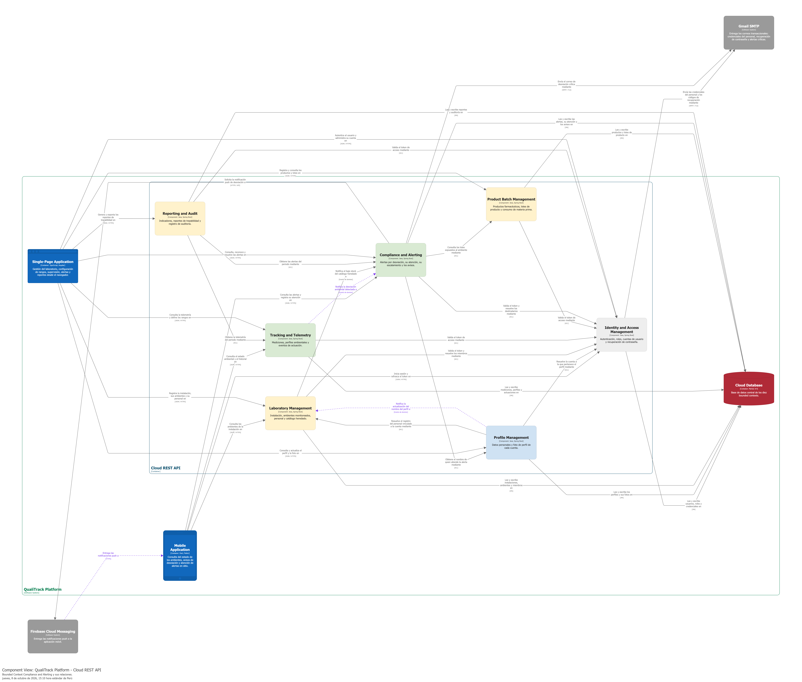

#### 4.2.2.6. Bounded Context Software Architecture Code Level Diagrams.

Los diagramas de nivel de código presentan las clases del Domain Layer de Compliance & Alerting y el esquema relacional que persiste alertas, avisos, eventos de cumplimiento y preferencias.

##### 4.2.2.6.1. Bounded Context Domain Layer Class Diagrams.

El diagrama muestra los Aggregates `DeviationAlert` y `Notification`, las entidades `ComplianceEvent` y `NotificationPreference`, sus Value Objects y enumeraciones, y los Commands, Queries, eventos e interfaces de repositorio del contexto.

##### 4.2.2.6.2. Bounded Context Database Design Diagram.

El diagrama de base de datos muestra las tablas de alertas de desviación, avisos, eventos de cumplimiento y preferencias de notificación. Los identificadores de laboratorio, ambiente, equipo y lote relacionan la información con los contextos que la originan.

---

### 4.2.3. Bounded Context: Equipment Management

Equipment Management administra los equipos físicos, instrumentos y dispositivos IoT registrados en QualiTrack. Es la fuente de verdad sobre la identidad del equipo, su estado operativo, su vínculo con un laboratorio o ambiente y sus mantenimientos. Las mediciones generadas por estos equipos no pertenecen a este contexto; son responsabilidad de Tracking & Telemetry.

#### 4.2.3.1. Domain Layer.

**`Equipment` — Aggregate Root**

- **Propósito:** representa un equipo o dispositivo físico registrado en un laboratorio.
- **Atributos principales:** `id`, `labId`, `name`, `type`, `model`, `serialNumber`, `status` y `sensorExternalId`.
- **Métodos principales:** `linkSensor` y `updateStatus`.
- **Relaciones:** utiliza `EquipmentType`, `EquipmentStatus` y `DeviceId`. La referencia `labId` se valida contra Laboratory Management.

**`MaintenanceRecord` — Aggregate Root**

- **Propósito:** registra una intervención de mantenimiento realizada sobre un equipo.
- **Atributos principales:** `id`, `equipmentId`, `maintenanceDate`, `technicianName`, `description` y `type`.
- **Relaciones:** utiliza `MaintenanceType` y se asocia al equipo mediante `equipmentId`.

**`BpmParameterConfig` — Entity**

- **Propósito:** mantiene una configuración de límites para una variable crítica asociada a un equipo.
- **Atributos principales:** `equipmentId`, `parameterName`, `minValue`, `maxValue` y `unit`.
- **Método principal:** `updateLimits`.
- **Relaciones:** utiliza `CriticalVariable`.

En la evolución IoT, los límites estrictamente ambientales y las reglas de actuación se concentran en Tracking & Telemetry. `BpmParameterConfig` se mantiene como parte del modelo actual de Equipment Management para compatibilidad con la implementación existente y para configuraciones asociadas al equipo.

**Value Objects y Enumerations**

- `EquipmentType`: identifica el tipo de equipo.
- `CriticalVariable`: identifica una variable controlada.
- `DeviceId`: representa el identificador externo del dispositivo o sensor asociado.
- `EquipmentStatus`: `OPERATIONAL`, `MAINTENANCE`, `OUT_OF_SERVICE` e `INACTIVE`.
- `MaintenanceType`: `PREVENTIVE`, `CORRECTIVE`, `CALIBRATION`, `INSPECTION` y `OTHER`.
- `DeviationSeverity`: niveles de severidad asociados a desviaciones del equipo.

**Commands principales**

- `RegisterEquipmentCommand`.
- `LinkSensorCommand`.
- `ConfigureBpmParametersCommand`.
- `RegisterMaintenanceCommand`.

**Queries principales**

- `GetEquipmentByIdQuery`.
- `GetEquipmentByLabIdQuery`.
- `GetEquipmentByDeviceIdQuery`.
- `GetCalibrationAlertsByLabIdQuery`.
- `GetBpmParameterConfigsByEquipmentIdQuery`.
- `GetMaintenanceByEquipmentIdQuery`.

**Eventos principales**

- `EquipmentRegisteredEvent`.
- `SensorLinkedEvent`.
- `BpmParameterConfiguredEvent`.
- `CalibrationExpiredEvent`.
- `MaintenanceRegisteredEvent`.

**Repository Interfaces**

- `EquipmentRepository`.
- `BpmParameterConfigRepository`.
- `MaintenanceRepository`.

#### 4.2.3.2. Interface Layer.

**`EquipmentController`**

Gestiona las operaciones relacionadas con el registro y consulta de equipos y con la vinculación del dispositivo físico.

**`EquipmentBpmConfigController`**

Expone las operaciones para consultar y mantener configuraciones de parámetros del equipo.

**`EquipmentMaintenanceController`**

Expone las operaciones de registro y consulta del historial de mantenimiento.

**Resources principales**

- `RegisterEquipmentResource`.
- `EquipmentResource`.
- `ConfigureBpmResource`.
- `BpmParameterConfigResource`.
- `RegisterMaintenanceResource`.
- `MaintenanceRecordResource`.

**Assemblers principales**

- `RegisterEquipmentCommandFromResourceAssembler`.
- `EquipmentResourceFromEntityAssembler`.
- `ConfigureBpmCommandFromResourceAssembler`.
- `BpmConfigResourceFromEntityAssembler`.
- `RegisterMaintenanceCommandFromResourceAssembler`.
- `MaintenanceResourceFromEntityAssembler`.

#### 4.2.3.3. Application Layer.

**Command Services**

- `EquipmentCommandService` / `EquipmentCommandServiceImpl`: coordina registro de equipos y vinculación del sensor o dispositivo.
- `BpmConfigCommandService` / `BpmConfigCommandServiceImpl`: coordina la configuración de parámetros.
- `MaintenanceCommandService` / `MaintenanceCommandServiceImpl`: registra las operaciones de mantenimiento.

**Query Services**

- `EquipmentQueryService` / `EquipmentQueryServiceImpl`.
- `BpmConfigQueryService` / `BpmConfigQueryServiceImpl`.
- `MaintenanceQueryService` / `MaintenanceQueryServiceImpl`.

**Event Handlers**

- `EquipmentRegisteredEventHandler`.
- `SensorLinkedEventHandler`.
- `BpmParameterConfiguredEventHandler`.
- `CalibrationExpiryEventHandler`.
- `MaintenanceRegisteredEventHandler`.

**ACL consumida**

- `ExternalLabService`: utiliza `LaboratoryContextFacade` para comprobar que el laboratorio o ambiente relacionado exista antes de registrar el equipo.

#### 4.2.3.4. Infrastructure Layer.

La persistencia se implementa mediante Spring Data JPA y adapters separados del modelo de dominio.

**Persistence Entities**

- `EquipmentPersistenceEntity`.
- `BpmParameterConfigPersistenceEntity`.
- `MaintenancePersistenceEntity`.

**Persistence Repositories**

- `EquipmentPersistenceRepository`.
- `BpmParameterConfigPersistenceRepository`.
- `MaintenancePersistenceRepository`.

**Repository Adapters**

- `EquipmentRepositoryImpl`.
- `BpmParameterConfigRepositoryImpl`.
- `MaintenanceRepositoryImpl`.

**Persistence Assemblers**

- `EquipmentPersistenceAssembler`.
- `BpmParameterConfigPersistenceAssembler`.
- `MaintenancePersistenceAssembler`.

**Converters**

- `DeviceIdPersistenceConverter`.
- `EquipmentStatusPersistenceConverter`.
- `EquipmentTypePersistenceConverter`.

#### 4.2.3.5. Bounded Context Software Architecture Component Level Diagrams.

El diagrama de componentes presenta la posición de **Equipment Management** dentro del **Cloud REST API**. Este Bounded Context mantiene la información de los equipos y dispositivos registrados y se relaciona con Laboratory Management para validar su pertenencia a una organización, con Tracking & Telemetry para asociar la información generada por los dispositivos y con otros contextos que requieren conocer su estado.

Para esta entrega se utiliza la vista de Structurizr **`Components-Equipment`**, definida sobre el container `Cloud REST API`. La vista refleja el C4 disponible actualmente y será detallada posteriormente a medida que se refine la descomposición interna del contexto.

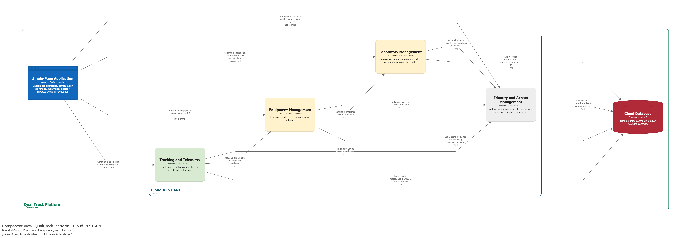

#### 4.2.3.6. Bounded Context Software Architecture Code Level Diagrams.

##### 4.2.3.6.1. Bounded Context Domain Layer Class Diagrams.

El diagrama de clases representa `Equipment`, `MaintenanceRecord` y `BpmParameterConfig`, junto con sus Value Objects, enumeraciones, Commands, Queries, eventos y repositorios.

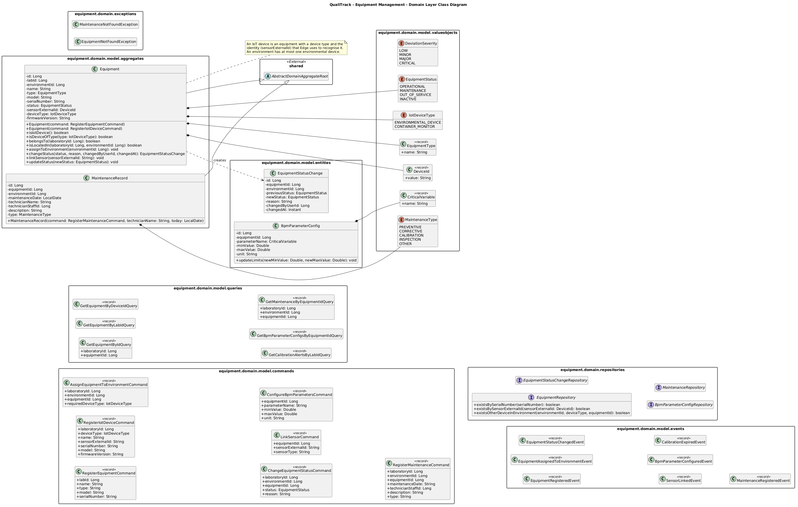

##### 4.2.3.6.2. Bounded Context Database Design Diagram.

El diagrama de base de datos representa las tablas de equipos, configuraciones de parámetros y mantenimientos. Las referencias al laboratorio se conservan mediante identificadores y no mediante una copia del modelo de Laboratory Management.

---

### 4.2.4. Bounded Context: Laboratory Management

Laboratory Management administra la organización física sobre la que opera QualiTrack: el laboratorio o almacén farmacéutico, sus **ambientes** (laboratorio, producción, almacén de materia prima, almacén de producto) y su **personal**. Los demás contextos ubican sus registros en estos ambientes: los equipos y nodos IoT, el inventario, los lotes y la telemetría.

El contexto conserva además un catálogo heredado de materias primas (`RawMaterial`) de la versión inicial. Ese catálogo es de solo lectura y existe para que Inventory Management importe de forma explícita los saldos iniciales. Las altas, recepciones y consumos nuevos pertenecen a Inventory Management, y los productos farmacéuticos, a Product Batch Management.

#### 4.2.4.1. Domain Layer.

**`Laboratory` — Aggregate Root**

- **Propósito:** representa la organización registrada en QualiTrack por el responsable de calidad durante la configuración inicial.
- **Atributos principales:** `id`, `name` (`LaboratoryName`), `ruc`, `address` (`LaboratoryAddress`), `phone`, `regulations` y `status`.
- **Método principal:** `updateProfile`.

**`Environment` — Aggregate Root**

- **Propósito:** zona del laboratorio o almacén que QualiTrack supervisa, identificada por un código y con un uso principal.
- **Atributos principales:** `id`, `laboratoryId`, `code`, `name`, `description`, `usage` (`EnvironmentUsage`), `usageAssignedBy` y `usageAssignedAt`.
- **Métodos principales:** `update`, `assignUsage` y `belongsTo`.
- **Reglas:** el código se normaliza al registrarse y el ambiente empieza sin uso. El uso puede cambiar, pero no reasignarse al mismo valor. Inventory Management y Product Batch Management usan `usage` para validar dónde se guardan los lotes (almacén de materia prima o de producto).

**`StaffMember` — Aggregate Root**

- **Propósito:** persona del personal del laboratorio. Al registrarla, el responsable de calidad le crea una cuenta para iniciar sesión (US34, TS19).
- **Atributos principales:** `id`, `laboratoryId`, `fullName`, `role`, `email`, `active`, `accessRole` (`StaffAccessRole`) y `userId`.
- **Métodos principales:** `linkAccount`, `rename`, `changeEmail`, `belongsTo` y `deactivate`.

**`RawMaterial` — Aggregate Root heredado**

- **Propósito:** saldo de materia prima registrado antes de que existiera Inventory Management. Se consulta en solo lectura y se importa una única vez hacia Inventory Management.
- **Atributos principales:** `id`, `laboratoryId`, `code`, `name`, `unit`, `currentStock` y `minimumThreshold`.

**Entity y Value Objects**

- `LaboratoryAddress`: `street`, `city` y `country`.
- `LaboratoryName`, `Regulation` y `StockQuantity`.
- `EnvironmentUsage`: `LABORATORY`, `PRODUCTION`, `RAW_MATERIAL_STORAGE`, `PRODUCT_STORAGE` y `OTHER`.
- `LaboratoryStatus`: `ACTIVE` e `INACTIVE`.
- `StaffAccessRole`: `OPERATOR` y `AUDITOR`. Define lo que puede hacer en la plataforma la cuenta del personal.

**Commands principales**

- `CreateLaboratoryCommand` y `UpdateLaboratoryCommand`.
- `RegisterEnvironmentCommand`, `UpdateEnvironmentCommand` y `AssignEnvironmentUsageCommand` (US30, US31).
- `RegisterStaffCommand` y `DeactivateStaffCommand`.
- `CreateRawMaterialCommand` (catálogo heredado).

**Queries principales**

- `GetLaboratoryByIdQuery`.
- `GetEnvironmentsByLaboratoryIdQuery` y `GetEnvironmentByIdQuery`.
- `GetStaffByLabIdQuery`, `GetStaffMemberByIdQuery` y `GetStaffMemberByUserIdQuery`.
- `GetRawMaterialsByLabIdQuery` y `GetLowStockMaterialsByLabIdQuery` (catálogo heredado).

**Eventos de dominio**

- `LaboratoryRegisteredEvent`.
- `EnvironmentRegisteredEvent`, `EnvironmentUpdatedEvent` y `EnvironmentUsageAssignedEvent`.
- `StaffRegisteredEvent` y `StaffDeactivatedEvent`.
- `RawMaterialCreatedEvent` y `RawMaterialLowStockEvent`.

**Repository Interfaces**

- `LaboratoryRepository`, `EnvironmentRepository`, `StaffRepository` y `RawMaterialRepository`.

#### 4.2.4.2. Interface Layer.

**REST controllers**

- `LaboratoryController` — `/api/v1/laboratories`: registra, consulta y actualiza el laboratorio.
- `LaboratoryEnvironmentsController` — `/api/v1/laboratories/{laboratoryId}/environments`: registra, lista, consulta y actualiza los ambientes, y asigna su uso con `POST /{environmentId}/usage-assignments`.
- `LaboratoryStaffController` — `/api/v1/laboratories/{laboratoryId}/staff`: registra al personal, lo lista o consulta y lo desactiva con `POST /{staffId}/deactivations`.
- `LaboratoryRawMaterialsController` — `/api/v1/laboratories/{laboratoryId}/raw-materials`: vista de solo lectura del catálogo heredado.

**Assemblers principales**

- `CreateLaboratoryCommandFromResourceAssembler`, `UpdateLaboratoryCommandFromResourceAssembler` y `LaboratoryResourceFromEntityAssembler`.
- `RegisterEnvironmentCommandFromResourceAssembler`, `UpdateEnvironmentCommandFromResourceAssembler`, `AssignEnvironmentUsageCommandFromResourceAssembler` y `EnvironmentResourceFromEntityAssembler`.
- `RegisterStaffCommandFromResourceAssembler` y `StaffResourceFromEntityAssembler`.
- `RawMaterialResourceFromEntityAssembler`.

**Fachadas e integration events**

- `LaboratoryContextFacade`: permite que otros contextos validen el laboratorio y sus ambientes (`existsEnvironment`, `findEnvironment`, `findEnvironments`) y resuelvan al personal (`findStaffMember`, `findStaffMemberByAccount`).
- `LegacyInventoryFacade`: entrega los saldos heredados (`materials`) y los bloquea al importarlos (`lock`) hacia Inventory Management.
- `LaboratoryTenantResourceLookup`: permite verificar que un recurso pertenezca al laboratorio del usuario autenticado.
- Integration events: `LaboratoryRegisteredIntegrationEvent`, `EnvironmentRegisteredIntegrationEvent`, `EnvironmentUpdatedIntegrationEvent`, `EnvironmentUsageAssignedIntegrationEvent`, `StaffRegisteredIntegrationEvent`, `StaffDeactivatedIntegrationEvent`, `RawMaterialCreatedIntegrationEvent` y `RawMaterialLowStockIntegrationEvent`.

#### 4.2.4.3. Application Layer.

**Command Services**

- `LaboratoryCommandService` / `LaboratoryCommandServiceImpl`.
- `LaboratoryOnboardingService` / `LaboratoryOnboardingServiceImpl`: crea el laboratorio y lo asocia al responsable de calidad en una sola operación, después de verificar su suscripción vigente.
- `EnvironmentCommandService` / `EnvironmentCommandServiceImpl`.
- `StaffCommandService` / `StaffCommandServiceImpl`: registra al personal y le crea su cuenta mediante IAM.
- `RawMaterialCommandService` / `RawMaterialCommandServiceImpl` (catálogo heredado).

**Query Services**

- `LaboratoryQueryService`, `EnvironmentQueryService`, `StaffQueryService` y `RawMaterialQueryService`, con sus implementaciones.

**Event Handlers**

- `LaboratoryRegisteredEventHandler`, `EnvironmentRegisteredEventHandler`, `EnvironmentUpdatedEventHandler`, `EnvironmentUsageAssignedEventHandler`, `StaffRegisteredEventHandler`, `StaffDeactivatedEventHandler`, `RawMaterialCreatedEventHandler` y `RawMaterialLowStockEventHandler`: publican los eventos de integración correspondientes.
- `StaffAccountSynchronizationEventHandler`: mantiene alineado al personal con su cuenta y su perfil. Escucha los cambios de correo de IAM y los cambios de nombre de Profile Management (`ProfileUpdatedIntegrationEvent`).

**ACL**

- `ExternalIamService`: crea y deshabilita las cuentas del personal en IAM.
- `LaboratoryExternalComplianceService`: comunica a Compliance & Alerting los avisos de bajo stock del catálogo heredado.
- `LaboratoryContextFacadeImpl` y `LegacyInventoryFacadeImpl`: implementan las fachadas del contexto.

#### 4.2.4.4. Infrastructure Layer.

- **Persistence Entities, Spring Data JPA Repositories y Assemblers** para `Laboratory`, `Environment`, `StaffMember` y `RawMaterial`.
- **Repository Adapters:** `LaboratoryRepositoryImpl`, `EnvironmentRepositoryImpl`, `StaffRepositoryImpl` y `RawMaterialRepositoryImpl`.
- **Converters:** `EnvironmentUsagePersistenceConverter`, `LaboratoryAddressPersistenceConverter`, `LaboratoryStatusPersistenceConverter` y `RegulationPersistenceConverter`.

#### 4.2.4.5. Bounded Context Software Architecture Component Level Diagrams.

El diagrama de componentes presenta **Laboratory Management** dentro del **Cloud REST API**. La Single-Page Application registra en este contexto la instalación, sus ambientes y su personal. El contexto verifica el plan vigente con Payments & Subscriptions, crea las cuentas del personal con IAM y sirve de referencia para Inventory, Equipment, Product Batch, Tracking y Profile.

Se utiliza la vista de Structurizr **`Components-Laboratory`**, definida sobre el container `Cloud REST API`.

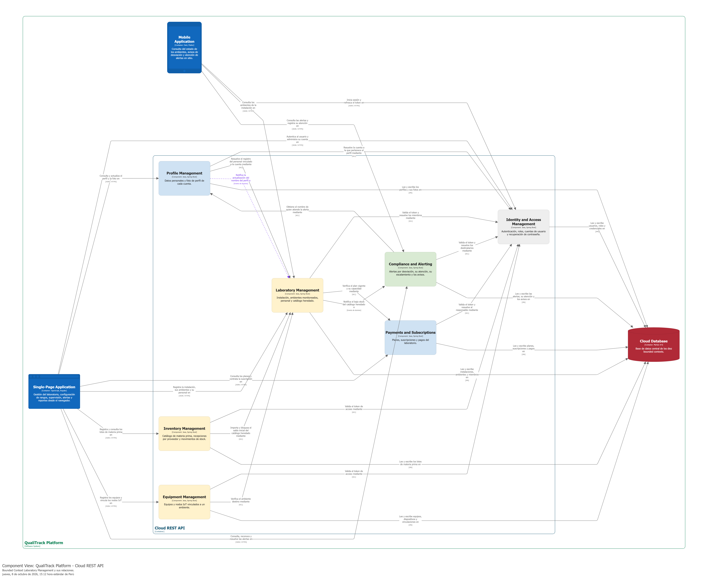

#### 4.2.4.6. Bounded Context Software Architecture Code Level Diagrams.

Los diagramas de nivel de código presentan las clases del Domain Layer de Laboratory Management y el esquema relacional que persiste laboratorios, ambientes, personal y el catálogo heredado.

##### 4.2.4.6.1. Bounded Context Domain Layer Class Diagrams.

El diagrama muestra los Aggregates `Laboratory`, `Environment`, `StaffMember` y `RawMaterial`, la entidad `LaboratoryAddress`, sus Value Objects y enumeraciones, y los Commands, Queries, eventos e interfaces de repositorio del contexto.

##### 4.2.4.6.2. Bounded Context Database Design Diagram.

El diagrama de base de datos muestra las tablas de laboratorios, ambientes, personal y materias primas heredadas, relacionadas mediante el identificador del laboratorio.

---

### 4.2.5. Bounded Context: Inventory Management

Inventory Management administra el catálogo actual de materias primas, las recepciones por lote, sus estados, las cantidades disponibles y el historial de movimientos. Este contexto es la fuente de verdad del stock utilizable de materias primas.

El stock no se mantiene como un número independiente que pueda quedar desactualizado. Se obtiene a partir de los lotes de materia prima que se encuentran habilitados y conservan cantidad disponible.

#### 4.2.5.1. Domain Layer.

**`RawMaterial` — Aggregate Root**

- **Propósito:** representa el catálogo actual de una materia prima dentro de un laboratorio.
- **Atributos principales:** `id`, `laboratoryId`, `code`, `name`, `unit` y `minimumStock`.
- **Método principal:** `usableStock`, que calcula la cantidad utilizable a partir de los lotes recibidos.
- **Relaciones:** puede tener múltiples `RawMaterialBatch` identificados mediante `rawMaterialId`.

**`RawMaterialBatch` — Aggregate Root**

- **Propósito:** representa una recepción o lote específico de una materia prima.
- **Atributos principales:** `laboratoryId`, `rawMaterialId`, `supplier`, `batchNumber`, `unit`, `initialAmount`, `availableAmount`, `receivedOn`, `expiresOn` y `status`.
- **Métodos principales:** `receive`, `isUsableOn`, `release`, `observe`, `reject` y `consume`.
- **Reglas relevantes:** solo los lotes `RELEASED`, con cantidad positiva y dentro de su periodo válido, pueden ser consumidos. No se realiza conversión implícita entre unidades diferentes.

**`InventoryMovement` — Entity / Record de dominio**

- **Propósito:** conserva el historial de cambios que afectan al inventario.
- **Información principal:** material, lote recibido, lote de producto relacionado, tipo de movimiento, cantidad, stock anterior, stock posterior, estados, motivo, actor y momento de la operación.
- **Regla:** el historial es append-only; no se utiliza para reemplazar el estado actual del lote sino para explicar cómo cambió.

**`RawMaterialBatchStatus` — Enumeration**

- **Valores:** `QUARANTINED`, `RELEASED`, `OBSERVED` y `REJECTED`.
- **Reglas:** una recepción inicia en cuarentena; debe ser revisada antes de liberarse. Los lotes observados o rechazados no se consideran stock utilizable.

**`MaterialStockSummary` — Value Object / Read Model**

- **Propósito:** resume material, stock utilizable, stock físico y datos necesarios para mostrar el estado actual del inventario.

**`ReceiptConsumption` — Value Object**

- **Propósito:** representa el resultado de consumir una cantidad específica de un lote de materia prima para un lote de producto.

**Commands principales**

- `SaveRawMaterialCommand`.
- `ReceiveRawMaterialBatchCommand`.
- `ReviewRawMaterialBatchCommand`.
- `ConsumeRawMaterialBatchCommand`.

**Queries principales**

- `GetInventoryMaterialsQuery`.
- `GetMaterialReceiptsQuery`.
- `GetMaterialMovementsQuery`.
- `GetPendingLegacyMaterialsQuery`.

**Repository Interface**

- `InventoryRepository`: concentra las operaciones de persistencia requeridas por el dominio de materiales, recepciones y movimientos.

#### 4.2.5.2. Interface Layer.

**`InventoryController`**

Expone las capacidades principales del contexto:

- consultar el catálogo de materias primas;
- crear o actualizar una materia prima;
- consultar las recepciones de un material;
- consultar lotes utilizables;
- registrar una nueva recepción;
- revisar y cambiar el estado de un lote;
- consumir materia prima para un lote de producto;
- consultar movimientos e historial;
- consultar elementos heredados pendientes de migración;
- importar explícitamente un material de la versión anterior.

El controlador aplica el contexto del laboratorio a cada operación. Las acciones sensibles de revisión e importación deben requerir los permisos correspondientes.

**`InventoryContextFacade`**

Expone hacia Product Batch Management únicamente las operaciones necesarias para consultar lotes utilizables y realizar consumos, evitando que Batch acceda directamente al repositorio interno de Inventory.

**Integration Event**

- `ReceiptConsumedIntegrationEvent`: comunica que una cantidad de un `RawMaterialBatch` fue consumida para un lote de producto.

**Resources y Assemblers**

La capa cuenta con Resources específicos para materia prima, recepción, consumo, movimiento, material heredado e importación, junto con Assemblers que convierten las solicitudes REST a Commands y el modelo de dominio a respuestas de la API.

#### 4.2.5.3. Application Layer.

**`InventoryCommandService` / `InventoryCommandServiceImpl`**

Coordina las operaciones que modifican el inventario. Entre sus responsabilidades se encuentran registrar materiales, recibir lotes, revisar su estado y realizar consumos. Antes de consumir materia prima valida el lote de producto mediante `BatchContextFacade` y registra el movimiento dentro de la misma operación de negocio.

**`InventoryQueryService` / `InventoryQueryServiceImpl`**

Resuelve consultas de materiales, recepciones, movimientos y datos heredados pendientes de migración.

**`InventoryImportService` / `InventoryImportServiceImpl`**

Permite importar de manera explícita un material heredado desde Laboratory Management. La importación se utiliza como mecanismo de transición y no convierte la información antigua en una segunda fuente de verdad permanente.

**`InventoryMovementRecorder`**

Centraliza la creación de movimientos y registra el usuario actual y el momento de la operación.

**`InventoryContextFacadeImpl`**

Implementa la fachada consumida por Product Batch Management.

**Consistencia transaccional**

La operación de consumo mantiene coordinado el descuento de `availableAmount`, la creación de `InventoryMovement` y el registro de uso del material en Product Batch Management. El diseño busca que la operación se confirme completa o se revierta completa, evitando stock descontado sin trazabilidad o trazabilidad creada sin descuento real.

#### 4.2.5.4. Infrastructure Layer.

**Persistence Entities**

- `InventoryMaterialEntity`.
- `InventoryReceiptEntity`.
- `InventoryMovementEntity`.

**Persistence Repositories**

- `InventoryMaterialPersistenceRepository`.
- `InventoryReceiptPersistenceRepository`.
- `InventoryMovementPersistenceRepository`.

**Adapter principal**

- `InventoryRepositoryImpl`: implementa `InventoryRepository` y coordina los repositorios JPA necesarios.

**Assemblers**

- `InventoryMaterialPersistenceAssembler`.
- `InventoryReceiptPersistenceAssembler`.
- `InventoryMovementPersistenceAssembler`.

**`InventoryConfiguration`**

Proporciona configuración técnica del contexto, incluyendo el `Clock` utilizado para evaluar fechas de recepción, vencimiento y movimientos de manera consistente.

#### 4.2.5.5. Bounded Context Software Architecture Component Level Diagrams.

El diagrama de componentes presenta la posición de **Inventory Management** dentro del **Cloud REST API** y las relaciones necesarias para gestionar materias primas, recepciones, cantidades disponibles y movimientos. Su integración con Product Batch Management permite relacionar el consumo real de una materia prima con un lote de producto, mientras que Laboratory Management proporciona el contexto organizacional necesario.

Para esta entrega se utiliza la vista de Structurizr **`Components-Inventory`**, definida sobre el container `Cloud REST API`. La vista corresponde al estado actual del C4 y podrá ser refinada posteriormente para detallar los componentes internos de Interface, Application, Domain e Infrastructure.

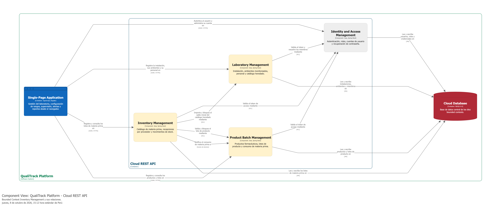

#### 4.2.5.6. Bounded Context Software Architecture Code Level Diagrams.

##### 4.2.5.6.1. Bounded Context Domain Layer Class Diagrams.

El diagrama presenta `RawMaterial`, `RawMaterialBatch`, `InventoryMovement`, `MaterialStockSummary`, `ReceiptConsumption`, `RawMaterialBatchStatus`, Commands, Queries y la interfaz `InventoryRepository`.

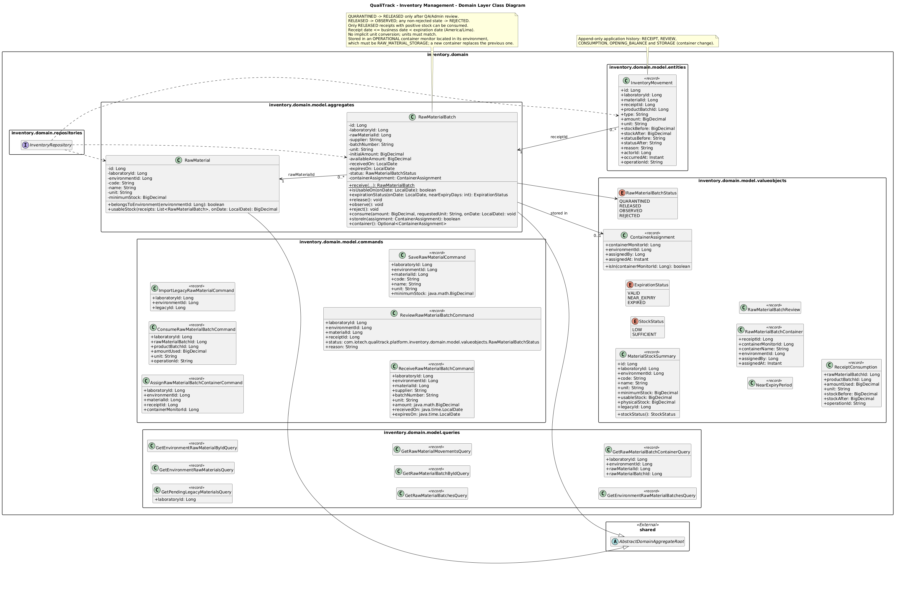

##### 4.2.5.6.2. Bounded Context Database Design Diagram.

El esquema de persistencia contiene las estructuras de materiales, recepciones y movimientos. La cantidad disponible se conserva a nivel de cada recepción, mientras los movimientos permiten reconstruir el historial de cambios del inventario.

---

### 4.2.6. Bounded Context: Product Batch Management

Product Batch Management administra los **productos farmacéuticos** registrados en los ambientes del laboratorio y sus **lotes de fabricación**. Registra todo lo que participa en un lote: los lotes de materia prima consumidos, los equipos utilizados, el personal que intervino y el contenedor monitoreado donde se almacena. Con esa información reconstruye la trazabilidad que el responsable de calidad revisa antes de liberar o rechazar el lote.

El contexto no administra el stock de la materia prima: Inventory Management valida y consume el lote de materia prima, y Product Batch Management registra el consumo cuando Inventory lo confirma.

#### 4.2.6.1. Domain Layer.

**`PharmaceuticalProduct` — Aggregate Root**

- **Propósito:** producto farmacéutico que se fabrica en un ambiente del laboratorio (US71, TS61).
- **Atributos principales:** `id`, `laboratoryId`, `environmentId`, `code`, `name`, `description`, `specifications` y `active`.
- **Método principal:** `belongsTo`.

**`Batch` — Aggregate Root**

- **Propósito:** lote de fabricación de un producto.
- **Atributos principales:** `id`, `labId`, `environmentId`, `productId`, `productName`, `batchNumber`, `quantity`, `unit`, `status` (`BatchStatus`), `startDate`, `endDate`, `notes` y `containerAssignment`.
- **Métodos principales:** `start`, `registerRawMaterialConsumption`, `release`, `reject`, `storeIn`, `container`, `isOpen` y `belongsTo`.
- **Reglas:** el lote nace en `PENDING` y pasa a `IN_PROGRESS` con su primer consumo de materia prima. Un lote cerrado (`RELEASED` o `REJECTED`) no vuelve a iniciarse ni acepta consumos. Solo se almacena en contenedores de un ambiente de almacén de producto.

**Entities**

- `RawMaterialUsage`: consumo de un lote de materia prima de Inventory (`batchId`, `rawMaterialId`, `inventoryReceiptId`, `quantityUsed`, `stockBefore`, `stockAfter`, `operationId`).
- `EquipmentUsage`: evidencia de que un equipo participó en el lote (`batchId`, `equipmentId`, `equipmentName`, `registeredByUserId`) (US76).
- `StaffParticipation`: evidencia de que una persona del personal participó en el lote (`batchId`, `staffId`, `staffName`, `staffRole`, `registeredByUserId`) (US77).
- `DigitalSignature`: firma de quien liberó el lote (`signedByUserId`, `signatureHash`, `signedAt`).
- `RejectionRecord`: registro del rechazo con su fecha y motivo.

**Value Objects**

- `BatchStatus`: `PENDING`, `IN_PROGRESS`, `RELEASED` y `REJECTED`.
- `ContainerAssignment`: contenedor monitoreado donde se guarda el lote, su ambiente, quién lo guardó y cuándo (US78).
- `BatchContainer`: modelo de lectura del contenedor del lote (US79).
- `BatchRelease` y `BatchRejection`: resultado de la decisión final, con la firma o el registro de rechazo.
- `BatchTraceability`: todo lo que participó en el lote, es decir, lotes de materia prima consumidos, equipos, personal y decisión final (US80, TS70).

**Commands principales**

- `CreateProductCommand` (US71, TS61) y `CreateBatchCommand` (US73, TS63).
- `RegisterRawMaterialUsageCommand` (US75, TS65), `RegisterEquipmentUsageCommand` (US76, TS66) y `RegisterStaffParticipationCommand` (US77, TS67).
- `AssignBatchContainerCommand` (US78, TS68).
- `ReleaseBatchCommand` (US81, TS71) y `RejectBatchCommand` (US82, TS72).

**Queries principales**

- `GetProductsByEnvironmentQuery` y `GetProductByIdQuery`.
- `GetBatchesByProductQuery`, `GetProductBatchQuery`, `GetBatchByIdQuery` y `GetBatchesByLabIdQuery`.
- `GetBatchContainerQuery` y `GetBatchTraceabilityQuery`.
- `GetRawMaterialUsageByBatchIdQuery`, `GetRawMaterialUsagesByInventoryMaterialQuery` y `GetRawMaterialHistoryQuery`.

**Eventos de dominio**

- `ProductCreatedEvent`.
- `BatchCreatedEvent`, `BatchStartedEvent`, `BatchReleasedEvent` y `BatchRejectedEvent`.
- `RawMaterialLinkedToBatchEvent`, `BatchParticipationRegisteredEvent` y `BatchStoredInContainerEvent`.

**Repository Interfaces**

- `ProductRepository`, `BatchRepository`, `RawMaterialUsageRepository`, `BatchParticipationRepository` y `BatchEvidenceRepository` (firmas de liberación y registros de rechazo).

#### 4.2.6.2. Interface Layer.

**REST controllers** (bajo `/api/v1/laboratories/{laboratoryId}`)

- `EnvironmentProductsController` — `/environments/{environmentId}/products`: registra, lista y consulta los productos de un ambiente.
- `ProductBatchesController` — `.../products/{productId}/batches`: registra, lista y consulta los lotes de un producto. También los libera (`POST /{batchId}/releases`) o rechaza (`POST /{batchId}/rejections`).
- `BatchManufacturingController` — `.../batches/{batchId}`: registra los consumos de materia prima, los equipos y el personal (`POST /raw-material-usages`, `/equipment-usages`, `/staff-participations`). Además consulta o asigna el contenedor (`GET/PUT /container-assignment`) y devuelve la trazabilidad (`GET /traceability`).
- `LaboratoryBatchesController` — `/batches`: lista los lotes de todo el laboratorio.
- `EnvironmentRawMaterialUsagesController` y `RawMaterialHistoryController`: muestran en qué lotes se consumió una materia prima de Inventory o del catálogo heredado.

**Assemblers principales**

- `CreateProductCommandFromResourceAssembler` y `ProductResourceFromEntityAssembler`.
- `CreateBatchCommandFromResourceAssembler`, `ReleaseBatchCommandFromResourceAssembler`, `RejectBatchCommandFromResourceAssembler` y `BatchResourceFromEntityAssembler`.
- `RawMaterialUsageResourceFromEntityAssembler`, `BatchParticipationResourceFromEntityAssembler`, `BatchContainerResourceFromEntityAssembler` y `BatchTraceabilityResourceFromEntityAssembler`.

**Fachadas e integration events**

- `BatchContextFacade`: permite que Inventory valide un lote consumible (`requireConsumable`) y que otros contextos consulten su estado o su trazabilidad (`isBatchReleased`, `isBatchRejected`, `findTraceability`).
- `BatchTenantResourceLookup`: resuelve el laboratorio dueño de un producto o lote.
- Integration events: `ProductCreatedIntegrationEvent`, `BatchCreatedIntegrationEvent`, `BatchStartedIntegrationEvent`, `BatchReleasedIntegrationEvent`, `BatchRejectedIntegrationEvent`, `RawMaterialLinkedToBatchIntegrationEvent`, `BatchParticipationRegisteredIntegrationEvent` y `BatchStoredInContainerIntegrationEvent`.

#### 4.2.6.3. Application Layer.

**Command Services**

- `ProductCommandService` / `ProductCommandServiceImpl`: registra productos en los ambientes del laboratorio.
- `BatchCommandService` / `BatchCommandServiceImpl`: registra lotes, los almacena en contenedores y registra su liberación o rechazo.
- `RawMaterialUsageCommandService` / `RawMaterialUsageCommandServiceImpl`: registra el consumo de materia prima solicitándolo a Inventory Management.
- `BatchParticipationCommandService` / `BatchParticipationCommandServiceImpl`: asocia los equipos (validados con Equipment Management) y el personal (validado con Laboratory Management).

**Query Services**

- `ProductQueryService`, `BatchQueryService`, `RawMaterialUsageQueryService` y `BatchTraceabilityQueryService`. Este último reconstruye la trazabilidad con los registros del lote y la ubicación de cada lote de materia prima en Inventory.

**Event Handlers**

- `ReceiptConsumedEventHandler`: registra el consumo confirmado por Inventory Management e inicia el lote con su primer consumo.
- `ProductCreatedEventHandler`, `BatchCreatedEventHandler`, `BatchStartedEventHandler`, `BatchReleasedEventHandler`, `BatchRejectedEventHandler`, `RawMaterialLinkedToBatchEventHandler`, `BatchParticipationRegisteredEventHandler` y `BatchStoredInContainerEventHandler`: publican los eventos de integración hacia los demás contextos.

**ACL**

- `BatchExternalInventoryService`: accede a las materias primas de Inventory Management.
- `BatchExternalEquipmentService`: lee los equipos de Equipment Management.
- `ExternalLaboratoryService`: valida ambientes y personal en Laboratory Management.
- `BatchExternalComplianceService`: encapsula la consulta a Compliance & Alerting sobre si un lote puede liberarse (`canReleaseBatch`).
- `BatchContextFacadeImpl`: implementa la fachada del contexto.

#### 4.2.6.4. Infrastructure Layer.

- **Persistence Entities, Spring Data JPA Repositories y Assemblers** para productos, lotes, consumos de materia prima, participación (equipos y personal) y evidencia de la decisión (firma y rechazo).
- **Repository Adapters:** `ProductRepositoryImpl`, `BatchRepositoryImpl`, `RawMaterialUsageRepositoryImpl`, `BatchParticipationRepositoryImpl` y `BatchEvidenceRepositoryImpl`.
- **Converter:** `BatchStatusPersistenceConverter`.

#### 4.2.6.5. Bounded Context Software Architecture Component Level Diagrams.

El diagrama de componentes presenta **Product Batch Management** dentro del **Cloud REST API**. La Single-Page Application registra en él productos y lotes. Inventory Management valida el lote y le notifica el consumo de materia prima, y Compliance & Alerting consulta los lotes expuestos a un ambiente con desviaciones.

Se utiliza la vista de Structurizr **`Components-ProductBatch`**, definida sobre el container `Cloud REST API`.

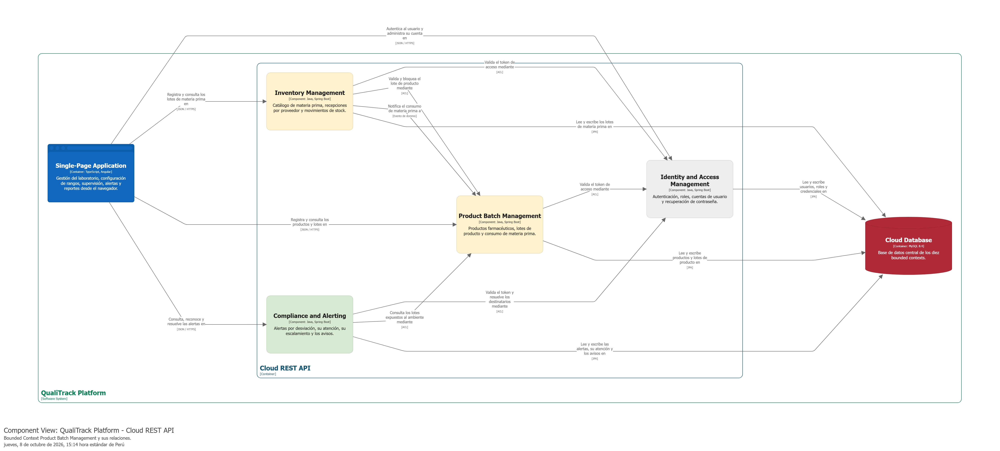

#### 4.2.6.6. Bounded Context Software Architecture Code Level Diagrams.

Los diagramas de nivel de código presentan las clases del Domain Layer de Product Batch Management y el esquema relacional que persiste productos, lotes y su trazabilidad.

##### 4.2.6.6.1. Bounded Context Domain Layer Class Diagrams.

El diagrama muestra los Aggregates `PharmaceuticalProduct` y `Batch`, las entidades de consumo, participación y evidencia, los Value Objects de estado, contenedor y trazabilidad, y los Commands, Queries, eventos e interfaces de repositorio del contexto.

##### 4.2.6.6.2. Bounded Context Database Design Diagram.

El diagrama de base de datos muestra las tablas de productos, lotes, consumos de materia prima, equipos y personal participantes, firmas de liberación y registros de rechazo, relacionadas mediante el identificador del lote.

---

### 4.2.7. Bounded Context: Reporting & Audit

Reporting & Audit consolida la evidencia que el laboratorio necesita frente a una inspección. Mantiene el **registro de auditoría** de las operaciones realizadas en los demás contextos, genera los **reportes** de trazabilidad de lote, de cumplimiento del periodo, de equipos y de inventario en PDF o CSV, y calcula los **indicadores** del laboratorio y las **tendencias de desviación** de cada ambiente.

Los indicadores y las tendencias no se guardan como copias que puedan quedar desactualizadas: se calculan al momento de la consulta a partir de los registros vigentes. Los reportes generados, en cambio, se almacenan con un checksum y no se modifican.

#### 4.2.7.1. Domain Layer.

**`AuditReport` — Aggregate Root**

- **Propósito:** reporte generado e inmutable, con su tipo, periodo, autor y checksum del contenido.
- **Atributos principales:** `id`, `laboratoryId`, `batchId`, `equipmentId`, `generatedBy`, `generatedByName`, `reportType`, `dateRangeFrom`, `dateRangeTo`, `filePath`, `checksum` y `generatedAt`.
- **Métodos principales:** `computeChecksum`, `isImmutable`, `isBatchReport` e `isEquipmentReport`.

**`KpiDashboard` — Aggregate Root**

- **Propósito:** indicadores de un laboratorio en un periodo: conteos operativos y resumen de las lecturas ambientales (US93, TS81).
- **Atributos principales:** `laboratoryId`, `timestamp`, `overallHealthScore`, `period` (`ReportingPeriod`), `metrics` y `measurementSummaries`.
- **Métodos principales:** `hasCriticalMetrics` y `hasAtRiskMetrics`.

**Entities**

- `AuditLogEntry`: entrada inmutable del registro de auditoría (`action`, `entityType`, `entityId`, `performedBy`, `timestamp`, `details`).
- `KpiMetric`: indicador individual con su valor, unidad, meta y estado.
- `DeviationTrend`: tendencia de una métrica de un dispositivo en un ambiente: dirección, lecturas evaluadas, porcentaje de tiempo en rango y número de desviaciones (US94, TS82). Se construye con `fromReadings`.
- `TrendDataPoint`: punto de la tendencia con su valor, sus límites y su estado; `isDeviation` indica si está fuera de rango.

**Value Objects**

- `ReportDocument`: contenido del archivo generado (`reportId`, `format`, `content`).
- `ReportingPeriod`: periodo del que se calcula un indicador o reporte. Por defecto son los últimos siete días.
- `MeasurementSummary`: promedio, mínimo y máximo de las lecturas numéricas de un dispositivo y métrica en el periodo.
- `EnvironmentalReading`: lectura de un dispositivo tal como la ve este contexto, obtenida de Tracking & Telemetry.
- Enumeraciones: `ReportType` (`BATCH_TRACEABILITY`, `COMPLIANCE_PERIOD`, `EQUIPMENT_LOG`, `KPI_SUMMARY`, `INVENTORY`), `ReportFormat` (`PDF`, `CSV`), `AuditAction`, `KpiMetricStatus` (`ON_TRACK`, `AT_RISK`, `CRITICAL`, `UNKNOWN`) y `TrendDirection` (`INCREASING`, `DECREASING`, `STABLE`).

**Commands principales**

- `GenerateBatchReportCommand` (TS84), `GenerateComplianceReportCommand` (TS83), `GenerateInventoryReportCommand` (US97, TS85) y `ExportEquipmentLogCommand`.
- `RecordAuditLogEntryCommand`.

**Queries principales**

- `GetKpiDashboardByLaboratoryIdQuery` y `GetDeviationTrendsByEnvironmentQuery`.
- `GetAuditLogQuery` y `GetStaffActivityQuery` (US92).
- `GetAuditReportByIdQuery`, `GetAuditReportsByLaboratoryIdQuery`, `GetAuditReportsByBatchIdQuery`, `GetAuditReportsByEquipmentIdQuery` y `GetReportDocumentByIdQuery`.

**Eventos de dominio**

- `AuditLogEntryRecordedEvent`.
- `AuditReportGeneratedEvent`.

**Repository Interfaces**

- `AuditReportRepository`, `AuditLogRepository` y `ReportDocumentRepository`.

**Excepciones de dominio**

- `ImmutableAuditReportException`, `InvalidReportDateRangeException`, `ReportGenerationException`, `AuditReportNotFoundException` y `AuditLogEntryNotFoundException`.

#### 4.2.7.2. Interface Layer.

**REST controllers**

- `KpiDashboardController` — `/api/v1/laboratories/{laboratoryId}/kpi-dashboards`: indicadores del laboratorio.
- `DeviationTrendController` — `.../environments/{environmentId}/deviation-trends`: tendencias de desviación del ambiente.
- `LaboratoryReportController` — `/api/v1/laboratories/{laboratoryId}`: genera reportes de cumplimiento (`POST /compliance-reports`) y de inventario (`POST /inventory/reports`) y lista los reportes generados (`GET /reports`).
- `BatchReportController` — `/api/v1/batches/{batchId}/reports`: genera y lista los reportes de trazabilidad de un lote.
- `EquipmentReportController` — `.../equipments/{equipmentId}/log-reports`: exporta el historial de un equipo.
- `ReportController` — `/api/v1/reports/{reportId}` y `/{reportId}/content`: metadatos y contenido del reporte en PDF o CSV.
- `BatchAuditLogController`, `EquipmentAuditLogController` y `StaffAuditLogController`: registro de auditoría de un lote, de un equipo y de la actividad de una persona del personal.

**Assemblers principales**

- `GenerateBatchReportCommandFromResourceAssembler`, `GenerateComplianceReportCommandFromResourceAssembler`, `GenerateInventoryReportCommandFromResourceAssembler` y `ExportEquipmentLogCommandFromResourceAssembler`.
- `AuditReportResourceFromEntityAssembler`, `AuditLogEntryResourceFromEntityAssembler`, `KpiDashboardResourceFromEntityAssembler`, `KpiMetricResourceFromEntityAssembler`, `DeviationTrendResourceFromEntityAssembler` y `TrendDataPointResourceFromEntityAssembler`.
- `ReportResponseAssembler` responde `201 Created` con el reporte guardado. `ReportingPeriodAssembler` lee el periodo solicitado.

**Fachada e integration events**

- `RaContextFacade`: permite que otros contextos registren entradas de auditoría (`recordAuditLog`).
- `RaTenantResourceLookup`: resuelve el laboratorio dueño de un reporte.
- Integration events: `AuditLogEntryRecordedIntegrationEvent` y `AuditReportGeneratedIntegrationEvent`.

#### 4.2.7.3. Application Layer.

**Command Services**

- `RaCommandService` / `RaCommandServiceImpl`: genera los reportes de lote, de cumplimiento, de equipo y de inventario. Reúne la información con los servicios ACL, la escribe con `ReportDocumentWriter` y la guarda como `AuditReport` con su `ReportDocument`.
- `AuditLogCommandService` / `AuditLogCommandServiceImpl`: registra las entradas de auditoría.

**Query Services**

- `RaQueryService` / `RaQueryServiceImpl`: calcula los indicadores y las tendencias y resuelve el registro de auditoría y los reportes generados.
- `ReportDocumentQueryService` / `ReportDocumentQueryServiceImpl`: entrega el contenido del reporte.

**Event Handlers**

- `LaboratoryAuditEventHandler`, `InventoryAuditEventHandler`, `EquipmentAuditEventHandler`, `TrackingAuditEventHandler`, `BatchAuditEventHandler` y `CaAuditEventHandler`: escuchan los eventos de integración de cada contexto y registran la operación en el registro de auditoría.
- `AuditLogEntryRecordedEventHandler` y `AuditReportGeneratedEventHandler`: publican los eventos de integración propios.

**ACL y datos de reporte**

- `RaExternalTrackingService`, `RaExternalComplianceService`, `RaExternalBatchService`, `RaExternalEquipmentService`, `RaExternalInventoryService` y `RaExternalLaboratoryService`: leen, mediante las fachadas de cada contexto, las lecturas y acciones, las alertas, la trazabilidad del lote, los dispositivos, el inventario y el laboratorio.
- `BatchReportData`, `ComplianceReportData`, `EquipmentReportData` e `InventoryReportData`: datos de cada reporte, independientes de su presentación.
- `RaOperationalDataService`: obtiene los conteos operativos de los indicadores. Hoy los lee directamente de los repositorios de Product Batch, Laboratory, Equipment y Compliance & Alerting, en solo lectura. Es una dependencia pendiente de reemplazar por las fachadas de esos contextos, para respetar el ACL descrito en el Context Mapping.

#### 4.2.7.4. Infrastructure Layer.

- **Documentos:** `ReportDocumentWriterImpl` y los renderizadores PDF `AbstractReportPdfRenderer`, `BatchReportPdfRenderer`, `PeriodReportPdfRenderer` e `InventoryReportPdfRenderer`, implementados con Apache PDFBox.
- **Persistencia:** entidades, Spring Data JPA Repositories y adapters para reportes, documentos y registro de auditoría (`AuditReportRepositoryImpl`, `ReportDocumentRepositoryImpl` y `AuditLogRepositoryImpl`).
- **Converters:** `AuditActionPersistenceConverter`, `ReportFormatPersistenceConverter` y `ReportTypePersistenceConverter`.
- **Configuración:** `RaConfiguration` usa la zona horaria del laboratorio (America/Lima) para los días calendario de los reportes.

#### 4.2.7.5. Bounded Context Software Architecture Component Level Diagrams.

El diagrama de componentes presenta **Reporting & Audit** dentro del **Cloud REST API**. La Single-Page Application genera y exporta en él los reportes. El contexto obtiene la telemetría y las alertas del periodo de Tracking & Telemetry y Compliance & Alerting, y persiste reportes y auditoría en la Cloud Database.

Se utiliza la vista de Structurizr **`Components-Reporting`**, definida sobre el container `Cloud REST API`.

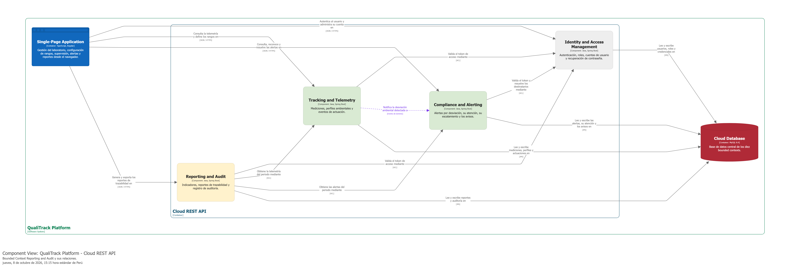

#### 4.2.7.6. Bounded Context Software Architecture Code Level Diagrams.

Los diagramas de nivel de código presentan las clases del Domain Layer de Reporting & Audit y el esquema relacional que persiste reportes y registro de auditoría.

##### 4.2.7.6.1. Bounded Context Domain Layer Class Diagrams.

El diagrama muestra los Aggregates `AuditReport` y `KpiDashboard`, las entidades `AuditLogEntry`, `KpiMetric`, `DeviationTrend` y `TrendDataPoint`, los Value Objects del periodo, los documentos y los resúmenes, y los Commands, Queries, eventos e interfaces de repositorio del contexto.

##### 4.2.7.6.2. Bounded Context Database Design Diagram.

El diagrama de base de datos muestra las tablas `audit_reports` (reportes generados) y `audit_log_entries` (registro de auditoría). Los indicadores y tendencias no tienen tablas porque se calculan al consultarlos.

---

### 4.2.8. Bounded Context: Identity & Access Management

Identity & Access Management es un Bounded Context transversal encargado de la identidad, autenticación y autorización de los usuarios de QualiTrack. Su función es proporcionar una identidad confiable al resto del sistema sin asumir responsabilidades relacionadas con laboratorios, inventario, telemetría o suscripciones.

#### 4.2.8.1. Domain Layer.

**`User` — Aggregate Root**

- **Propósito:** representa la cuenta de acceso de un usuario.
- **Atributos principales:** `id`, `username`, `password`, `roles`, `laboratoryId` y `status`.
- **Métodos principales:** `addRole`, `addRoles`, `deactivate`, `isActive`, `getUsernameValue` y `getPasswordValue`.
- **Relaciones:** contiene roles y utiliza `Username`, `PasswordHash` y `UserStatus`.

**`Role` — Entity**

- **Propósito:** representa un rol asignable a los usuarios.
- **Atributos principales:** `id` y `name`.
- **Métodos principales:** `getStringName`, `hasName` y `validateRoleSet`.

**`Username` — Value Object**

Encapsula el identificador utilizado para el inicio de sesión.

**`PasswordHash` — Value Object**

Representa únicamente la contraseña ya protegida. La contraseña en texto plano no forma parte del modelo persistido.

**`Roles` — Enumeration**

- `ROLE_ADMIN`.
- `ROLE_QA_MANAGER`.
- `ROLE_LAB_OPERATOR`.

**`UserStatus` — Enumeration**

- `ACTIVE`.
- `INACTIVE`.
- `SUSPENDED`.

**Commands principales**

- `SignInCommand`.
- `SignUpCommand`.
- `AssignRoleCommand`.
- `DeactivateUserCommand`.
- `SeedRolesCommand`.

**Queries principales**

- `GetUserByIdQuery`.
- `GetUserByUsernameQuery`.
- `GetAllUsersQuery`.
- `GetRoleByNameQuery`.
- `GetAllRolesQuery`.

**Repository Interfaces**

- `UserRepository`.
- `RoleRepository`.

#### 4.2.8.2. Interface Layer.

**`AuthenticationController`**

- Recibe las solicitudes de registro e inicio de sesión.
- Convierte los Resources a `SignUpCommand` o `SignInCommand`.
- Devuelve el usuario autenticado junto con el token cuando las credenciales son válidas.

**`UsersController`**

- Permite consultar usuarios, asignar roles y desactivar cuentas de acuerdo con los permisos definidos.

**`RolesController`**

- Expone la consulta de los roles disponibles.

**`IamContextFacade`**

Expone información mínima hacia otros contextos, como comprobar que un usuario exista, obtener su laboratorio asociado, consultar el nombre del usuario o verificar si tiene un rol determinado.

**Resources principales**

- `SignInResource`.
- `SignUpResource`.
- `AuthenticatedUserResource`.
- `UserResource`.
- `RoleResource`.

#### 4.2.8.3. Application Layer.

**`UserCommandService` / `UserCommandServiceImpl`**

Coordina el registro, inicio de sesión, asignación de roles y desactivación de usuarios. Utiliza `HashingService` para proteger contraseñas y `TokenService` para generar tokens de acceso.

**`RoleCommandService` / `RoleCommandServiceImpl`**

Inicializa y administra los roles base requeridos por la aplicación.

**Query Services**

- `UserQueryService` / `UserQueryServiceImpl`.
- `RoleQueryService` / `RoleQueryServiceImpl`.

**`ApplicationReadyEventHandler`**

Inicializa los roles cuando la aplicación se encuentra disponible, evitando depender de una carga manual previa.

**Outbound Service Contracts**

- `HashingService`.
- `TokenService`.

Estas interfaces se definen fuera de Infrastructure para evitar que el dominio de identidad dependa de BCrypt o JWT como tecnologías concretas.

#### 4.2.8.4. Infrastructure Layer.

**Seguridad y hashing**

- `BCryptHashingService` configura `BCryptPasswordEncoder`.
- `HashingServiceImpl` implementa el contrato de hashing.

**JWT y autorización**

- `TokenServiceImpl` implementa la generación y validación de tokens JWT.
- `BearerTokenService` extrae el token del header de autorización.
- `BearerAuthorizationRequestFilter` valida las solicitudes protegidas.
- `UserDetailsServiceImpl` integra el usuario del dominio con Spring Security.
- `UserDetailsImpl` adapta `User` al contrato `UserDetails`.
- `UnauthorizedRequestHandlerEntryPoint` gestiona accesos no autorizados.
- `WebSecurityConfiguration` define la cadena de filtros y configuración de seguridad.

**Persistencia**

- `UserPersistenceEntity` y `RolePersistenceEntity`.
- `UserPersistenceRepository` y `RolePersistenceRepository`.
- `UserRepositoryImpl` y `RoleRepositoryImpl`.
- `UserPersistenceAssembler` y `RolePersistenceAssembler`.
- `RolesPersistenceConverter` y `UserStatusPersistenceConverter`.

#### 4.2.8.5. Bounded Context Software Architecture Component Level Diagrams.

El diagrama de componentes presenta la posición de **Identity & Access Management** dentro del **Cloud REST API**. Este contexto proporciona identidad, autenticación y autorización a los demás módulos de QualiTrack y mantiene relaciones con aquellos procesos que necesitan validar al usuario autenticado o su acceso a las capacidades del sistema.

Para esta entrega se utiliza la vista de Structurizr **`Components-IAM`**, definida sobre el container `Cloud REST API`. La vista corresponde al C4 actual y posteriormente podrá detallarse para evidenciar de manera interna los componentes de autenticación, autorización, repositorios y seguridad.

#### 4.2.8.6. Bounded Context Software Architecture Code Level Diagrams.

##### 4.2.8.6.1. Bounded Context Domain Layer Class Diagrams.

El diagrama muestra `User`, `Role`, los Value Objects de identidad y contraseña protegida, las enumeraciones de roles y estado, Commands, Queries y repositorios.

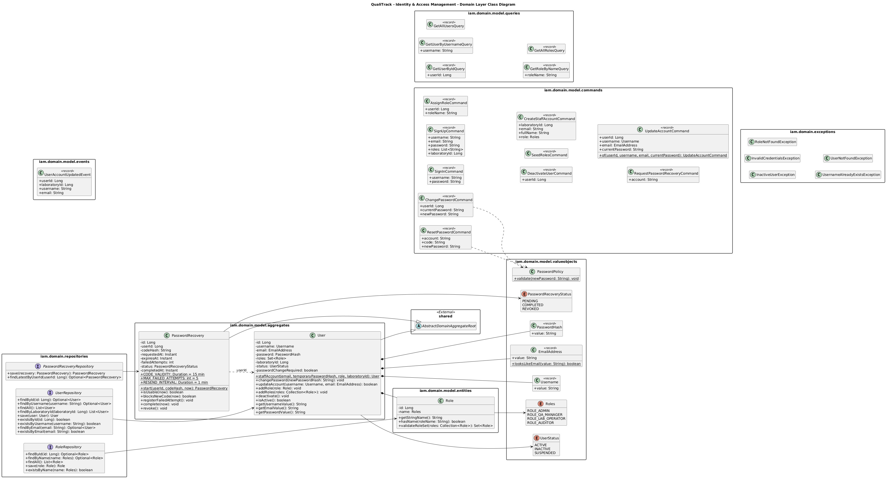

##### 4.2.8.6.2. Bounded Context Database Design Diagram.

El esquema de base de datos representa usuarios, roles y su relación de muchos a muchos, además de los campos necesarios para mantener el estado y la relación de acceso con la organización correspondiente.

---

### 4.2.9. Bounded Context: Payments & Subscriptions

Payments & Subscriptions administra los planes comerciales, el estado de las suscripciones y los pagos asociados. Se mantiene separado de IAM porque la identidad del usuario y la contratación del servicio representan responsabilidades diferentes.

Stripe se utiliza como proveedor externo para procesar el pago. QualiTrack mantiene en su propia base de datos la información necesaria para conocer qué plan se encuentra activo y qué pagos fueron confirmados, sin almacenar directamente los datos sensibles del medio de pago.

#### 4.2.9.1. Domain Layer.

**`Subscription` — Aggregate Root**

- **Propósito:** representa la contratación de un plan por parte de un usuario y su laboratorio.
- **Atributos principales:** `id`, `userId`, `laboratoryId`, `planCode`, `billingCycle`, `status`, identificadores de Stripe, periodo vigente y datos de cancelación.
- **Métodos principales:** `activate`, `cancel` e `isActive`.
- **Relaciones:** utiliza `PlanCode`, `BillingCycle` y `SubscriptionStatus`.

**`SubscriptionPlan` — Entity**

- **Propósito:** representa un plan disponible para contratación.
- **Atributos principales:** código, nombre, descripción, precio, ciclo de facturación, `stripePriceId`, límites de usuarios/equipos y estado activo.
- **Método principal:** `isSelectable`.

**`SubscriptionPayment` — Entity**

- **Propósito:** conserva un pago asociado a una suscripción después de recibir información confirmada del proveedor.
- **Atributos principales:** `subscriptionId`, proveedor, identificador del pago externo, sesión de checkout, importe, estado y fecha de pago.
- **Métodos principales:** `stripePayment` e `isPaid`.

**`Money` — Value Object**

- **Atributos:** `amount` y `currency`.
- **Propósito:** evita representar importes únicamente con valores numéricos sin moneda.

**Enumerations**

- `PlanCode`: `FREE`, `BASIC`, `PROFESSIONAL` y `ENTERPRISE`.
- `BillingCycle`: `MONTHLY` y `YEARLY`.
- `SubscriptionStatus`: `ACTIVE`, `INACTIVE`, `PENDING_PAYMENT`, `CANCELLED` y `EXPIRED`.
- `PaymentProvider`: `STRIPE` y `MOCK`.
- `PaymentStatus`: `PENDING`, `PAID`, `FAILED`, `CANCELLED` y `REFUNDED`.

**Commands principales**

- `CreateCheckoutSessionCommand`.
- `ActivateSubscriptionCommand`.
- `CancelSubscriptionCommand`.
- `RecordStripePaymentCommand`.

**Queries principales**

- `GetSubscriptionPlansQuery`.
- `GetActiveSubscriptionByLaboratoryIdQuery`.
- `GetActiveSubscriptionByUserIdQuery`.
- `GetBillingSummaryByLaboratoryIdQuery`.
- `GetPaymentsBySubscriptionIdQuery`.
- `GetSubscriptionByStripeCheckoutSessionIdQuery`.

**Eventos principales**

- `CheckoutSessionCreatedEvent`.
- `SubscriptionActivatedEvent`.
- `SubscriptionCancelledEvent`.
- `SubscriptionPaymentRecordedEvent`.

**Repository Interfaces**

- `SubscriptionRepository`.
- `SubscriptionPlanRepository`.
- `SubscriptionPaymentRepository`.

#### 4.2.9.2. Interface Layer.

**`SubscriptionController`**

Expone las operaciones para:

- consultar planes activos;
- crear una sesión de checkout;
- consultar la suscripción activa;
- consultar el resumen de facturación;
- consultar pagos de una suscripción;
- cancelar la renovación o suscripción según las reglas definidas.

**`StripeWebhookController`**

Recibe los eventos enviados por Stripe. Su responsabilidad es verificar y traducir dichos eventos a Commands de aplicación, evitando que el payload externo modifique directamente el modelo de dominio.

**Resources principales**

- `CreateCheckoutSessionResource`.
- `CheckoutSessionResource`.
- `CancelSubscriptionResource`.
- `SubscriptionResource`.
- `SubscriptionPlanResource`.
- `SubscriptionPaymentResource`.
- `StripeWebhookResource`.

**`SubscriptionContextFacade`**

Permite a otros contextos consultar de forma controlada si existe una suscripción activa, verificar un plan o conocer el código del plan vigente.

#### 4.2.9.3. Application Layer.

**`SubscriptionCommandService` / `SubscriptionCommandServiceImpl`**

Coordina la creación de sesiones de pago, activación, cancelación y registro de pagos. La activación se realiza únicamente a partir de una confirmación válida del proveedor y no por una decisión tomada únicamente en el frontend.

**`SubscriptionQueryService` / `SubscriptionQueryServiceImpl`**

Resuelve consultas de planes, suscripciones activas, historial y pagos.

**Event Handlers**

- `CheckoutSessionCreatedEventHandler`.
- `SubscriptionActivatedEventHandler`.
- `SubscriptionCancelledEventHandler`.
- `SubscriptionPaymentRecordedEventHandler`.

**`ExternalStripeService` — ACL / Outbound Service**

- Crea sesiones de checkout en Stripe.
- Recupera información de la suscripción del proveedor.
- Solicita cancelaciones cuando corresponde.
- Traduce los identificadores y fechas de Stripe a estructuras que entiende el Application Layer.

De esta manera, el dominio no depende directamente de las clases del SDK de Stripe.

#### 4.2.9.4. Infrastructure Layer.

**Persistence Entities**

- `SubscriptionPersistenceEntity`.
- `SubscriptionPlanPersistenceEntity`.
- `SubscriptionPaymentPersistenceEntity`.

**Embeddable**

- `MoneyEmbeddable` representa importe y moneda dentro de las entidades JPA.

**Persistence Repositories**

- `SubscriptionPersistenceRepository`.
- `SubscriptionPlanPersistenceRepository`.
- `SubscriptionPaymentPersistenceRepository`.

**Repository Adapters**

- `SubscriptionRepositoryImpl`.
- `SubscriptionPlanRepositoryImpl`.
- `SubscriptionPaymentRepositoryImpl`.

**Persistence Assemblers**

- `SubscriptionPersistenceAssembler`.
- `SubscriptionPlanPersistenceAssembler`.
- `SubscriptionPaymentPersistenceAssembler`.
- `MoneyPersistenceAssembler`.

**Converters**

Se utilizan converters para `PlanCode`, `BillingCycle`, `SubscriptionStatus`, `PaymentProvider` y `PaymentStatus`.

**Integración Stripe**

La infraestructura contiene la configuración necesaria para utilizar el SDK de Stripe y validar los webhooks. Las claves del proveedor deben mantenerse en variables de entorno y no almacenarse en el repositorio.

#### 4.2.9.5. Bounded Context Software Architecture Component Level Diagrams.

El diagrama de componentes presenta la posición de **Payments & Subscriptions** dentro del **Cloud REST API**. Este contexto gestiona planes, suscripciones y pagos y mantiene una integración con Identity & Access Management para relacionar la contratación con el usuario, además de utilizar Stripe como proveedor externo para el procesamiento del pago.

Para esta entrega se utiliza la vista de Structurizr **`Components-Payments`**, definida sobre el container `Cloud REST API`. La vista representa el C4 actual del proyecto y podrá refinarse posteriormente para mostrar con mayor detalle la separación entre dominio, servicios de aplicación, persistencia e integración con Stripe.

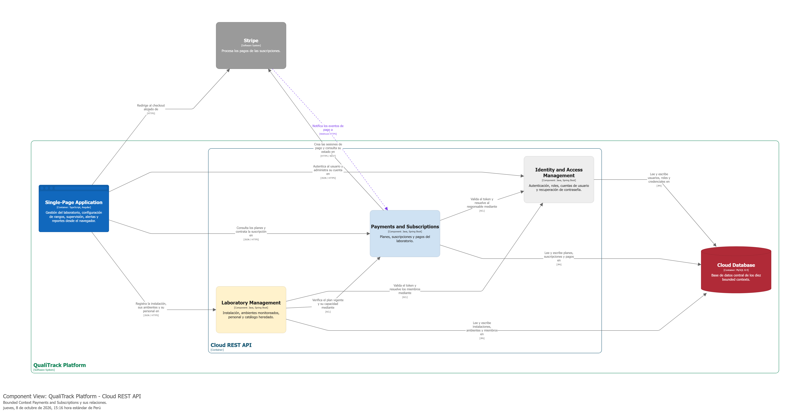

#### 4.2.9.6. Bounded Context Software Architecture Code Level Diagrams.

##### 4.2.9.6.1. Bounded Context Domain Layer Class Diagrams.

El diagrama de clases representa `Subscription`, `SubscriptionPlan`, `SubscriptionPayment`, `Money`, las enumeraciones comerciales, Commands, Queries, eventos y repositorios del contexto.

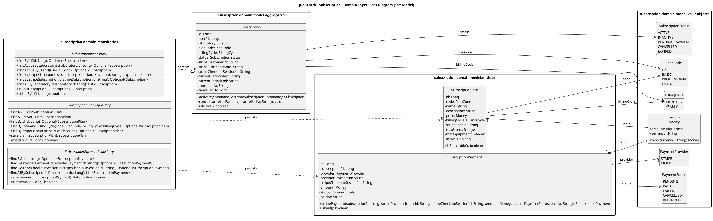

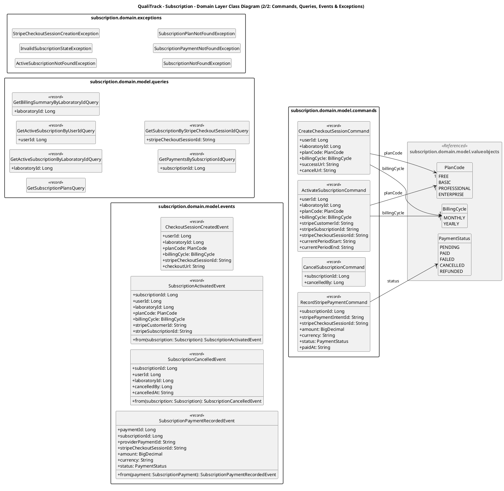

##### 4.2.9.6.2. Bounded Context Database Design Diagram.

El diagrama de base de datos muestra planes, suscripciones y pagos, incluyendo los identificadores externos necesarios para relacionar los registros internos con Stripe. Los datos sensibles de tarjetas u otros medios de pago no se almacenan dentro de QualiTrack.

