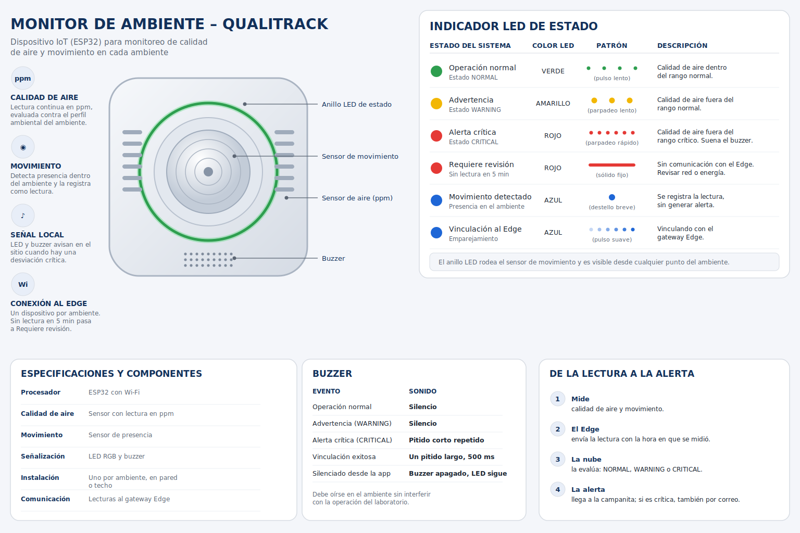
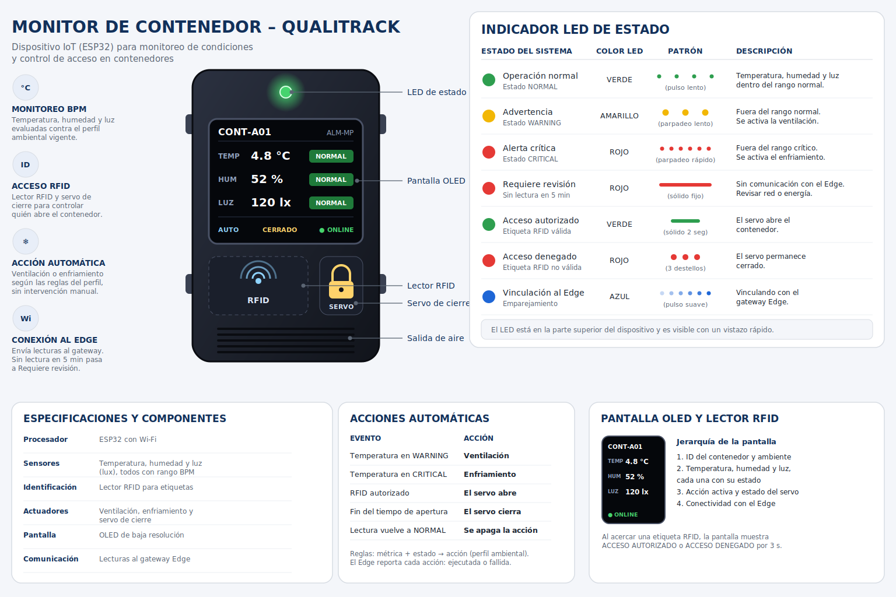

# Capítulo V: Solution UI/UX Design

En este capítulo se detallan las decisiones de diseño de producto para la plataforma QualiTrack y su respectiva Landing Page. Se establecen las guías de estilo visuales, la arquitectura de la información y los criterios que aseguran una experiencia de usuario (UX) intuitiva y profesional, alineada a las exigencias de la industria farmacéutica y entidades regulatorias como la DIGEMID.

## 5.1. Style Guidelines

### 5.1.1. General Style Guidelines

El diseño visual de la plataforma **QualiTrack** se rige por una estética limpia, tecnológica y de alta precisión, reflejando el compromiso de **IoTech** con la integridad de datos en la manufactura farmacéutica. El objetivo es proyectar un entorno de confianza y profesionalismo que minimice la carga cognitiva del usuario al monitorear variables críticas.

En este capítulo, detallaremos cada uno de los elementos visuales y de estilo que guían el desarrollo de la aplicación QualiTrack, siempre siguiendo los principios de Diseño de Experiencia de Usuario (UX) e Interfaz de Usuario (UI) para garantizar la máxima usabilidad y accesibilidad.

**Branding**

El logotipo principal de QualiTrack está compuesto por un isotipo que integra múltiples elementos semánticos de nuestro dominio técnico: El Escudo y la Cerradura representan la seguridad inquebrantable, la inmutabilidad de los registros y el cumplimiento regulatorio frente a DIGEMID. El check central Simboliza la aprobación de calidad (BPM) y la liberación de lotes de producción. Los Nodos de Circuitos evocan la automatización industrial y la conexión directa a los equipos mediante telemetría IoT. Y finalmente la tipografía del logo el nombre divide sus conceptos utilizando el azul tecnológico para la calidad y el verde de cumplimiento para la trazabilidad.

 

  

 

**Typography**

La tipografía empleada en QualiTrack será **Rubik**, con sus variantes Light, Regular, Medium, SemiBold, Bold y ExtraBold. La elección de Rubik se basa en su estética moderna y profesional, que se equilibra con una excelente legibilidad de datos numéricos en diversas resoluciones y dispositivos (móviles, tabletas, pantallas industriales). Además, su disponibilidad a través de Google Fonts asegura una carga eficiente y consistente.

La jerarquía tipográfica se establece de la siguiente manera para garantizar claridad y ritmo visual:

* **Títulos principales (H1/Sección heading):** 5rem (aprox. 50px) en escritorio, 4.5rem (aprox. 45px) en móvil.
* **Subtítulos (H2/Sub-headings):** 3rem (aprox. 30px) en escritorio.
* **Títulos de componentes (H3/H4):** 2rem (aprox. 20px) a 2.5rem (aprox. 25px).
* **Cuerpo del texto (p):** 1.6rem (aprox. 16px) con un interlineado de 1.6.
* **Botones y etiquetas (span):** 1.4rem (aprox. 14px) a 1.8rem (aprox. 18px).

  

Esta distribución garantiza un contraste óptimo entre el texto y el fondo, superando un ratio mínimo de 4.5:1 según las WCAG 2.1 AA para una accesibilidad superior en entornos de laboratorio.

 

**Colors**

Nuestra paleta de colores ha sido cuidadosamente seleccionada para evocar sensaciones de pulcritud, profesionalismo tecnológico y control. Se ha distribuido en tres categorías principales:

**Paleta principal**: Colores que definen la identidad de QualiTrack y se usan en elementos clave.
* **Primario (Verde Azulado / Teal QualiTrack):** var(--primary-color | #0D9488) (referencia principal).
* **Secundario (Azul Pizarra Oscuro):** var(--secondary-color | #0F172A) (para texto principal y elementos interactivos).
* **Terciario (Gris Pizarra):** var(--tertiary-color | #64748B) (para texto secundario y detalles).
* **Fondo Claro:** var(--bg-light) (fondos de secciones).
* **Fondo Blanco:** var(--white) (fondos de tarjetas y elementos principales).
  
**Paleta de Soporte**: Colores complementarios que añaden profundidad y contraste.
* **Gris Neutro:** Para bordes sutiles, líneas divisorias y fondos de alternancia.

**Colores Funcionales**: Reservados para comunicar estados específicos al usuario.
* **Éxito:** Verde (#4CAF50) para confirmaciones y acciones exitosas.
* **Error:** Rojo (#F44336) para alertas y mensajes de error.
* **Advertencia:** Amarillo (#FFC107) para notificaciones y avisos importantes.

  

Esta combinación cromática refleja los valores de nuestra marca y busca transmitir al público (laboratorios e instituciones como DIGEMID) una imagen de rigor científico, seguridad y trazabilidad inmutable.

 

**Spacing**

El espaciado en QualiTrack sigue un sistema de espaciado modular y consistente para garantizar un ritmo visual armonioso y una jerarquía clara en toda la interfaz. La consistencia en el espaciado ayuda a reducir la carga cognitiva del usuario y mejora la legibilidad de los reportes técnicos.

* **Espaciado Básico:** Usamos un espaciado base en el sistema de grid. Este valor es la unidad mínima y se multiplica para crear espacios más grandes.
* **Margen Interno (Padding) Generoso:** Las secciones principales de la página utilizan un padding vertical de 5rem (50px) para crear pausas visuales claras. Los contenedores de tarjetas o elementos secundarios usan padding más pequeños, como 3rem a 4rem (30px - 40px), para agrupar el contenido de forma lógica.
* **Espacio entre Elementos:** El espaciado entre elementos relacionados, como las tarjetas de planes o el bloque de características (features), varía entre 3rem (30px) y 5rem (50px). Esto mantiene una densidad de información adecuada sin abrumar visualmente al usuario frente a las métricas.
* **Line Height del Texto:** El interlineado del texto (line-height) está configurado en 1.6, lo que facilita la lectura de párrafos largos y evita que las líneas de datos se sientan demasiado juntas.

 

**Tono de Comunicación**

La voz y el tono de QualiTrack están diseñados para ser tan confiables y precisos como nuestra telemetría IoT. Nuestro objetivo es conectar con Jefes de Calidad e Inspectores Públicos de manera altamente profesional y técnica.

* **Tono: Formal y corporativo,** con un enfoque en la precisión. Buscamos proyectar autoridad y dominio sobre normativas regulatorias (BPM, Data Integrity), manteniendo la seriedad que exigen los laboratorios farmacéuticos.
* **Actitud: Resolutiva y segura.** El 90% de nuestra comunicación es orientada a la eficiencia y reducción de errores ("Eliminación del error humano", "Trazabilidad Inmutable"), mientras que el 10% restante es persuasiva, especialmente en los llamados a la acción para solicitar demos.
* **Lenguaje: Técnico y directo.** No evitamos la jerga de la industria, ya que nuestro usuario final la utiliza a diario (ej. LIMS, DIGEMID, Autoclaves, Telemetría). Nos enfocamos en los beneficios operativos que QualiTrack aporta a las líneas de producción.
* **Voz: Experta y vanguardista.** Posicionamos a QualiTrack como el estándar de la industria 4.0 en manufactura farmacéutica, siendo el escudo digital frente a las inspecciones regulatorias.

Este enfoque comunicacional busca generar confianza corporativa, asegurando a los laboratorios que están automatizando sus procesos de forma segura, y a las entidades de salud pública, que la plataforma garantiza la transparencia absoluta de los datos.

### 5.1.2. Web, Mobile and IoT Style Guidelines

**Web Style Guidelines**

Las directrices de estilo web de **QualiTrack** se centran en la precisión técnica, la inmutabilidad de los datos y la eficiencia operativa. Nuestro objetivo es crear una experiencia visual que refleje la misión de nuestra plataforma: digitalizar y automatizar el control de calidad farmacéutico con un diseño limpio, tecnológico y altamente funcional.

**1) Layout**

* **Sistema de Grid:** Utilizamos un diseño de cuadrícula flexible para garantizar que el contenido de QualiTrack se adapte perfectamente a cualquier resolución. Este enfoque permite que las tarjetas de telemetría y los planes de suscripción se ajusten dinámicamente, manteniendo el orden y la coherencia visual necesarios en un entorno industrial.
* **Headers y Footers:** El encabezado (header) es fijo en la parte superior, proporcionando acceso constante a la navegación principal y a los botones de acceso al sistema (*Sign In*, *Sign Up*). El pie de página (footer) es completo y funcional, centralizando los enlaces legales, información de contacto institucional y la suscripción a actualizaciones.
* **Cards:** Las tarjetas son el componente central de nuestra interfaz para estructurar información crítica. Se utilizan para destacar los pilares de nuestra oferta (IoT, *Compliance*, Auditorías) y los planes de precios. Cuentan con bordes redondeados y sombras suaves para darles una apariencia moderna y "elevada", facilitando la lectura de parámetros técnicos.

**2) Responsive Design**

* **Desktop:** La navegación principal es totalmente visible en la barra superior junto a las acciones de usuario. El contenido se presenta en múltiples columnas para un uso eficiente del espacio en monitores de estaciones de trabajo de laboratorio.
* **Tablet:** Los elementos de la cuadrícula se adaptan a un diseño de dos columnas. Los botones y campos táctiles mantienen un tamaño adecuado para facilitar la interacción con guantes o en movimiento.
* **Mobile:** La experiencia está optimizada para una sola columna. La navegación se desplaza a un menú desplegable, y todos los elementos interactivos son grandes y claros, ideales para supervisores que monitorean la planta desde dispositivos móviles.

**3) Interaction Design**

* **Botones:** Nuestros botones son llamativos y utilizan los colores de marca. Cuentan con efectos visuales lineales al pasar el cursor para confirmar la interactividad. El botón principal de llamado a la acción destaca claramente para incentivar la conversión.
* **Formularios:** El formulario de contacto en el pie de página es sencillo y directo, ofreciendo una guía visual rápida y coherente en toda la página.

**4) Images and Icons**

* **Imágenes:** Se utilizan fotografías de alta calidad que evocan el entorno farmacéutico moderno: científicos en laboratorios y plantas de manufactura digitalizadas. Las imágenes están optimizadas para carga rápida y refuerzan el mensaje de tecnología aplicada a la seguridad de la salud.
* **Íconos:** Empleamos un estilo lineal y minimalista. Estos íconos representan visualmente servicios críticos como la telemetría IoT (antena), gestión de lotes (matraz) y cumplimiento regulatorio (escudo), ofreciendo una guía visual rápida y coherente en toda la página.

**5) Repositorio Central**

* **Organización:** El proyecto sigue una estructura de archivos lógica y modular. Los activos visuales se encuentran en `public/assets/images`, los estilos en `public/assets/styles/style.css`, y la lógica interactiva en `public/assets/scripts/main.js`.
* **Versionado:** Usamos **Git** como sistema de control de versiones para gestionar los cambios en el código y asegurar que todo el equipo de ClosedSource trabaje sobre la versión más estable y actualizada del producto.

**Mobile Style Guidelines**
 
**1) Layout y Grid**
 
* **Orientación:** La aplicación está optimizada para modo vertical (portrait). Las vistas de historial de telemetría (gráficos con líneas de umbral) también funcionan en landscape.
* **Columna única:** Todo el contenido se presenta en una sola columna, con padding horizontal fijo de **16 dp**, siguiendo Material Design 3.
* **Área táctil mínima:** Todos los elementos interactivos (botones, ítems de lista, íconos de acción) tienen un área táctil mínima de **48 × 48 dp**, pensada para el Operario que trabaja con guantes dentro del laboratorio.
* **Cards de lectura:** Altura mínima de 80 dp, con el valor de la lectura en tipografía grande (H2). Un borde lateral de 4 dp en el color de estado (verde/amarillo/rojo) identifica la condición sin leer el número.
  
**2) Navegación — Bottom Navigation Bar**
 
| Destino       | Ícono Material                        | Descripción de uso por rol                                                                                                   |
|---------------|---------------------------------------|------------------------------------------------------------------------------------------------------------------------------|
| **Home**      | `space_dashboard`                     | Panel del laboratorio: alertas abiertas, lotes en proceso, materiales con stock bajo y últimas alertas.                      |
| **Telemetry** | `monitor_heart`                       | Telemetry Dashboard: última lectura por métrica (temperatura, humedad, luminosidad) y gráfico de las últimas 24 horas.       |
| **Alerts**    | `notifications`                       | Alertas activas e historial. El Operario y el QA Manager atienden y resuelven; el Auditor solo consulta.                     |
| **Batches**   | `inventory_2`                         | Lotes de producción y de materia prima, con estado, vencimiento y trazabilidad.                                              |
| **More**      | `menu`                                | Accesos secundarios: inventario, equipos, reportes, perfil, preferencias de notificación e idioma.                           |
 
* El destino activo se resalta con un indicador (pill) de color primario suave detrás del ícono; las etiquetas siempre están visibles.
  
**3) Tipografía Mobile**
 
| Elemento                    | Tamaño | Peso     | Uso                                              |
|-----------------------------|--------|----------|--------------------------------------------------|
| H1 — Título de pantalla     | 22 sp  | Bold     | Nombre de la sección activa                      |
| H2 — Título de card         | 18 sp  | SemiBold | Nombre del ambiente/contenedor, valor de lectura |
| H3 — Subtítulo / Etiqueta   | 16 sp  | Medium   | Nombre de la métrica (Temperatura, Humedad)      |
| Body — Texto de contenido   | 14 sp  | Regular  | Descripciones, notas                             |
| Caption — Metadatos         | 12 sp  | Regular  | Hora de la última lectura, ID del dispositivo    |
| Button label                | 14 sp  | Medium   | Etiquetas de botones de acción                   |
 
* Interlineado: **1.5** para cuerpo de texto y **1.2** para encabezados.
  
**4) Colores en contexto móvil**
 
* **Fondo de pantalla:** `#F3F4F6` (gris azulado muy claro).
* **Fondo de card:** `#FFFFFF` con sombra `elevation: 1`.
* **Color de acento:** verde azulado (teal) para el ítem activo de la barra inferior, los *chips* seleccionados y la serie de la gráfica; títulos en azul marino.
* **Colores de estado:** verde = `NORMAL`, amarillo = `WARNING`, rojo = `CRITICAL`, azul = información/vinculación, gris = `Requiere revisión` (sin lectura en 5 minutos). Siempre acompañados de ícono y texto de estado.
  
**5) Componentes principales**
 
* **Reading Card:** Nombre de la métrica, valor actual (H2 bold), unidad, estado (`NORMAL` / `WARNING` / `CRITICAL`) y hora de la lectura. Íconos `trending_up` / `trending_down` / `trending_flat` complementan el color.
* **Environment Card:** Código y nombre del ambiente, uso (laboratorio, producción, almacén), calidad de aire en ppm, movimiento y badge de conexión del Monitor de Ambiente.
* **Container Card:** Identificador del Monitor de Contenedor, temperatura, humedad, luz, acción automática activa (`air` ventilación, `ac_unit` enfriamiento) y estado del servo (`lock` / `lock_open`).
* **Alert Card y Banner:** La alerta (una por incidente, por dispositivo y métrica) muestra severidad, estado (Sin atender → Atendida → Resuelta) y botones `Atender` y `Resolver`. Una alerta crítica nueva aparece como banner rojo (`#F44336`) con el botón `Ver detalle`.
* **Telemetry Chart:** Gráfico de líneas (últimas 24 h) con selector de métrica (Temperature, Humidity, Luminosity) y de rango (15 min, 1 h, 6 h) mediante *filter chips*. Dibuja el rango normal (línea verde discontinua) y el rango crítico (línea roja discontinua) sobre la serie, con leyenda: Temperature, Warning, Critical, Normal range, Critical range.
* **Metric Card:** Card con ícono de la métrica, valor en tipografía grande, chip de estado (`Normal`, `Warning`, `Critical`), rangos configurados (por ejemplo "normal 15–25 °C · critical 10–30 °C") y fecha/hora de la lectura. Se muestran dos por fila.
* **Notification Bell:** Campanita en la barra superior con contador de avisos sin leer; se actualiza cada 30 segundos.
* **Batch Status Chip:** Chip de estado del lote (Cuarentena, Liberado, Observado, Rechazado; Pendiente, En proceso) y de vencimiento (vigente, por vencer, vencido).
* **Search Bar, FAB y Empty State:** Search bar con filtrado desde el segundo carácter; FAB (56 dp) `add` en listas que permiten crear registros (según rol); empty state con ícono de 80 dp y texto H3.
  
**6) Interaction Design**
 
* **Pull-to-refresh:** En todas las listas, en Telemetry y en Alerts.
* **Transiciones:** `slide` horizontal entre pantallas; las Reading Cards usan `fade` al actualizarse.
* **Push (Firebase Cloud Messaging):** Una alerta crítica envía un push con deep link que abre el detalle de la alerta, sin pasar por Home.
* **Retroalimentación háptica:** Vibración corta (50 ms) al confirmar una acción (atender o resolver una alerta). Vibración larga (200 ms) al recibir una alerta crítica con la app en primer plano.

**7) Variaciones por rol**
 
| Elemento             | QA Manager                                           | Operario                                                  | Auditor                                  |
|----------------------|------------------------------------------------------|-----------------------------------------------------------|------------------------------------------|
| Home                 | Panel completo del laboratorio                       | Alertas abiertas y lotes en proceso                       | Panel en solo lectura                    |
| Telemetry            | Lecturas y edición de perfiles ambientales           | Lecturas de los ambientes y contenedores                  | Solo lectura                             |
| Alertas              | Atender, resolver y "Avisar por correo"              | Atender y resolver                                        | Solo consulta                            |
| Batches e inventario | Revisión de lotes (liberar, observar, rechazar)      | Recibir lotes, guardarlos en contenedores y registrar consumos | Solo lectura                        |
| Acciones disponibles | Gestión completa del laboratorio                     | Operación diaria                                          | Sin escritura (puede editar su perfil)   |
 
**8) Accesibilidad**
 
* **Contraste de texto:** Ratio mínimo 4.5:1 (WCAG 2.1 AA).
* **Descriptores de accesibilidad:** Todos los íconos y botones incluyen `contentDescription` (TalkBack / VoiceOver). Las lecturas incluyen métrica, unidad y estado (por ejemplo, "Temperatura del contenedor A01: 4,8 grados Celsius, estado normal").
* **Tamaño de fuente dinámico:** Respeta la configuración del sistema hasta `sp × 1.3`.
* **Color nunca como único indicador:** Todo estado se acompaña de ícono y texto, igual que en el LED de los dispositivos.
**9) Consistencia cross-platform con los dispositivos IoT**
 
| Estado del sistema                  | LED del dispositivo                         | Interfaz Móvil                                             |
|-------------------------------------|---------------------------------------------|------------------------------------------------------------|
| Operación normal (`NORMAL`)         | Verde — pulso lento                         | Borde card verde + badge "Normal"                          |
| Advertencia (`WARNING`)             | Amarillo — parpadeo lento                   | Borde card amarillo + badge "Warning" + acción de ventilación |
| Alerta crítica (`CRITICAL`)         | Rojo — parpadeo rápido                      | Borde card rojo + Alert Banner + vibración larga           |
| Requiere revisión                   | Rojo — sólido fijo                          | Badge gris "Requiere revisión" + ícono `signal_wifi_off`   |
| Acceso RFID autorizado              | Verde — sólido 2 s                          | Evento de acceso con ícono `lock_open`                     |
| Acceso RFID denegado                | Rojo — 3 destellos                          | Evento de acceso con ícono `lock` en rojo                  |
| Movimiento detectado (ambiente)     | Azul — destello breve                       | Indicador `directions_run` en la Environment Card          |
| Vinculación al Edge                 | Azul — pulso suave                          | Badge azul "Vinculando"                                    |

**IoT Style Guidelines**

Los dispositivos IoT de **QualiTrack** son el punto de contacto físico del sistema con el laboratorio o almacén farmacéutico. Operan en segundo plano de forma continua y solo se manifiestan cuando existe un estado relevante, por lo que cualquier información visual o sonora debe ser **comprensible en menos de dos segundos**, sin conocimientos técnicos previos.
 
Estos lineamientos aplican a los componentes de la capa Embedded:
 
- **Monitor de Ambiente** (*Dispositivo Ambiental*, ESP32): uno por ambiente. Mide calidad de aire (ppm) y movimiento, y señaliza con LED y buzzer.
- **Monitor de Contenedor** (*Container Monitor*, ESP32): varios por ambiente. Mide temperatura, humedad y luz, lee etiquetas RFID, muestra la información en una pantalla y ejecuta acciones automáticas (ventilación, enfriamiento y servo de cierre).
- **Edge Device**: gateway que recibe las lecturas de los ESP32, las envía a la nube con la hora en que se midieron, descarga el perfil ambiental vigente y reporta las acciones ejecutadas.
Todos deben ser coherentes con la aplicación web y móvil en lenguaje visual, codificación de color y terminología (`NORMAL`, `WARNING`, `CRITICAL`, Requiere revisión).
 
**Principios de Diseño para Dispositivos IoT**
 
1. **Invisibilidad funcional**: el dispositivo no requiere atención durante la operación normal.
2. **Legibilidad inmediata**: el Operario debe interpretar el estado de un vistazo, incluso con poca luz.
3. **Consistencia cross-platform**: el mismo color, ícono y término en dispositivo, app móvil y web. Un estado rojo en el dispositivo es rojo en la app.
4. **Mínima fricción operativa**: se prioriza la automatización (ventilación, enfriamiento, cierre del servo) sobre la interacción manual.
5. **Diseño inclusivo**: los indicadores no dependen solo del color; se complementan con patrones de parpadeo, sonido y texto en pantalla.
6. **Trazabilidad BPM**: toda lectura y acción del dispositivo queda registrada con su hora para la auditoría exigida por las BPM de DIGEMID.
7. **Resiliencia ante desconectividad**: si no hay lectura en 5 minutos, el dispositivo pasa a **Requiere revisión** y lo comunica visualmente.
 
**Dispositivo 1 — Monitor de Ambiente (Dispositivo Ambiental)**
 
**Descripción General**
 
| Atributo               | Detalle                                                                                         |
|------------------------|-------------------------------------------------------------------------------------------------|
| Tipo                   | Dispositivo ESP32 de montaje en pared o techo                                                   |
| Ubicación              | Uno por ambiente del laboratorio o almacén                                                      |
| Función principal      | Medir calidad de aire (ppm) y detectar movimiento                                               |
| Modo de operación      | Pasivo y continuo; envía lecturas al Edge Device                                                |
| Evento disparador      | Calidad de aire fuera del rango normal (`WARNING`) o crítico (`CRITICAL`) del perfil ambiental  |
 
**Diseño Físico**
 
- **Forma**: carcasa compacta de perfil bajo, con el sensor de movimiento al centro y un anillo LED a su alrededor, visible desde cualquier punto del ambiente.
- **Ventilación**: aberturas laterales para el sensor de calidad de aire, sin exponer la electrónica.
- **Buzzer**: rejilla en la parte inferior de la cara frontal.
- **Material**: plástico ABS blanco, fácil de limpiar con desinfectantes de uso en laboratorio.
- **Identificación**: etiqueta con el ID del dispositivo y el código del ambiente asignado.

**Indicador LED de Estado**
 
| Estado del Sistema        | Color LED | Patrón                  | Descripción                                          |
|---------------------------|-----------|-------------------------|------------------------------------------------------|
| **Operación normal**      | Verde     | Pulso lento             | Calidad de aire dentro del rango normal.             |
| **Advertencia**           | Amarillo  | Parpadeo lento          | Calidad de aire fuera del rango normal.              |
| **Alerta crítica**        | Rojo      | Parpadeo rápido         | Calidad de aire fuera del rango crítico.             |
| **Requiere revisión**     | Rojo      | Sólido fijo             | Sin lectura en 5 minutos. Revisar red o energía.     |
| **Movimiento detectado**  | Azul      | Destello breve          | Presencia registrada como lectura, sin alerta.       |
| **Vinculación al Edge**   | Azul      | Pulso suave y continuo  | Emparejando con el gateway Edge.                     |
 
**Buzzer**
 
| Evento                       | Patrón de sonido                         |
|------------------------------|------------------------------------------|
| Operación normal             | Silencio                                 |
| Advertencia (`WARNING`)      | Silencio                                 |
| Alerta crítica (`CRITICAL`)  | Pitido corto repetido                    |
| Vinculación exitosa          | Un pitido largo de 500 ms                |
| Silenciado desde la app      | Buzzer apagado; el LED continúa activo   |
 
> El sonido debe ser audible en el ambiente sin interferir con la operación del laboratorio.
 
**Botón Físico**
 
Un único botón lateral, con función exclusiva de encender/apagar (presión larga de 3 segundos).

**Imágen del dispositivo**
 

 
**Dispositivo 2 — Monitor de Contenedor**
 
**Descripción General**
 
| Atributo               | Detalle                                                                                                      |
|------------------------|--------------------------------------------------------------------------------------------------------------|
| Tipo                   | Dispositivo ESP32 montado sobre o junto al contenedor                                                        |
| Ubicación              | Varios por ambiente; uno por contenedor monitoreado (cadena de frío, almacén de materias primas, producto terminado) |
| Función principal      | Medir temperatura, humedad y luz; leer etiquetas RFID; ejecutar acciones automáticas                         |
| Modo de operación      | Continuo; los actuadores responden a las reglas del perfil ambiental                                         |
| Evento disparador      | Lectura fuera del rango normal o crítico del perfil del monitor                                              |

**Diseño Físico**
 
- **Pantalla**: display OLED en la cara frontal, a la altura de la vista.
- **Lector RFID**: zona delimitada junto a la pantalla, con ícono de ondas.
- **Servo de cierre**: indicador de candado junto al lector RFID.
- **Salida de aire**: rejilla inferior para ventilación/enfriamiento.
- **LED de estado**: en la parte superior del dispositivo.
- **Material**: carcasa resistente a desinfectantes y a la humedad propia de cámaras frías.

**Indicador LED de Estado**
 
| Estado del Sistema       | Color LED | Patrón                  | Descripción                                            |
|--------------------------|-----------|-------------------------|--------------------------------------------------------|
| **Operación normal**     | Verde     | Pulso lento             | Temperatura, humedad y luz dentro del rango normal.    |
| **Advertencia**          | Amarillo  | Parpadeo lento          | Fuera del rango normal. Se activa la ventilación.      |
| **Alerta crítica**       | Rojo      | Parpadeo rápido         | Fuera del rango crítico. Se activa el enfriamiento.    |
| **Requiere revisión**    | Rojo      | Sólido fijo             | Sin lectura en 5 minutos. Revisar red o energía.       |
| **Acceso autorizado**    | Verde     | Sólido 2 segundos       | Etiqueta RFID válida; el servo abre el contenedor.     |
| **Acceso denegado**      | Rojo      | 3 destellos             | Etiqueta RFID no válida; el servo permanece cerrado.   |
| **Vinculación al Edge**  | Azul      | Pulso suave y continuo  | Emparejando con el gateway Edge.                       |

**Acciones Automáticas**
 
| Evento                          | Acción                      |
|---------------------------------|-----------------------------|
| Temperatura en `WARNING`        | Ventilación                 |
| Temperatura en `CRITICAL`       | Enfriamiento                |
| RFID autorizado                 | El servo abre               |
| Fin del tiempo de apertura      | El servo cierra             |
| Lectura vuelve a `NORMAL`       | Se apaga la acción          |
 
> Las reglas (métrica + estado → acción) se definen en el perfil ambiental del monitor. El Edge descarga el perfil vigente y reporta cada acción con su causa y resultado (ejecutada o fallida). Se recomienda aplicar histéresis para evitar encendidos y apagados continuos.
 
**Pantalla OLED**
 
Jerarquía de información:
 
1. **Identificador del contenedor** y ambiente (ej. `CONT-A01 · ALM-MP`).
2. **Temperatura, humedad y luz**, cada una con su valor, unidad y estado (`NORMAL` / `WARNING` / `CRITICAL`).
3. **Acción activa** (ventilación o enfriamiento) y **estado del servo** (abierto / cerrado).
4. **Conectividad** con el Edge (`ONLINE` / `OFFLINE`).
Mensajes temporales (3 s): `ACCESO AUTORIZADO`, `ACCESO DENEGADO`.
 
**Botón Físico**
 
Un único botón lateral, con función exclusiva de encender/apagar (presión larga de 3 segundos).

**Imágen del dispositivo**
 

 
**Dispositivo 3 — Edge Device**
 
| Atributo            | Detalle                                                                                              |
|---------------------|------------------------------------------------------------------------------------------------------|
| Función principal   | Recibir lecturas de los ESP32, enviarlas a la nube, descargar el perfil vigente y reportar acciones  |
| Ubicación           | Dentro del laboratorio, con buena cobertura hacia todos los ESP32                                    |
| Modo de operación   | Continuo; conserva las lecturas pendientes si se pierde la conexión a internet                       |
 
| Estado del Sistema                    | Color LED | Patrón                    |
|---------------------------------------|-----------|---------------------------|
| **Operación normal (con internet)**   | Verde     | Pulso lento               |
| **Sin internet, red local activa**    | Amarillo  | Doble destello            |
| **Sin comunicación con dispositivos** | Rojo      | Sólido fijo               |
| **Recibiendo lectura de un ESP32**    | Azul      | Destello breve por paquete |
| **Arranque / configuración**          | Azul      | Pulso suave y continuo    |
 
**Flujo de la lectura a la alerta**
 
1. El dispositivo mide y el Edge envía la lectura a la nube con la hora en que se midió.
2. El backend la evalúa con el perfil vigente: `NORMAL`, `WARNING` o `CRITICAL`.
3. Si el estado empeora, Compliance abre una alerta (una por dispositivo y métrica) o la escala si pasó a crítica.
4. La campanita avisa a todo el laboratorio; si es crítica, también se envía un correo.
5. Si el monitor tiene una regla para ese estado, ejecuta la acción y la reporta.
6. Cuando la lectura vuelve a normal se registra la normalización; la alerta sigue abierta hasta que una persona la resuelva.
