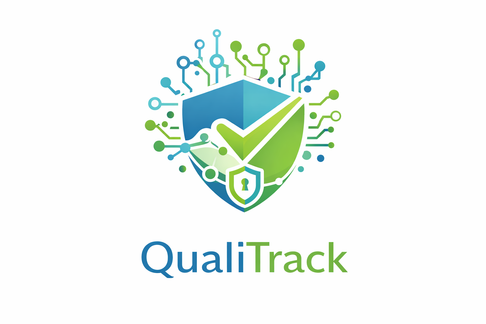
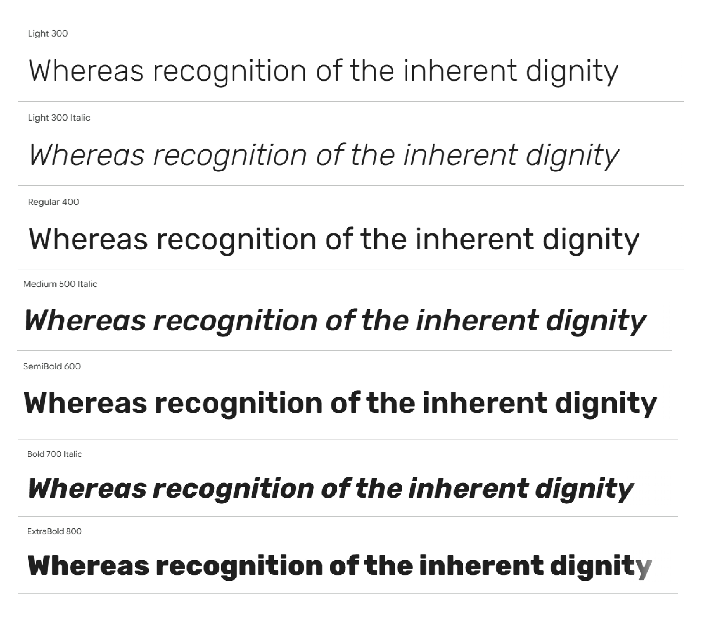
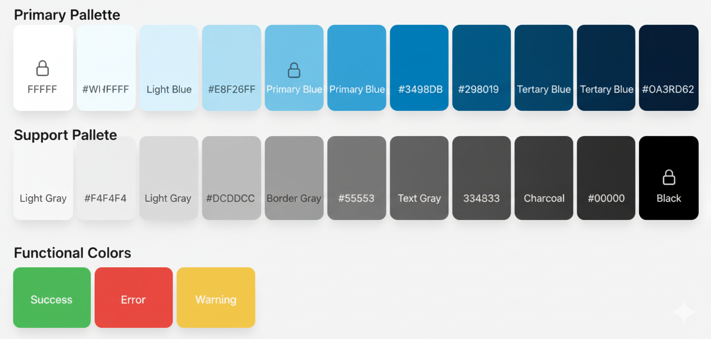

# Capítulo V: Solution UI/UX Design

En este capítulo se detallan las decisiones de diseño de producto para la plataforma QualiTrack y su respectiva Landing Page. Se establecen las guías de estilo visuales, la arquitectura de la información y los criterios que aseguran una experiencia de usuario (UX) intuitiva y profesional, alineada a las exigencias de la industria farmacéutica y entidades regulatorias como la DIGEMID.

## 5.1. Style Guidelines

### 5.1.1. General Style Guidelines

El diseño visual de la plataforma **QualiTrack** se rige por una estética limpia, tecnológica y de alta precisión, reflejando el compromiso de **IoTech** con la integridad de datos en la manufactura farmacéutica. El objetivo es proyectar un entorno de confianza y profesionalismo que minimice la carga cognitiva del usuario al monitorear variables críticas.

En este capítulo, detallaremos cada uno de los elementos visuales y de estilo que guían el desarrollo de la aplicación QualiTrack, siempre siguiendo los principios de Diseño de Experiencia de Usuario (UX) e Interfaz de Usuario (UI) para garantizar la máxima usabilidad y accesibilidad.

**Branding**

El logotipo principal de QualiTrack está compuesto por un isotipo que integra múltiples elementos semánticos de nuestro dominio técnico: El Escudo y la Cerradura representan la seguridad inquebrantable, la inmutabilidad de los registros y el cumplimiento regulatorio frente a DIGEMID. El check central Simboliza la aprobación de calidad (BPM) y la liberación de lotes de producción. Los Nodos de Circuitos evocan la automatización industrial y la conexión directa a los equipos mediante telemetría IoT. Y finalmente la tipografía del logo el nombre divide sus conceptos utilizando el azul tecnológico para la calidad y el verde de cumplimiento para la trazabilidad.

 

  

 

**Typography**

La tipografía empleada en QualiTrack será **Rubik**, con sus variantes Light, Regular, Medium, SemiBold, Bold y ExtraBold. La elección de Rubik se basa en su estética moderna y profesional, que se equilibra con una excelente legibilidad de datos numéricos en diversas resoluciones y dispositivos (móviles, tabletas, pantallas industriales). Además, su disponibilidad a través de Google Fonts asegura una carga eficiente y consistente.

La jerarquía tipográfica se establece de la siguiente manera para garantizar claridad y ritmo visual:

* **Títulos principales (H1/Sección heading):** 5rem (aprox. 50px) en escritorio, 4.5rem (aprox. 45px) en móvil.
* **Subtítulos (H2/Sub-headings):** 3rem (aprox. 30px) en escritorio.
* **Títulos de componentes (H3/H4):** 2rem (aprox. 20px) a 2.5rem (aprox. 25px).
* **Cuerpo del texto (p):** 1.6rem (aprox. 16px) con un interlineado de 1.6.
* **Botones y etiquetas (span):** 1.4rem (aprox. 14px) a 1.8rem (aprox. 18px).

  

Esta distribución garantiza un contraste óptimo entre el texto y el fondo, superando un ratio mínimo de 4.5:1 según las WCAG 2.1 AA para una accesibilidad superior en entornos de laboratorio.

 

**Colors**

Nuestra paleta de colores ha sido cuidadosamente seleccionada para evocar sensaciones de pulcritud, profesionalismo tecnológico y control. Se ha distribuido en tres categorías principales:

**Paleta principal**: Colores que definen la identidad de QualiTrack y se usan en elementos clave.
* **Primario (Verde Azulado / Teal QualiTrack):** var(--primary-color | #0D9488) (referencia principal).
* **Secundario (Azul Pizarra Oscuro):** var(--secondary-color | #0F172A) (para texto principal y elementos interactivos).
* **Terciario (Gris Pizarra):** var(--tertiary-color | #64748B) (para texto secundario y detalles).
* **Fondo Claro:** var(--bg-light) (fondos de secciones).
* **Fondo Blanco:** var(--white) (fondos de tarjetas y elementos principales).
  
**Paleta de Soporte**: Colores complementarios que añaden profundidad y contraste.
* **Gris Neutro:** Para bordes sutiles, líneas divisorias y fondos de alternancia.

**Colores Funcionales**: Reservados para comunicar estados específicos al usuario.
* **Éxito:** Verde (#4CAF50) para confirmaciones y acciones exitosas.
* **Error:** Rojo (#F44336) para alertas y mensajes de error.
* **Advertencia:** Amarillo (#FFC107) para notificaciones y avisos importantes.

  

Esta combinación cromática refleja los valores de nuestra marca y busca transmitir al público (laboratorios e instituciones como DIGEMID) una imagen de rigor científico, seguridad y trazabilidad inmutable.

 

**Spacing**

El espaciado en QualiTrack sigue un sistema de espaciado modular y consistente para garantizar un ritmo visual armonioso y una jerarquía clara en toda la interfaz. La consistencia en el espaciado ayuda a reducir la carga cognitiva del usuario y mejora la legibilidad de los reportes técnicos.

* **Espaciado Básico:** Usamos un espaciado base en el sistema de grid. Este valor es la unidad mínima y se multiplica para crear espacios más grandes.
* **Margen Interno (Padding) Generoso:** Las secciones principales de la página utilizan un padding vertical de 5rem (50px) para crear pausas visuales claras. Los contenedores de tarjetas o elementos secundarios usan padding más pequeños, como 3rem a 4rem (30px - 40px), para agrupar el contenido de forma lógica.
* **Espacio entre Elementos:** El espaciado entre elementos relacionados, como las tarjetas de planes o el bloque de características (features), varía entre 3rem (30px) y 5rem (50px). Esto mantiene una densidad de información adecuada sin abrumar visualmente al usuario frente a las métricas.
* **Line Height del Texto:** El interlineado del texto (line-height) está configurado en 1.6, lo que facilita la lectura de párrafos largos y evita que las líneas de datos se sientan demasiado juntas.

 

**Tono de Comunicación**

La voz y el tono de QualiTrack están diseñados para ser tan confiables y precisos como nuestra telemetría IoT. Nuestro objetivo es conectar con Jefes de Calidad e Inspectores Públicos de manera altamente profesional y técnica.

* **Tono: Formal y corporativo,** con un enfoque en la precisión. Buscamos proyectar autoridad y dominio sobre normativas regulatorias (BPM, Data Integrity), manteniendo la seriedad que exigen los laboratorios farmacéuticos.
* **Actitud: Resolutiva y segura.** El 90% de nuestra comunicación es orientada a la eficiencia y reducción de errores ("Eliminación del error humano", "Trazabilidad Inmutable"), mientras que el 10% restante es persuasiva, especialmente en los llamados a la acción para solicitar demos.
* **Lenguaje: Técnico y directo.** No evitamos la jerga de la industria, ya que nuestro usuario final la utiliza a diario (ej. LIMS, DIGEMID, Autoclaves, Telemetría). Nos enfocamos en los beneficios operativos que QualiTrack aporta a las líneas de producción.
* **Voz: Experta y vanguardista.** Posicionamos a QualiTrack como el estándar de la industria 4.0 en manufactura farmacéutica, siendo el escudo digital frente a las inspecciones regulatorias.

Este enfoque comunicacional busca generar confianza corporativa, asegurando a los laboratorios que están automatizando sus procesos de forma segura, y a las entidades de salud pública, que la plataforma garantiza la transparencia absoluta de los datos.

### 5.1.2. Web, Mobile and IoT Style Guidelines

**Web Style Guidelines**

Las directrices de estilo web de **QualiTrack** se centran en la precisión técnica, la inmutabilidad de los datos y la eficiencia operativa. Nuestro objetivo es crear una experiencia visual que refleje la misión de nuestra plataforma: digitalizar y automatizar el control de calidad farmacéutico con un diseño limpio, tecnológico y altamente funcional.

**1) Layout**

* **Sistema de Grid:** Utilizamos un diseño de cuadrícula flexible para garantizar que el contenido de QualiTrack se adapte perfectamente a cualquier resolución. Este enfoque permite que las tarjetas de telemetría y los planes de suscripción se ajusten dinámicamente, manteniendo el orden y la coherencia visual necesarios en un entorno industrial.
* **Headers y Footers:** El encabezado (header) es fijo en la parte superior, proporcionando acceso constante a la navegación principal y a los botones de acceso al sistema (*Sign In*, *Sign Up*). El pie de página (footer) es completo y funcional, centralizando los enlaces legales, información de contacto institucional y la suscripción a actualizaciones.
* **Cards:** Las tarjetas son el componente central de nuestra interfaz para estructurar información crítica. Se utilizan para destacar los pilares de nuestra oferta (IoT, *Compliance*, Auditorías) y los planes de precios. Cuentan con bordes redondeados y sombras suaves para darles una apariencia moderna y "elevada", facilitando la lectura de parámetros técnicos.

**2) Responsive Design**

* **Desktop:** La navegación principal es totalmente visible en la barra superior junto a las acciones de usuario. El contenido se presenta en múltiples columnas para un uso eficiente del espacio en monitores de estaciones de trabajo de laboratorio.
* **Tablet:** Los elementos de la cuadrícula se adaptan a un diseño de dos columnas. Los botones y campos táctiles mantienen un tamaño adecuado para facilitar la interacción con guantes o en movimiento.
* **Mobile:** La experiencia está optimizada para una sola columna. La navegación se desplaza a un menú desplegable, y todos los elementos interactivos son grandes y claros, ideales para supervisores que monitorean la planta desde dispositivos móviles.

**3) Interaction Design**

* **Botones:** Nuestros botones son llamativos y utilizan los colores de marca. Cuentan con efectos visuales lineales al pasar el cursor para confirmar la interactividad. El botón principal de llamado a la acción destaca claramente para incentivar la conversión.
* **Formularios:** El formulario de contacto en el pie de página es sencillo y directo, ofreciendo una guía visual rápida y coherente en toda la página.

**4) Images and Icons**

* **Imágenes:** Se utilizan fotografías de alta calidad que evocan el entorno farmacéutico moderno: científicos en laboratorios y plantas de manufactura digitalizadas. Las imágenes están optimizadas para carga rápida y refuerzan el mensaje de tecnología aplicada a la seguridad de la salud.
* **Íconos:** Empleamos un estilo lineal y minimalista. Estos íconos representan visualmente servicios críticos como la telemetría IoT (antena), gestión de lotes (matraz) y cumplimiento regulatorio (escudo), ofreciendo una guía visual rápida y coherente en toda la página.

**5) Repositorio Central**

* **Organización:** El proyecto sigue una estructura de archivos lógica y modular. Los activos visuales se encuentran en `public/assets/images`, los estilos en `public/assets/styles/style.css`, y la lógica interactiva en `public/assets/scripts/main.js`.
* **Versionado:** Usamos **Git** como sistema de control de versiones para gestionar los cambios en el código y asegurar que todo el equipo de ClosedSource trabaje sobre la versión más estable y actualizada del producto.
