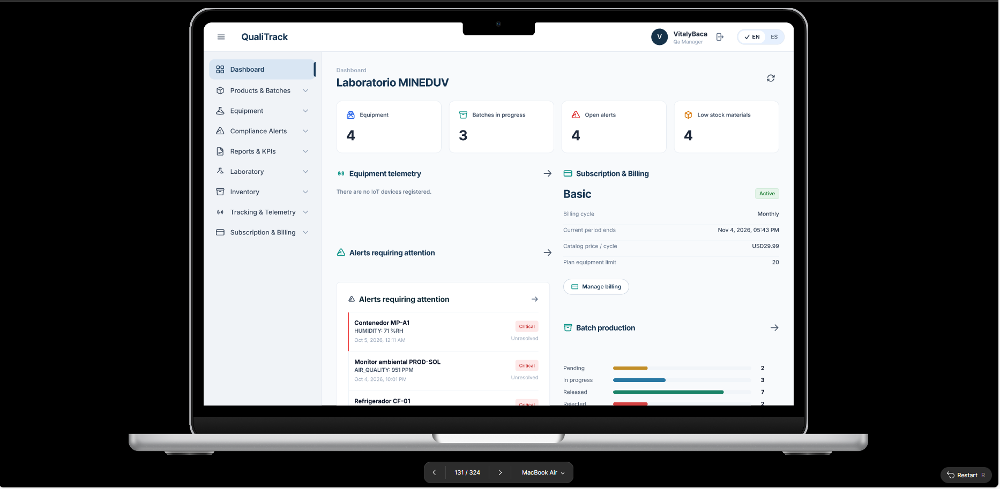
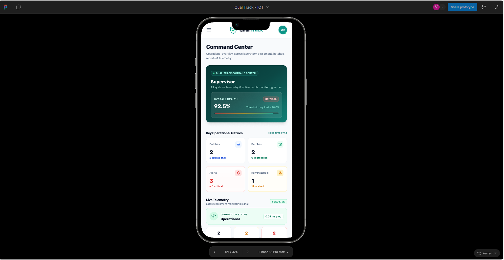

## 5.5. Applications Prototyping

En esta sección, se evidencian pruebas de uso del prototipo de la aplicación web y móvil. Además, se adjunta un video donde se usa el prototipo y las interacciones con el prototipo se basan en los User Flows descritos previamente.

Los prototipos se elaboraron en Figma a partir de los mock-ups de la sección 5.4.3 y se presentan en el modo de presentación de Figma, sobre un marco de MacBook Air para la aplicación web y de iPhone 13 Pro Max para la aplicación móvil. Sus pantallas están enlazadas entre sí, de modo que es posible recorrer los flujos de la aplicación como lo haría un usuario: desde el registro y la configuración inicial hasta la gestión de productos farmacéuticos, lotes de producción, personal, materias primas y ambientes. Estas pruebas permitieron validar la navegación y la consistencia visual antes de implementar las vistas de la Web Application en el Sprint 1.

**Enlace al prototipo en Figma:** https://shorturl.at/Dm9VA

**Prototipo de la aplicación web**

<em>Figura: Prototipo de la aplicación web en Figma. La vista muestra el Dashboard del responsable de calidad con los indicadores de equipos, lotes en progreso, alertas abiertas y materiales con bajo stock, las alertas que requieren atención, el resumen de la suscripción y el estado de la producción de lotes, junto con el menú lateral que da acceso a cada módulo y el selector de idioma.</em>

En el video de la aplicación web se recorren los User Flows de la sección 5.4.4: el registro y la configuración inicial, la gestión de productos farmacéuticos, de lotes de producción, de personal, de materias primas y de ambientes.

Link del video: https://bit.ly/4yGwGTr

**Prototipo de la aplicación movil**

<em>Figura: Prototipo de la aplicación móvil en Figma. La vista muestra el Command Center con el estado general del laboratorio, las métricas operativas de lotes, alertas y materias primas, y la sección de telemetría con el estado de conexión de los dispositivos, pensada para consultar la situación del laboratorio desde el celular.</em>

En el video de la aplicación móvil se recorren sus principales flujos de navegación, según los wireflows y mock-ups móviles de la sección 5.4.

Link del video: https://shorturl.at/pV2C9
