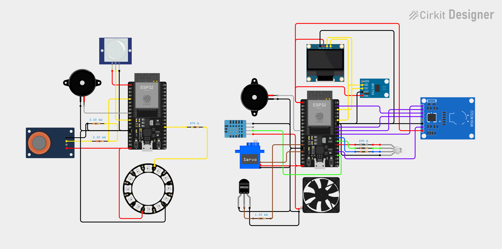
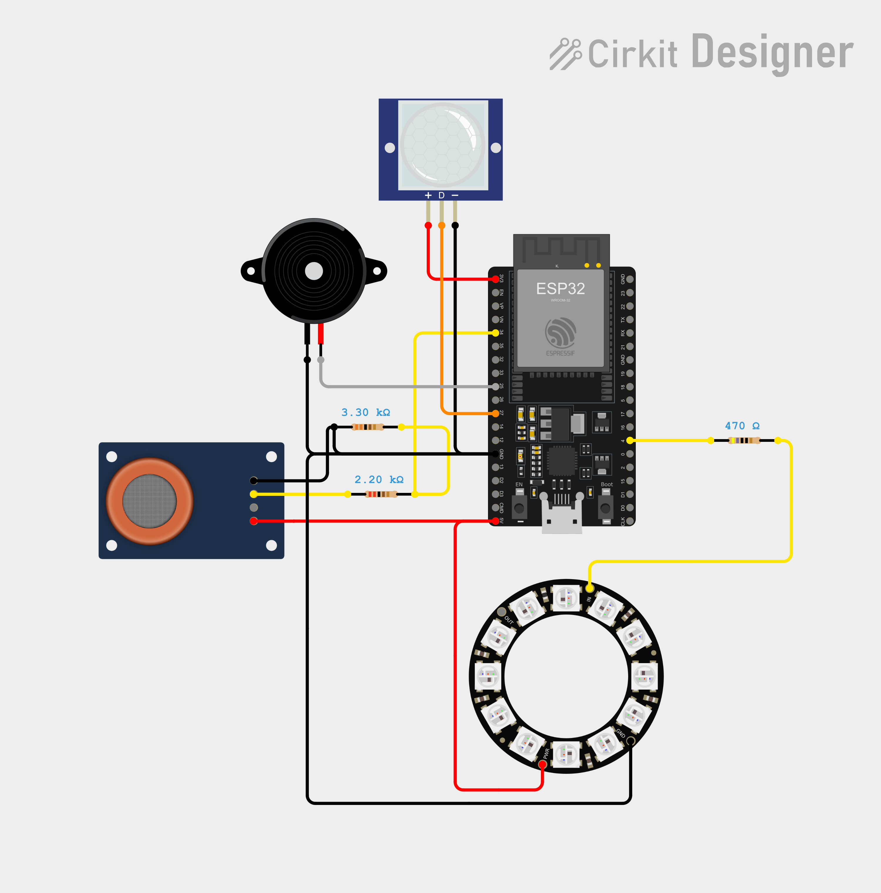
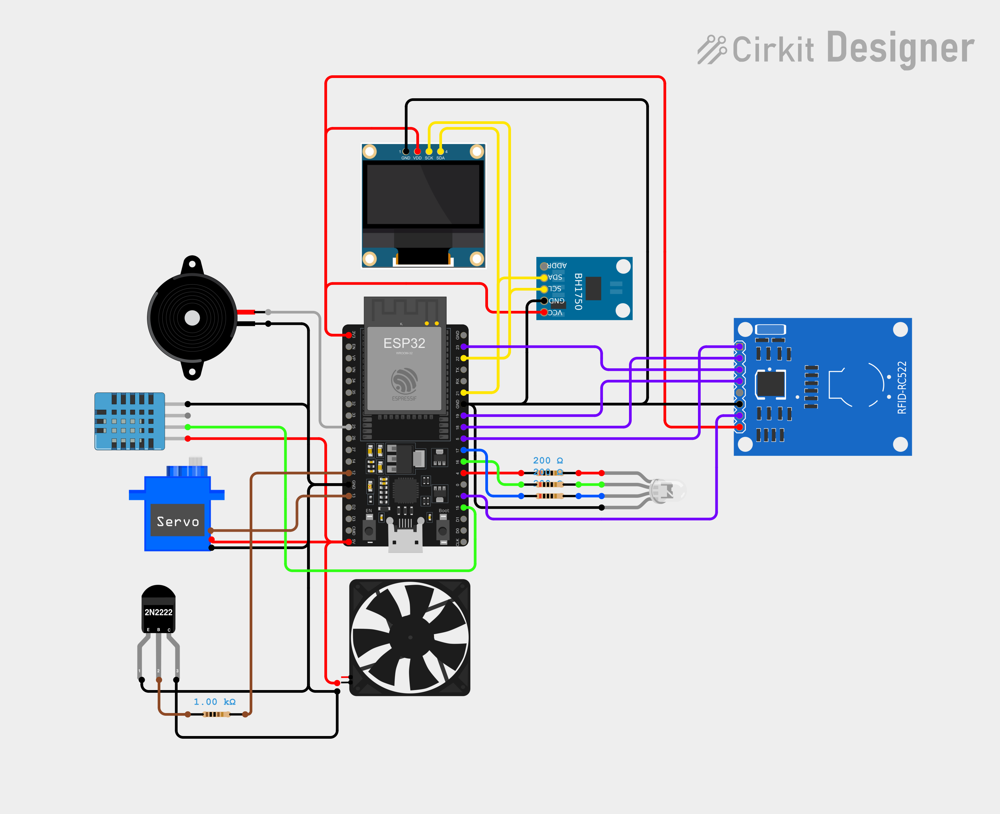
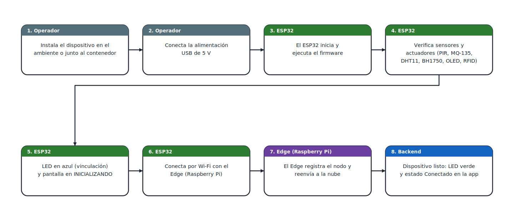
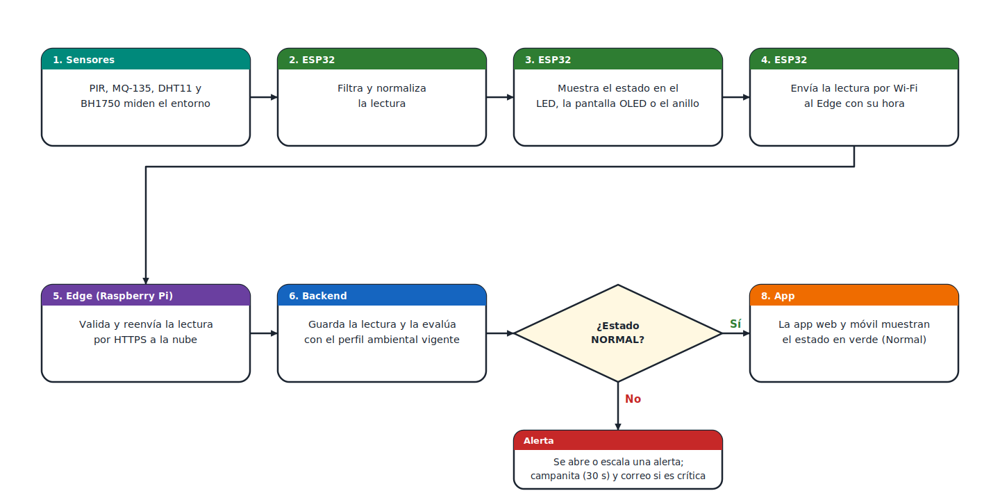
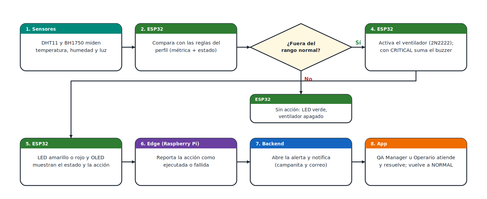
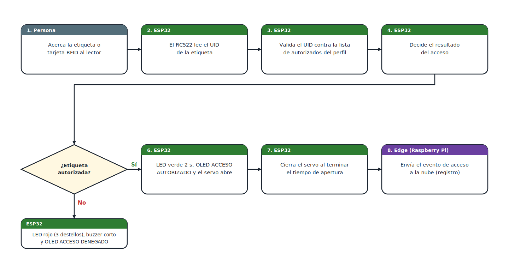

## 5.6. IoT Device Design

### Diseño de los dispositivos IoT

Además del diseño de experiencia e interfaces de las aplicaciones web y móvil, se detalla a continuación el diseño de los dispositivos IoT de QualiTrack. Estos dispositivos son responsables de capturar, procesar y transmitir las condiciones físicas de los laboratorios y almacenes farmacéuticos (calidad de aire, movimiento, temperatura, humedad y luz), de ejecutar acciones automáticas sobre los contenedores (ventilación y apertura controlada) y de registrar los accesos mediante RFID. La solución está compuesta por dos nodos con ESP32 (**Monitor de Ambiente** y **Monitor de Contenedor**) y un **Edge**, una Raspberry Pi 4 que recibe los datos de los nodos y los reenvía a la nube.

Para el diseño metodológico se adopta el enfoque de los 12 pasos propuesto por Balestrieri et al. (2021), aplicado **al conjunto de la solución IoT**. Las decisiones se relacionan con la arquitectura de información (estados `NORMAL`, `WARNING` y `CRITICAL`, perfil ambiental, alertas por incidente y estado de conexión *Requiere revisión*) y con la guía de estilos para las interfaces físicas de los dispositivos IoT (colores, patrones de LED, sonidos y pantalla OLED).

#### Paso 1: Definición de los requisitos del sistema

| Criterios | Especificación Técnica |
|---|---|
| **Capacidades de Suministro de Energía** | **Entorno de operación:** Los nodos operan de forma estática en interiores (laboratorio, almacén de materias primas y cámaras de frío), con acceso permanente a la red eléctrica. **Entrada de alimentación:** USB de 5 V. El Monitor de Ambiente requiere ≥ 1 A y el Monitor de Contenedor ≥ 2 A, por el pico del servo y del ventilador. **Restricciones:** Al contar con red eléctrica no se usan baterías ni energy harvesting. El Edge es una Raspberry Pi 4 alimentada con una fuente USB-C de 5 V / 3 A, conectada a la misma red local. |
| **Restricciones de Latencia (Time-Delay)** | **Muestreo periódico:** El Monitor de Ambiente envía una lectura cada 60 s y el Monitor de Contenedor cada 30 s. Cada lectura funciona además como señal de vida: si no hay lectura ni acción en 5 minutos, el dispositivo pasa a *Requiere revisión*. **Reacción local:** La señal local (LED, pantalla, buzzer) y la acción automática deben ejecutarse en ≤ 1 s desde que la lectura supera un umbral. **Transmisión de eventos críticos:** La latencia desde el nodo hasta el estado persistido en la nube debe ser menor a 2.0 s. |

#### Paso 2: Elección de la tipología de sistema IoT

| Parámetro de Clasificación | Estructura Definida | Justificación Técnica |
|---|---|---|
| **Suministro de Energía** | Alimentado por red (Network-Powered) | El laboratorio y el almacén cuentan con tomas de corriente junto a los puntos de instalación. |
| **Restricción de Retardo (Time-Delay)** | Tiempo real flexible (Soft Real-Time) | Un retraso de pocos segundos en la visualización no compromete la seguridad; lo crítico es que la acción local ocurra de inmediato y que quede registro con la hora de medición. |
| **Tipología Final** | **Network-powered Soft Real-Time IoT System con actuación local en lazo cerrado** | Cada nodo mide, evalúa las reglas del perfil y actúa (ventilador, servo, buzzer, LED) sin depender de la nube; el Edge y la nube centralizan el registro, las alertas y las notificaciones. |

#### Paso 3: Definición de requisitos para la capa física

| Parámetro | Definición y Requisitos Técnicos |
|---|---|
| **Configuración de Elementos** | **Monitor de Ambiente (1 por ambiente):** 1 ESP32.  Sensores: 1 sensor de movimiento (PIR) y 1 sensor MQ-135.  Actuadores: 1 anillo LED de 16 píxeles (Adafruit 12 NeoPixel Ring) y 1 buzzer. **Monitor de Contenedor (varios por ambiente):** 1 ESP32 por contenedor;  Sensores: 1 sensor de temperatura y humedad (DHT11), 1 Sensor de luz (BH1750) y lector RFID (RC522);  Actuadores: 1 ventilador (con transistor 2N2222), 1 servo de cierre, 1 LED RGB, 1 buzzer y 1 pantalla OLED de 0.96". |
| **Incertidumbre Objetivo (Target Uncertainty)** | **Sensor de temperatura:** ±2 °C en 0–50 °C. **Sensor de humedad:** ±5 % HR. **Sensor de Luz:** Resolución de 1 lux y ±20 % típico. **Calidad de aire:** Lectura indicativa para tendencias y umbrales; no es una medición metrológica certificada. **Sensor de Movimiento:** Detección binaria de presencia. |
| **Precisión del Actuador** | Servo con dos posiciones (abierto y cerrado) con error de ±5°. Ventilador con encendido y apagado y histéresis. Patrones de LED y buzzer con temporización de ±50 ms. La pantalla OLED se actualiza en ≤ 1 s tras un cambio de estado. |
| **Interfaces Digitales** | ADC de 12 bits (MQ-135), GPIO digital (PIR, transistor del ventilador, buzzer), bus de un solo hilo (DHT y anillo LED), I2C (OLED y BH1750), SPI (RC522) y PWM (servo). |
| **Capacidad de Procesamiento Local** | ESP32 de doble núcleo a 240 MHz con 520 KB de SRAM. Funciones requeridas en el firmware: 1) promedio móvil (ventana deslizante) para atenuar ruido; 2) evaluación de las reglas del perfil con histéresis; 3) validación de la etiqueta RFID; 4) patrones de LED y buzzer no bloqueantes; 5) envío de lecturas con la hora de medición. Tiempo de procesamiento local requerido: < 100 ms. |

#### Paso 4: Definición de requisitos para la capa de intercambio de datos

| Parámetro | Definición Técnica |
|---|---|
| **Latencia de Transporte Local** | El retraso desde el nodo hasta el Edge debe ser menor a 100 ms en condiciones normales de red. |
| **Medio Físico de Transmisión** | Inalámbrico, Wi-Fi 2.4 GHz (802.11 b/g/n), para evitar cableado de red dentro de las áreas controladas. |
| **Topología de Red** | Estrella: todos los nodos del laboratorio se conectan al punto de acceso, que los enlaza con el Edge. |
| **Rango Operativo** | Cobertura de 20 a 30 m en interiores. En cámaras frías metálicas debe verificarse la señal. |
| **Consumo Máximo de Potencia de Radio** | Hasta ≈ 250 mA durante la transmisión Wi-Fi del ESP32. La fuente debe sostener este pico junto con el servo y el ventilador sin caídas de tensión que alteren la lectura del MQ-135. |
| **Criptografía y Seguridad** | Red local con WPA2/WPA3. El Edge envía a la nube por HTTPS/TLS. Las lecturas y acciones del Edge no se duplican (mismo dispositivo, métrica y momento). Hoy el Edge usa la cuenta de un operario; las credenciales propias del dispositivo están pendientes. |

#### Paso 5: Definición de requisitos para la capa de información

| Criterios | Especificación de Capa |
|---|---|
| **Perfiles de Usuario** | **QA Manager:** define los perfiles ambientales, atiende y resuelve alertas, revisa lotes. **Operario:** opera el laboratorio, atiende y resuelve alertas, registra recepción y consumo de materiales. **Auditor:** consulta telemetría, alertas e historial en solo lectura. |
| **Distribución de Servicios** | **Monitoreo:** última lectura y gráfico de 24 h por métrica, con estado `NORMAL`, `WARNING` o `CRITICAL`. **Alertas:** una alerta por incidente, con escalamiento y registro de normalización. **Control de acceso:** registro de aperturas autorizadas y denegadas por RFID. **Acciones automáticas:** historial de acciones ejecutadas o fallidas con su causa. **Estado de conexión:** *Conectado* o *Requiere revisión* según la última lectura. |
| **Arquitectura de Procesamiento y Cómputo** | **En el nodo (ESP32):** adquisición, filtrado, evaluación de las reglas del perfil, control de actuadores y señales locales. **En el Edge (Raspberry Pi):** recepción de lecturas, validación del dispositivo, buffer, reenvío a la nube, descarga del perfil vigente y reporte de acciones. **En la nube (Spring Boot, MySQL):** evaluación de cada lectura contra el perfil, gestión de alertas, estado de conexión, notificaciones (campanita y correo) y reportes de auditoría. |

#### Paso 6: Definición de requisitos para la capa de servicios de aplicación

| Servicio | Especificación de la Interfaz | Complejidad del Cliente |
|---|---|---|
| **Visualización de Telemetría** | Pantalla *Telemetry Dashboard* con tarjetas por métrica (valor, estado, rangos normal y crítico y hora) y gráfico de las últimas 24 h con selector de métrica (Temperature, Humidity, Luminosity) y de rango (15 min, 1 h, 6 h). | **Baja:** renderizado pasivo de los datos del backend. |
| **Alertas** | Lista de alertas con severidad y estado (sin atender, atendida, resuelta) y acciones *Atender*, *Resolver* y envío de correo. Campanita con avisos cada 30 s. | **Baja:** consumo de API REST y renderizado. |
| **Perfiles y Dispositivos** | Gestión del perfil ambiental (cada cambio crea una versión que el Edge descarga) y registro de los dispositivos IoT con su identificador del Edge, serie y firmware. | **Media:** formularios con validación y versionado. |
| **Control de Acceso e Historial** | Historial de accesos RFID y de acciones automáticas, con filtros por contenedor y fecha. | **Media:** filtrado y ordenamiento de datos temporales. |
| **Reportes de Auditoría** | Reportes de telemetría, alertas e inventario para inspecciones BPM. | **Media:** consulta y exportación. |

#### Paso 7: Elección de la arquitectura de las capas de intercambio de datos y de información

**Selección Tecnológica de Arquitectura:**

* **Capa de Intercambio de Datos (Local):** Los nodos ESP32 envían sus lecturas por Wi-Fi a un servicio Edge que se ejecuta en una Raspberry Pi 4 (protocolo local **HTTP/JSON**, con MQTT como alternativa). El Edge guarda las lecturas pendientes y las reenvía cuando recupera la conexión, de modo que la operación local no depende de Internet.
* **Capa de Integración de Información (Nube):** Backend en **Spring Boot** con persistencia en **MySQL**. El Edge reenvía las lecturas y acciones por **HTTPS REST** y descarga el perfil ambiental vigente (Cloud → Edge).

**Análisis Detallado de Retardo en el Flujo de Datos:**

| Origen | Destino | Protocolo / Canal | Latencia Estimada (ms) | Acción Operativa |
|---|---|---|---|---|
| Nodo (ESP32) | Edge (Raspberry Pi) | HTTP sobre Wi-Fi local | 100 | Envío de la lectura con su hora de medición. |
| Edge (Raspberry Pi) | Servicio Edge | Local | 20 | Validación del dispositivo, deduplicación y puesta en cola. |
| Edge (Raspberry Pi) | Backend (Spring Boot) | HTTPS / WAN (REST) | 500 | Reenvío cifrado de la lectura a la nube. |
| Backend | MySQL | Conexión interna | 150 | Persistencia, evaluación contra el perfil y apertura o escalamiento de la alerta. |
| **Latencia total hasta el estado persistido** | | | **770 ms (0.77 s)** | Menor al límite de 2.0 s del Paso 1. |
| Backend | App web y móvil | HTTPS (consulta de la campanita) | hasta 30 000 | La campanita se actualiza cada 30 s; no forma parte del límite de 2.0 s. |

#### Paso 8: Elección de sensores y actuadores

| Parámetro Físico | Modelo de Componente | Justificación e Integración Técnica |
|---|---|---|
| **Movimiento** | Sensor PIR HC-SR501 | Salida digital con alcance de 3 a 7 m y consumo en reposo de microamperios. Se conecta a un GPIO del ESP32. |
| **Calidad de aire** | Módulo MQ-135 | Salida analógica sensible a amoníaco, benceno y otros gases. Su salida llega a 5 V, por lo que se reduce con un divisor resistivo (2.2 kΩ y 3.3 kΩ a tierra, ≈ 3.0 V) antes del ADC del ESP32. Requiere precalentamiento y calibración. |
| **Temperatura y humedad** | Sensor digital DHT11 | Salida de un solo hilo, económico y suficiente para rangos de laboratorio (±2 °C y ±5 % HR). Si la cadena de frío exige mayor exactitud, se reemplaza por un DHT22 sin cambiar el cableado. |
| **Luz** | Sensor BH1750 | Salida digital I2C con resolución de 1 lux, adecuada para detectar aperturas o exposición a luz en el contenedor. |
| **Identificación** | Lector RFID RC522 | Lee etiquetas de 13.56 MHz a corta distancia por SPI. Permite controlar quién abre cada contenedor. |
| **Interfaz Local** | Pantalla OLED SSD1306, LED RGB, anillo LED de 16 píxeles y buzzer | La OLED muestra el estado y los valores en el contenedor. El LED RGB y el anillo LED comunican el estado de un vistazo y el buzzer refuerza las alertas críticas. |
| **Actuación** | Servo SG90 y ventilador de 5 V con transistor 2N2222 | El servo abre o cierra el contenedor. El ventilador se conmuta con el transistor desde un GPIO (resistencia de base de 1 kΩ), ya que el pin no puede alimentarlo directamente. |

#### Paso 9: Elección del microcontrolador y transceptores de radio del dispositivo

| Rol en la Red | Modelo de Hardware | Transceptor Integrado | Justificación Metodológica |
|---|---|---|---|
| **Nodo Sensor (Ambiente y Contenedor)** | ESP32 DevKit | Wi-Fi 2.4 GHz (802.11 b/g/n) | SoC de 32 bits de doble núcleo con radio integrado, ADC de 12 bits y buses I2C, SPI, PWM y de un solo hilo. Sus 520 KB de SRAM permiten ejecutar a la vez el stack Wi-Fi, las lecturas y la lógica de reglas. |
| **Concentrador (Edge)** | Raspberry Pi 4 Model B | Wi-Fi de doble banda + Ethernet | Computadora de placa única de 1.5 GHz (ARM Cortex-A72) con capacidad para ejecutar el servicio Edge, recibir varios nodos en paralelo, guardar lecturas pendientes y reenviarlas por HTTPS a la nube. |

#### Paso 10: Definición de los algoritmos de procesamiento de datos

| Nombre del Algoritmo | Responsabilidad y Lógica | Nivel de Ubicación |
|---|---|---|
| **Filtrado por Promedio Móvil** | Atenúa el ruido de las lecturas analógicas (MQ-135) y de luz con una ventana de N muestras (N = 10): `Valor filtrado = (1/N) · Σ Sᵢ`. | Nodo (ESP32) |
| **Normalización de Variables** | Convierte la salida del DHT en °C y % HR validando su checksum, y la del BH1750 en lux. Descarta lecturas corruptas. | Nodo (ESP32) |
| **Estimación de Calidad de Aire** | Convierte el voltaje del MQ-135 (tras el divisor) en una lectura indicativa en ppm con una curva de calibración (relación Rs/R0). | Nodo (ESP32) |
| **Evaluación de Reglas con Histéresis** | Compara cada lectura con los rangos del perfil y aplica la regla *métrica + estado → acción*: `WARNING` activa el ventilador y `CRITICAL` suma el buzzer. La histéresis evita encendidos y apagados continuos. | Nodo (ESP32) |
| **Control de Acceso RFID** | Lee el UID de la etiqueta, lo valida contra la lista de autorizados y decide si el servo abre, por cuánto tiempo y qué señal local muestra. | Nodo (ESP32) |
| **Máquina de Estados de Señales** | Genera de forma no bloqueante los patrones de LED, anillo y buzzer según el estado del sistema. | Nodo (ESP32) |
| **Buffer y Reenvío (Store-and-Forward)** | Guarda las lecturas y acciones pendientes y las reenvía sin duplicar (mismo dispositivo, métrica y momento). Descarga el perfil vigente y lo propaga a los nodos. | Edge (Raspberry Pi) |
| **Evaluación de Estado y Alertas** | Clasifica cada lectura como `NORMAL`, `WARNING` o `CRITICAL`, abre una alerta por incidente, la escala si pasa a crítica y registra la normalización. | Nube (Backend) |
| **Verificación de Conexión** | Marca el dispositivo como *Conectado* si hubo una lectura o acción en los últimos 5 minutos; si no, *Requiere revisión*. | Nube (Backend) |

#### Paso 11: Análisis del esfuerzo computacional de los algoritmos

| Algoritmo | Complejidad Temporal (Big O) | Complejidad Espacial | Tiempo Estimado de Ejecución | Ubicación |
|---|---|---|---|---|
| Filtrado por promedio móvil | O(N) | O(N) (buffer de N muestras) | 10 ms | Nodo (ESP32) |
| Normalización de variables | O(1) | O(1) | 5 ms | Nodo (ESP32) |
| Estimación de calidad de aire | O(1) | O(1) | 5 ms | Nodo (ESP32) |
| Evaluación de reglas con histéresis | O(R), con R reglas del perfil | O(R) | 5 ms | Nodo (ESP32) |
| Control de acceso RFID | O(A), con A etiquetas autorizadas | O(A) | 30 ms | Nodo (ESP32) |
| Máquina de estados de señales | O(1) | O(1) | < 1 ms por ciclo | Nodo (ESP32) |
| Buffer y reenvío | O(1) por lectura | O(P), con P lecturas pendientes | 20 ms | Edge (Raspberry Pi) |
| Evaluación de estado y alertas | O(1) por lectura | O(1) | 150 ms | Nube (Backend) |
| Verificación de conexión | O(D), con D dispositivos | O(D) | 50 ms | Nube (Backend) |

**Justificación Técnica del Esfuerzo Computacional:**

* **Complejidad temporal:** el único algoritmo que crece con el número de muestras es el promedio móvil, O(N), con N = 10. El resto son comparaciones y operaciones aritméticas directas.
* **Tiempo de ejecución:** a 240 MHz, los cálculos locales toman pocos milisegundos. El tiempo dominante es la espera de los sensores (el DHT entrega una lectura cada 1 a 2 s), no la capacidad del microcontrolador.
* **Uso de memoria:** los búferes y las reglas del perfil ocupan una fracción mínima de los 520 KB de SRAM, lo que deja espacio para el stack Wi-Fi.
* **Rendimiento del Edge:** el servicio Edge solo valida, almacena y reenvía, por lo que una Raspberry Pi 4 atiende a varios nodos sin sobrecargarse.
* Los tiempos de esta tabla son estimaciones que deben validarse con mediciones en el firmware.

#### Paso 12: Definición de la interfaz de usuario gráfica

| Módulo de Interfaz | Plataformas de Visualización | Elementos Clave de la UI | Justificación Funcional |
|---|---|---|---|
| **Señalización Física** | Anillo LED, LED RGB, buzzer y pantalla OLED | Colores y patrones por estado (verde, amarillo, rojo, azul), sonido de alerta y valores con estado en la OLED. | Permite al Operario conocer el estado de un vistazo, incluso con poca luz y sin abrir la aplicación. |
| **Telemetry Dashboard** | Aplicación móvil y web | Tarjetas por métrica con estado y rangos; gráfico de 24 h con selectores de métrica y rango. | Muestra la última lectura y la tendencia frente a los rangos normal y crítico. |
| **Alertas y Campanita** | Aplicación móvil y web | Lista de alertas con severidad y estado, acciones *Atender* y *Resolver*, contador de avisos. | Concentra la atención de incidentes y deja trazabilidad de quién actuó. |
| **Gestión de Dispositivos y Perfiles** | Aplicación web | Registro de dispositivos IoT, estado *Conectado* o *Requiere revisión*, edición de perfiles ambientales. | Permite configurar el sistema sin intervenir el firmware. |
| **Historial de Accesos y Acciones** | Aplicación web | Eventos de apertura autorizada o denegada y acciones automáticas con su resultado. | Aporta evidencia para auditorías BPM. |

### Diseño físico y de circuito de los dispositivos IoT

Por otro lado, se presenta la propuesta de diseño físico y de circuito de los dispositivos IoT, la cual muestra los componentes utilizados y cómo se conectan con el ESP32 de cada nodo.

**Diseño del circuito:**

En la siguiente imagen, elaborada en Cirkit Designer, se muestran los dos nodos de la solución. A la izquierda, el **Monitor de Ambiente** (PIR, MQ-135, buzzer y anillo LED). A la derecha, el **Monitor de Contenedor** (OLED, BH1750, RC522, DHT, servo, ventilador con transistor, LED RGB y buzzer).

  

**Conexiones del Monitor de Ambiente:**

| Componente | Pin del componente | Conexión en el ESP32 | Observación |
|---|---|---|---|
| Sensor PIR | VCC / D / GND | 3V3 / GPIO 27 / GND | Salida digital de presencia. |
| MQ-135 | VCC / AO / GND | 5V / GPIO 34 / GND | AO pasa por un divisor de 2.2 kΩ y 3.3 kΩ a tierra (≈ 3.0 V). DO queda sin conexión. |
| Buzzer | + / − | GPIO 25 / GND | Sonido de alerta. |
| Anillo LED de 16 píxeles | 5V / DIN / GND | 5V / GPIO 4 (con 470 Ω) / GND | La resistencia protege la línea de datos. |

**Conexiones del Monitor de Contenedor:**

| Componente | Pin del componente | Conexión en el ESP32 | Observación |
|---|---|---|---|
| Pantalla OLED SSD1306 | VDD / SCK / SDA / GND | 3V3 / GPIO 22 / GPIO 21 / GND | Bus I2C compartido. |
| Sensor BH1750 | VCC / SCL / SDA / GND | 3V3 / GPIO 22 / GPIO 21 / GND | ADDR sin conexión (dirección 0x23). |
| Lector RC522 | 3.3V / GND / MOSI / MISO / SCK / SDA / RST | 3V3 / GND / GPIO 23 / 19 / 18 / 5 / 2 | Bus SPI. |
| Sensor DHT | VCC / DATA / GND | 5V / GPIO 15 / GND | Temperatura y humedad. |
| Servo | Señal / VCC / GND | GPIO 13 / 5V / GND | Cierre del contenedor. |
| Ventilador 5 V | + / − | 5V / colector del 2N2222 | Emisor del 2N2222 a GND. |
| Transistor 2N2222 | Base | GPIO 12 (con 1 kΩ) | Conmutación del ventilador. |
| LED RGB (cátodo común) | R / G / B / GND | GPIO 4 / 16 / 17 (con 200 Ω cada uno) / GND | Señal de estado. |
| Buzzer | + / − | GPIO 25 / GND | Sonido de alerta y de acceso denegado. |

El **Edge** (Raspberry Pi 4) no requiere circuito adicional: se alimenta por USB-C y se comunica con los nodos y la nube por Wi-Fi o Ethernet.

**Observaciones de diseño para validar antes de armar el prototipo:**

* Los pines GPIO 2, 12 y 15 son *strapping pins* del ESP32: deben estar en un nivel definido durante el arranque. Si el RC522 o el transistor causan problemas al iniciar, se pueden mover a otros GPIO libres (por ejemplo, GPIO 14 o 27).
* El anillo LED a máximo brillo puede consumir cerca de 1 A. Se recomienda limitar el brillo y usar una fuente de al menos 2 A.
* El servo y el ventilador se alimentan desde el pin de 5 V del ESP32; si hay reinicios, se deben usar una fuente suficiente y un condensador de desacople.

**Diseño físico:**

El Monitor de Ambiente se plantea como una carcasa compacta de montaje en pared o techo, con el sensor PIR al centro rodeado por el anillo LED de estado, aberturas de ventilación laterales para el MQ-135 y la rejilla del buzzer en la parte inferior. El Monitor de Contenedor se plantea como un módulo para montar sobre o junto al contenedor, con la pantalla OLED al frente, la zona del lector RFID junto al indicador del servo, el LED de estado en la parte superior y una rejilla de aire para el ventilador. La alimentación USB de 5 V se ubica en un lateral de cada carcasa.

  

  

### Flujos de interacción de los dispositivos IoT

Los flujos de interacción representan la forma en que las personas, el hardware y el sistema QualiTrack se relacionan durante la operación diaria. Permiten evidenciar que el diseño responde también a decisiones de instalación, monitoreo, control de acceso y atención de alertas.

**Flujo 1: Instalación y encendido de los dispositivos IoT**

Describe la puesta en marcha: el operador instala el dispositivo, lo conecta a la alimentación, el ESP32 verifica sus componentes y se vincula con el Edge, que registra el nodo y lo reenvía a la nube.

  

**Flujo 2: Monitoreo normal del entorno**

Representa el funcionamiento habitual: los sensores miden, el ESP32 filtra y envía la lectura al Edge, la nube la evalúa con el perfil vigente y la aplicación muestra el estado. Si el estado no es normal, se abre o escala una alerta.

  

**Flujo 3: Acción automática por desviación en el contenedor**

Muestra cómo el Monitor de Contenedor reacciona cuando la temperatura, la humedad o la luz salen del rango normal: activa el ventilador (y el buzzer si es crítico), informa la acción al Edge y la nube abre la alerta para que el personal la atienda.

  

**Flujo 4: Control de acceso por RFID**

Describe la apertura controlada del contenedor: el lector RFID lee la etiqueta, el ESP32 la valida y, según el resultado, abre el servo con señal verde o mantiene el contenedor cerrado con señal roja y buzzer. El evento se registra en la nube.

  

