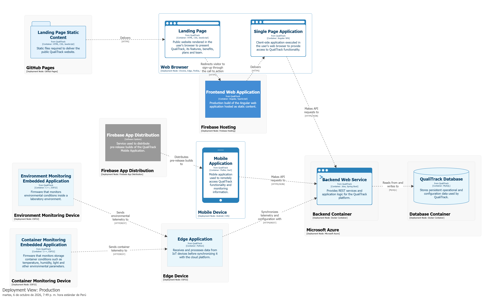

# Capítulo VI: Product Implementation, Validation & Deployment

## 6.1. Software Configuration Management
En esta sección se establecen las decisiones, convenciones y herramientas utilizadas por el equipo ClosedSource para gestionar de manera consistente el desarrollo, integración y despliegue de los diferentes productos digitales que conforman QualiTrack. La solución IoT está compuesta por seis productos principales: Landing Page, Web Application, Mobile Application, Backend Web Service, Edge Application y Embedded Application.

Durante el ciclo de vida del proyecto se definen prácticas para el control y organización del código fuente, la configuración de los entornos de desarrollo y la preparación de los entornos de despliegue correspondientes a cada producto. Estas decisiones permiten mantener la trazabilidad de los cambios realizados durante los sprints, facilitar el trabajo colaborativo entre los miembros del equipo y asegurar una integración progresiva entre las diferentes capas y componentes de la solución QualiTrack.

### 6.1.1. Software Development Environment Configuration

En esta sección se presentan las herramientas utilizadas durante el ciclo de vida del proyecto QualiTrack. Estas herramientas permiten la colaboración entre los miembros del equipo en las actividades de gestión, diseño, desarrollo, pruebas, documentación y despliegue de los diferentes productos digitales que conforman la solución IoT.

Las herramientas se organizan según las siguientes disciplinas:

1. Project Management
2. Requirements Management
3. Product UX/UI Design
4. Software Development
5. Software Testing
6. Software Documentation
7. Software Deployment

#### Project Management

Esta disciplina se centra en la planificación, seguimiento y control del trabajo realizado por el equipo durante los sprints.

<ul>
  <li>
    <strong>Jira:</strong> Herramienta utilizada para organizar el Product Backlog, registrar User Stories y Technical Stories, planificar Sprints y realizar seguimiento del estado de los work-items del equipo. 
    <strong>Ruta de referencia:</strong>
    <a href="https://www.atlassian.com/software/jira" target="_blank">
      https://www.atlassian.com/software/jira
    </a>
  </li>
  <li>
    <strong>Trello:</strong> Herramienta visual utilizada como board de apoyo para mostrar el avance de tareas durante los sprints y evidenciar el estado del trabajo realizado por el equipo. 
    <strong>Ruta de referencia:</strong>
    <a href="https://trello.com" target="_blank">
      https://trello.com
    </a>
  </li>
</ul>

#### Requirements Management

La gestión de requisitos permite documentar las necesidades de los segmentos objetivo, definir User Stories, Technical Stories y criterios de aceptación asociados con las funcionalidades y características de calidad de QualiTrack.

<ul>
  <li>
    <strong>Markdown:</strong> Lenguaje utilizado para redactar el Product Backlog, Sprint Backlog, evidencias de implementación y documentación del proyecto dentro del Project Report. 
    <strong>Ruta de referencia:</strong>
    <a href="https://www.markdownguide.org/" target="_blank">
      https://www.markdownguide.org/
    </a>
  </li>
  <li>
    <strong>Gherkin:</strong> Lenguaje utilizado para redactar criterios de aceptación en formato Given-When-Then, facilitando la especificación del comportamiento esperado de las User Stories. 
    <strong>Ruta de referencia:</strong>
    <a href="https://cucumber.io/docs/gherkin/" target="_blank">
      https://cucumber.io/docs/gherkin/
    </a>
  </li>
</ul>

#### Product UX/UI Design

El diseño de experiencia de usuario y de interfaz permite definir la propuesta visual de QualiTrack para los diferentes productos que interactúan directamente con sus usuarios, incluyendo la Landing Page, la Web Application y la Mobile Application.

<ul>
  <li>
    <strong>Figma:</strong> Herramienta utilizada para la elaboración de wireframes, mock-ups y prototipos de la Landing Page, Web Application y Mobile Application. 
    <strong>Ruta de referencia:</strong>
    <a href="https://www.figma.com/" target="_blank">
      https://www.figma.com/
    </a>
  </li>
  <li>
    <strong>Miro:</strong> Herramienta colaborativa utilizada para actividades de análisis, identificación de bounded contexts y organización visual de ideas relacionadas con el dominio de la solución. 
    <strong>Ruta de referencia:</strong>
    <a href="https://miro.com/" target="_blank">
      https://miro.com/
    </a>
  </li>
  <li>
    <strong>UXPressia:</strong> Herramienta utilizada para trabajar artefactos de entendimiento del usuario, como User Personas, Empathy Maps, Customer Journey Maps e Impact Maps. 
    <strong>Ruta de referencia:</strong>
    <a href="https://uxpressia.com/" target="_blank">
      https://uxpressia.com/
    </a>
  </li>
  <li>
    <strong>Lucidchart:</strong> Herramienta utilizada para elaborar diagramas de apoyo arquitectónico y de modelado, incluyendo diagramas de clases y diagramas de base de datos. 
    <strong>Ruta de referencia:</strong>
    <a href="https://www.lucidchart.com/" target="_blank">
      https://www.lucidchart.com/
    </a>
  </li>
</ul>

#### Software Development

El desarrollo de QualiTrack comprende la implementación de los diferentes productos digitales que conforman la solución IoT: Landing Page, Web Application, Mobile Application, Backend Web Services, Edge Application y Embedded Application. Cada producto utiliza tecnologías y entornos de desarrollo especializados según sus responsabilidades dentro de la arquitectura.

<ul>
  <li>
    <strong>GitHub:</strong> Plataforma utilizada para alojar los repositorios del proyecto, administrar el control de versiones y mantener la trazabilidad de los cambios realizados sobre los diferentes productos digitales de QualiTrack. 
    <strong>Ruta de referencia:</strong>
    <a href="https://github.com" target="_blank">
      https://github.com
    </a> 
    <strong>Organización del proyecto:</strong>
    <a href="https://github.com/ClosedSource-11848" target="_blank">
      https://github.com/ClosedSource-11848
    </a>
  </li>
  <li>
    <strong>WebStorm:</strong> IDE utilizado para el desarrollo de la Web Application con Angular, TypeScript, HTML y CSS. 
    <strong>Ruta de descarga:</strong>
    <a href="https://www.jetbrains.com/webstorm/" target="_blank">
      https://www.jetbrains.com/webstorm/
    </a>
  </li>
  <li>
    <strong>IntelliJ IDEA:</strong> IDE utilizado para el desarrollo del Backend Web Service implementado con Java y Spring Boot. 
    <strong>Ruta de descarga:</strong>
    <a href="https://www.jetbrains.com/idea/" target="_blank">
      https://www.jetbrains.com/idea/
    </a>
  </li>
  <li>
    <strong>CLion:</strong> IDE utilizado para el desarrollo de la Embedded Application de QualiTrack. Permite implementar, compilar y depurar el software ejecutado por los dispositivos embebidos que forman parte de la solución IoT. 
    <strong>Ruta de descarga:</strong>
    <a href="https://www.jetbrains.com/clion/download/" target="_blank">
      https://www.jetbrains.com/clion/download/
    </a>
  </li>
  <li>
    <strong>PyCharm:</strong> IDE utilizado para el desarrollo de la Edge Application de QualiTrack mediante Python, permitiendo implementar y depurar los componentes de software ejecutados en la capa Edge de la solución. 
    <strong>Ruta de descarga:</strong>
    <a href="https://www.jetbrains.com/pycharm/download/" target="_blank">
      https://www.jetbrains.com/pycharm/download/
    </a>
  </li>
  <li>
    <strong>Flutter:</strong> Framework utilizado para implementar la Mobile Application de QualiTrack a partir de una única base de código, permitiendo desarrollar las interfaces y funcionalidades destinadas al acceso móvil a la solución. 
    <strong>Ruta de descarga:</strong>
    <a href="https://docs.flutter.dev/install" target="_blank">
      https://docs.flutter.dev/install
    </a>
  </li>
  <li>
    <strong>Angular:</strong> Framework utilizado para implementar la Single Page Application correspondiente a la Web Application de QualiTrack, incluyendo componentes, rutas, servicios y consumo de APIs REST. 
    <strong>Ruta de referencia:</strong>
    <a href="https://angular.dev/" target="_blank">
      https://angular.dev/
    </a>
  </li>
  <li>
    <strong>Spring Boot:</strong> Framework utilizado para implementar los servicios REST del backend y organizar la lógica correspondiente a los diferentes bounded contexts de QualiTrack. 
    <strong>Ruta de referencia:</strong>
    <a href="https://spring.io/projects/spring-boot" target="_blank">
      https://spring.io/projects/spring-boot
    </a>
  </li>
  <li>
    <strong>Spring Security:</strong> Framework utilizado para proteger los endpoints del backend mediante mecanismos de autenticación y autorización. 
    <strong>Ruta de referencia:</strong>
    <a href="https://spring.io/projects/spring-security" target="_blank">
      https://spring.io/projects/spring-security
    </a>
  </li>
  <li>
    <strong>MySQL:</strong> Sistema gestor de base de datos relacional utilizado para la persistencia de la información administrada por el Backend Web Service de QualiTrack. 
    <strong>Ruta de referencia:</strong>
    <a href="https://www.mysql.com/" target="_blank">
      https://www.mysql.com/
    </a>
  </li>
  <li>
    <strong>Stripe:</strong> Plataforma utilizada para implementar el flujo de suscripción y pago mediante Stripe Checkout en modo de prueba. 
    <strong>Ruta de referencia:</strong>
    <a href="https://stripe.com/" target="_blank">
      https://stripe.com/
    </a>
  </li>
</ul>

#### Software Testing

Las pruebas y validaciones de QualiTrack comprenden la revisión del comportamiento de sus diferentes productos digitales, la ejecución de los principales flujos funcionales, la inspección de las comunicaciones HTTP y la validación de la información persistida.

<ul>
  <li>
    <strong>Swagger UI:</strong> Herramienta utilizada para probar los endpoints REST del backend, revisar los contratos de request y response y validar los recursos documentados mediante OpenAPI. 
    <strong>Ruta de referencia:</strong>
    <a href="https://swagger.io/tools/swagger-ui/" target="_blank">
      https://swagger.io/tools/swagger-ui/
    </a>
  </li>
  <li>
    <strong>Chrome DevTools:</strong> Herramienta utilizada para inspeccionar requests, responses, errores de comunicación, carga de recursos y comportamiento de la Web Application desde el navegador. 
    <strong>Ruta de referencia:</strong>
    <a href="https://developer.chrome.com/docs/devtools/" target="_blank">
      https://developer.chrome.com/docs/devtools/
    </a>
  </li>
  <li>
    <strong>MySQL Workbench:</strong> Herramienta utilizada para consultar y validar los datos persistidos por la aplicación durante las pruebas funcionales. 
    <strong>Ruta de descarga:</strong>
    <a href="https://www.mysql.com/products/workbench/" target="_blank">
      https://www.mysql.com/products/workbench/
    </a>
  </li>
</ul>

#### Software Documentation

La documentación permite describir la arquitectura, endpoints, diagramas, decisiones de diseño y evidencias de desarrollo de los diferentes componentes del proyecto.

<ul>
  <li>
    <strong>OpenAPI Specification / Swagger:</strong> Estándar utilizado para documentar los servicios REST proporcionados por el Backend Web Service de QualiTrack. 
    <strong>Ruta de referencia:</strong>
    <a href="https://swagger.io/specification/" target="_blank">
      https://swagger.io/specification/
    </a>
  </li>
  <li>
    <strong>PlantUML:</strong> Herramienta utilizada para representar diagramas de clases, diagramas de base de datos y otros diagramas asociados con la arquitectura de la solución. 
    <strong>Ruta de referencia:</strong>
    <a href="https://plantuml.com/" target="_blank">
      https://plantuml.com/
    </a>
  </li>
  <li>
    <strong>Markdown:</strong> Lenguaje utilizado para redactar el Project Report y mantener documentación versionada junto con los repositorios del proyecto. 
    <strong>Ruta de referencia:</strong>
    <a href="https://www.markdownguide.org/" target="_blank">
      https://www.markdownguide.org/
    </a>
  </li>
</ul>

#### Software Deployment

El despliegue de QualiTrack utiliza servicios diferenciados de acuerdo con las características de cada producto digital que forma parte de la solución.

<ul>
  <li>
    <strong>GitHub Pages:</strong> Servicio utilizado para desplegar públicamente la Landing Page de QualiTrack. 
    <strong>Ruta de referencia:</strong>
    <a href="https://pages.github.com/" target="_blank">
      https://pages.github.com/
    </a>
  </li>
  <li>
    <strong>Firebase Hosting:</strong> Servicio utilizado para desplegar la Web Application desarrollada con Angular. 
    <strong>Ruta de referencia:</strong>
    <a href="https://firebase.google.com/products/hosting" target="_blank">
      https://firebase.google.com/products/hosting
    </a>
  </li>
  <li>
    <strong>Firebase App Distribution:</strong> Servicio utilizado para distribuir versiones de prueba de la Mobile Application desarrollada con Flutter entre los miembros del equipo y usuarios autorizados para realizar pruebas. Permite administrar y entregar builds pre-release de la aplicación antes de una eventual publicación en una tienda de aplicaciones. 
    <strong>Ruta de referencia:</strong>
    <a href="https://firebase.google.com/docs/app-distribution" target="_blank">
      https://firebase.google.com/docs/app-distribution
    </a>
  </li>
  <li>
    <strong>Render:</strong> Plataforma utilizada para desplegar el Backend Web Service de QualiTrack. 
    <strong>Ruta de referencia:</strong>
    <a href="https://render.com/" target="_blank">
      https://render.com/
    </a>
  </li>
  <li>
    <strong>Railway:</strong> Plataforma utilizada para desplegar la base de datos MySQL utilizada por QualiTrack. 
    <strong>Ruta de referencia:</strong>
    <a href="https://railway.com/" target="_blank">
      https://railway.com/
    </a>
  </li>
</ul>

### 6.1.2. Source Code Management

El código fuente del proyecto QualiTrack se organiza en repositorios independientes con el propósito de facilitar el seguimiento de modificaciones, la revisión del código y la gestión del ciclo de vida de cada uno de los productos digitales que conforman la solución IoT. GitHub es utilizado como plataforma de colaboración y alojamiento de los repositorios, mientras que Git se emplea como sistema distribuido de control de versiones.

<h4>Repositorios del Proyecto</h4>

Los repositorios del proyecto se encuentran centralizados dentro de la organización <strong>IoTech-2620-8741</strong> en GitHub:
<a href="https://github.com/IoTech-2620-8741" target="_blank">
https://github.com/IoTech-2620-8741
</a>.

<table>
  <thead>
    <tr>
      <th>Producto</th>
      <th>URL del Repositorio</th>
    </tr>
  </thead>
  <tbody>
    <tr>
      <td>Project Report</td>
      <td>
        <a href="https://github.com/IoTech-2620-8741/qualitrack-report" target="_blank">
          https://github.com/IoTech-2620-8741/qualitrack-report
        </a>
      </td>
    </tr>
    <tr>
      <td>Landing Page</td>
      <td>
        <a href="https://github.com/IoTech-2620-8741/qualitrack-landing-page" target="_blank">
          https://github.com/IoTech-2620-8741/qualitrack-landing-page
        </a>
      </td>
    </tr>
    <tr>
      <td>Web Application</td>
      <td>
        <a href="https://github.com/IoTech-2620-8741/qualitrack-web-app" target="_blank">
          https://github.com/IoTech-2620-8741/qualitrack-web-app
        </a>
      </td>
    </tr>
  </tbody>
</table>

<h4>GitFlow Workflow</h4>

El equipo adopta GitFlow como workflow de control de versiones para organizar el desarrollo de cada producto de QualiTrack. Esta estrategia permite separar las versiones estables del producto, el trabajo de integración, el desarrollo de nuevas funcionalidades, la preparación de releases y las correcciones urgentes realizadas sobre versiones publicadas.

El workflow se aplica de manera independiente en los repositorios correspondientes a los diferentes productos del proyecto.

<strong>Ramas principales:</strong>

<ul>
  <li>
    <strong><code>main</code>:</strong> Rama principal que contiene las versiones estables y desplegables de cada producto. El código integrado en esta rama debe corresponder a una versión preparada para ser utilizada en los entornos de despliegue definidos por el equipo.
  </li>
  <li>
    <strong><code>develop</code>:</strong> Rama de integración que contiene las funcionalidades completadas para la siguiente versión del producto. Las nuevas funcionalidades se integran primero en esta rama antes de formar parte de una release.
  </li>
</ul>

<strong>Ramas de soporte:</strong>

<ul>
  <li>
    <strong><code>feature/&lt;scope&gt;-&lt;functionality&gt;</code>:</strong>
    Ramas utilizadas para desarrollar nuevas funcionalidades. Se crean a partir de
    <code>develop</code> y, una vez completadas y revisadas, se integran nuevamente en
    <code>develop</code>.
      
    Ejemplos:
    <code>feature/equipment-monitoring</code>,
    <code>feature/batch-management</code>,
    <code>feature/mobile-alerts</code>,
    <code>feature/edge-telemetry</code>.
      
  </li>

  <li>
    <strong><code>release/&lt;version&gt;</code>:</strong>
    Ramas utilizadas para preparar una nueva versión estable del producto. Se crean a partir de <code>develop</code> cuando las funcionalidades previstas para la versión han sido completadas.
      
    Ejemplos:
    <code>release/1.0.0</code>,
    <code>release/1.1.0</code>.
      
    Una vez validada la versión, la rama se integra en <code>main</code> y posteriormente los cambios necesarios se sincronizan nuevamente con <code>develop</code>.
      
  </li>

  <li>
    <strong><code>hotfix/&lt;version&gt;-&lt;issue&gt;</code>:</strong>
    Ramas utilizadas para realizar correcciones urgentes sobre una versión estable existente. Se crean a partir de <code>main</code> y utilizan una nueva versión de tipo PATCH.
      
    Ejemplos:
    <code>hotfix/1.0.1-authentication-error</code>,
    <code>hotfix/1.1.1-telemetry-validation</code>.
      
    Una vez finalizada la corrección, sus cambios se integran tanto en <code>main</code> como en <code>develop</code> para evitar que el defecto vuelva a aparecer en versiones posteriores.
  </li>
</ul>

<h4>Conventional Commits</h4>

El equipo utiliza la especificación Conventional Commits para mantener mensajes de commit claros, consistentes y trazables en los distintos repositorios de QualiTrack. La estructura general utilizada es:

<pre><code>&lt;type&gt;[optional scope]: &lt;description&gt;</code></pre>

El <code>type</code> identifica la naturaleza del cambio realizado, mientras que el
<code>scope</code> permite indicar opcionalmente el módulo, bounded context o componente afectado.

<table>
  <thead>
    <tr>
      <th>Tipo</th>
      <th>Descripción</th>
    </tr>
  </thead>
  <tbody>
    <tr>
      <td><code>feat</code></td>
      <td>Incorporación de una nueva funcionalidad al producto.</td>
    </tr>
    <tr>
      <td><code>fix</code></td>
      <td>Corrección de un error o comportamiento incorrecto.</td>
    </tr>
    <tr>
      <td><code>docs</code></td>
      <td>Cambios relacionados únicamente con documentación.</td>
    </tr>
    <tr>
      <td><code>style</code></td>
      <td>Cambios de formato que no modifican el comportamiento del software.</td>
    </tr>
    <tr>
      <td><code>refactor</code></td>
      <td>Modificación interna del código que no agrega funcionalidades ni corrige errores.</td>
    </tr>
    <tr>
      <td><code>test</code></td>
      <td>Creación, modificación o corrección de pruebas.</td>
    </tr>
    <tr>
      <td><code>build</code></td>
      <td>Cambios relacionados con compilación, dependencias o configuración de construcción.</td>
    </tr>
    <tr>
      <td><code>chore</code></td>
      <td>Tareas de mantenimiento que no modifican directamente las funcionalidades del producto.</td>
    </tr>
  </tbody>
</table>

<strong>Ejemplos de commits para los productos de QualiTrack:</strong>

<pre><code>feat(benefits): add product benefits section
fix(toolbar): fix toolbar landing page
feat(equipment): add equipment monitoring dashboard
feat(alerts): add equipment alert visualization
feat(iam): implement user authentication
feat(batch): add batch management
fix(laboratory): fix laboratory subscription and staff management endpoints
feat(telemetry): implement telemetry processing
feat(sensors): add sensor data acquisition
feat(equipment): expose equipment telemetry endpoints
fix(telemetry): correct telemetry validation
fix(iam): correct authentication token validation
docs(report): update sprint execution evidence
</code></pre>

<h4>Semantic Versioning</h4>

El equipo utiliza Semantic Versioning 2.0.0 como convención para identificar las versiones estables de los productos de QualiTrack. Cada release utiliza el formato
<code>MAJOR.MINOR.PATCH</code>.

<ul>
  <li>
    <strong>MAJOR:</strong> Se incrementa cuando se incorporan cambios incompatibles con versiones anteriores.
  </li>
  <li>
    <strong>MINOR:</strong> Se incrementa cuando se incorporan nuevas funcionalidades manteniendo compatibilidad con la versión anterior.
  </li>
  <li>
    <strong>PATCH:</strong> Se incrementa cuando se realizan correcciones compatibles con la versión anterior.
  </li>
</ul>

Por ejemplo, una primera versión estable puede identificarse como <code>1.0.0</code>. La incorporación posterior de una nueva funcionalidad compatible generaría la versión
<code>1.1.0</code>, mientras que una corrección sobre dicha versión produciría
<code>1.1.1</code>.

Al integrar una release o hotfix en la rama <code>main</code>, se utiliza un tag de Git asociado con la versión correspondiente siguiendo la convención
<code>vMAJOR.MINOR.PATCH</code>, por ejemplo:
<code>v1.0.0</code>, <code>v1.1.0</code> o <code>v1.1.1</code>.

### 6.1.3. Source Code Style Guide & Conventions

En esta sección se establecen las convenciones de programación y nomenclatura que serán aplicadas en los diferentes productos digitales de QualiTrack. El objetivo es mantener un código consistente, legible y mantenible entre los miembros del equipo, aun cuando la solución utiliza diferentes lenguajes y tecnologías para la Landing Page, Web Application, Mobile Application, Backend Web Service, Edge Application y Embedded Application.

Como convención general, todos los identificadores definidos por el equipo, incluyendo clases, interfaces, métodos, funciones, variables, archivos, componentes, servicios, endpoints y elementos del dominio, deben utilizar nombres en inglés. Asimismo, los términos asociados al dominio deben mantenerse alineados con el Ubiquitous Language establecido para QualiTrack.

**Referencias de guías de estilo adoptadas**
<table>
  <thead>
    <tr>
      <th>Producto</th>
      <th>Lenguaje / Tecnología</th>
      <th>Referencia adoptada</th>
    </tr>
  </thead>
  <tbody>
    <tr>
      <td>Landing Page</td>
      <td>HTML / CSS</td>
      <td><a href="https://google.github.io/styleguide/htmlcssguide.html" target="_blank">Google HTML/CSS Style Guide</a></td>
    </tr>
    <tr>
      <td>Landing Page</td>
      <td>JavaScript</td>
      <td><a href="https://google.github.io/styleguide/jsguide.html" target="_blank">Google JavaScript Style Guide</a></td>
    </tr>
    <tr>
      <td>Web Application</td>
      <td>TypeScript</td>
      <td><a href="https://google.github.io/styleguide/tsguide.html" target="_blank">Google TypeScript Style Guide</a></td>
    </tr>
    <tr>
      <td>Web Application</td>
      <td>Angular</td>
      <td><a href="https://angular.dev/style-guide" target="_blank">Angular Style Guide</a></td>
    </tr>
    <tr>
    <tr>
      <td>Acceptance Criteria</td>
      <td>Gherkin</td>
      <td><a href="https://cucumber.io/docs/gherkin/reference/" target="_blank">Gherkin Reference</a></td>
    </tr>
  </tbody>
</table>

Estas referencias se utilizan como base para establecer criterios comunes de nomenclatura, formato y organización. Cuando una tecnología establece una convención específica distinta de las demás, se prioriza la convención correspondiente a dicha tecnología.

**Nomenclatura General**
<table>
  <thead>
    <tr>
      <th>Elemento</th>
      <th>Convención</th>
      <th>Ejemplo</th>
    </tr>
  </thead>
  <tbody>
    <tr>
      <td>Clases TypeScript</td>
      <td>PascalCase</td>
      <td><code>EquipmentService</code>, <code>LaboratoryDashboard</code></td>
    </tr>
    <tr>
      <td>Interfaces TypeScript</td>
      <td>PascalCase</td>
      <td><code>EquipmentResource</code>, <code>SignInRequest</code></td>
    </tr>
    <tr>
      <td>Métodos y funciones</td>
      <td>camelCase</td>
      <td><code>getEquipmentById()</code>, <code>loadLaboratories()</code></td>
    </tr>
    <tr>
      <td>Variables y propiedades</td>
      <td>camelCase</td>
      <td><code>laboratoryId</code>, <code>selectedEquipment</code></td>
    </tr>
    <tr>
      <td>Constantes</td>
      <td>SCREAMING_SNAKE_CASE</td>
      <td><code>API_BASE_URL</code>, <code>DEFAULT_LANGUAGE</code></td>
    </tr>
    <tr>
      <td>Archivos Angular</td>
      <td>kebab-case</td>
      <td><code>equipment-detail.ts</code>, <code>laboratory-dashboard.html</code></td>
    </tr>
    <tr>
      <td>Componentes Angular</td>
      <td>PascalCase</td>
      <td><code>EquipmentDetail</code>, <code>LaboratoryDashboard</code></td>
    </tr>
    <tr>
      <td>Clases CSS</td>
      <td>kebab-case</td>
      <td><code>.summary-card</code>, <code>.toolbar-actions</code></td>
    </tr>
  </tbody>
</table>

**Convenciones para Landing Page**
- Utilizar HTML semántico para estructurar el contenido de la página.
- Utilizar nombres de clases CSS en inglés y en kebab-case.
- Evitar estilos inline cuando una regla pueda ser reutilizada mediante clases CSS.
- Mantener una nomenclatura descriptiva para secciones y componentes.
  
**Convenciones para Web Application**
- Uso de Angular standalone components.
- Separación por bounded context dentro de src/app.
- Organización por capas: domain, application, infrastructure y presentation.
- Uso de stores y signals para gestión de estado.
- Uso de services/endpoints para encapsular comunicación HTTP.
- Uso de archivos de traducción para soporte bilingüe ES/EN.
- Uso de nombres en inglés para componentes, entidades, comandos y recursos.

<h4>Ejemplo TypeScript</h4>

<pre><code>export class SubscriptionPlan {
  constructor(params: {
    id: number;
    code: string;
    name: string;
    priceAmount: number;
    currency: string;
  }) {
    this.id = params.id;
    this.code = params.code;
    this.name = params.name;
    this.priceAmount = params.priceAmount;
    this.currency = params.currency;
  }
}
</code></pre>

<h4>Ejemplo Gherkin</h4>

<pre><code>Feature: Batch traceability

  Scenario: Link raw material to a production batch
    Given the QA Manager is authenticated
    And a production batch exists
    And a raw material exists in the laboratory inventory
    When the QA Manager links the raw material to the batch
    Then the system should register the raw material usage
    And the batch traceability history should include the linked material
</code></pre>

### 6.1.4. Software Deployment Configuration

En esta sección se establece la configuración utilizada para el despliegue de los productos digitales de QualiTrack. El objetivo es definir los pasos necesarios para publicar una versión funcional a partir del código fuente almacenado en los repositorios correspondientes. Para esta entrega se consideran dos productos desplegables: la Landing Page, publicada mediante GitHub Pages, y el Frontend Web Application, publicado mediante Firebase Hosting.

**Landing Page - GitHub Pages**

La Landing Page de QualiTrack se desplegó mediante GitHub Pages a partir del repositorio ClosedSource-LandingPage. Al estar desarrollada principalmente con HTML, CSS y JavaScript, puede publicarse como un sitio estático directamente desde el repositorio de GitHub.

**Pasos de Configuración y Despliegue**

<ol>
  <li>Acceder al repositorio <code>qualitrack-landing-page</code> en GitHub.</li>
  <li>Navegar a <strong>Settings &gt; Pages</strong>.</li>
  <li>Seleccionar la rama <code>main</code> como fuente de publicación</li>
  <li>Seleccionar la carpeta <code>/ (root)</code> como directorio de publicación.</li>
  <li>Guardar la configuración y esperar a que GitHub Pages realice la publicación del sitio.</li>
  <li>Verificar la correcta carga y funcionamiento de la Landing Page mediante la URL generada.</li>
</ol>

**Frontend Web Application - Firebase Hosting**

La Frontend Web Application desarrollada con Angular se despliega mediante Firebase Hosting. Para ello, primero se genera una versión de producción y posteriormente los archivos resultantes son publicados mediante Firebase CLI.

**Pasos de Configuración y Despliegue**

<ol>
  <li>Integrar los cambios aprobados a la rama <code>main</code> del repositorio<code>qualitrack-web-app</code> </li>
  <li>Clonar el repositorio <code>qualitrack-web-app</code> en GitHub</li>
  <li>Instalar las dependencias con <code>npm install</code>.</li>
  <li>Instalar Firebase CLI mediante <code>npm install -g firebase-tools</code>.</li>
  <li>Autenticarse mediante <code>firebase login</code>.</li>
  <li>Inicializar Firebase Hosting con <code>firebase init hosting</code>.</li>
  <li>Configurar el directorio de salida generado por Angular.</li>
  <li>Compilar el proyecto con <code>ng build --configuration production</code>.</li>
  <li>Desplegar con <code>firebase deploy --only hosting</code>.</li>
</ol>

**Backend Web Service:** Será empaquetado en un contenedor Docker y desplegado en Microsoft Azure, desde donde se expondrán los servicios REST desarrollados con Spring Boot.

**Database:** La base de datos MySQL será ejecutada en un contenedor Docker dentro de Microsoft Azure, proporcionando la persistencia requerida por el Backend Web Service.

**Mobile Application:** Las versiones de prueba desarrolladas con Flutter serán distribuidas mediante Firebase App Distribution, permitiendo entregar builds pre-release a los integrantes del equipo y testers autorizados.

**Edge Application:** Será instalada y ejecutada directamente sobre el Edge Device definido por la arquitectura IoT.

**Embedded Applications:** Serán compiladas como firmware y desplegadas directamente sobre dispositivos ESP32. La solución contempla un dispositivo destinado al monitoreo de ambientes del laboratorio y otro destinado al monitoreo de contenedores utilizados para almacenar lotes, permitiendo supervisar las condiciones físicas correspondientes.

**Deployment Diagram**

El siguiente diagrama de despliegue representa la distribución de los productos de software de QualiTrack en los servicios y dispositivos donde serán ejecutados o distribuidos. Asimismo, muestra las principales relaciones de comunicación entre la Landing Page, la Frontend Web Application, los servicios cloud, la Mobile Application y los componentes IoT de la solución. El diagrama permite visualizar de forma general la infraestructura definida para el despliegue actual y previsto de QualiTrack.

  

