## 6.2. Landing Page, Services & Applications Implementation

### 6.2.1. Sprint 1

#### 6.2.1.1. Sprint Planning 1

#### 6.2.1.2. Aspect Leaders and Collaborators

#### 6.2.1.3. Sprint Backlog 1

#### 6.2.1.4. Development Evidence for Sprint Review

#### 6.2.1.5. Testing Suite Evidence for Sprint Review

#### 6.2.1.6. Execution Evidence for Sprint Review

#### 6.2.1.7. Services Documentation Evidence for Sprint Review

#### 6.2.1.8. Software Deployment Evidence for Sprint Review

En esta sección, se mostrarán las evidencias guardadas y documentadas sobre el despliegue del software que nosotros hemos incluido en el alcance de este primer sprint. Es importante documentar las acciones de despliegue para replicarlas y/o mejorarlas en los siguientes sprints.

**Despliegue de la aplicación backend, incluyendo base de datos**:

Nombre del repositorio en la organización: qualitrack-platform

Previo a iniciar los pasos:

* Para el uso del servicio SMTP con Gmail, debes tener creado una contraseña de aplicacion en tu cuenta de correo a usar:

1) En myaccount.google.com, buscamos **Contraseñas de aplicaciones** o entramos a [Contraseñas de aplicaciones](https://myaccount.google.com/apppasswords):

2) Ingresas el nombre de la aplicación, en este caso, escribimos **iotech-qualitrack**:


3) Finalmente, mostrará la contraseña para la aplicación, que nos permitirá usar la cuenta de correo para las aplicaciones externas:


**Paso 1: Registro de proveedores en Azure:**

1) En [Portal de Azure](https://portal.azure.com/), buscamos en la barra de navegación **Suscripciones**:


2) Seleccionamos la suscripción que tenemos:


3) Vamos a Configuración y después Proveedores de Recursos:


4) Seleccionamos los siguientes recursos: Microsoft.App, Microsoft.OperationalInsights, Microsoft.ContainerRegistry, Microsoft.DBforMySQL y Microsoft.ManagedIdentity y le damos a registrar.


**Paso 2: Creación de grupo de recursos, identidad en GitHub y permisos:**

1) Buscamos **Grupos de recursos**:


2) Le damos a Crear grupo de recursos:

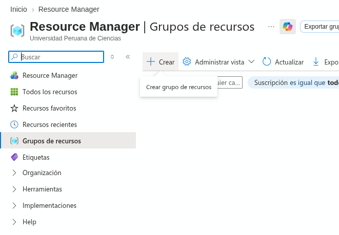

3) Ingresamos el nombre y la región del grupo de recursos a crear:

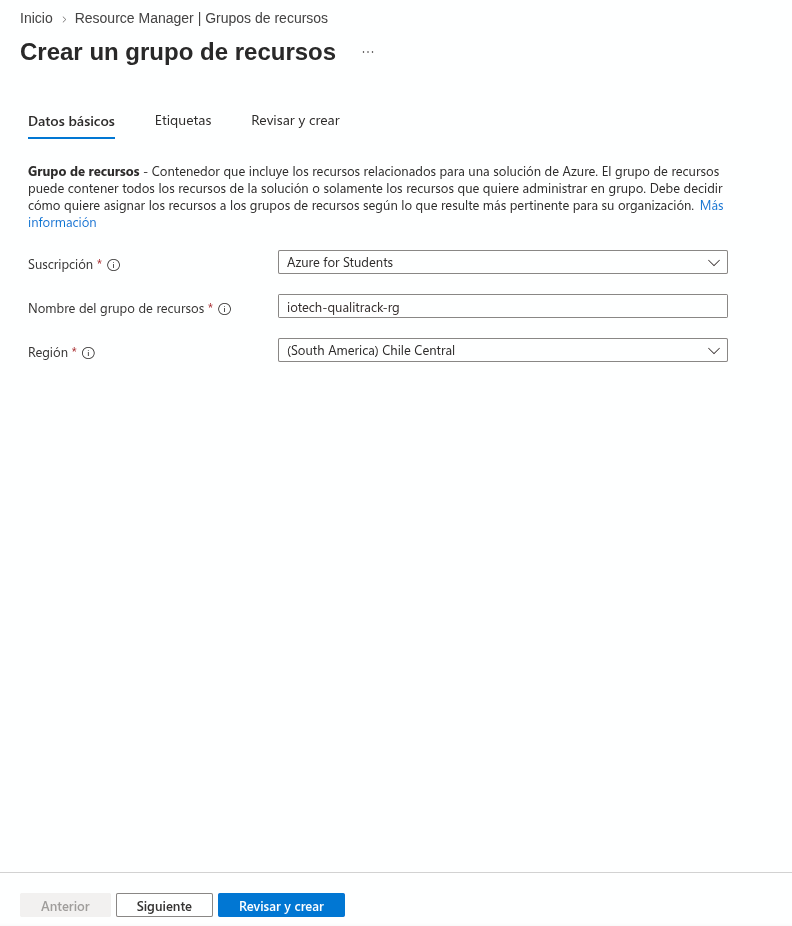

4) Le damos a crear grupo de recursos:

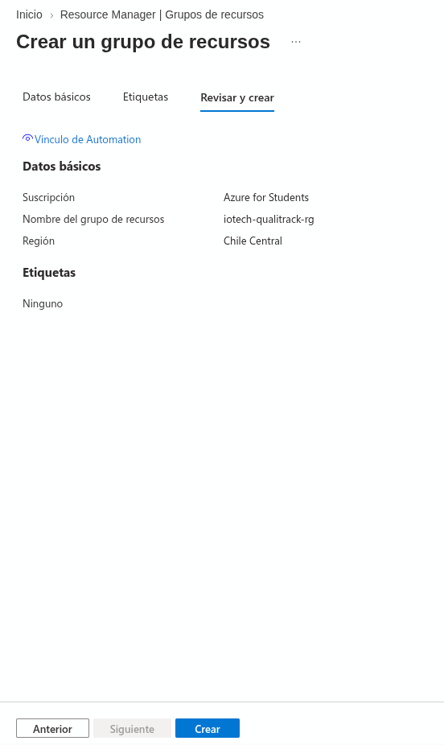


5) Ahora, vamos a **Identidades administradas**:

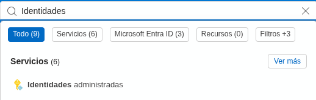

6) Le damos a crear, seleccionamos nuestro grupo, el nombre y la región para la identidad:


7) Creamos la identidad administrada:


8) Dentro de la identidad, vamos a Configuración y después Credenciales federadas:

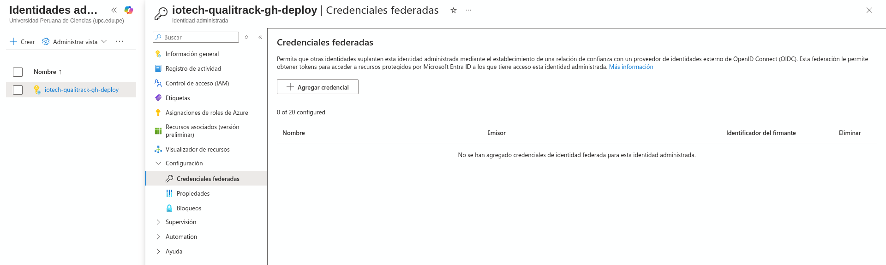

9) Agregaremos una credencial para Github Actions que nos permitirá realizar CI/CD con todos los valores que nos piden:

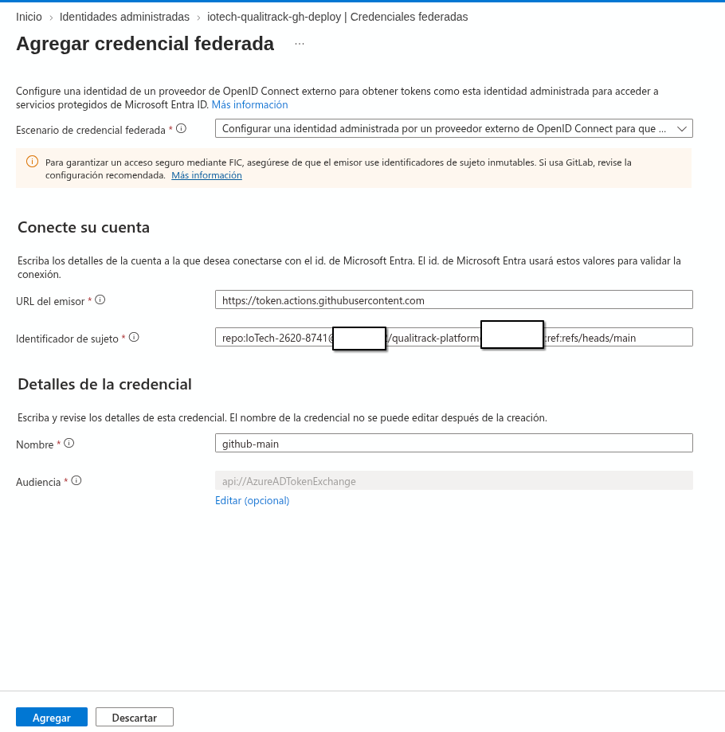

10) Volvemos a grupos de recursos, entramos a Control de Acceso (IAM) y agregamos una asignación de roles con rol de **Colaborador**, en miembros, seleccionamos la credencial dentro de la identidad administrada:


**Paso 3: Registro de imagen de contenedor**

1) Buscamos y entramos a **Container registries** y creamos un registro, seleccionando nuestro grupo e ingresando un nombre con una región y un plan de precios y lo creamos:


**Paso 4: Creación de la base de datos MySQL**

1) Buscamos y entramos a **Azure Database for MySQL servers**:


2) Le damos a Crear y seleccionamos la opción **Servidor flexible**:


3) En Datos básicos, seleccionamos nuestro grupo de recursos **iotech-qualitrack-rg**, ingresamos el nombre **iotech-qualitrack-mysql**, la región **Chile Central** y la versión **8.4**:


4) En Carga de trabajo, seleccionamos **Desarrollo o aficionado** y verificamos que quede el tamaño **Burstable B1ms** con **20 GiB** de almacenamiento. Además, dejamos desactivada la opción de Alta disponibilidad:


5) En Autenticación, seleccionamos únicamente **MySQL**, ingresamos el usuario **iotechadmin** y una contraseña segura. Es importante guardar esta contraseña, ya que no se puede recuperar después:


6) En la pestaña Redes, seleccionamos como método de conectividad **Acceso público** y marcamos la opción **Permitir acceso público desde cualquier servicio de Azure dentro de Azure a este servidor**, lo que permitirá que nuestra Container App se conecte a la base de datos. Opcionalmente, podemos agregar nuestra IP actual si queremos conectarnos desde MySQL Workbench:

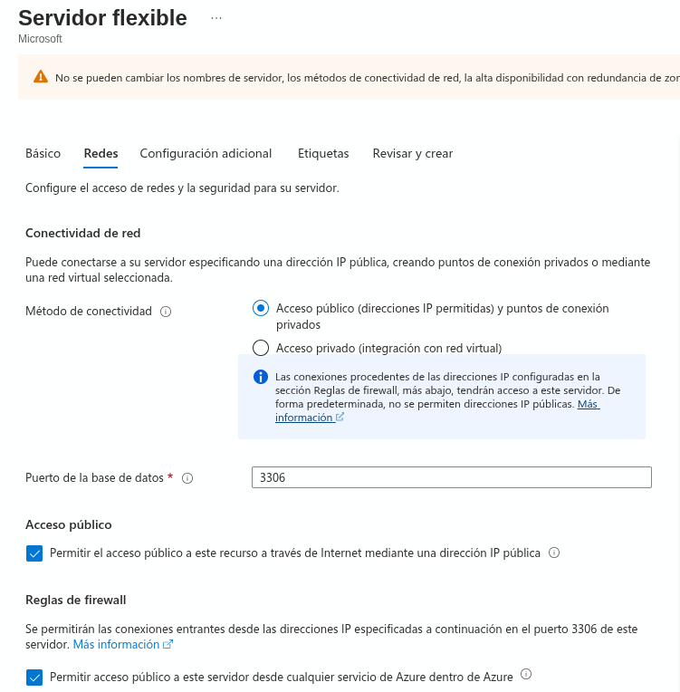

7) Le damos a Revisar y crear, verificamos que la validación sea superada y creamos el servidor. Este proceso puede tardar varios minutos:

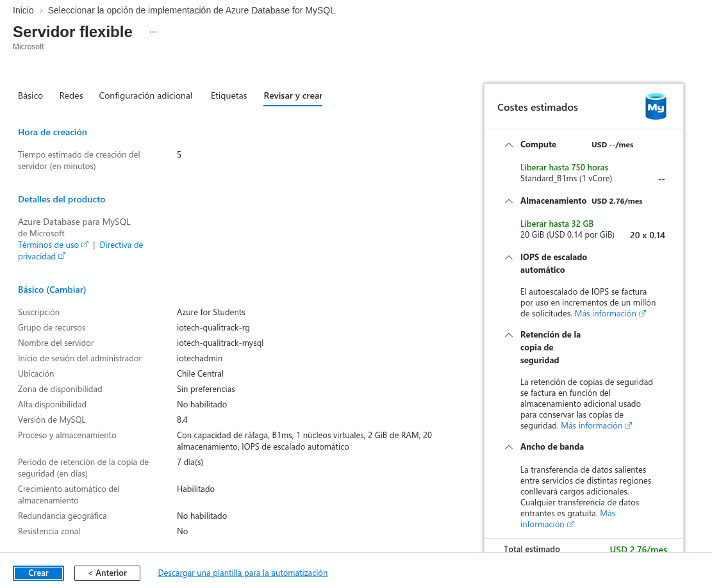

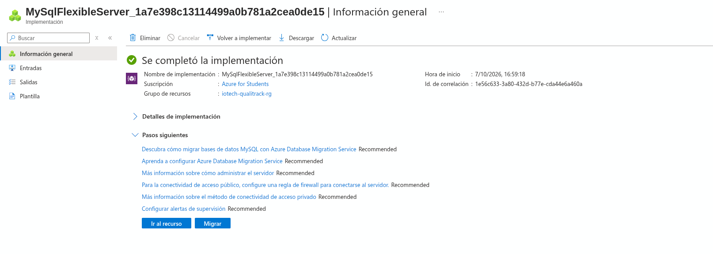

8) Cuando termine el despliegue, entramos al servidor, vamos a **Bases de datos** y le damos a Agregar:


9) Ingresamos el nombre de la base de datos **iotech_qualitrack** y la guardamos:


10) Finalmente, en **Información general**, copiamos el nombre del servidor, que termina en **.mysql.database.azure.com**, ya que lo usaremos más adelante para la configuración del back-end:

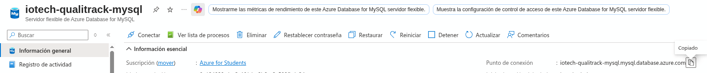

**Paso 5: Creación en Container Apps con imagen temporal**

1) Creamos una aplicación contenedora de Container Apps, lo crearemos desde bash porque la creación mediante la GUI de Azure crea una versión que no admite secretos:

* Registramos las variables del nombre de grupo de recursos y región:


* Creamos el entorno para la aplicación de contenedores en el grupo de recursos y región:


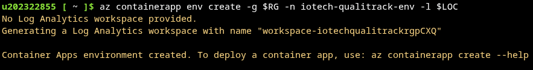

* Creamos la aplicación de contenedores dentro del entorno creado:

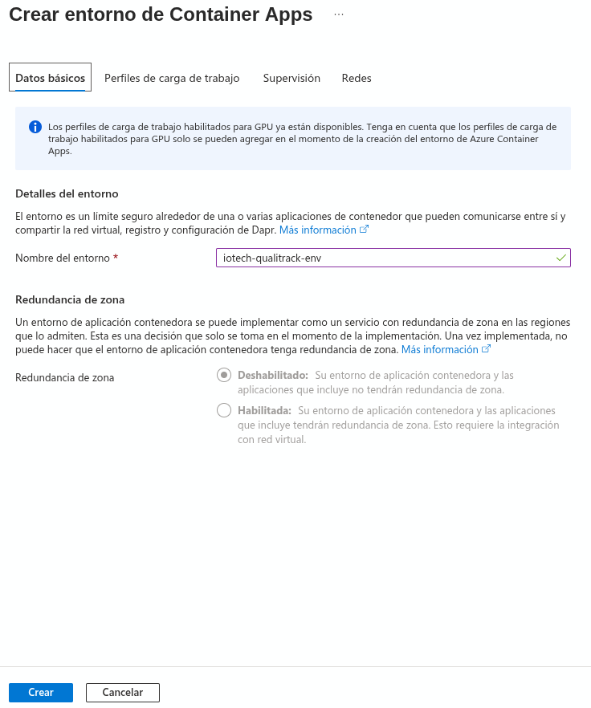

**Paso 6: Agregación de identidad, permisos, secretos y variables**

1) Para la agregación de identidad, usaremos Shell:

* Obtener el ID de la identidad de la aplicación de contenedor dentro del grupo de recursos:


* Asigna permisos para descargar imágenes de contenedores en el ACR:


* Configura la identidad administrada por el sistema de la aplicación de contenedor:


2) Para los secretos, ingresamos desde la aplicación de contenedor a seguridad, secretos y agregamos los secretos que necesitamos:


3) Configuramos la entrada en Redes, entradas y cambiamos el puerto de entrada a 8080 (el que escucha Spring Boot):


4) Ingresaremos las variables de entorno para la aplicación, en este caso, haremos referencia a los secretos para algunas variables de entorno:

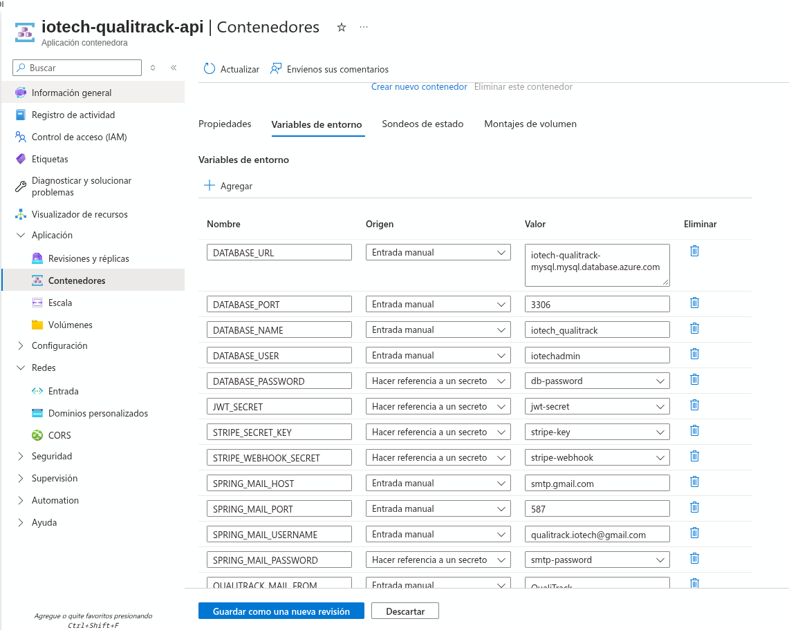

**Paso 7: Ingreso de secretos en el repositorio**

1) Entramos en nuestro repositorio, opciones, secretos y variables y agregamos los secretos de repositorio para conexión a Azure:

* Los datos AZURE_SUBSCRIPTION_ID y AZURE_TENANT_ID se consiguen con este comando:
```bash
az account show --query "{tenant:tenantId, subscription:id}" -o table
```

* El AZURE_CLIENT_ID es del paso 2


**Paso 8: Creación de rama en repositorio para CI-CD junto a Azure**

1) Creamos una nueva rama feature para la integración de workflows:

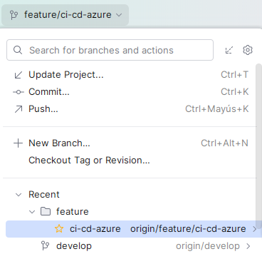

2) Creamos los archivos deploy.yml y ci.yml dentro de .github/workflows


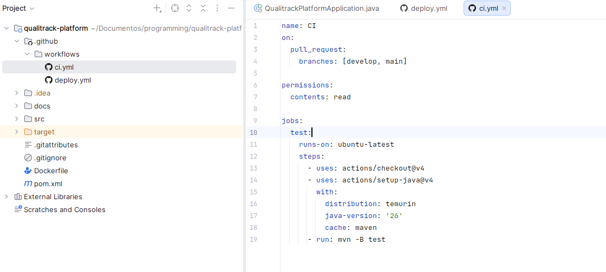

3) Hacemos push a la rama feature, creamos un PR, esperamos que el test de CI termine y hacemos merge:


* Para que funcionen correctamente los workflows creados, deben restringir los merge sin previa creación de un PR.

**Paso 9: Creación de rama release versión 1.0.0**

1) Creamos nuestra rama release, en la versión 1.0.0 y la pasamos a remoto:


2) Creamos nuestro PR hacia main:

* Previo a la creación del PR, verificamos que todo lo creado en Azure funcione correctamente.


3) Esperamos a que las pruebas y el despliegue integrados en workflows terminen:


4) Después de aceptar y realizar el merge a main, esperamos a que termine el workflow de despliegue hacia Azure Container Apps que hemos creado:

* Posteriormente, se realizó un hotfix (**hotfix/deploy-image-flag**) hacia main para corregir la construcción de la imagen Docker en el workflow de despliegue. Este es el workflow que terminó correctamente:

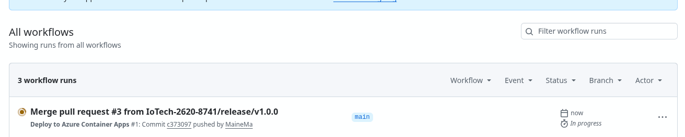

**Paso 10: Verificaciones y pasos finales**

1) Entramos a la aplicación del contenedor, dentro, entramos a revisiones y réplicas:


2) Verificamos que podemos entrar a la documentación Swagger con el link: [Qualitrack Swagger Documentation](https://iotech-qualitrack-api.wonderfulocean-c1f38f8b.chilecentral.azurecontainerapps.io/swagger-ui/index.html)


3) Verificamos la base de datos usando MySQL Workbench mediante una conexión remota y si existen las tablas:


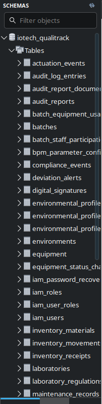

4) Etiquetamos la rama main con la nueva versión de lanzamiento:

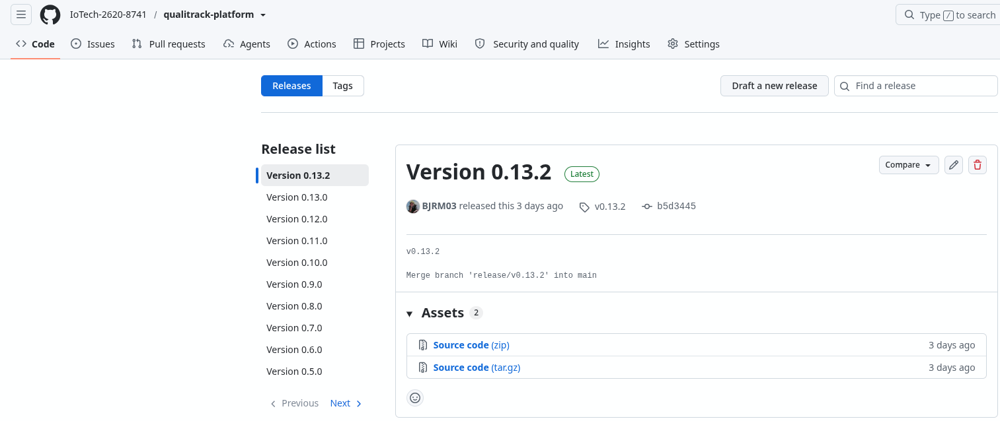

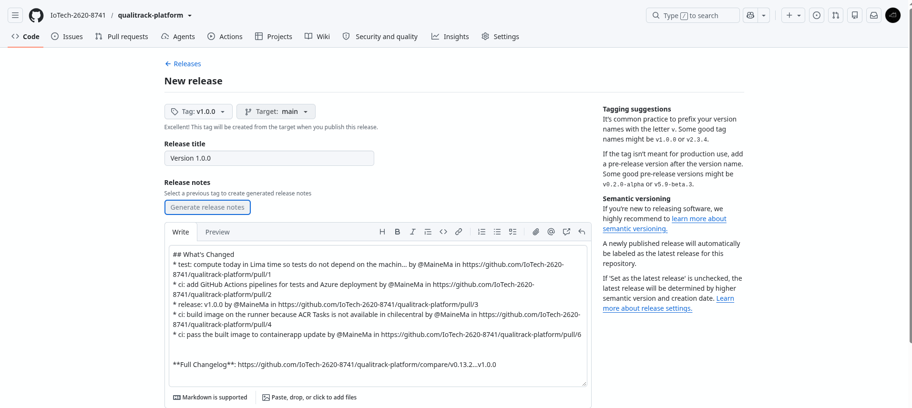


* También eliminamos las ramas release y hotfix, cumpliendo el estándar Gitflow

5) En nuestra aplicación de contenedores, en la sección aplicaciones, contenedores y variables de entorno quitamos SPRING_JPA_HIBERNATE_DDL_AUTO para evitar cambios de esquema:


**Despliegue de la aplicación web**

#### 6.2.1.9. Team Collaboration Insights during Sprint
