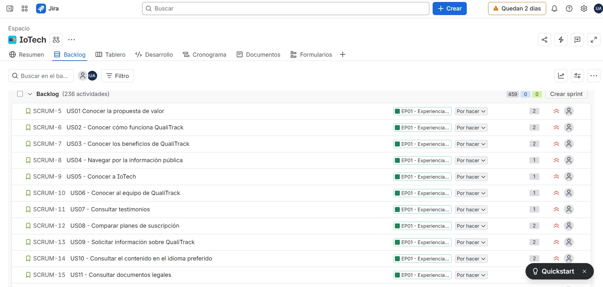

## 3.3. Product Backlog

El Product Backlog de QualiTrack reúne las User Stories (US), Technical Stories (TS), Maker Stories (MS) y Spike Stories
(SP) definidas para el desarrollo de la solución. Estas historias se encuentran priorizadas de acuerdo con el valor que
aportan al producto, considerando inicialmente el Landing Page como primer entregable del proyecto y, posteriormente,
las funcionalidades vinculadas con los procesos principales de QualiTrack, como la gestión y trazabilidad de materias
primas y productos, el monitoreo de ambientes y contenedores mediante dispositivos IoT, la respuesta automática ante
desviaciones y la gestión de alertas. Las funcionalidades complementarias, como reportes, mantenimiento, suscripciones e
identidad y acceso, se incorporan posteriormente según su relevancia para el proyecto. Para estimar el esfuerzo de cada
historia se utilizan Story Points de 1, 2 y 3.

| # Orden | User Story ID | Título                                                                    | Descripción                                                                                                                                                                                                                               | Story Points |
|:--------|:--------------|:--------------------------------------------------------------------------|:------------------------------------------------------------------------------------------------------------------------------------------------------------------------------------------------------------------------------------------|:-------------|
| 1       | US01          | Conocer la propuesta de valor                                             | Como visitante, quiero conocer qué problema resuelve QualiTrack, para decidir si deseo seguir evaluando la solución.                                                                                                                      | 2            |
| 2       | US02          | Conocer cómo funciona QualiTrack                                          | Como visitante, quiero comprender cómo funciona QualiTrack, para saber cómo monitorea las condiciones ambientales y responde ante una desviación.                                                                                         | 2            |
| 3       | US03          | Conocer los beneficios de QualiTrack                                      | Como visitante, quiero conocer los beneficios de QualiTrack, para evaluar si puede mejorar la supervisión y trazabilidad de mi organización.                                                                                              | 2            |
| 4       | US04          | Navegar por la información pública                                        | Como visitante, quiero acceder a las diferentes secciones del sitio público, para encontrar rápidamente la información que necesito.                                                                                                      | 1            |
| 5       | US05          | Conocer a IoTech                                                          | Como visitante, quiero conocer la startup IoTech, para saber qué organización desarrolla QualiTrack.                                                                                                                                      | 1            |
| 6       | US06          | Conocer al equipo de QualiTrack                                           | Como visitante, quiero conocer a las personas que desarrollan QualiTrack, para identificar al equipo responsable del producto.                                                                                                            | 1            |
| 7       | US07          | Consultar testimonios                                                     | Como visitante, quiero conocer testimonios reales relacionados con QualiTrack, para contar con una referencia adicional antes de decidir si utilizar la solución.                                                                         | 1            |
| 8       | US08          | Comparar planes de suscripción                                            | Como visitante, quiero comparar los planes disponibles de QualiTrack, para identificar cuál se ajusta mejor a las necesidades de mi organización.                                                                                         | 2            |
| 9       | US09          | Solicitar información sobre QualiTrack                                    | Como visitante, quiero enviar una consulta al equipo de QualiTrack, para resolver dudas antes de decidir si utilizar la solución.                                                                                                         | 2            |
| 10      | US10          | Consultar el contenido en el idioma preferido                             | Como visitante, quiero consultar la información pública en español o inglés, para comprender el contenido en el idioma que prefiera.                                                                                                      | 2            |
| 11      | US11          | Consultar documentos legales                                              | Como visitante, quiero consultar los Términos de Servicio y la Política de Privacidad, para conocer las condiciones aplicables antes de utilizar QualiTrack.                                                                              | 1            |
| 12      | US37          | Registrar una materia prima                                               | Como responsable de calidad y supervisión, quiero registrar una materia prima, para identificarla dentro del catálogo controlado de la organización.                                                                                      | 2            |
| 13      | US38          | Consultar materias primas                                                 | Como personal operativo, quiero consultar las materias primas registradas, para identificar los insumos disponibles durante mis actividades.                                                                                              | 1            |
| 14      | US39          | Registrar un lote recibido de materia prima                               | Como personal operativo autorizado, quiero registrar un lote recibido de una materia prima, para dejar constancia de su proveedor, cantidad y vencimiento.                                                                                | 2            |
| 15      | US40          | Consultar lotes de materia prima                                          | Como personal operativo, quiero consultar los lotes de una materia prima, para conocer sus cantidades, estados y vencimientos antes de utilizarlos.                                                                                       | 1            |
| 16      | US41          | Revisar el estado de un lote de materia prima                             | Como responsable de calidad y supervisión, quiero liberar, observar o rechazar un lote de materia prima con un motivo, para controlar si puede usarse en producción.                                                                      | 2            |
| 17      | US42          | Consultar el stock utilizable                                             | Como personal operativo, quiero consultar la cantidad utilizable de una materia prima, para saber cuánto material se encuentra disponible.                                                                                                | 2            |
| 18      | US43          | Identificar materias primas con stock bajo                                | Como responsable de calidad y supervisión, quiero identificar materias primas con stock por debajo del mínimo, para planificar su reposición.                                                                                             | 2            |
| 19      | US44          | Identificar lotes próximos a vencer                                       | Como personal operativo, quiero identificar lotes próximos a vencer, para evitar seleccionar material que pronto dejará de ser utilizable.                                                                                                | 2            |
| 20      | US45          | Asignar un lote de materia prima a un contenedor monitoreado              | Como personal operativo autorizado, quiero asociar un lote de materia prima con el contenedor monitoreado donde será almacenado, para conocer su ubicación y relacionar sus condiciones de conservación.                                  | 2            |
| 21      | US46          | Consultar el contenedor de una materia prima                              | Como personal operativo, quiero consultar en qué contenedor se encuentra un lote de materia prima, para ubicarlo y revisar las condiciones registradas para su almacenamiento.                                                            | 1            |
| 22      | US47          | Consultar los movimientos de una materia prima                            | Como personal operativo, quiero consultar los movimientos de una materia prima, para saber qué entró, qué se revisó, dónde se guardó y qué se consumió.                                                                                   | 2            |
| 23      | TS26          | Registrar una materia prima mediante la API                               | Como Developer, quiero registrar una materia prima mediante la API, para integrar el alta de insumos.                                                                                                                                     | 2            |
| 24      | TS27          | Consultar materias primas mediante la API                                 | Como Developer, quiero consultar materias primas mediante la API, para mostrar el catálogo disponible.                                                                                                                                    | 1            |
| 25      | TS28          | Registrar un lote de materia prima mediante la API                        | Como Developer, quiero registrar un lote recibido mediante la API, para incorporar nuevas recepciones al inventario.                                                                                                                      | 2            |
| 26      | TS29          | Consultar lotes de materia prima mediante la API                          | Como Developer, quiero consultar lotes mediante la API, para mostrar cantidades, estados y vencimientos.                                                                                                                                  | 1            |
| 27      | TS30          | Cambiar el estado de un lote mediante la API                              | Como Developer, quiero cambiar el estado de un lote de materia prima mediante la API, para controlar si puede utilizarse.                                                                                                                 | 2            |
| 28      | TS31          | Calcular el stock utilizable mediante la API                              | Como Developer, quiero calcular el stock utilizable desde los lotes disponibles, para evitar mantener una cantidad estática separada.                                                                                                     | 3            |
| 29      | TS32          | Consultar materias primas con stock bajo mediante la API                  | Como Developer, quiero consultar materias primas con stock bajo, para mostrar los insumos que requieren reposición.                                                                                                                       | 2            |
| 30      | TS33          | Consultar lotes próximos a vencer mediante la API                         | Como Developer, quiero consultar lotes próximos a vencer, para mostrar los registros que requieren atención.                                                                                                                              | 2            |
| 31      | TS34          | Asignar materia prima a un contenedor mediante la API                     | Como Developer, quiero asociar un lote de materia prima con un contenedor monitoreado mediante la API, para mantener su ubicación trazable.                                                                                               | 2            |
| 32      | TS35          | Consultar el contenedor de una materia prima mediante la API              | Como Developer, quiero consultar el contenedor asociado a un lote de materia prima mediante la API, para recuperar su ubicación de almacenamiento.                                                                                        | 1            |
| 33      | TS36          | Consultar movimientos de materia prima mediante la API                    | Como Developer, quiero consultar los movimientos de una materia prima mediante la API, para mostrar sus recepciones, revisiones, almacenamientos y consumos.                                                                              | 2            |
| 34      | US75          | Registrar un producto                                                     | Como responsable de calidad y supervisión, quiero registrar un producto farmacéutico, para identificarlo y permitir el registro posterior de sus lotes.                                                                                   | 2            |
| 35      | US76          | Consultar productos                                                       | Como personal operativo, quiero consultar los productos registrados, para seleccionar correctamente el producto asociado a una fabricación.                                                                                               | 1            |
| 36      | US77          | Registrar un lote de producto                                             | Como personal operativo autorizado, quiero registrar una fabricación de un producto, para dejar constancia del lote que se procesa.                                                                                                       | 2            |
| 37      | US78          | Consultar un lote de producto                                             | Como personal operativo, quiero consultar la información de un lote, para revisar los datos de la fabricación en la que estoy participando.                                                                                               | 1            |
| 38      | US79          | Registrar el consumo de materia prima                                     | Como personal operativo autorizado, quiero registrar el lote de materia prima y la cantidad usada en una fabricación, para descontar el stock correcto y mantener la trazabilidad.                                                        | 3            |
| 39      | US80          | Asociar un equipo con un lote de producto                                 | Como personal operativo autorizado, quiero asociar los equipos utilizados con un lote, para dejar evidencia de los recursos que participaron en la fabricación.                                                                           | 2            |
| 40      | US81          | Asociar personal con un lote de producto                                  | Como personal operativo autorizado, quiero asociar a las personas que participaron en una fabricación, para conservar evidencia de quién intervino.                                                                                       | 2            |
| 41      | US82          | Asignar un lote de producto a un contenedor monitoreado                   | Como personal operativo autorizado, quiero asociar un lote de producto con el contenedor monitoreado donde será almacenado, para conocer su ubicación y relacionar sus condiciones de conservación.                                       | 2            |
| 42      | US83          | Consultar el contenedor de un lote de producto                            | Como personal operativo, quiero consultar en qué contenedor se encuentra un lote de producto, para ubicarlo y revisar las condiciones registradas para su almacenamiento.                                                                 | 1            |
| 43      | US84          | Consultar la trazabilidad de un lote                                      | Como responsable de calidad y supervisión, quiero consultar los recursos relacionados con un lote fabricado, para reconstruir qué materias primas, equipos, personas y contenedor participaron.                                           | 3            |
| 44      | US85          | Liberar un lote de producto                                               | Como responsable de calidad y supervisión, quiero liberar un lote que cumple las especificaciones, para dejar constancia firmada de que puede continuar.                                                                                  | 2            |
| 45      | US86          | Rechazar un lote de producto                                              | Como responsable de calidad y supervisión, quiero rechazar un lote con un motivo, para impedir que continúe.                                                                                                                              | 2            |
| 46      | TS68          | Registrar un producto mediante la API                                     | Como Developer, quiero registrar un producto mediante la API, para integrar el alta del catálogo.                                                                                                                                         | 2            |
| 47      | TS69          | Consultar productos mediante la API                                       | Como Developer, quiero consultar productos mediante la API, para mostrar el catálogo disponible.                                                                                                                                          | 1            |
| 48      | TS70          | Registrar un lote de producto mediante la API                             | Como Developer, quiero registrar un lote de producto mediante la API, para integrar nuevas fabricaciones.                                                                                                                                 | 2            |
| 49      | TS71          | Consultar lotes de producto mediante la API                               | Como Developer, quiero consultar lotes de producto mediante la API, para recuperar las fabricaciones registradas.                                                                                                                         | 1            |
| 50      | TS72          | Registrar consumo de materia prima mediante la API                        | Como Developer, quiero registrar consumo de materia prima mediante la API, para actualizar inventario y trazabilidad.                                                                                                                     | 3            |
| 51      | TS73          | Asociar equipos con un lote mediante la API                               | Como Developer, quiero asociar equipos con un lote mediante la API, para conservar los equipos utilizados.                                                                                                                                | 2            |
| 52      | TS74          | Asociar personal con un lote mediante la API                              | Como Developer, quiero asociar personal con un lote mediante la API, para conservar las personas relacionadas.                                                                                                                            | 2            |
| 53      | TS75          | Asignar un lote de producto a un contenedor mediante la API               | Como Developer, quiero asociar un lote de producto con un contenedor monitoreado mediante la API, para mantener su ubicación trazable.                                                                                                    | 2            |
| 54      | TS76          | Consultar el contenedor de un lote de producto mediante la API            | Como Developer, quiero consultar el contenedor asociado a un lote de producto mediante la API, para recuperar su ubicación de almacenamiento.                                                                                             | 1            |
| 55      | TS77          | Consultar trazabilidad de lotes mediante la API                           | Como Developer, quiero consultar la trazabilidad de un lote mediante la API, para obtener sus recursos y almacenamiento relacionados.                                                                                                     | 3            |
| 56      | TS78          | Liberar un lote mediante la API                                           | Como Developer, quiero liberar un lote existente mediante la API, para soportar la revisión realizada por un responsable autorizado.                                                                                                      | 2            |
| 57      | TS79          | Rechazar un lote mediante la API                                          | Como Developer, quiero rechazar un lote existente mediante la API, para conservar el motivo y el estado resultante.                                                                                                                       | 2            |
| 58      | TS80          | Consultar los lotes del laboratorio mediante la API                       | Como Developer, quiero consultar los lotes de producto de todo el laboratorio mediante la API, para mostrar su estado en un solo lugar.                                                                                                   | 1            |
| 59      | US93          | Identificar lotes afectados por una materia prima no utilizable           | Como responsable de calidad y supervisión, quiero identificar qué lotes de producto utilizaron una materia prima observada o rechazada, para evaluar el posible impacto.                                                                  | 3            |
| 60      | TS87          | Consultar lotes afectados por trazabilidad                                | Como Developer, quiero consultar qué lotes de producto están relacionados con un lote de materia prima, para apoyar la evaluación de impacto.                                                                                             | 2            |
| 61      | US27          | Registrar el laboratorio o almacén                                        | Como responsable de calidad y supervisión, quiero registrar el laboratorio o almacén de mi organización, para comenzar a configurar QualiTrack.                                                                                           | 2            |
| 62      | US30          | Registrar un ambiente                                                     | Como responsable de calidad y supervisión, quiero registrar un ambiente dentro del laboratorio o almacén, para organizar los dispositivos y contenedores según su ubicación.                                                              | 2            |
| 63      | US31          | Definir el uso de un ambiente                                             | Como responsable de calidad y supervisión, quiero indicar el uso principal de un ambiente, para diferenciar zonas de laboratorio, almacenamiento de materias primas, almacenamiento de productos u otros usos permitidos.                 | 2            |
| 64      | US32          | Consultar los ambientes registrados                                       | Como personal operativo, quiero consultar los ambientes registrados de mi instalación, para identificar las zonas en las que debo realizar mis actividades.                                                                               | 1            |
| 65      | US34          | Registrar personal                                                        | Como responsable de calidad y supervisión, quiero registrar a un operario o a un auditor de mi laboratorio, para que tenga su propia cuenta y quede identificado en las operaciones.                                                      | 2            |
| 66      | US35          | Consultar la actividad de un miembro del personal                         | Como responsable de calidad y supervisión o auditor, quiero consultar las acciones que registró una persona del laboratorio, para revisar su participación.                                                                               | 2            |
| 67      | US36          | Desactivar a un miembro del personal                                      | Como responsable de calidad y supervisión, quiero desactivar a una persona que dejó el laboratorio, para que su cuenta deje de funcionar sin perder su historial.                                                                         | 2            |
| 68      | US28          | Consultar la información del laboratorio o almacén                        | Como responsable de calidad y supervisión, quiero consultar los datos de mi laboratorio o almacén, para revisar la información registrada.                                                                                                | 1            |
| 69      | US29          | Actualizar la información del laboratorio o almacén                       | Como responsable de calidad y supervisión, quiero actualizar los datos generales de mi laboratorio o almacén, para mantener su información vigente.                                                                                       | 2            |
| 70      | US33          | Actualizar un ambiente                                                    | Como responsable de calidad y supervisión, quiero actualizar la información de un ambiente, para mantener correctamente identificada la zona monitoreada.                                                                                 | 2            |
| 71      | TS15          | Registrar una instalación mediante la API                                 | Como Developer, quiero registrar un laboratorio o almacén mediante la API, para integrar la configuración inicial en las aplicaciones.                                                                                                    | 2            |
| 72      | TS18          | Registrar un ambiente mediante la API                                     | Como Developer, quiero registrar un ambiente mediante la API, para integrar nuevas zonas de monitoreo.                                                                                                                                    | 2            |
| 73      | TS19          | Registrar el uso de un ambiente mediante la API                           | Como Developer, quiero registrar el uso de un ambiente mediante la API, para diferenciar las zonas de materias primas, productos y otros usos.                                                                                            | 2            |
| 74      | TS20          | Consultar ambientes mediante la API                                       | Como Developer, quiero consultar los ambientes de una instalación mediante la API, para mostrar sus zonas registradas.                                                                                                                    | 1            |
| 75      | TS22          | Registrar personal mediante la API                                        | Como Developer, quiero registrar personal mediante la API, para relacionar personas con las operaciones de trazabilidad.                                                                                                                  | 2            |
| 76      | TS23          | Consultar personal mediante la API                                        | Como Developer, quiero consultar el personal registrado mediante la API, para utilizarlo en las funciones de trazabilidad.                                                                                                                | 1            |
| 77      | TS24          | Consultar la actividad del personal mediante la API                       | Como Developer, quiero consultar las acciones registradas por un miembro del personal mediante la API, para revisar su participación en el laboratorio.                                                                                   | 2            |
| 78      | TS25          | Desactivar personal mediante la API                                       | Como Developer, quiero desactivar a un miembro del personal mediante la API, para impedir su acceso sin perder su historial.                                                                                                              | 2            |
| 79      | TS16          | Consultar una instalación mediante la API                                 | Como Developer, quiero consultar un laboratorio o almacén mediante la API, para recuperar su información.                                                                                                                                 | 1            |
| 80      | TS17          | Actualizar una instalación mediante la API                                | Como Developer, quiero actualizar un laboratorio o almacén mediante la API, para mantener su información vigente.                                                                                                                         | 2            |
| 81      | TS21          | Actualizar un ambiente mediante la API                                    | Como Developer, quiero actualizar un ambiente mediante la API, para mantener vigente la información de la zona.                                                                                                                           | 2            |
| 82      | US48          | Registrar un equipo                                                       | Como responsable de calidad y supervisión, quiero registrar un equipo, para identificarlo dentro de las operaciones de QualiTrack.                                                                                                        | 2            |
| 83      | US49          | Consultar equipos                                                         | Como personal operativo, quiero consultar los equipos registrados en mi instalación, para conocer su información y estado antes de utilizarlos.                                                                                           | 1            |
| 84      | US50          | Asociar un equipo con un ambiente                                         | Como responsable de calidad y supervisión, quiero asociar un equipo con el ambiente donde se encuentra, para mantener su ubicación registrada.                                                                                            | 2            |
| 85      | US51          | Actualizar el estado operativo de un equipo                               | Como personal operativo encargado de equipos, quiero actualizar el estado de un equipo, para indicar si está operativo, en mantenimiento o fuera de servicio.                                                                             | 2            |
| 86      | US54          | Registrar un dispositivo ambiental                                        | Como responsable de calidad y supervisión, quiero registrar el dispositivo ambiental basado en ESP32, para identificar el nodo que supervisará un ambiente.                                                                               | 2            |
| 87      | US55          | Asociar un dispositivo ambiental con un ambiente                          | Como responsable de calidad y supervisión, quiero asociar el dispositivo ambiental con el ambiente que debe supervisar, para relacionar correctamente sus lecturas y eventos.                                                             | 2            |
| 88      | US56          | Registrar un monitor de contenedor                                        | Como responsable de calidad y supervisión, quiero registrar un monitor de contenedor basado en ESP32, para identificar el dispositivo que supervisará las condiciones internas de un contenedor.                                          | 2            |
| 89      | US57          | Asociar un monitor de contenedor con un ambiente                          | Como responsable de calidad y supervisión, quiero asociar un monitor de contenedor con el ambiente donde está ubicado, para relacionar sus mediciones con la zona correcta.                                                               | 2            |
| 90      | US58          | Consultar el estado de conexión de un dispositivo IoT                     | Como personal operativo, quiero conocer si el dispositivo ambiental o el monitor de contenedor está comunicándose con Edge, para detectar rápidamente cuándo requiere revisión.                                                           | 2            |
| 91      | US59          | Configurar los parámetros BPM de un equipo                                | Como personal operativo encargado de equipos, quiero definir el mínimo y el máximo de un parámetro de proceso de un equipo, para registrar las condiciones de operación que exigen las BPM.                                               | 2            |
| 92      | TS37          | Registrar equipos mediante la API                                         | Como Developer, quiero registrar equipos mediante la API, para integrar el alta de equipos.                                                                                                                                               | 2            |
| 93      | TS38          | Consultar equipos mediante la API                                         | Como Developer, quiero consultar equipos mediante la API, para mostrar su información y estado.                                                                                                                                           | 1            |
| 94      | TS39          | Asociar equipos con ambientes mediante la API                             | Como Developer, quiero asociar equipos con ambientes mediante la API, para conservar su ubicación.                                                                                                                                        | 2            |
| 95      | TS40          | Registrar cambio de estado de equipos mediante la API                     | Como Developer, quiero registrar un cambio de estado operativo de un equipo mediante la API, para reflejar su disponibilidad de forma trazable.                                                                                           | 2            |
| 96      | TS43          | Registrar dispositivos ambientales mediante la API                        | Como Developer, quiero registrar dispositivos ambientales mediante la API, para identificarlos antes de su integración con Edge.                                                                                                          | 2            |
| 97      | TS44          | Asociar dispositivos ambientales con ambientes mediante la API            | Como Developer, quiero asociar un dispositivo ambiental con un ambiente mediante la API, para relacionar sus lecturas con la zona correcta.                                                                                               | 2            |
| 98      | TS45          | Registrar monitores de contenedor mediante la API                         | Como Developer, quiero registrar monitores de contenedor mediante la API, para identificarlos antes de su integración con Edge.                                                                                                           | 2            |
| 99      | TS46          | Asociar monitores de contenedor con ambientes mediante la API             | Como Developer, quiero asociar un monitor de contenedor con un ambiente mediante la API, para relacionar sus mediciones con la zona correcta.                                                                                             | 2            |
| 100     | TS47          | Consultar el estado de conexión de dispositivos mediante la API           | Como Developer, quiero consultar el estado de conexión de dispositivos IoT mediante la API, para mostrar su disponibilidad.                                                                                                               | 2            |
| 101     | TS48          | Configurar parámetros BPM mediante la API                                 | Como Developer, quiero configurar el rango de un parámetro BPM de un equipo mediante la API, para registrar sus condiciones de operación.                                                                                                 | 2            |
| 102     | SP01          | Evaluación técnica del sensor de calidad de aire y movimiento             | Como equipo de desarrollo, queremos comparar y validar alternativas para calidad de aire y detección de movimiento del dispositivo ambiental, para seleccionar sensores compatibles con ESP32 y adecuados para la demostración.           | 2            |
| 103     | SP02          | Evaluación técnica de temperatura, humedad y luminosidad del contenedor   | Como equipo de desarrollo, queremos validar los sensores del monitor de contenedor, incluyendo DHT22 o alternativa equivalente y el sensor de luminosidad, para confirmar su integración con el ESP32.                                    | 2            |
| 104     | SP03          | Evaluación técnica de actuadores y alimentación del contenedor            | Como equipo de desarrollo, queremos validar la forma segura de controlar ventilación o refrigeración simulada y el servomotor desde el ESP32, para definir el circuito de actuación.                                                      | 2            |
| 105     | SP04          | Evaluación técnica de RFID para identificación del contenedor             | Como equipo de desarrollo, queremos validar un lector RFID compatible con el ESP32, para definir cómo se identificará el contenedor o la referencia asociada a su contenido.                                                              | 2            |
| 106     | SP05          | Evaluación de histéresis y recuperación para control local                | Como equipo de desarrollo, queremos investigar una estrategia de histéresis y estabilidad temporal para el monitor de contenedor, para evitar cambios repetidos de los actuadores cerca de un límite.                                     | 2            |
| 107     | SP06          | Evaluación de comunicación REST de dos tipos de dispositivo con Edge      | Como equipo de desarrollo, queremos validar la comunicación HTTP de los dos ESP32 con el RESTful Edge API, para confirmar que el dispositivo ambiental y el monitor de contenedor pueden intercambiar información dentro de la red local. | 2            |
| 108     | SP07          | Evaluación de seguridad para identificar dispositivos ante Edge           | Como equipo de desarrollo, queremos investigar y validar un mecanismo de identificación para ambos tipos de dispositivo ante Edge, para evitar aceptar datos de nodos no registrados.                                                     | 2            |
| 109     | SP08          | Evaluación de persistencia offline y sincronización Edge-Cloud            | Como equipo de desarrollo, queremos validar el almacenamiento temporal en SQLite y la sincronización posterior de datos de ambos dispositivos, para evitar pérdida o duplicación durante cortes de Internet.                              | 3            |
| 110     | SP09          | Evaluación del entorno físico para el Edge Service                        | Como equipo de desarrollo, queremos validar el equipo donde se ejecutará Flask, Peewee y SQLite, para confirmar que el Edge Service puede operar de forma estable con ambos ESP32.                                                        | 1            |
| 111     | MS01          | Leer calidad de aire en el dispositivo ambiental                          | Como maker, quiero obtener la lectura del sensor de calidad de aire conectado al ESP32 ambiental, para disponer de una referencia de la condición del ambiente.                                                                           | 2            |
| 112     | MS02          | Detectar movimiento en el dispositivo ambiental                           | Como maker, quiero obtener eventos del sensor de movimiento conectado al ESP32 ambiental, para registrar la actividad detectada en el ambiente.                                                                                           | 2            |
| 113     | MS05          | Enviar telemetría ambiental al Edge API                                   | Como maker, quiero enviar las lecturas y eventos del dispositivo ambiental al Edge API, para que queden disponibles para almacenamiento y sincronización.                                                                                 | 2            |
| 114     | MS06          | Leer temperatura y humedad en el monitor de contenedor                    | Como maker, quiero obtener temperatura y humedad desde el sensor del monitor de contenedor, para supervisar las condiciones internas del contenedor.                                                                                      | 2            |
| 115     | MS07          | Leer luminosidad en el monitor de contenedor                              | Como maker, quiero obtener la lectura de luminosidad del contenedor, para registrar su condición de exposición.                                                                                                                           | 2            |
| 116     | MS09          | Leer una identificación RFID en el contenedor                             | Como maker, quiero leer una etiqueta RFID desde el monitor de contenedor, para identificar el contenedor o la referencia configurada para su contenido.                                                                                   | 2            |
| 117     | MS12          | Enviar telemetría del contenedor al Edge API                              | Como maker, quiero enviar las mediciones del monitor de contenedor al Edge API, para que queden disponibles para almacenamiento y sincronización.                                                                                         | 2            |
| 118     | MS14          | Autenticar los dispositivos con Edge                                      | Como maker, quiero que cada ESP32 se autentique con el Edge API, para que solo los dispositivos registrados puedan enviar información.                                                                                                    | 2            |
| 119     | TS53          | Autenticar dispositivos ambientales en Edge                               | Como Developer, quiero validar la identidad de cada dispositivo ambiental antes de aceptar sus solicitudes en Edge, para impedir datos de nodos no registrados.                                                                           | 2            |
| 120     | TS54          | Autenticar monitores de contenedor en Edge                                | Como Developer, quiero validar la identidad de cada monitor de contenedor antes de aceptar sus solicitudes en Edge, para impedir datos de nodos no registrados.                                                                           | 2            |
| 121     | TS55          | Recibir telemetría del dispositivo ambiental en Edge                      | Como Developer, quiero recibir calidad de aire y eventos de movimiento desde el dispositivo ambiental mediante el Edge API, para almacenarlos localmente.                                                                                 | 2            |
| 122     | TS56          | Recibir telemetría del monitor de contenedor en Edge                      | Como Developer, quiero recibir temperatura, humedad, luminosidad e identificación disponible desde el monitor de contenedor mediante el Edge API, para almacenarlos localmente.                                                           | 2            |
| 123     | TS60          | Conservar registros pendientes en Edge                                    | Como Developer, quiero conservar en SQLite los registros pendientes de ambos tipos de dispositivo, para evitar pérdida de información cuando Cloud no está disponible.                                                                    | 2            |
| 124     | TS61          | Sincronizar telemetría ambiental pendiente con Cloud                      | Como Developer, quiero sincronizar las mediciones y eventos ambientales pendientes desde Edge hacia Cloud, para centralizar la información cuando existe conectividad.                                                                    | 3            |
| 125     | TS62          | Sincronizar telemetría de contenedores pendiente con Cloud                | Como Developer, quiero sincronizar las mediciones de contenedores pendientes desde Edge hacia Cloud, para centralizar la información cuando existe conectividad.                                                                          | 3            |
| 126     | US60          | Configurar el rango de calidad de aire de un ambiente                     | Como responsable de calidad y supervisión, quiero definir el rango normal y el rango crítico de calidad de aire (ppm) de un ambiente, para que cada lectura se clasifique como normal, advertencia o crítica.                             | 2            |
| 127     | US61          | Configurar rangos de temperatura y humedad de un contenedor               | Como responsable de calidad y supervisión, quiero definir el rango normal y el crítico de temperatura (°C) y humedad (%RH) de un monitor de contenedor, para detectar desviaciones sobre lo almacenado.                                   | 2            |
| 128     | US62          | Configurar el rango de luminosidad de un contenedor                       | Como responsable de calidad y supervisión, quiero definir el rango normal y el crítico de luminosidad (lux) de un monitor de contenedor, para detectar exposiciones a la luz.                                                             | 2            |
| 129     | US63          | Configurar una respuesta automática del contenedor                        | Como responsable de calidad y supervisión, quiero definir qué acción ejecuta el contenedor cuando una métrica pasa a advertencia o a crítico, para que reaccione sin esperar a una persona.                                               | 3            |
| 130     | US64          | Consultar la calidad de aire de un ambiente                               | Como personal operativo, quiero consultar la lectura actual de calidad de aire del ambiente donde trabajo, para reconocer si la condición requiere atención.                                                                              | 2            |
| 131     | US65          | Consultar la detección de movimiento de un ambiente                       | Como personal operativo, quiero consultar si el dispositivo ambiental registró movimiento recientemente, para conocer la actividad detectada por el nodo instalado.                                                                       | 2            |
| 132     | US66          | Reconocer el estado del ambiente desde el dispositivo                     | Como personal operativo, quiero reconocer localmente el estado del ambiente mediante el LED y el buzzer, para identificar una condición de advertencia o crítica sin depender de la aplicación.                                           | 2            |
| 133     | US67          | Consultar temperatura y humedad de un contenedor                          | Como personal operativo, quiero consultar la temperatura y humedad actuales de un contenedor monitoreado, para verificar las condiciones del material o producto almacenado.                                                              | 2            |
| 134     | US68          | Consultar la luminosidad de un contenedor                                 | Como personal operativo, quiero consultar la luminosidad registrada dentro de un contenedor, para verificar la condición de exposición del contenido.                                                                                     | 2            |
| 135     | US69          | Consultar la acción automática de un contenedor                           | Como personal operativo, quiero conocer si el monitor de contenedor activó ventilación, refrigeración simulada o el servo, para saber cómo está respondiendo ante una desviación.                                                         | 2            |
| 136     | US70          | Consultar la identificación RFID de un contenedor                         | Como personal operativo, quiero consultar la identificación RFID asociada al contenedor, para confirmar que estoy trabajando con el contenedor esperado.                                                                                  | 2            |
| 137     | US71          | Consultar localmente los datos del contenedor                             | Como personal operativo, quiero visualizar en la pantalla del contenedor sus datos principales, para revisar su estado sin abrir la aplicación.                                                                                           | 2            |
| 138     | US72          | Consultar el historial del dispositivo ambiental                          | Como responsable de calidad y supervisión, quiero consultar las lecturas del dispositivo ambiental en un periodo, para revisar cómo se comportó el ambiente.                                                                              | 2            |
| 139     | US73          | Consultar el historial de un contenedor monitoreado                       | Como responsable de calidad y supervisión, quiero consultar las lecturas y las acciones automáticas de un monitor de contenedor en un periodo, para revisar las condiciones de lo almacenado.                                             | 2            |
| 140     | US74          | Reconocer una alarma local                                                | Como personal operativo, quiero reconocer una alarma desde el dispositivo, para dejar constancia de que la situación está siendo atendida.                                                                                                | 2            |
| 141     | TS49          | Guardar el rango de calidad de aire mediante la API                       | Como Developer, quiero guardar el rango de calidad de aire de un ambiente mediante la API, para configurar el dispositivo ambiental.                                                                                                      | 2            |
| 142     | TS50          | Guardar rangos de temperatura y humedad de contenedores mediante la API   | Como Developer, quiero guardar los rangos de temperatura y humedad mediante la API, para configurar los monitores de contenedor.                                                                                                          | 2            |
| 143     | TS51          | Guardar el rango de luminosidad mediante la API                           | Como Developer, quiero guardar el rango de luminosidad mediante la API, para configurar el monitoreo del contenedor.                                                                                                                      | 2            |
| 144     | TS52          | Guardar reglas de actuación de contenedores mediante la API               | Como Developer, quiero guardar reglas de actuación mediante la API, para relacionar condiciones del contenedor con acciones automáticas.                                                                                                  | 3            |
| 145     | TS57          | Recibir eventos de actuación del contenedor en Edge                       | Como Developer, quiero recibir eventos de ventilación, refrigeración simulada o servo mediante el Edge API, para conservar las acciones realizadas.                                                                                       | 2            |
| 146     | TS58          | Entregar configuración al dispositivo ambiental desde Edge                | Como Developer, quiero exponer desde Edge la configuración vigente del dispositivo ambiental, para que el ESP32 obtenga sus criterios de operación.                                                                                       | 2            |
| 147     | TS59          | Entregar configuración al monitor de contenedor desde Edge                | Como Developer, quiero exponer desde Edge la configuración vigente del monitor de contenedor, para que el ESP32 obtenga sus rangos y reglas.                                                                                              | 2            |
| 148     | TS63          | Sincronizar eventos de actuación pendientes con Cloud                     | Como Developer, quiero sincronizar los eventos de actuación de contenedores desde Edge hacia Cloud, para mantener la trazabilidad de las respuestas automáticas.                                                                          | 3            |
| 149     | TS64          | Sincronizar configuraciones de Cloud hacia Edge                           | Como Developer, quiero obtener desde Cloud las configuraciones vigentes de ambos tipos de dispositivo, para mantener en Edge una copia disponible.                                                                                        | 3            |
| 150     | TS65          | Consultar telemetría ambiental mediante la API                            | Como Developer, quiero consultar las mediciones y eventos del dispositivo ambiental mediante la API, para integrarlos en las aplicaciones.                                                                                                | 2            |
| 151     | TS66          | Consultar telemetría de contenedores mediante la API                      | Como Developer, quiero consultar mediciones y estados de contenedores mediante la API, para integrarlos en las aplicaciones.                                                                                                              | 2            |
| 152     | TS67          | Consultar eventos de actuación mediante la API                            | Como Developer, quiero consultar eventos de actuación mediante la API, para mostrar el historial de respuestas automáticas.                                                                                                               | 2            |
| 153     | MS03          | Controlar el LED del dispositivo ambiental                                | Como maker, quiero controlar el indicador LED del dispositivo ambiental, para representar localmente el estado normal, de advertencia o crítico.                                                                                          | 2            |
| 154     | MS04          | Controlar el buzzer del dispositivo ambiental                             | Como maker, quiero controlar el buzzer del dispositivo ambiental, para emitir una señal sonora cuando una condición configurada requiere atención.                                                                                        | 2            |
| 155     | MS08          | Mostrar datos en la pantalla del contenedor                               | Como maker, quiero mostrar los datos principales en la pantalla del monitor de contenedor, para verificar su estado directamente en campo.                                                                                                | 2            |
| 156     | MS10          | Controlar la ventilación o refrigeración simulada del contenedor          | Como maker, quiero controlar el actuador de ventilación o refrigeración simulada, para ejecutar una respuesta local cuando una regla lo requiere.                                                                                         | 3            |
| 157     | MS11          | Controlar el servo del contenedor                                         | Como maker, quiero controlar el servomotor del contenedor, para ejecutar el movimiento definido por una regla de actuación.                                                                                                               | 3            |
| 158     | MS13          | Enviar eventos de actuación del contenedor al Edge API                    | Como maker, quiero enviar a Edge los eventos producidos por los actuadores del contenedor, para mantener la trazabilidad de las acciones realizadas.                                                                                      | 2            |
| 159     | MS15          | Obtener la configuración desde Edge                                       | Como maker, quiero que cada dispositivo obtenga desde Edge su configuración vigente, para operar con los criterios asignados.                                                                                                             | 2            |
| 160     | MS16          | Mantener el control local sin Internet                                    | Como maker, quiero que los dispositivos sigan evaluando y actuando localmente cuando Cloud no está disponible, para mantener las funciones básicas de supervisión y control.                                                              | 3            |
| 161     | TS81          | Crear alertas a partir de desviaciones                                    | Como Developer, quiero generar una alerta cuando Cloud confirma una desviación del ambiente o contenedor que cumple las reglas, para iniciar su ciclo de atención.                                                                        | 3            |
| 162     | US89          | Consultar alertas activas                                                 | Como personal operativo, quiero consultar las alertas activas de las áreas y contenedores en los que trabajo, para priorizar las situaciones que requieren atención inmediata.                                                            | 1            |
| 163     | US90          | Consultar el detalle de una alerta                                        | Como personal operativo, quiero conocer si una alerta se originó en el ambiente o en un contenedor y qué condición la produjo, para entender la situación antes de intervenir.                                                            | 2            |
| 164     | US91          | Registrar que una alerta está siendo atendida                             | Como personal operativo autorizado, quiero indicar que estoy atendiendo una alerta, para dejar constancia de quién inició la atención y cuándo.                                                                                           | 2            |
| 165     | US92          | Resolver una alerta                                                       | Como personal operativo autorizado o responsable de calidad, quiero registrar la resolución de una alerta con notas, para conservar cómo y cuándo terminó la desviación.                                                                  | 2            |
| 166     | US87          | Recibir una notificación push por una desviación                          | Como responsable de calidad y supervisión, quiero recibir una notificación push cuando se genera una alerta relevante, para conocer la situación aunque no esté revisando QualiTrack.                                                     | 2            |
| 167     | US88          | Recibir un correo ante una desviación crítica                             | Como responsable de calidad y supervisión, quiero recibir un correo cuando una alerta es crítica, para enterarme aunque no tenga QualiTrack abierto.                                                                                      | 2            |
| 168     | US96          | Recibir avisos en la aplicación                                           | Como usuario autenticado, quiero ver en la aplicación los avisos de alertas y de lotes, para enterarme de lo que pasa sin revisar cada sección.                                                                                           | 2            |
| 169     | US97          | Configurar mis preferencias de notificación                               | Como usuario autenticado, quiero elegir si recibo avisos en la aplicación y por correo, y desde qué severidad, para recibir solo lo que me interesa.                                                                                      | 2            |
| 170     | US94          | Consultar condiciones desde el móvil                                      | Como personal operativo, quiero consultar desde el móvil el estado de un ambiente o contenedor autorizado, para revisar sus condiciones cuando no estoy frente al dispositivo.                                                            | 2            |
| 171     | US95          | Consultar alertas desde el móvil                                          | Como personal operativo, quiero consultar desde la aplicación móvil las alertas de mis áreas y contenedores autorizados, para revisar situaciones pendientes mientras me desplazo por la instalación.                                     | 2            |
| 172     | TS82          | Consultar alertas mediante la API                                         | Como Developer, quiero consultar alertas mediante la API, para integrar su lista y detalle en las aplicaciones.                                                                                                                           | 2            |
| 173     | TS88          | Consultar el detalle de una alerta mediante la API                        | Como Developer, quiero consultar el detalle de una alerta mediante la API, para mostrar su origen, su evolución y su cierre.                                                                                                              | 2            |
| 174     | TS83          | Registrar atención de una alerta mediante la API                          | Como Developer, quiero registrar el inicio de atención de una alerta mediante la API, para conservar quién comenzó a atenderla.                                                                                                           | 2            |
| 175     | TS84          | Registrar resolución de una alerta mediante la API                        | Como Developer, quiero registrar la resolución de una alerta mediante la API, para completar su ciclo de vida.                                                                                                                            | 2            |
| 176     | TS85          | Enviar notificaciones push de alertas                                     | Como Developer, quiero integrar el servicio de notificaciones push, para avisar cuando una alerta cumple las reglas de notificación móvil.                                                                                                | 3            |
| 177     | TS86          | Enviar correos de alertas críticas                                        | Como Developer, quiero integrar el servicio de correo, para avisar cuando una alerta crítica requiere este canal.                                                                                                                         | 3            |
| 178     | TS89          | Consultar y leer avisos mediante la API                                   | Como Developer, quiero consultar y marcar como leídos los avisos del usuario mediante la API, para mostrarlos en la aplicación.                                                                                                           | 2            |
| 179     | TS90          | Configurar preferencias de notificación mediante la API                   | Como Developer, quiero consultar y actualizar las preferencias de notificación del usuario mediante la API, para decidir qué avisos recibe.                                                                                               | 2            |
| 180     | SP10          | Evaluación técnica de Firebase para distribución y notificaciones móviles | Como equipo de desarrollo, queremos validar Firebase App Distribution y Firebase Cloud Messaging con la aplicación Flutter de QualiTrack, para definir un flujo de pruebas móviles y notificaciones push.                                 | 2            |
| 181     | US105         | Consultar el panel de control del laboratorio                             | Como usuario autenticado, quiero ver un resumen de mi laboratorio al ingresar, para saber qué requiere atención.                                                                                                                          | 3            |
| 182     | US98          | Consultar el registro de auditoría                                        | Como responsable de calidad y supervisión o auditor, quiero consultar qué acciones se registraron, quién las hizo y cuándo, para reconstruir lo ocurrido ante una inspección.                                                             | 2            |
| 183     | US99          | Consultar un resumen de mediciones ambientales                            | Como responsable de calidad y supervisión, quiero consultar el promedio, el mínimo y el máximo de las lecturas de un periodo, para resumir el comportamiento ambiental.                                                                   | 2            |
| 184     | US100         | Consultar indicadores de desviaciones                                     | Como responsable de calidad y supervisión, quiero consultar el tiempo dentro de rango y las desviaciones de un ambiente, para evaluar su estabilidad.                                                                                     | 3            |
| 185     | US101         | Generar un reporte ambiental                                              | Como responsable de calidad y supervisión, quiero generar un reporte de cumplimiento de un periodo, para revisar lecturas, desviaciones, alertas y acciones.                                                                              | 3            |
| 186     | US102         | Generar un reporte de trazabilidad de lote                                | Como responsable de calidad y supervisión, quiero generar el reporte de un lote, para conservar evidencia de su fabricación.                                                                                                              | 3            |
| 187     | US103         | Generar un reporte de inventario                                          | Como responsable de calidad y supervisión, quiero generar un reporte de inventario, para revisar materias primas, lotes, saldos y vencimientos.                                                                                           | 2            |
| 188     | TS91          | Consultar auditoría mediante la API                                       | Como Developer, quiero consultar registros de auditoría mediante la API, para integrar la trazabilidad de acciones en las aplicaciones.                                                                                                   | 2            |
| 189     | TS92          | Calcular resumen estadístico ambiental                                    | Como Developer, quiero calcular promedio, mínimo y máximo a partir de mediciones persistidas, para ofrecer un resumen cuantitativo.                                                                                                       | 2            |
| 190     | TS93          | Calcular indicadores de desviaciones                                      | Como Developer, quiero calcular tiempo dentro de rango y cantidad de desviaciones, para ofrecer indicadores ambientales.                                                                                                                  | 3            |
| 191     | TS94          | Generar reporte ambiental con datos persistidos                           | Como Developer, quiero generar un reporte ambiental a partir de mediciones, desviaciones, alertas y actuaciones registradas, para entregar información consolidada.                                                                       | 3            |
| 192     | TS95          | Generar reporte de trazabilidad de lote                                   | Como Developer, quiero generar un reporte de trazabilidad a partir de las relaciones registradas de un lote, para entregar evidencia de fabricación.                                                                                      | 3            |
| 193     | TS96          | Generar reporte de inventario                                             | Como Developer, quiero generar un reporte de inventario a partir de materias primas y lotes persistidos, para entregar información consolidada del stock.                                                                                 | 2            |
| 194     | TS98          | Exportar reportes en formato PDF                                          | Como Developer, quiero exportar un reporte generado a PDF, para permitir que los usuarios conserven una copia del documento.                                                                                                              | 2            |
| 195     | TS99          | Consultar reportes generados mediante la API                              | Como Developer, quiero consultar los reportes generados mediante la API, para listarlos y volver a descargarlos.                                                                                                                          | 1            |
| 196     | US52          | Registrar un mantenimiento                                                | Como personal operativo encargado de equipos, quiero registrar un mantenimiento realizado, para dejar evidencia de la intervención.                                                                                                       | 2            |
| 197     | US53          | Consultar el historial de mantenimiento                                   | Como personal operativo, quiero consultar los mantenimientos de un equipo, para conocer las intervenciones realizadas antes de utilizarlo.                                                                                                | 1            |
| 198     | TS41          | Registrar mantenimientos mediante la API                                  | Como Developer, quiero registrar mantenimientos mediante la API, para conservar las intervenciones realizadas.                                                                                                                            | 2            |
| 199     | TS42          | Consultar mantenimientos mediante la API                                  | Como Developer, quiero consultar mantenimientos mediante la API, para mostrar las intervenciones registradas.                                                                                                                             | 1            |
| 200     | US104         | Generar un reporte de mantenimiento                                       | Como responsable de calidad y supervisión, quiero generar la bitácora de un equipo en un periodo, para revisar sus mantenimientos y cambios de estado.                                                                                    | 2            |
| 201     | TS97          | Generar reporte de mantenimiento                                          | Como Developer, quiero generar un reporte de mantenimiento a partir de las intervenciones persistidas, para entregar el historial consolidado de los equipos.                                                                             | 2            |
| 202     | US106         | Actualizar mis datos personales                                           | Como usuario autenticado, quiero registrar mi nombre completo, DNI, teléfono y ubicación, para que el laboratorio me identifique correctamente.                                                                                           | 2            |
| 203     | US107         | Actualizar mi foto de perfil                                              | Como usuario autenticado, quiero subir, cambiar o quitar mi foto, para que me reconozcan en la aplicación.                                                                                                                                | 2            |
| 204     | US108         | Consultar el perfil de un miembro del personal                            | Como responsable de calidad y supervisión, quiero ver la foto y los datos de una persona de mi laboratorio, para identificarla.                                                                                                           | 2            |
| 205     | TS100         | Consultar y actualizar el perfil mediante la API                          | Como Developer, quiero consultar y actualizar el perfil del usuario mediante la API, para mantener sus datos personales.                                                                                                                  | 2            |
| 206     | TS101         | Gestionar la foto de perfil mediante la API                               | Como Developer, quiero subir, consultar y quitar la foto de perfil mediante la API, para identificar al usuario en la aplicación.                                                                                                         | 2            |
| 207     | TS102         | Consultar el perfil de un miembro del personal mediante la API            | Como Developer, quiero consultar el perfil y la foto de un miembro del personal mediante la API, para que el responsable de calidad lo identifique.                                                                                       | 2            |
| 208     | US19          | Seleccionar un plan                                                       | Como responsable de calidad y supervisión, quiero seleccionar un plan disponible, para indicar qué modalidad desea contratar mi organización.                                                                                             | 1            |
| 209     | US20          | Completar el pago de la suscripción                                       | Como responsable de calidad y supervisión, quiero completar el pago del plan seleccionado, para activar la suscripción de mi organización.                                                                                                | 2            |
| 210     | US21          | Consultar el estado de la suscripción                                     | Como responsable de calidad y supervisión, quiero consultar el plan contratado y su vigencia, para conocer el estado actual del servicio.                                                                                                 | 1            |
| 211     | US22          | Consultar el historial de pagos                                           | Como responsable de calidad y supervisión, quiero consultar los pagos registrados, para revisar el historial de facturación de la organización.                                                                                           | 1            |
| 212     | US23          | Cancelar la renovación de la suscripción                                  | Como responsable de calidad y supervisión, quiero cancelar la renovación de mi suscripción activa, para evitar el siguiente cobro sin perder el acceso ya pagado.                                                                         | 2            |
| 213     | US24          | Continuar hacia la contratación cuando no existe una suscripción activa   | Como usuario autenticado sin suscripción activa, quiero continuar con la selección de un plan, para completar el requisito pendiente de mi cuenta.                                                                                        | 2            |
| 214     | US25          | Continuar hacia el registro de la instalación                             | Como usuario autenticado con suscripción activa, quiero registrar mi laboratorio o almacén si todavía no existe, para completar la configuración inicial.                                                                                 | 2            |
| 215     | US26          | Acceder a las funciones operativas con la configuración inicial completa  | Como usuario autenticado, quiero acceder a las funciones operativas cuando la suscripción y la instalación están configuradas, para utilizar QualiTrack según mi rol.                                                                     | 2            |
| 216     | TS09          | Crear una sesión de pago                                                  | Como Developer, quiero crear una sesión de pago con el proveedor externo, para iniciar la contratación sin almacenar datos sensibles de pago.                                                                                             | 2            |
| 217     | TS10          | Procesar confirmaciones del proveedor de pagos                            | Como Developer, quiero procesar los eventos enviados por el proveedor de pagos, para actualizar el estado de las suscripciones.                                                                                                           | 2            |
| 218     | TS11          | Consultar la suscripción mediante la API                                  | Como Developer, quiero consultar la suscripción vigente mediante la API, para que las aplicaciones conozcan el estado del servicio contratado.                                                                                            | 1            |
| 219     | TS12          | Cancelar la renovación mediante la API                                    | Como Developer, quiero cancelar la renovación de una suscripción mediante la API, para integrar esta operación en las aplicaciones.                                                                                                       | 2            |
| 220     | TS13          | Consultar planes mediante la API                                          | Como Developer, quiero consultar los planes de suscripción mediante la API, para mostrar las opciones de contratación.                                                                                                                    | 1            |
| 221     | TS14          | Consultar pagos mediante la API                                           | Como Developer, quiero consultar los pagos de una suscripción mediante la API, para mostrar el historial de cobros.                                                                                                                       | 1            |
| 222     | US12          | Crear una cuenta                                                          | Como visitante, quiero crear una cuenta en QualiTrack, para iniciar sesión y continuar con la contratación del servicio.                                                                                                                  | 2            |
| 223     | US13          | Iniciar sesión                                                            | Como usuario registrado, quiero iniciar sesión con mis credenciales, para acceder al flujo correspondiente al estado de mi cuenta.                                                                                                        | 2            |
| 224     | US14          | Solicitar recuperación de contraseña                                      | Como usuario registrado, quiero solicitar la recuperación de mi contraseña con mi usuario o mi correo, para recibir un código que me permita volver a acceder.                                                                            | 2            |
| 225     | US15          | Restablecer la contraseña                                                 | Como usuario registrado, quiero establecer una nueva contraseña con el código recibido, para volver a acceder a mi cuenta.                                                                                                                | 2            |
| 226     | US16          | Cerrar sesión                                                             | Como usuario autenticado, quiero cerrar mi sesión, para impedir que otra persona continúe utilizando mi acceso.                                                                                                                           | 1            |
| 227     | US17          | Cambiar mi contraseña                                                     | Como usuario autenticado, quiero cambiar mi contraseña, para que solo yo la conozca.                                                                                                                                                      | 2            |
| 228     | US18          | Actualizar el usuario y el correo de mi cuenta                            | Como usuario autenticado, quiero cambiar mi usuario y mi correo, para mantener mis datos de acceso al día.                                                                                                                                | 2            |
| 229     | TS01          | Registrar usuarios mediante la API                                        | Como Developer, quiero registrar usuarios mediante la API, para integrar la creación de cuentas en las aplicaciones de QualiTrack.                                                                                                        | 2            |
| 230     | TS02          | Autenticar usuarios mediante la API                                       | Como Developer, quiero autenticar usuarios mediante la API, para obtener una sesión válida para las aplicaciones de QualiTrack.                                                                                                           | 2            |
| 231     | TS03          | Solicitar recuperación de contraseña mediante la API                      | Como Developer, quiero iniciar la recuperación de contraseña mediante la API, para que las aplicaciones puedan solicitar el restablecimiento de acceso.                                                                                   | 2            |
| 232     | TS04          | Confirmar restablecimiento de contraseña mediante la API                  | Como Developer, quiero confirmar una recuperación y registrar una nueva contraseña mediante la API, para completar el restablecimiento de acceso.                                                                                         | 2            |
| 233     | TS05          | Validar permisos por rol                                                  | Como Developer, quiero validar los permisos del usuario antes de ejecutar una operación protegida, para impedir acciones no autorizadas.                                                                                                  | 1            |
| 234     | TS06          | Consultar la configuración inicial mediante la API                        | Como Developer, quiero consultar la configuración inicial del usuario mediante la API, para guiarlo al siguiente paso pendiente.                                                                                                          | 1            |
| 235     | TS07          | Cambiar la contraseña mediante la API                                     | Como Developer, quiero cambiar la contraseña del usuario autenticado mediante la API, para reemplazar la contraseña temporal o la actual.                                                                                                 | 2            |
| 236     | TS08          | Actualizar la cuenta mediante la API                                      | Como Developer, quiero actualizar el usuario y el correo de la cuenta mediante la API, para mantener los datos de acceso al día.                                                                                                          | 2            |

**Evidencia del Product Backlog:**

**Enlace público al Product
Backlog:** [https://shorturl.at/Zq2mP](https://iotech-2620.atlassian.net/jira/software/projects/SCRUM/boards/1/backlog?atlOrigin=eyJpIjoiMzRhZDg1MzEwMzliNGNjYThlNTcyMDMzNWI0MzUyYTciLCJwIjoiaiJ9)