# Capítulo IV: Solution Software Design

Este capítulo describe el diseño de software de la solución para la plataforma QualiTrack, incluyendo los niveles
estratégicos y tácticos del diseño impulsado por el dominio **(Domain Driven Design)**. Se detallan los procesos de
descubrimiento de contextos, modelado de flujos de mensajes del dominio, mapeo de contextos y la arquitectura del
software a diferentes niveles **(C4)**.
También se incluyen diagramas de arquitectura del software, diagramas de componentes y diagramas de código para cada
contexto delimitado identificado en el diseño.

## 4.1. Strategic-Level Domain-Driven Design.

En esta sección se aborda el enfoque de Strategic-Level Domain-Driven Design,
el cual permite definir una vision clara del dominio de la plataforma QualiTrack, identificar los contextos delimitados
y establecer las relaciones entre ellos. Se incluyen los siguientes subtemas:

### 4.1.1. Design-Level EventStorming.

En esta sección se presenta el Design-Level EventStorming, técnica utilizada para profundizar en el comportamiento del
sistema a partir de los procesos identificados previamente en el Big Picture EventStorming. En esta etapa se detallan
los eventos, comandos, actores, políticas, modelos de lectura, sistemas externos y agregados que permiten representar
con mayor precisión las reglas e interacciones del dominio.

A partir del análisis de los flujos identificados en el Big Picture EventStorming, el equipo identificó diversos pain
points relacionados principalmente con el monitoreo de condiciones ambientales, la gestión de desviaciones, el control
de materias primas, la trazabilidad de lotes y la consulta de información histórica. Estos puntos de fricción
representan situaciones en las que el proceso actual presenta ambigüedades o requiere una definición más precisa para su
posterior digitalización.

**Flujo de monitoreo y control ambiental:**

- *How do you confirm that an out-of-range condition really corresponds to an environmental deviation?:* No se
  encontraba completamente definido el mecanismo utilizado para confirmar que una medición fuera de rango corresponde
  realmente a una desviación ambiental. Este punto orientó el diseño de un flujo de monitoreo basado en registros de
  telemetría, detección de anomalías y generación de alertas.

**Flujo de gestión de desviaciones ambientales:**

- *"Who determines that the environmental condition has been corrected and that the activity can resume?":* El flujo no
  precisaba completamente cómo se valida la recuperación de una condición ambiental ni quién determina que la actividad
  puede continuar. Este punto permitió definir eventos relacionados con la detección, atención y resolución de
  desviaciones y alertas.

**Flujo de desarrollo y producción de productos:**

- *What criteria are considered to determine if a batch is approved or rejected?* No estaban completamente especificados
  los criterios y pasos posteriores a la evaluación de un lote. Este punto orientó el diseño del flujo de Product Batch
  Management, diferenciando la evaluación del lote de sus posibles resultados: liberación o rechazo.

**Flujo de gestión de materias primas:**

- *What criteria are used to accept or reject an incoming batch, and where is that decision registered?":* El proceso no
  detallaba suficientemente cómo se determina la aceptación o rechazo de una materia prima recibida ni cómo queda
  registrada dicha decisión. Este punto permitió estructurar el flujo de recepción, revisión, aceptación o rechazo y
  actualización del inventario.

  

Con el fin de mantener la consistencia y facilitar la interpretación del modelo, el equipo definió una convención de
colores para los post-its utilizados durante la tercera fase del Design-Level Event Storming. Esta convención permitió
identificar de manera visual los distintos elementos del dominio, tales como eventos, comandos, actores, políticas,
modelos de lectura y sistemas externos, facilitando la comprensión de las relaciones y flujos dentro del sistema.

**Paso 1: Event**

El primer paso consistió en la identificación de los eventos de dominio del sistema. Un evento representa un hecho
relevante que ya ocurrió dentro del dominio y se expresa en tiempo pasado. En el Design-Level EventStorming, estos
eventos se representaron mediante tarjetas de color naranja.

  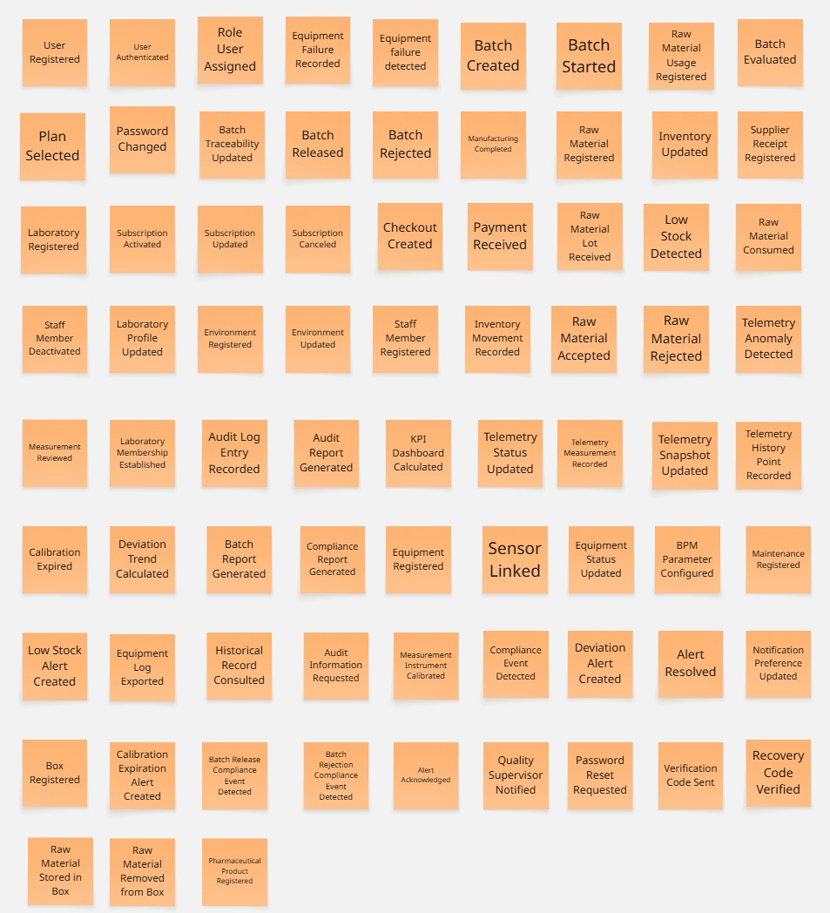

Entre los eventos identificados se encuentran:

- User Registered, User Authenticated, User Role Assigned, Password Changed, Password Reset Requested, Verification Code
  Sent y Recovery Code Verified.

- Plan Selected, Checkout Created, Payment Received, Subscription Activated, Subscription Updated y Subscription
  Canceled.

- Laboratory Registered, Laboratory Profile Updated, Environment Registered, Environment Updated, Staff Member
  Registered, Laboratory Membership Established, Staff Member Deactivated y Box Registered.

- Equipment Registered, Sensor Linked, BPM Parameter Configured, Maintenance Registered, Equipment Status Updated,
  Measurement Instrument Calibrated, Calibration Expired, Equipment Failure Detected y Equipment Failure Recorded.

- Telemetry Measurement Recorded, Telemetry History Point Recorded, Telemetry Anomaly Detected, Telemetry Snapshot
  Updated, Telemetry Status Updated y Measurement Reviewed.

- Raw Material Registered, Supplier Receipt Registered, Raw Material Lot Received, Raw Material Accepted, Raw Material
  Rejected, Inventory Updated, Inventory Movement Recorded, Raw Material Consumed, Low Stock Detected, Raw Material
  Stored in Box y Raw Material Removed from Box.

- Batch Created, Batch Started, Pharmaceutical Product Registered, Raw Material Usage Registered, Manufacturing
  Completed, Batch Evaluated, Batch Released, Batch Rejected y Batch Traceability Updated.

- Compliance Event Detected, Deviation Alert Created, Alert Acknowledged, Alert Resolved, Notification Preference
  Updated, Low Stock Alert Created, Calibration Expiration Alert Created, Batch Release Compliance Event Detected, Batch
  Rejection Compliance Event Detected y Quality Supervisor Notified.

- Audit Log Entry Recorded, Audit Information Requested, Historical Record Consulted, Audit Report Generated, Batch
  Report Generated, Compliance Report Generated, Equipment Log Exported, KPI Dashboard Calculated y Deviation Trend
  Calculated.

Durante esta etapa se priorizó que los eventos representaran hechos ocurridos dentro del dominio, evitando confundirlos
con acciones realizadas por un usuario. Por ello, las acciones como registrar, actualizar, consultar, crear o detectar
se expresaron como el resultado que se produce después de ejecutar una determinada operación. Por ejemplo, Create Batch
corresponde al comando, mientras que Batch Created representa el evento producido.

Asimismo, se conservaron algunos eventos provenientes del Big Picture EventStorming cuando estos continuaban siendo
relevantes para representar el comportamiento del sistema en el Design-Level. Entre ellos se encuentran Manufacturing
Completed, Batch Evaluated, Raw Material Accepted, Raw Material Rejected, Measurement Reviewed y Measurement Instrument
Calibrated. Esto permitió mantener la trazabilidad entre el proceso actual identificado durante el análisis del negocio
y el comportamiento propuesto para la solución.

**Paso 2: Timelines**

El segundo paso consistió en organizar los eventos de dominio identificados en el paso anterior mediante líneas de
tiempo. El objetivo fue establecer el orden cronológico natural en el que ocurren los hechos dentro de cada flujo.

Los eventos fueron organizados en secuencias horizontales, conectando aquellos que forman parte de un mismo proceso y
manteniendo separados los flujos que ocurren de manera independiente.

  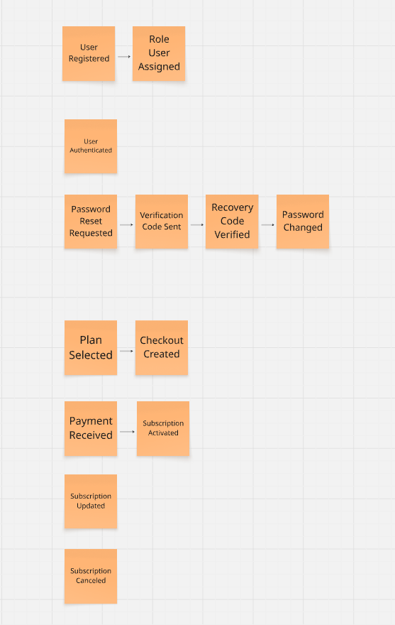

Se organizaron los eventos del IAM y Payments & Subscriptions en secuencias temporales, mostrando el orden en que
ocurren dentro de cada flujo. Se identificaron procesos independientes, como el registro y autenticación de usuarios, la
recuperación de contraseña y la gestión de suscripciones y pagos.

  

Se organizaron los eventos del Reporting & Audit según su secuencia. El flujo principal parte de la solicitud de
información de auditoría, continúa con la consulta del registro histórico y finaliza con la generación del reporte de
auditoría. También se ubicaron como procesos independientes la generación de reportes de lote y cumplimiento, la
exportación del registro de equipos, el cálculo del dashboard de KPIs y el cálculo de tendencias de desviaciones.

  

Se organizaron los eventos del Product Batch Management. El flujo inicia con la creación y comienzo del lote, seguido
del registro del producto farmacéutico y del uso de materias primas. Luego, tras completar la fabricación, el lote es
evaluado y puede continuar por dos caminos: Batch Released o Batch Rejected.

  

El flujo principal muestra la creación, reconocimiento y resolución de una alerta. También se presentan procesos
independientes relacionados con la detección de bajo stock y la creación de su alerta, la actualización de preferencias
de notificación y los eventos de cumplimiento asociados a la liberación o rechazo de lotes. Finalmente, se incluye la
notificación al supervisor de calidad.

  

El flujo inicia con el registro de la materia prima, la recepción del lote y su evaluación, que puede resultar en su
aceptación o rechazo. Cuando la materia prima es aceptada y almacenada, puede ser consumida, actualizando el inventario
y registrando el movimiento correspondiente. A partir de la actualización del inventario también se puede detectar un
nivel bajo de stock.

  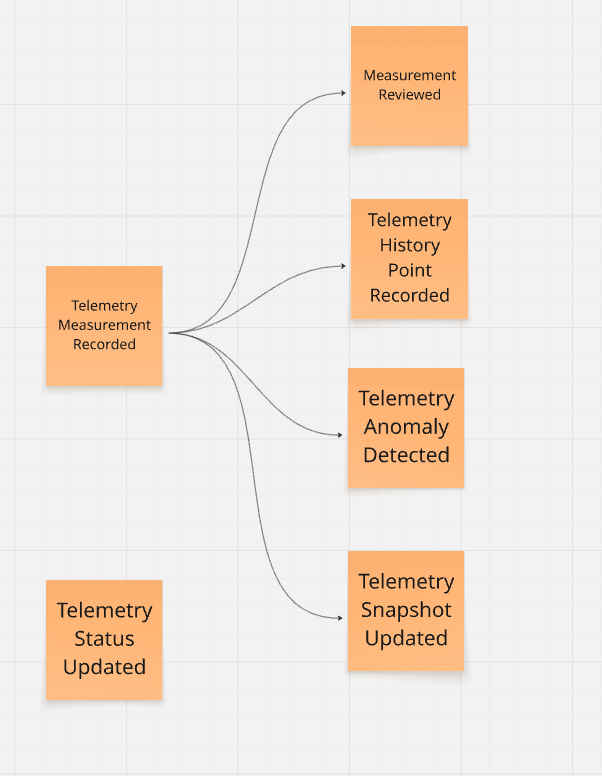

El flujo parte del registro de una medición de telemetría, a partir del cual se generan diferentes acciones: registrar
el punto histórico, revisar la medición, detectar anomalías y actualizar el estado de la telemetría. La actualización
del estado se mantiene como un proceso independiente.

  

En esta imagen se organizaron los eventos en tres flujos principales. El primero corresponde al registro y actualización
del laboratorio. El segundo muestra el registro y actualización de un ambiente, seguido del registro de un Box, que
funciona como contenedor de productos farmacéuticos y permite organizar su seguimiento mediante mediciones de
temperatura, calidad del aire, humedad y luminosidad. Finalmente, el tercer flujo representa el registro del personal,
el establecimiento de su membresía en el laboratorio y su posterior desactivación.

  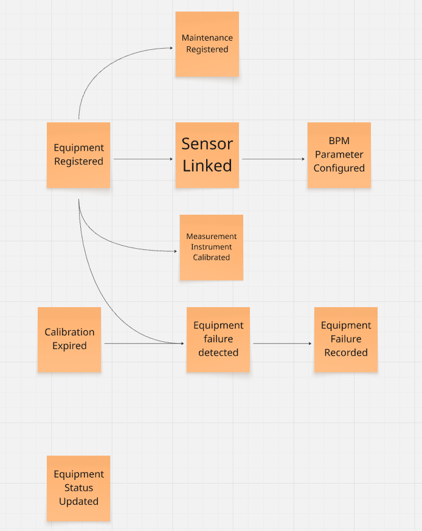

El flujo inicia con el registro del equipo, seguido de la vinculación del sensor y la configuración de sus parámetros
BPM. También se consideran el mantenimiento y la calibración del instrumento. Finalmente, se contempla la expiración de
la calibración, la detección y registro de fallas del equipo, además de la actualización de su estado.

**Resumen**

En el **flujo de gestión de usuarios,** se organizó la secuencia de registro, asignación de rol y autenticación, además
del flujo independiente de recuperación de contraseña mediante la solicitud, envío y verificación del código de
recuperación.

En el **flujo de suscripciones y pagos**, se estableció la secuencia desde la selección del plan y creación del checkout
hasta la recepción del pago y activación de la suscripción, considerando posteriormente su actualización o cancelación.

En el **flujo de gestión de laboratorios**, se organizaron los eventos relacionados con el registro y actualización del
laboratorio, el registro y actualización de ambientes, el registro de los Box como contenedores para los productos
farmacéuticos y la gestión del personal mediante su registro, membresía y desactivación.

En el **flujo de monitoreo de telemetría**, se estableció el registro de las mediciones y sus posibles derivaciones
hacia el registro histórico, detección de anomalías, actualización del estado y revisión de las mediciones.

En el **flujo de gestión de equipos**, se organizaron las actividades relacionadas con el registro del equipo,
vinculación del sensor, configuración de parámetros BPM, mantenimiento, calibración, detección y registro de fallas, así
como la actualización del estado del equipo.

En el **flujo de gestión de materias primas e inventario**, se estableció la secuencia de registro de la materia prima,
recepción del lote y su posterior aceptación o rechazo. Para los lotes aceptados se organizó el almacenamiento, consumo,
actualización del inventario, registro de movimientos y detección de bajo stock.

En el **flujo de fabricación y gestión de lotes**, se organizó la secuencia de creación e inicio del lote, registro del
producto farmacéutico y uso de materias primas, finalización de la fabricación y evaluación del lote, que posteriormente
puede resultar en su liberación o rechazo.

En el **flujo de gestión de alertas y cumplimiento**, se organizaron los eventos relacionados con la creación,
reconocimiento y resolución de alertas, la detección de bajo stock y los eventos de cumplimiento asociados a la
liberación o rechazo de lotes, además de la actualización de preferencias de notificación y la notificación al
supervisor de calidad.

Finalmente, en el **flujo de auditoría y generación de información**, se estableció la secuencia de solicitud de
información, consulta de registros históricos y generación del reporte de auditoría, además de los procesos
independientes de generación de reportes, cálculo de indicadores y tendencias y exportación de información.

La organización de estos flujos permitió establecer una visión cronológica del comportamiento del sistema y sirvió como
base para continuar con las siguientes etapas del Design-Level EventStorming.

**Paso 3: Paint Point**

El tercer paso consistió en identificar los pain points presentes en los flujos organizados durante el paso anterior.
Estos puntos representan dudas, ambigüedades o decisiones de diseño que requieren una definición adicional para
completar el comportamiento del sistema. En el tablero se representaron mediante tarjetas en forma de rombo de color
rosa.

  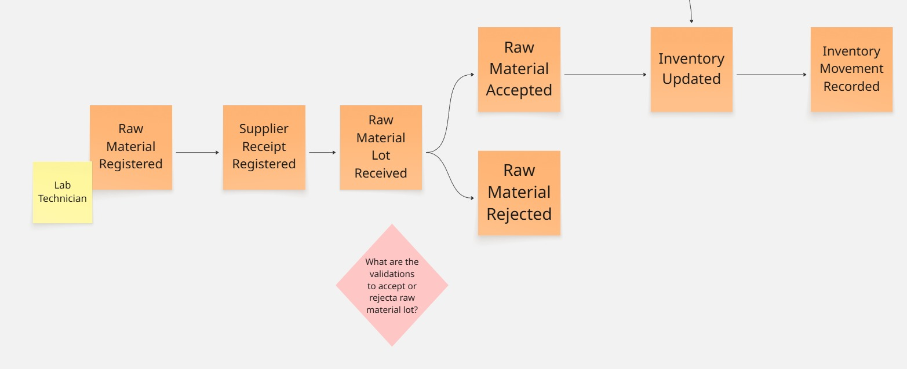

El Pain Point identificado en este flujo se relaciona con las validaciones necesarias para determinar si un lote de
materia prima debe ser aceptado o rechazado después de su recepción. La pregunta busca definir qué criterios deben
considerarse antes de actualizar el inventario con una materia prima aceptada.

  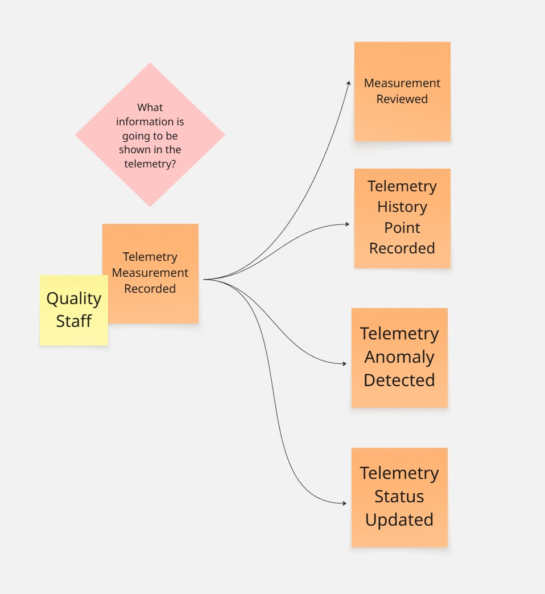

El Pain Point identificado en este flujo se relaciona con qué información debe mostrarse en la telemetría. Esto permite
definir los datos que se presentarán a partir de las mediciones registradas y que posteriormente podrán ser revisados,
almacenados en el historial, utilizados para detectar anomalías y actualizar el estado de la telemetría.

  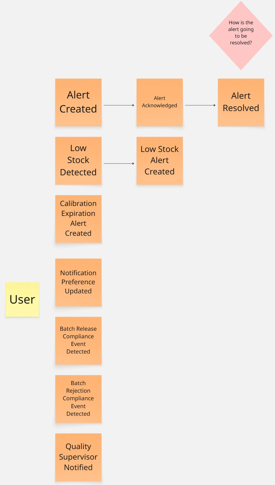

El Pain Point identificado en este flujo se relaciona con cómo se resolverá una alerta después de que ha sido creada y
reconocida. Esto permite definir el proceso necesario para llevar una alerta hasta su resolución.

  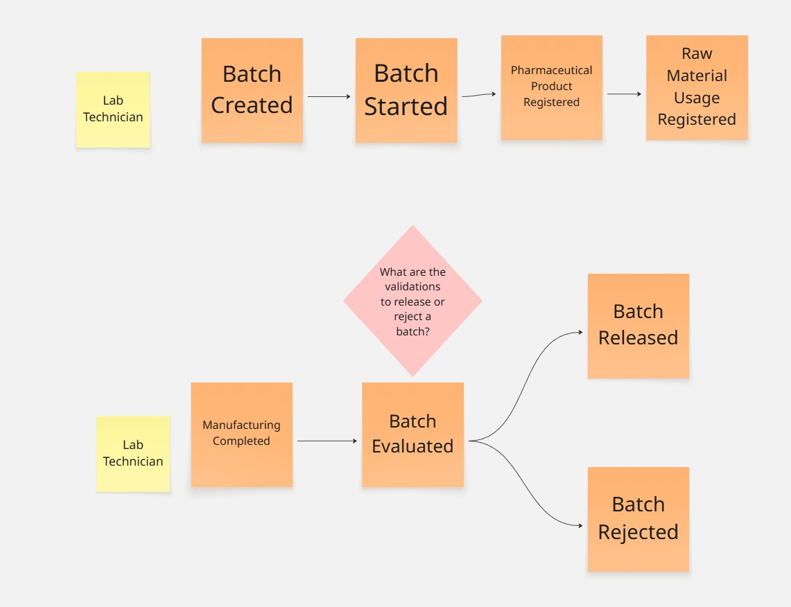

El Pain Point identificado en este flujo se relaciona con qué validaciones deben realizarse para determinar si un lote
puede ser liberado o debe ser rechazado después de completar su fabricación y evaluar el lote.

  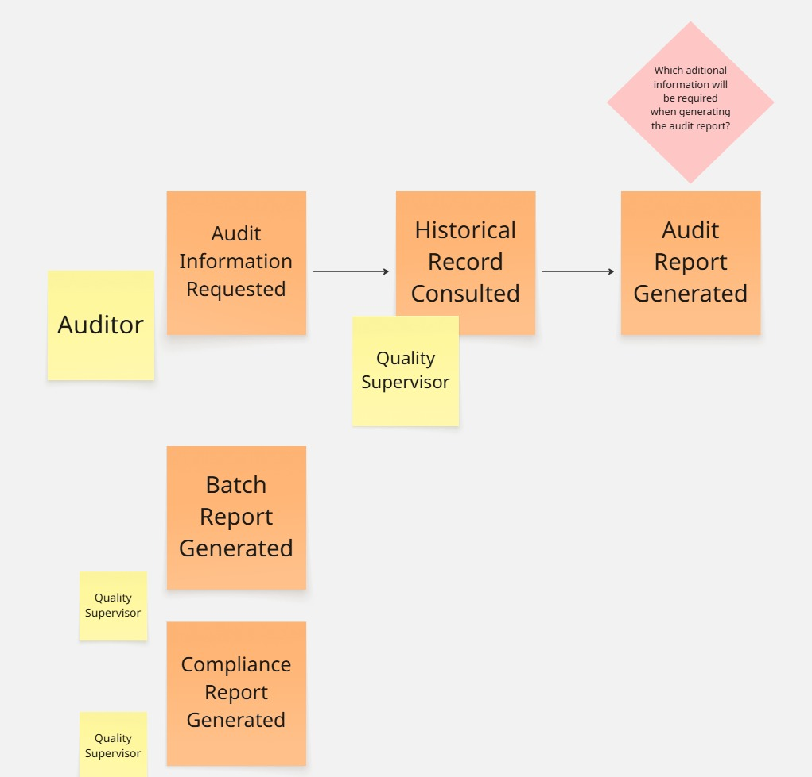

El Pain Point identificado en este flujo se relaciona con determinar qué información adicional debe incluirse al generar
un reporte de auditoría, a partir de la consulta de los registros históricos y la información solicitada por el auditor.

  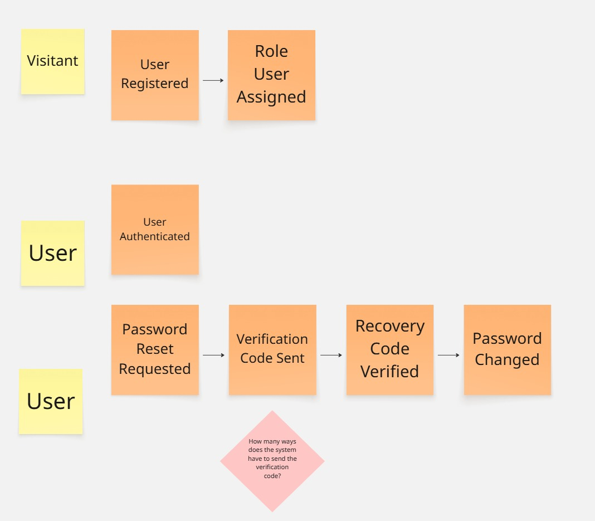

El Pain Point identificado en este flujo se relaciona con definir los medios disponibles para enviar el código de
verificación durante la recuperación de contraseña.

  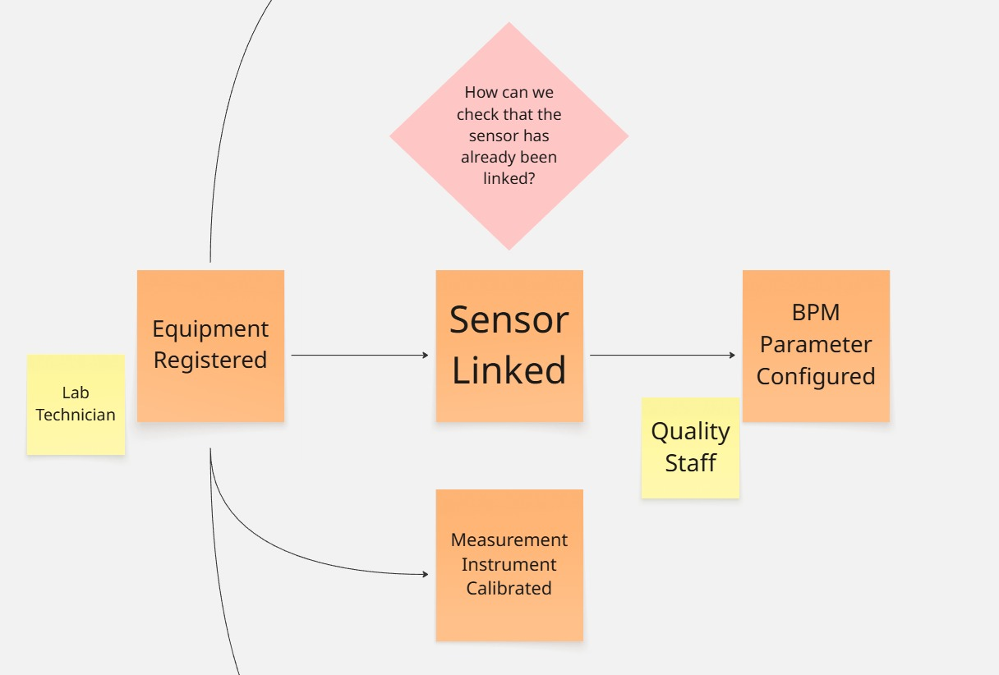

El Pain Point identificado en este flujo se relaciona con verificar si un sensor ya se encuentra vinculado a otro equipo
antes de realizar una nueva vinculación.

**Resumen de Pain Points**

- **How many ways does the system have to send the verification code?** Identificado en el flujo de recuperación de
  contraseña, donde se requiere definir el mecanismo mediante el cual se enviará el código de verificación.
- **Which additional information will be required when generating the audit report?** Identificado en el flujo de
  auditoría, debido a la necesidad de determinar qué información adicional será necesaria para generar el reporte de
  auditoría.
- **What are the validations to release or reject a batch?** Identificado en el flujo de evaluación de lotes, donde se
  requiere establecer las validaciones que determinarán si un lote será liberado o rechazado.
- **How is the alert going to be resolved?** Identificado en el flujo de gestión de alertas, debido a la necesidad de
  definir cómo se realizará la resolución de una alerta después de que haya sido reconocida.
- **What are the validations to accept or reject raw material lot?** Identificado en el flujo de recepción de materias
  primas, donde se requiere establecer las validaciones necesarias para aceptar o rechazar un lote recibido.
- **What information is going to be shown in the telemetry?** Identificado en el flujo de registro de telemetría, debido
  a la necesidad de determinar qué información será presentada a partir de las mediciones registradas.
- **How can we check that the sensor has already been linked?** Identificado en el flujo de registro y vinculación de
  equipos, debido a la necesidad de determinar cómo verificar que un sensor ya se encuentra vinculado antes de realizar
  una nueva asociación.

En conjunto, estos Pain Points permitieron identificar los aspectos del diseño que requerían una definición adicional
antes de continuar con la implementación de los flujos.

**Paso 4: Pivotal Points**

El cuarto paso consistió en identificar los pivotal points dentro de las líneas de tiempo previamente organizadas. Estos
puntos representan momentos de transición relevantes en los que ocurre un cambio significativo de estado, etapa o
responsabilidad dentro de los flujos del sistema. Para su representación se utilizaron líneas verticales de separación
sobre los eventos seleccionados.

  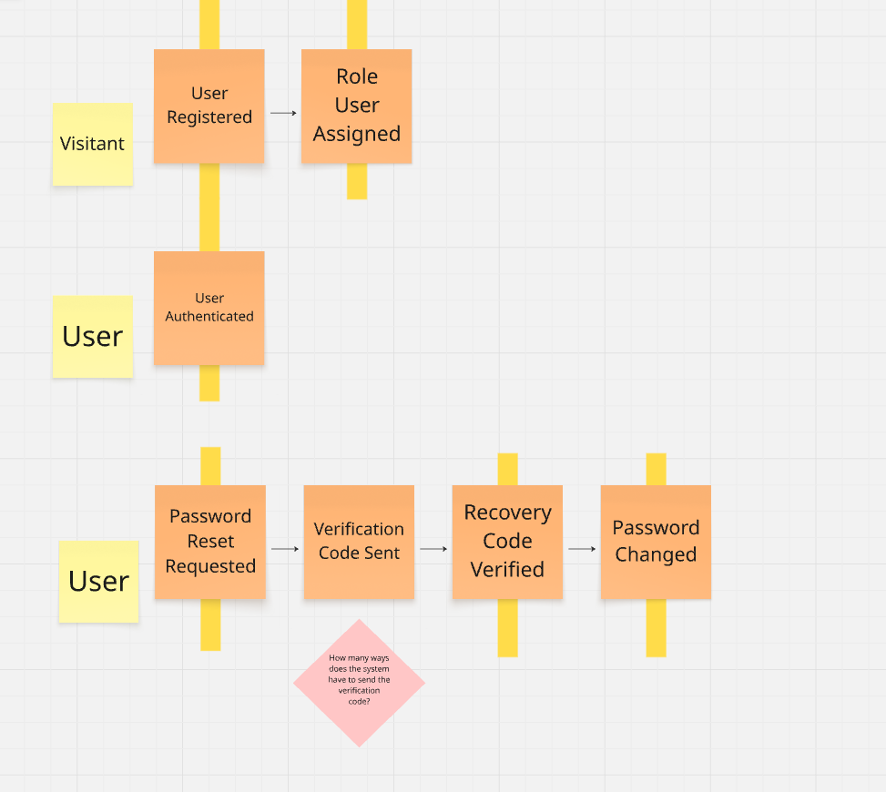

En el flujo de gestión de usuarios se identificaron como Pivotal Events User Registered, Role User Assigned, User
Authenticated, Password Reset Requested, Recovery Code Verified y Password Changed, debido a que representan cambios
relevantes en el estado del usuario o marcan el inicio y la finalización de procesos importantes. Por otro lado,
Verification Code Sent no se considera un Pivotal Event, ya que corresponde a un paso intermedio dentro del proceso de
recuperación de contraseña y no representa un cambio significativo de estado.

  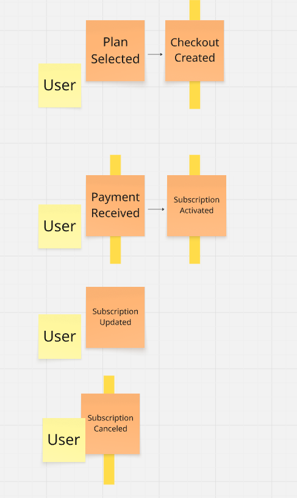

En el flujo de suscripciones y pagos se identificaron como Pivotal Events Checkout Created, Payment Received,
Subscription Activated y Subscription Canceled, debido a que representan cambios relevantes en el proceso de
contratación y en el estado de la suscripción. Por otro lado, Plan Selected y Subscription Updated no se consideran
Pivotal Events, ya que corresponden a acciones dentro del flujo que no representan un cambio significativo de estado.

  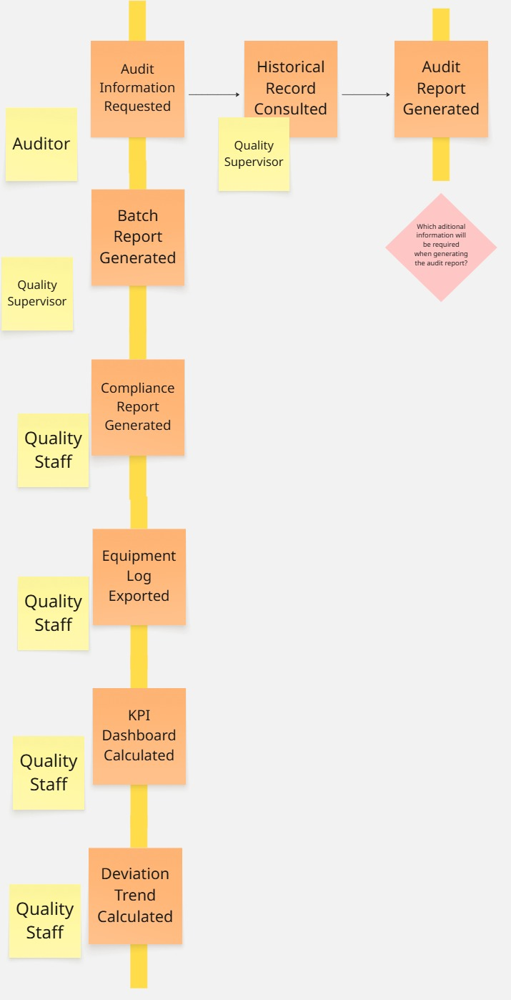

En el flujo de auditoría y generación de información se identificaron como Pivotal Events Audit Information Requested,
Audit Report Generated, Batch Report Generated, Compliance Report Generated, Equipment Log Exported, KPI Dashboard
Calculated y Deviation Trend Calculated, debido a que representan la generación o disponibilidad de información
relevante para auditorías, seguimiento y análisis. Por otro lado, Historical Record Consulted no se considera Pivotal
Event, ya que corresponde a una actividad intermedia dentro del proceso de generación del reporte de auditoría.

  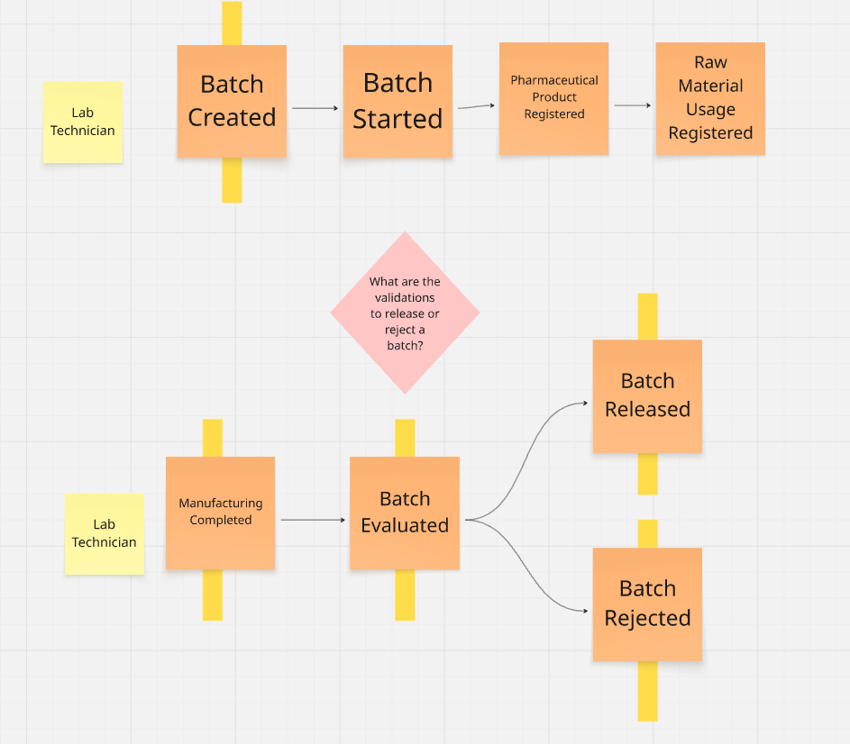

En el flujo de fabricación y gestión de lotes se identificaron como Pivotal Events Batch Created, Manufacturing
Completed, Batch Evaluated, Batch Released y Batch Rejected, debido a que representan cambios relevantes en el ciclo de
vida del lote, desde su creación y evaluación hasta la decisión final de liberarlo o rechazarlo. Por otro lado, Batch
Started, Pharmaceutical Product Registered y Raw Material Usage Registered no se consideran Pivotal Events, ya que
corresponden a actividades intermedias dentro del proceso.

  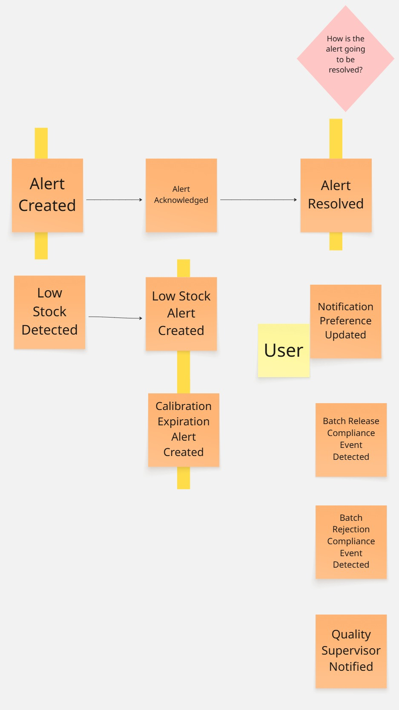

En el flujo de gestión de alertas y cumplimiento se identificaron como Pivotal Events Alert Created, Alert Resolved, Low
Stock Detected, Low Stock Alert Created y Calibration Expiration Alert Created, debido a que representan cambios
relevantes en la detección y gestión de situaciones que requieren atención. Por otro lado, Alert Acknowledged,
Notification Preference Updated, Batch Release Compliance Event Detected, Batch Rejection Compliance Event Detected y
Quality Supervisor Notified no se consideran Pivotal Events, ya que corresponden a acciones complementarias o pasos
intermedios del proceso.

  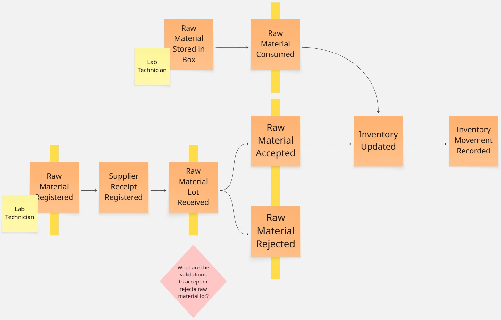

En el flujo de gestión de materias primas e inventario se identificaron como Pivotal Events Raw Material Registered, Raw
Material Lot Received, Raw Material Accepted, Raw Material Rejected y Raw Material Consumed, debido a que representan
cambios relevantes en el ciclo de vida de la materia prima, desde su registro y recepción hasta su aceptación, rechazo o
consumo. Por otro lado, Supplier Receipt Registered, Raw Material Stored in Box, Inventory Updated e Inventory Movement
Recorded no se consideran Pivotal Events, ya que corresponden a actividades de registro o actualización dentro del
proceso.

  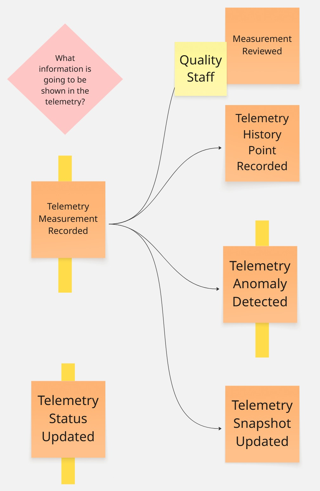

En el flujo de monitoreo de telemetría se identificaron como Pivotal Events Telemetry Measurement Recorded, Telemetry
Anomaly Detected y Telemetry Status Updated, debido a que representan cambios relevantes en el registro y estado de la
información de telemetría. Por otro lado, Measurement Reviewed, Telemetry History Point Recorded y Telemetry Snapshot
Updated corresponden a procesos de consulta, almacenamiento o actualización derivados de la medición registrada.

  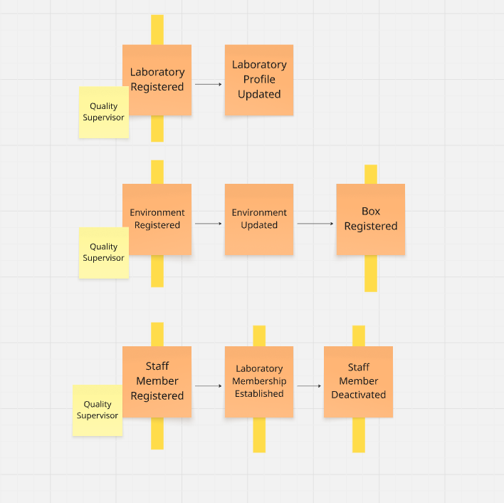

En el flujo de gestión de laboratorios se identificaron como Pivotal Events Laboratory Registered, Environment
Registered, Staff Member Registered, Laboratory Membership Established, Staff Member Deactivated y Box Registered debido
a que representan cambios relevantes en la creación y administración del laboratorio, sus ambientes, los contenedores
(Box) que tendra dicho ambiente del laboratorio y el personal asociado. Por otro lado, Laboratory Profile Updated y
Environment Updated no se consideran Pivotal Events, ya que corresponden a actualizaciones o acciones complementarias
dentro de estos procesos.

  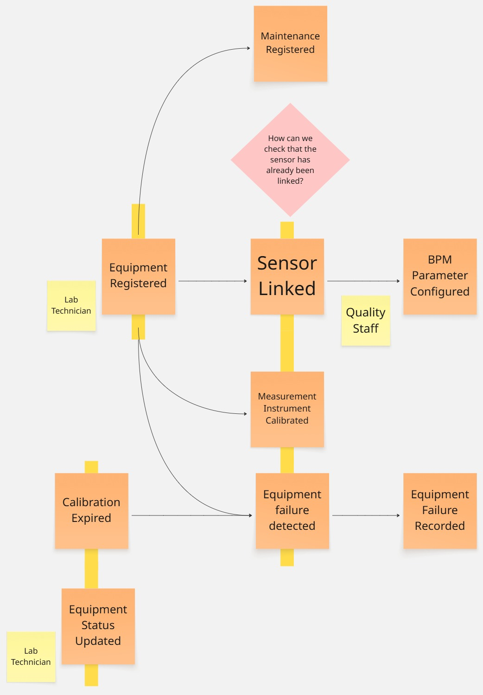

En el flujo de gestión de equipos se identificaron como Pivotal Events Equipment Registered, Sensor Linked, Measurement
Instrument Calibrated, Calibration Expired, Equipment Failure Detected y Equipment Status Updated, debido a que
representan cambios relevantes en el estado y ciclo de vida del equipo. Por otro lado, Maintenance Registered, BPM
Parameter Configured y Equipment Failure Recorded no se consideran Pivotal Events, ya que corresponden a actividades de
mantenimiento, configuración o registro dentro del proceso.

A partir de la revisión de los flujos, el equipo identificó los siguientes Pivotal Events:

- User Registered, Role User Assigned, User Authenticated, Password Reset Requested, Recovery Code Verified y Password
  Changed.
- Checkout Created, Payment Received, Subscription Activated y Subscription Canceled.
- Audit Information Requested, Audit Report Generated, Batch Report Generated, Compliance Report Generated, Equipment
  Log Exported, KPI Dashboard Calculated y Deviation Trend Calculated.
- Batch Created, Manufacturing Completed, Batch Evaluated, Batch Released y Batch Rejected.
- Raw Material Registered, Raw Material Lot Received, Raw Material Accepted, Raw Material Rejected, Raw Material
  Consumed y Low Stock Detected.
- Laboratory Registered, Environment Registered, Staff Member Registered, Laboratory Membership Established y Staff
  Member Deactivated.
- Equipment Registered, Sensor Linked, Measurement Instrument Calibrated, Calibration Expired, Equipment Failure
  Detected y Equipment Status Updated.
- Telemetry Measurement Recorded, Telemetry Anomaly Detected y Telemetry Status Updated.

Estos eventos fueron destacados en las líneas de tiempo mediante las líneas verticales, permitiendo visualizar los
principales puntos de transición identificados en el comportamiento diseñado para el sistema.

**Paso 5: Commands**

El quinto paso consistió en identificar los commands asociados a los eventos de dominio previamente definidos. Un
command representa la intención o acción que solicita la ejecución de una operación dentro del sistema y, cuando
corresponde, produce como resultado un evento de dominio. Para su representación se utilizaron tarjetas de color azul,
ubicadas antes del evento que generan.

  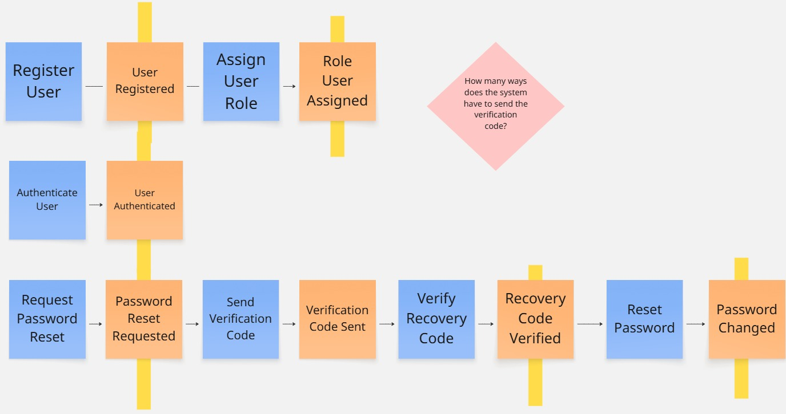

En esta etapa se identificaron los comandos asociados a las principales acciones del flujo de gestión de usuarios. Cada
comando representa una intención del usuario o del sistema que, al ejecutarse correctamente, genera un evento de
dominio. De esta manera, se estableció la relación entre las acciones realizadas y los cambios de estado producidos en
el sistema.

| **Comando**                | **Evento asociado**      | **Descripción**                                                                                                                     |
|----------------------------|--------------------------|-------------------------------------------------------------------------------------------------------------------------------------|
| **Register User**          | User Registered          | Permite registrar un nuevo usuario en el sistema, generando su registro correspondiente.                                            |
| **Assign User Role**       | Role User Assigned       | Permite asignar un rol al usuario registrado, definiendo los permisos que tendrá dentro del sistema.                                |
| **Authenticate User**      | User Authenticated       | Permite validar las credenciales del usuario para verificar su identidad y permitir el acceso al sistema.                           |
| **Request Password Reset** | Password Reset Requested | Permite iniciar el proceso de recuperación de contraseña cuando el usuario solicita restablecer su acceso.                          |
| **Send Verification Code** | Verification Code Sent   | Permite enviar un código de verificación al usuario como parte del proceso de recuperación de contraseña.                           |
| **Verify Recovery Code**   | Recovery Code Verified   | Permite comprobar que el código de recuperación ingresado por el usuario sea válido antes de continuar con el cambio de contraseña. |
| **Reset Password**         | Password Changed         | Permite establecer una nueva contraseña una vez que el proceso de recuperación ha sido validado correctamente.                      |

  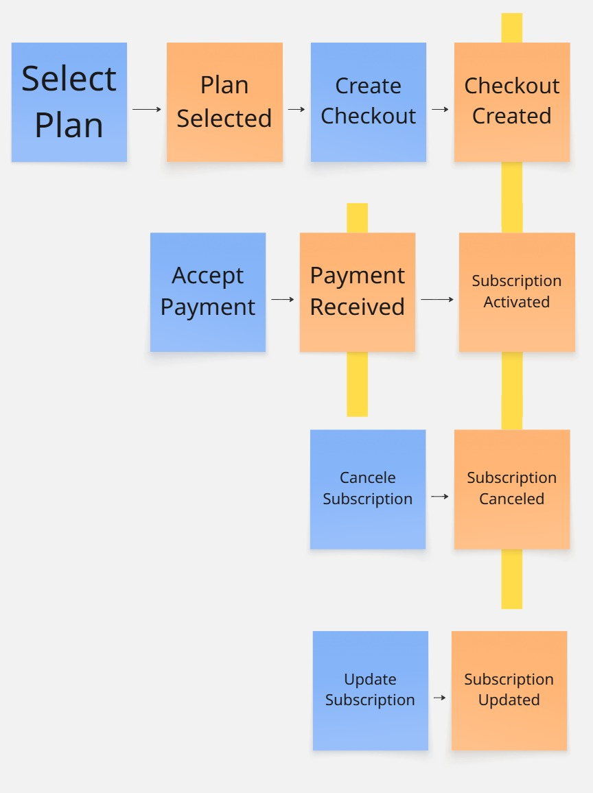

Se identificaron los comandos relacionados con la selección del plan, la creación del checkout, el procesamiento del
pago y la gestión posterior de la suscripción. Cada comando se encuentra asociado a un evento que representa el cambio
producido en el estado de la suscripción.

| **Comando**             | **Evento asociado**   | **Descripción**                                                                        |
|-------------------------|-----------------------|----------------------------------------------------------------------------------------|
| **Select Plan**         | Plan Selected         | Permite seleccionar el plan de suscripción que el usuario desea contratar.             |
| **Create Checkout**     | Checkout Created      | Permite crear el proceso de checkout para continuar con el pago del plan seleccionado. |
| **Accept Payment**      | Payment Received      | Permite procesar el pago correspondiente a la suscripción seleccionada.                |
| **Cancel Subscription** | Subscription Canceled | Permite cancelar una suscripción que se encuentra activa.                              |
| **Update Subscription** | Subscription Updated  | Permite modificar la configuración o condiciones de una suscripción existente.         |

  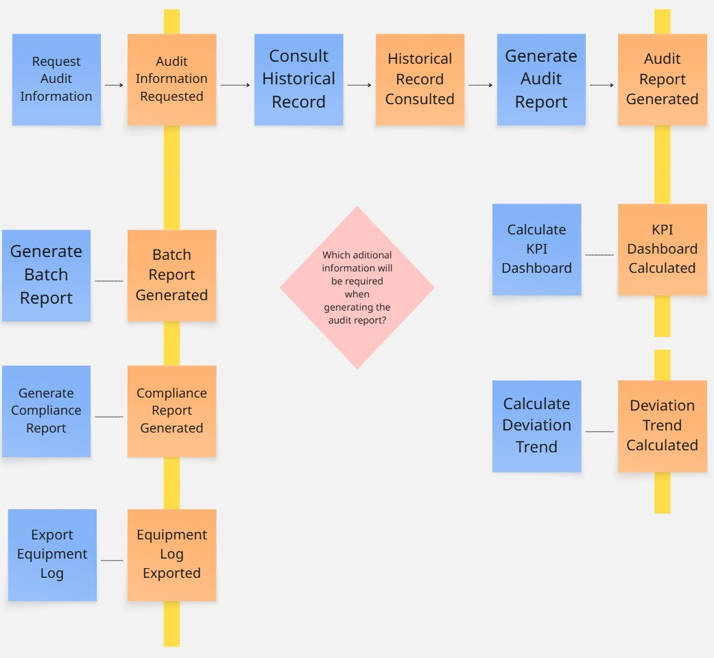

Se identificaron los comandos relacionados con la consulta de información histórica, generación de reportes, exportación
de registros y cálculo de indicadores. Cada comando produce un evento que representa el resultado de la operación
realizada dentro del contexto de auditoría y generación de información.

| **Comando**                    | **Evento asociado**         | **Descripción**                                                                                               |
|--------------------------------|-----------------------------|---------------------------------------------------------------------------------------------------------------|
| **Request Audit Information**  | Audit Information Requested | Permite solicitar la información necesaria para realizar una auditoría.                                       |
| **Consult Historical Record**  | Historical Record Consulted | Permite consultar los registros históricos disponibles para obtener información relacionada con la auditoría. |
| **Generate Audit Report**      | Audit Report Generated      | Permite generar el reporte de auditoría a partir de la información recopilada.                                |
| **Generate Batch Report**      | Batch Report Generated      | Permite generar un reporte con la información relacionada con los lotes registrados.                          |
| **Generate Compliance Report** | Compliance Report Generated | Permite generar un reporte relacionado con el cumplimiento de las condiciones y controles establecidos.       |
| **Export Equipment Log**       | Equipment Log Exported      | Permite exportar el registro histórico de información asociada a los equipos.                                 |
| **Calculate KPI Dashboard**    | KPI Dashboard Calculated    | Permite calcular los indicadores utilizados para mostrar el estado general del sistema mediante el dashboard. |
| **Calculate Deviation Trend**  | Deviation Trend Calculated  | Permite calcular la tendencia de las desviaciones registradas para facilitar su análisis histórico.           |

  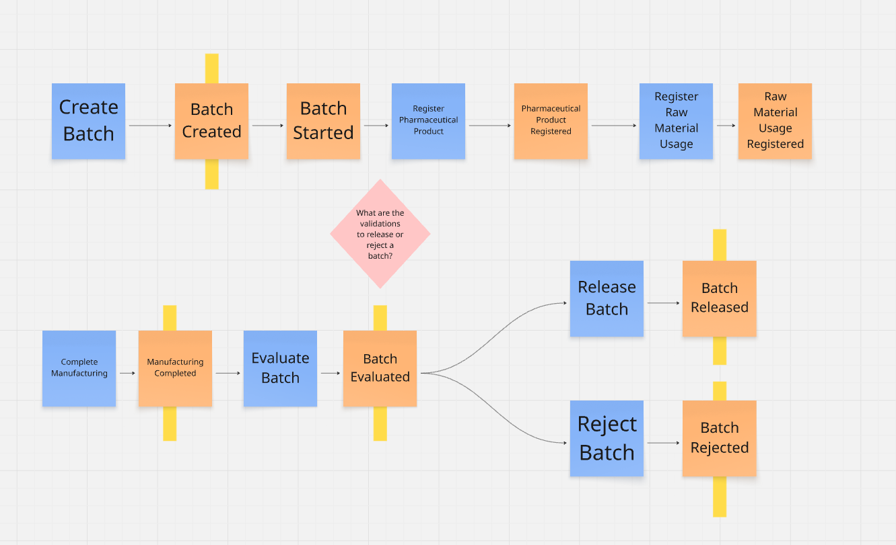

Se identificaron los comandos relacionados con la creación y evaluación de lotes, el registro del producto farmacéutico
y el uso de materias primas, así como la finalización de la fabricación. Finalmente, la evaluación del lote permite
determinar su liberación o rechazo, generando el evento correspondiente en cada caso.

| **Comando**                         | **Evento asociado**               | **Descripción**                                                                                              |
|-------------------------------------|-----------------------------------|--------------------------------------------------------------------------------------------------------------|
| **Create Batch**                    | Batch Created                     | Permite crear un nuevo lote de producción para iniciar su gestión y trazabilidad.                            |
| **Register Pharmaceutical Product** | Pharmaceutical Product Registered | Permite registrar el producto farmacéutico asociado al proceso de producción.                                |
| **Register Raw Material Usage**     | Raw Material Usage Registered     | Permite registrar las materias primas utilizadas durante la fabricación del lote.                            |
| **Complete Manufacturing**          | Manufacturing Completed           | Permite registrar la finalización del proceso de fabricación del lote.                                       |
| **Evaluate Batch**                  | Batch Evaluated                   | Permite evaluar el lote terminado de acuerdo con las validaciones establecidas para determinar su resultado. |
| **Release Batch**                   | Batch Released                    | Permite liberar el lote cuando cumple con las condiciones requeridas para su aprobación.                     |
| **Reject Batch**                    | Batch Rejected                    | Permite rechazar el lote cuando no cumple con las condiciones requeridas para su aprobación.                 |

  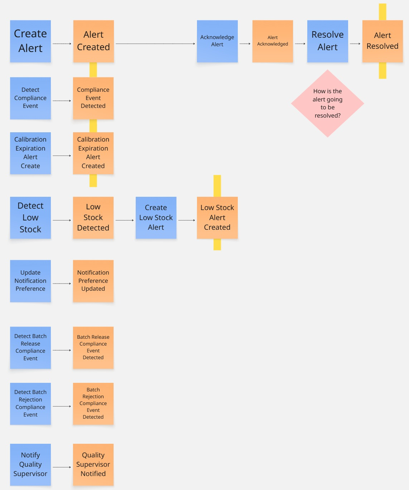

Se identificaron los comandos relacionados con la detección y gestión de eventos de cumplimiento, creación,
reconocimiento y resolución de alertas, así como el control de bajo stock y las preferencias de notificación. También se
consideraron los eventos de cumplimiento asociados a la liberación o rechazo de lotes y la notificación al supervisor de
calidad.

| **Comando**                                 | **Evento asociado**                       | **Descripción**                                                                                                    |
|---------------------------------------------|-------------------------------------------|--------------------------------------------------------------------------------------------------------------------|
| **Create Alert**                            | Alert Created                             | Permite crear una alerta cuando se identifica una situación que requiere atención.                                 |
| **Acknowledge Alert**                       | Alert Acknowledged                        | Permite registrar que una alerta ha sido reconocida y atendida por el responsable correspondiente.                 |
| **Resolve Alert**                           | Alert Resolved                            | Permite registrar la resolución de una alerta una vez atendida la situación que la originó.                        |
| **Detect Compliance Event**                 | Compliance Event Detected                 | Permite detectar y registrar un evento relacionado con el cumplimiento de las condiciones establecidas.            |
| **Detect Low Stock**                        | Low Stock Detected                        | Permite detectar una condición de bajo stock en las materias primas disponibles.                                   |
| **Create Low Stock Alert**                  | Low Stock Alert Created                   | Permite generar una alerta cuando se detecta que el nivel de stock se encuentra por debajo del límite establecido. |
| **Update Notification Preference**          | Notification Preference Updated           | Permite actualizar las preferencias de notificación configuradas por el usuario.                                   |
| **Detect Batch Release Compliance Event**   | Batch Release Compliance Event Detected   | Permite detectar un evento de cumplimiento relacionado con la liberación de un lote.                               |
| **Detect Batch Rejection Compliance Event** | Batch Rejection Compliance Event Detected | Permite detectar un evento de cumplimiento relacionado con el rechazo de un lote.                                  |
| **Notify Quality Supervisor**               | Quality Supervisor Notified               | Permite notificar al supervisor de calidad cuando una situación requiere su atención.                              |

  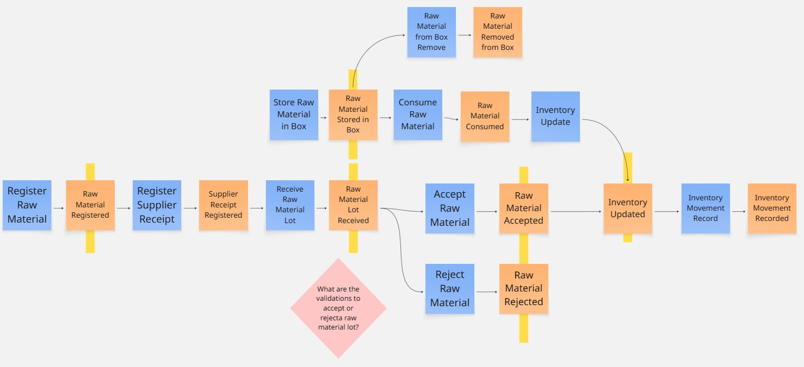

Se identificaron los comandos relacionados con el registro, recepción, aceptación y rechazo de materias primas, así como
con su almacenamiento, consumo y actualización de existencias. También se consideró el registro de los movimientos de
inventario para mantener la trazabilidad de las operaciones realizadas.

| **Comando**                      | **Evento asociado**           | **Descripción**                                                                                              |
|----------------------------------|-------------------------------|--------------------------------------------------------------------------------------------------------------|
| **Register Raw Material**        | Raw Material Registered       | Permite registrar una nueva materia prima dentro del inventario.                                             |
| **Register Supplier Receipt**    | Supplier Receipt Registered   | Permite registrar la recepción de materia prima proveniente de un proveedor.                                 |
| **Receive Raw Material Lot**     | Raw Material Lot Received     | Permite registrar la recepción de un lote específico de materia prima.                                       |
| **Accept Raw Material**          | Raw Material Accepted         | Permite aceptar un lote de materia prima después de realizar las validaciones correspondientes.              |
| **Reject Raw Material**          | Raw Material Rejected         | Permite rechazar un lote de materia prima cuando no cumple con las condiciones establecidas.                 |
| **Store Raw Material in Box**    | Raw Material Stored in Box    | Permite registrar el almacenamiento de la materia prima en un contenedor o box.                              |
| **Remove Raw Material from Box** | Raw Material Removed from Box | Permite registrar la salida de la materia prima almacenada en un box.                                        |
| **Consume Raw Material**         | Raw Material Consumed         | Permite registrar el consumo de una cantidad de materia prima durante un proceso de producción.              |
| **Update Inventory**             | Inventory Updated             | Permite actualizar las cantidades disponibles de materia prima después de una operación de inventario.       |
| **Record Inventory Movement**    | Inventory Movement Recorded   | Permite registrar el movimiento realizado sobre una materia prima para mantener su historial de operaciones. |

  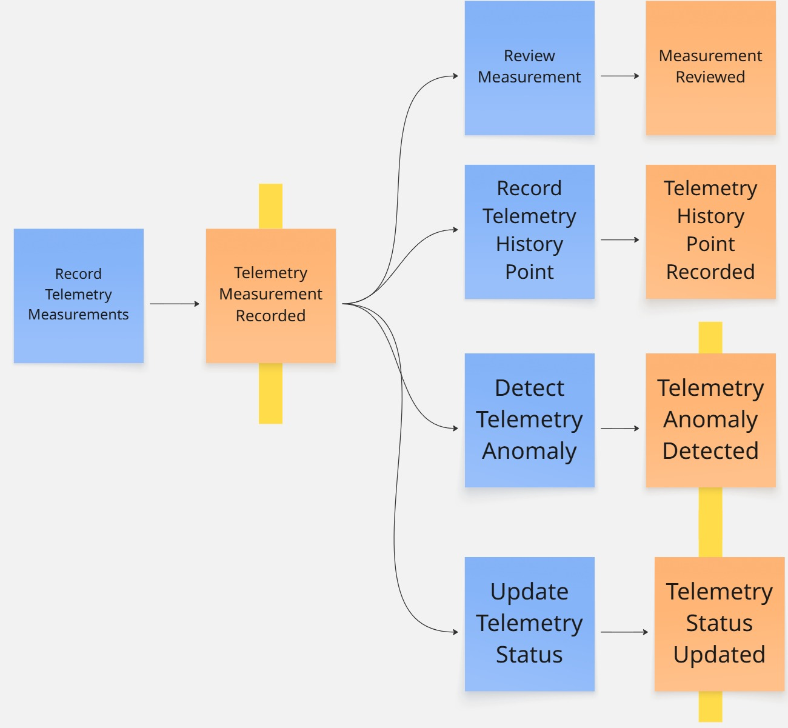

Se identificaron los comandos relacionados con el registro y revisión de las mediciones de telemetría. Además, se
consideraron las operaciones para mantener el historial, detectar anomalías y actualizar el estado de la telemetría a
partir de las mediciones registradas.

| **Comando**                        | **Evento asociado**              | **Descripción**                                                                                |
|------------------------------------|----------------------------------|------------------------------------------------------------------------------------------------|
| **Record Telemetry Measurements**  | Telemetry Measurement Recorded   | Permite registrar las mediciones obtenidas de los dispositivos de telemetría.                  |
| **Review Measurement**             | Measurement Reviewed             | Permite revisar una medición registrada para verificar la información obtenida.                |
| **Record Telemetry History Point** | Telemetry History Point Recorded | Permite registrar una medición como punto dentro del historial de telemetría.                  |
| **Detect Telemetry Anomaly**       | Telemetry Anomaly Detected       | Permite detectar una anomalía en los valores de telemetría registrados.                        |
| **Update Telemetry Status**        | Telemetry Status Updated         | Permite actualizar el estado actual de la telemetría de acuerdo con la información registrada. |

  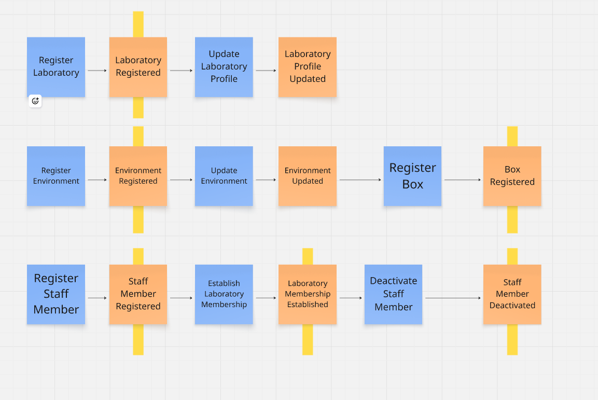

Se identificaron los comandos relacionados con el registro y actualización del laboratorio, sus ambientes y boxes,
además de la gestión de los miembros del personal y su pertenencia al laboratorio. También se consideró la desactivación
del personal cuando deja de formar parte del laboratorio.

| **Comando**                         | **Evento asociado**               | **Descripción**                                                                                                 |
|-------------------------------------|-----------------------------------|-----------------------------------------------------------------------------------------------------------------|
| **Register Laboratory**             | Laboratory Registered             | Permite registrar un nuevo laboratorio dentro del sistema.                                                      |
| **Update Laboratory Profile**       | Laboratory Profile Updated        | Permite actualizar la información y configuración básica del laboratorio.                                       |
| **Register Environment**            | Environment Registered            | Permite registrar un nuevo ambiente o área perteneciente al laboratorio.                                        |
| **Update Environment**              | Environment Updated               | Permite actualizar la información configurada para un ambiente del laboratorio.                                 |
| **Register Box**                    | Box Registered                    | Permite registrar un box dentro del ambiente para organizar los productos farmacéuticos que serán monitoreados. |
| **Register Staff Member**           | Staff Member Registered           | Permite registrar a un nuevo miembro del personal asociado al laboratorio.                                      |
| **Establish Laboratory Membership** | Laboratory Membership Established | Permite establecer la relación entre un miembro del personal y el laboratorio correspondiente.                  |
| **Deactivate Staff Member**         | Staff Member Deactivated          | Permite desactivar la participación de un miembro del personal dentro del laboratorio.                          |

  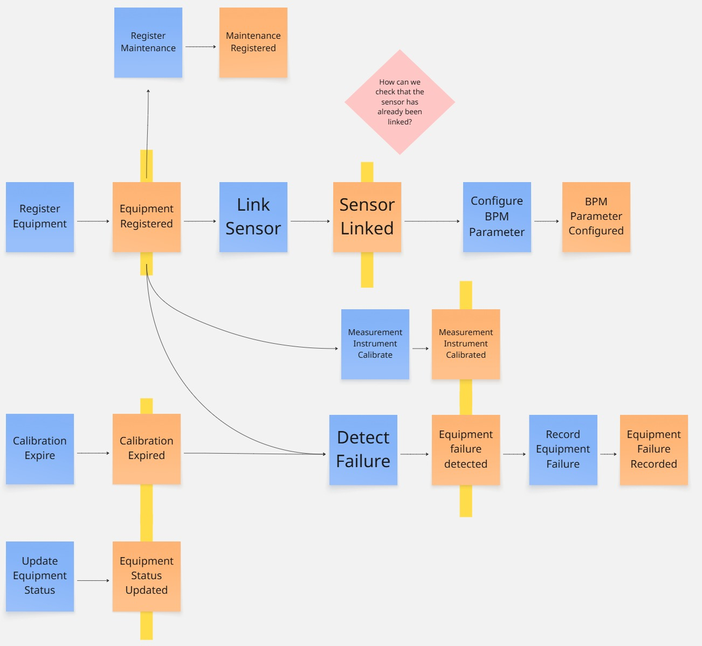

Se identificaron los comandos relacionados con el registro y mantenimiento de los equipos, la vinculación de sensores y
configuración de parámetros BPM. También se consideraron las operaciones de calibración, detección y registro de fallas,
así como la actualización del estado del equipo y la expiración de su calibración.

| **Comando**                          | **Evento asociado**               | **Descripción**                                                                                                 |
|--------------------------------------|-----------------------------------|-----------------------------------------------------------------------------------------------------------------|
| **Register Equipment**               | Equipment Registered              | Permite registrar un nuevo equipo dentro del sistema.                                                           |
| **Register Maintenance**             | Maintenance Registered            | Permite registrar las actividades de mantenimiento realizadas sobre un equipo.                                  |
| **Link Sensor**                      | Sensor Linked                     | Permite vincular un sensor con el equipo correspondiente.                                                       |
| **Configure BPM Parameter**          | BPM Parameter Configured          | Permite configurar los parámetros BPM asociados al equipo.                                                      |
| **Measurement Instrument Calibrate** | Measurement Instrument Calibrated | Permite registrar la calibración del instrumento de medición para asegurar su correcto funcionamiento.          |
| **Detect Failure**                   | Equipment Failure Detected        | Permite registrar la detección de una falla en el equipo.                                                       |
| **Record Equipment Failure**         | Equipment Failure Recorded        | Permite registrar formalmente la falla detectada y mantener su información como parte del historial del equipo. |
| **Update Equipment Status**          | Equipment Status Updated          | Permite actualizar el estado operativo del equipo.                                                              |
| **Calibration Expire**               | Calibration Expired               | Representa la expiración de la calibración del equipo cuando se alcanza el periodo establecido.                 |

Los comandos identifacdos abarcan las principales operaciones de gestión de usuarios y autenticación, suscripciones y
pagos, auditoría y generación de reportes, gestión de lotes y materias primas, monitoreo de telemetría, gestión de
laboratorios y equipos, y control de alertas y cumplimiento. De esta manera, se estableció una relación clara entre las
acciones realizadas y los eventos generados, permitiendo definir de forma más estructurada los flujos funcionales de la
solución.

**Paso 6: Policies and Actors**

El sexto paso incorporó al modelo los actores y las políticas del sistema. Los actores se representan mediante tarjetas
pequeñas de color amarillo y permiten identificar quién inicia o participa en los diferentes flujos. Las políticas,
representadas mediante tarjetas de color lila, corresponden a reglas automáticas que se ejecutan después de determinados
eventos y desencadenan nuevas acciones dentro del sistema.

  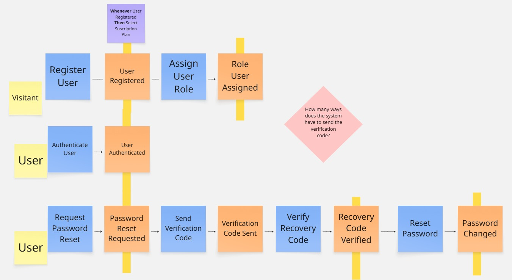

Se identificaron los actores y las políticas que intervienen en el flujo de gestión de usuarios. El Visitante participa
en el registro inicial, mientras que el Usuario interviene en la autenticación y en el proceso de recuperación de
contraseña. A partir del registro, se realiza la asignación del rol correspondiente y, posteriormente, el usuario puede
autenticarse en el sistema. En el caso de la recuperación de contraseña, el usuario solicita el restablecimiento, recibe
un código de verificación, este es validado y finalmente se realiza el cambio de contraseña. Además, se estableció la
política que indica que, después del registro del usuario, debe realizarse la selección de un plan de suscripción.

  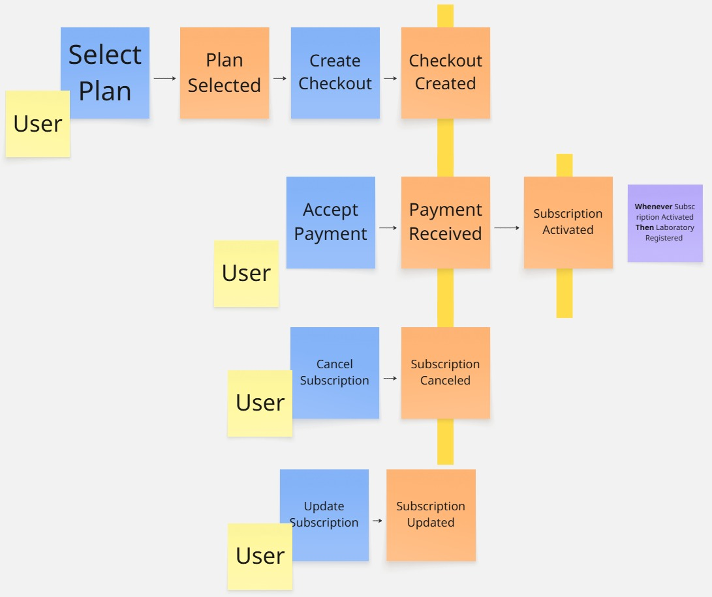

Se identificaron los actores y las políticas relacionadas con la gestión de suscripciones. El Usuario participa en la
selección del plan, la aceptación del pago, así como en la actualización o cancelación de su suscripción. El flujo
inicia con la selección del plan y la creación del checkout; posteriormente, al recibir el pago, la suscripción es
activada. Como política, se establece que cuando la suscripción es activada, se procede con el registro del laboratorio.
Asimismo, el usuario puede actualizar o cancelar su suscripción según corresponda.

  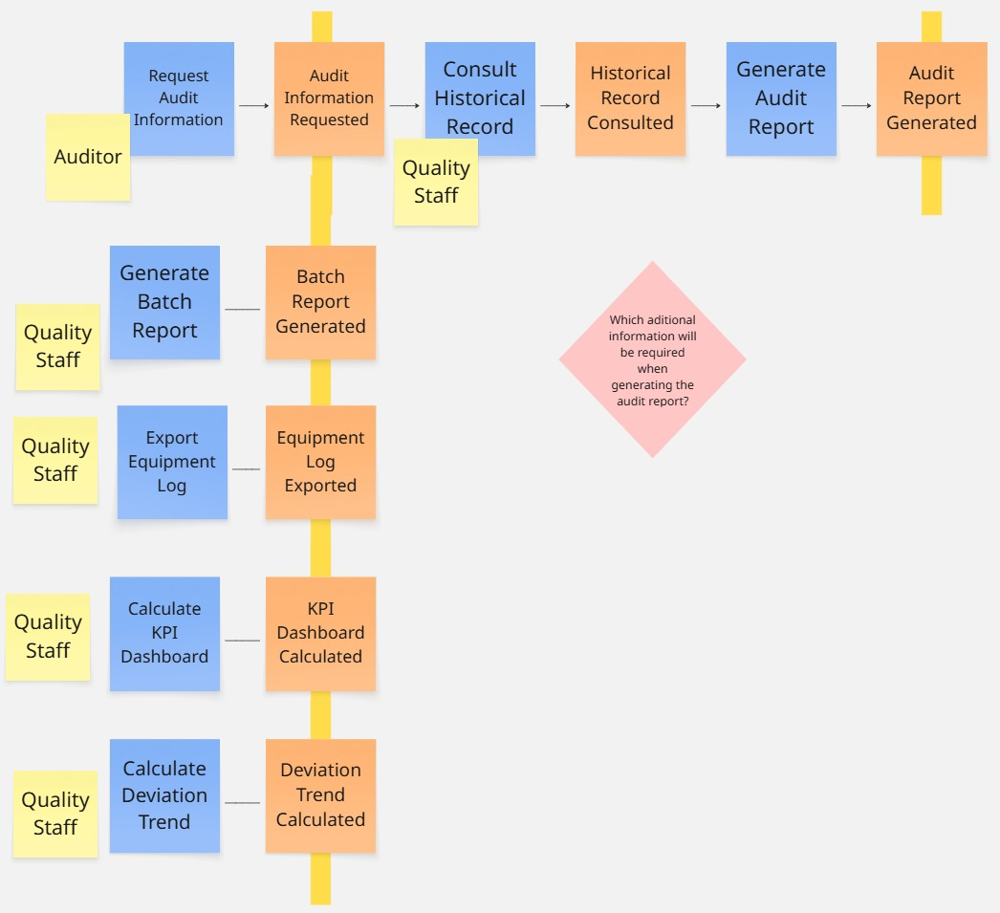

Se identificaron los actores y las políticas relacionadas con la auditoría y generación de información. El Auditor
participa solicitando la información de auditoría, mientras que el Quality Staff interviene en la consulta de registros
históricos, generación de reportes, exportación de registros de equipos y cálculo de indicadores si los auditores lo
solicitan.

  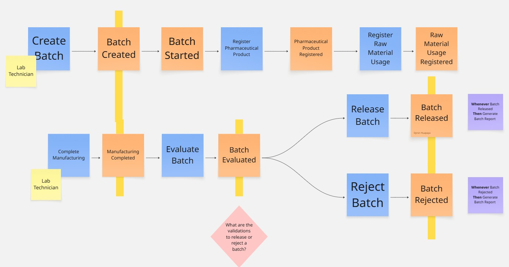

En esta etapa se identificaron los actores y las políticas relacionadas con la gestión de lotes. El Lab Technician
participa en la creación del lote, el inicio del proceso y el registro del uso de materias primas, así como en la
finalización de la fabricación. Posteriormente, el lote es evaluado y puede ser liberado o rechazado según las
validaciones establecidas. Como políticas, se contempla que cuando un lote es liberado se genere un reporte del lote,
mientras que ante un rechazo también se genere el reporte correspondiente. Además, se identifica como punto pendiente
definir las validaciones necesarias para determinar si un lote puede ser liberado o rechazado.

  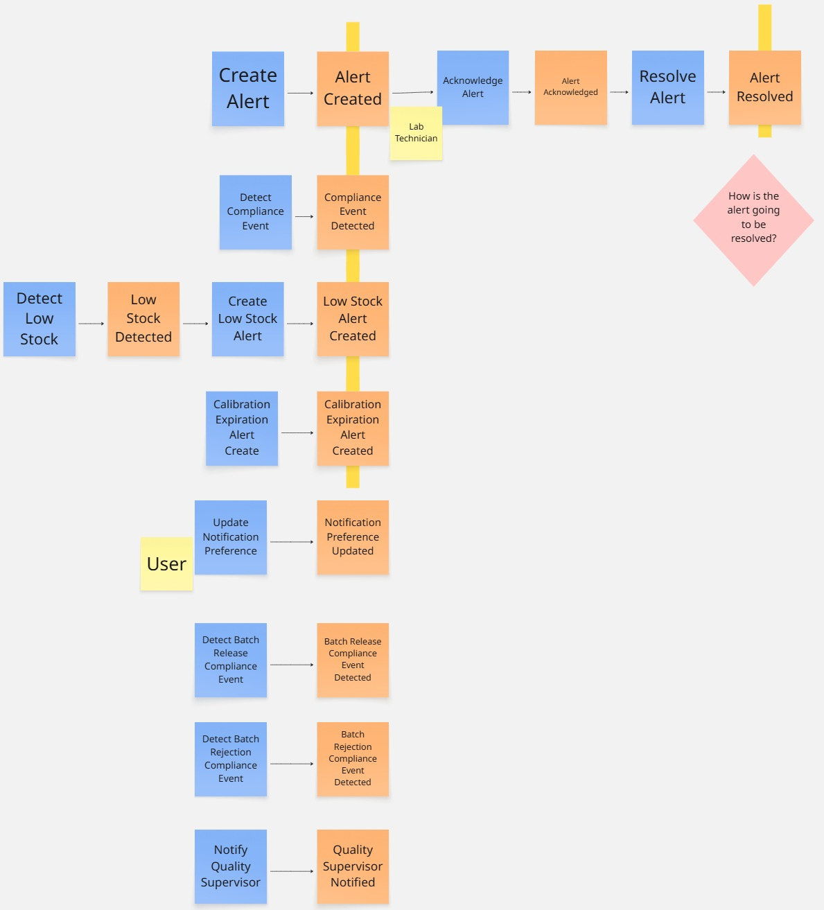

En esta etapa se identificaron los actores y las políticas relacionadas con la gestión de alertas y cumplimiento. El Lab
Technician participa en el reconocimiento de las alertas, mientras que el User puede actualizar sus preferencias de
notificación. El flujo contempla la creación, reconocimiento y resolución de alertas, además de la detección de eventos
de cumplimiento, bajo stock y vencimiento de calibraciones. También se consideran eventos asociados a la liberación o
rechazo de lotes y la notificación al Quality Supervisor.

  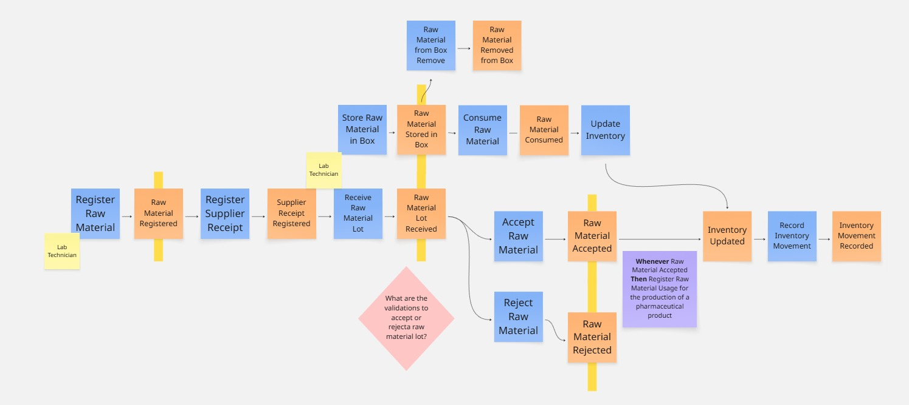

En esta etapa se identificaron los actores y las políticas relacionadas con la gestión de materias primas e inventario.
El Lab Technician participa en el registro de la materia prima, la recepción del lote, su almacenamiento y las
actividades de consumo. El lote recibido puede ser aceptado o rechazado según las validaciones establecidas. Cuando una
materia prima es aceptada, se actualiza el inventario y se registra el movimiento correspondiente; posteriormente, puede
ser consumida para la producción y retirarse del box cuando sea necesario. Como política, se establece que cuando una
materia prima es aceptada, puede registrarse su uso para la producción de un producto farmacéutico.

  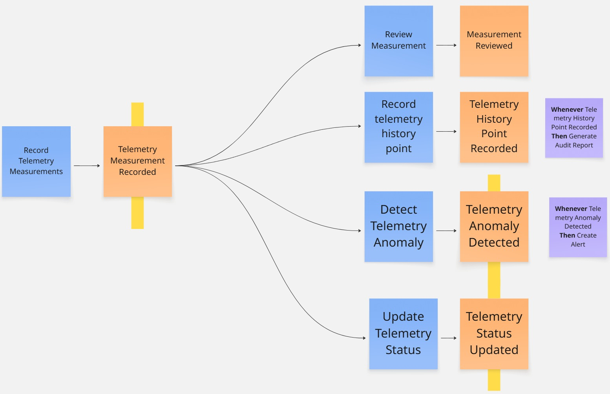

En esta etapa se identificaron los actores y las políticas relacionadas con el monitoreo de telemetría. El flujo parte
del registro de las mediciones de telemetría, a partir del cual se puede consultar el historial, revisar las mediciones,
detectar anomalías y actualizar el estado de la telemetría. Como políticas, se establece que cuando se registra un punto
del historial de telemetría, se puede generar un reporte de auditoría, y que cuando se detecta una anomalía de
telemetría, se debe crear una alerta.

  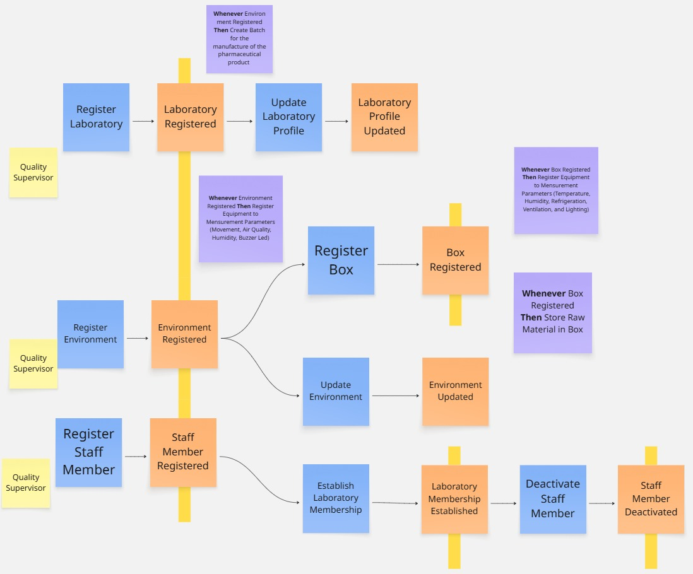

En esta etapa se identificaron los actores y las políticas relacionadas con la gestión del laboratorio. El Quality
Supervisor participa en el registro y actualización del laboratorio y sus ambientes, así como en el registro del
personal y la gestión de su pertenencia al laboratorio. También se contempla el registro de boxes dentro de los
ambientes para organizar los espacios donde se realizan las mediciones y el almacenamiento de materias primas.

Como políticas, se establece que cuando se registra un ambiente, se debe registrar el equipo necesario para medir los
parámetros correspondientes; cuando se registra un box, se deben registrar los equipos de medición y posteriormente se
puede almacenar materia prima en él. Asimismo, cuando se registra un ambiente, se contempla la creación de un lote para
la fabricación del producto farmacéutico.

  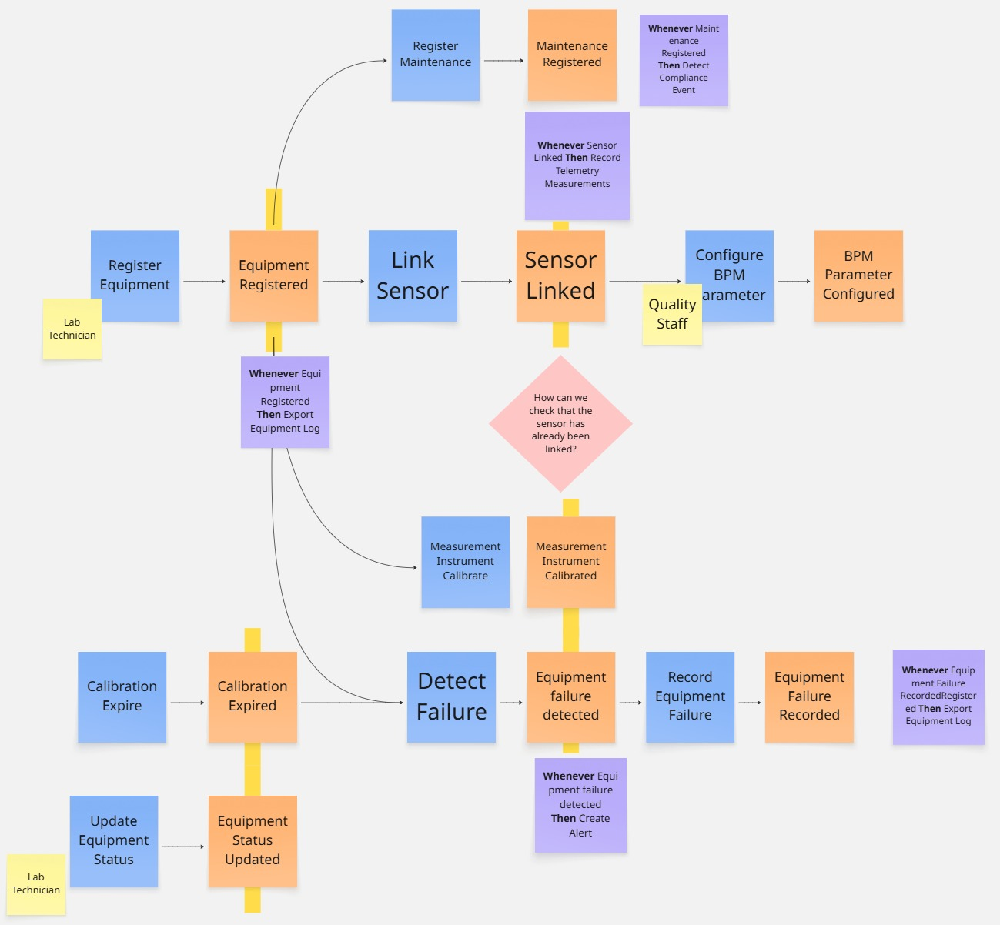

En esta etapa se identificaron los actores y las políticas relacionadas con la gestión de equipos. El Lab Technician
participa en el registro y actualización del equipo, mantenimiento y calibración, mientras que el Quality Staff
interviene en la configuración de los parámetros BPM. El flujo también contempla la vinculación de sensores, la
detección y registro de fallas y la expiración de la calibración.

Como políticas, se establece que cuando un sensor es vinculado, se deben registrar las mediciones de telemetría; cuando
se registra un mantenimiento, se debe detectar el evento de cumplimiento correspondiente; y cuando se detecta o registra
una falla del equipo, se generan acciones relacionadas con la auditoría y las alertas. Además, cuando se registra un
equipo, se contempla la exportación de su registro para las auditorias.

**Resumen**

Las políticas se redactaron siguiendo la estructura “Whenever Event X, then Command Y”, indicando que, cuando ocurre un
determinado evento, se ejecuta el comando correspondiente. De esta manera, se representan de forma clara las reglas que
conectan los eventos del dominio con las acciones que debe realizar el sistema.

| N.° | Política                                                                                                                                        | Descripción                                                                                                                                                            |
|-----|-------------------------------------------------------------------------------------------------------------------------------------------------|------------------------------------------------------------------------------------------------------------------------------------------------------------------------|
| 1   | **Whenever Sensor Linked Then Record Telemetry Measurements**                                                                                   | Cuando un sensor es vinculado, se inicia automáticamente el registro de las mediciones de telemetría.                                                                  |
| 2   | **Whenever Maintenance Registered Then Detect Compliance Event**                                                                                | Cuando se registra un mantenimiento, se genera automáticamente la detección de un evento relacionado con el cumplimiento.                                              |
| 3   | **Whenever Equipment failure detected Then Create Alert**                                                                                       | Cuando se detecta una falla en un equipo, se crea automáticamente una alerta para su atención.                                                                         |
| 4   | **Whenever Box Registered Then Store Raw Material in Box**                                                                                      | Cuando se registra una caja, se inicia automáticamente el almacenamiento de la materia prima en dicha caja.                                                            |
| 5   | **Whenever Box Registered Then Register Equipment to Mensurement Parameters (Temperature, Humidity, Refrigeration, Ventilation, and Lighting)** | Cuando se registra una caja, se inicia el registro del equipo asociado a los parámetros de medición de temperatura, humedad, refrigeración, ventilación e iluminación. |
| 6   | **Whenever Environment Registered Then Create Batch for the manufacture of the pharmaceutical product**                                         | Cuando se registra un ambiente, se inicia automáticamente la creación de un lote destinado a la fabricación de un producto farmacéutico.                               |
| 7   | **Whenever Environment Registered Then Register Equipment to Mensurement Parameters (Movement, Air Quality, Humidity, Buzzer Led)**             | Cuando se registra un ambiente, se inicia el registro del equipo asociado a los parámetros de movimiento, calidad del aire, humedad y buzzer LED.                      |
| 8   | **Whenever Environment Registered Then Create Batch for the manufacture of the pharmaceutical product**                                         | Cuando se registra un ambiente, se inicia automáticamente la creación de un lote destinado a la fabricación de un producto farmacéutico.                               |
| 9   | **Whenever Raw Material Accepted Then Register Raw Material Usage for the production of a pharmaceutical product**                              | Cuando una materia prima es aceptada, se inicia automáticamente el registro de su utilización para la producción de un producto farmacéutico.                          |
| 10  | **Whenever Subscription Activated Then Laboratory Registered**                                                                                  | Cuando una suscripción es activada, se registra automáticamente el laboratorio correspondiente.                                                                        |
| 11  | **Whenever User Registered Then Select Subscription Plan**                                                                                      | Cuando un usuario es registrado, se inicia automáticamente la selección del plan de suscripción.                                                                       |
| 12  | **Whenever Batch Released Then Detect Batch Release Compliance Event**                                                                          | Cuando un lote es liberado, se detecta automáticamente un evento de cumplimiento asociado a la liberación del lote.                                                    |
| 13  | **Whenever Batch Released Then Generate Batch Report**                                                                                          | Cuando un lote es liberado, se genera automáticamente el reporte correspondiente al lote.                                                                              |
| 14  | **Whenever Batch Rejected Then Generate Batch Report**                                                                                          | Cuando un lote es rechazado, se genera automáticamente el reporte correspondiente al lote.                                                                             |
| 15  | **Whenever Batch Rejected Then Detect Batch Rejected Compliance Event**                                                                         | Cuando un lote es rechazado, se detecta automáticamente un evento de cumplimiento asociado al rechazo del lote.                                                        |

Los actores identificados fueron las siguientes:

| Actor                  | Participación principal                                                               |
|------------------------|---------------------------------------------------------------------------------------|
| **Visitor**            | Usuario visitante provediente de un pagina estatica.                                  |
| **User**               | Autenticación, recuperación de contraseña y gestión de suscripción.                   |
| **Lab Technician**     | Registro y operación de lotes, materias primas, equipos y actividades de laboratorio. |
| **Quality Staff**      | Registro y revisión de mediciones, telemetría y parámetros de calidad.                |
| **Quality Supervisor** | Gestión y supervisión de laboratorios, ambientes, personal y procesos de calidad.     |
| **Auditor**            | Solicitud y revisión de información histórica y reportes de auditoría.                |

#### 4.1.1.1 Candidate Context Discovery.

Luego de identificar los eventos, flujos, comandos y políticas del dominio, el equipo avanzó con la detección de
contextos candidatos. Esta fase les permitió organizar los elementos vinculados de acuerdo con su cohesión funcional y
las reglas de negocio que compartían, lo que facilitó la definición de los futuros Bounded Contexts. De este modo, el
equipo logro modelar el dominio de Qualitrack en contextos con responsabilidades claramente separadas.

**Paso 7: Read Models**

El séptimo paso consistió en identificar los Read Models del sistema. Estos representan las vistas o conjuntos de
información que los actores consultan antes de ejecutar determinados comandos. Se representan mediante tarjetas de color
verde y permiten disponer de la información necesaria para realizar una acción dentro de cada bounded context.

  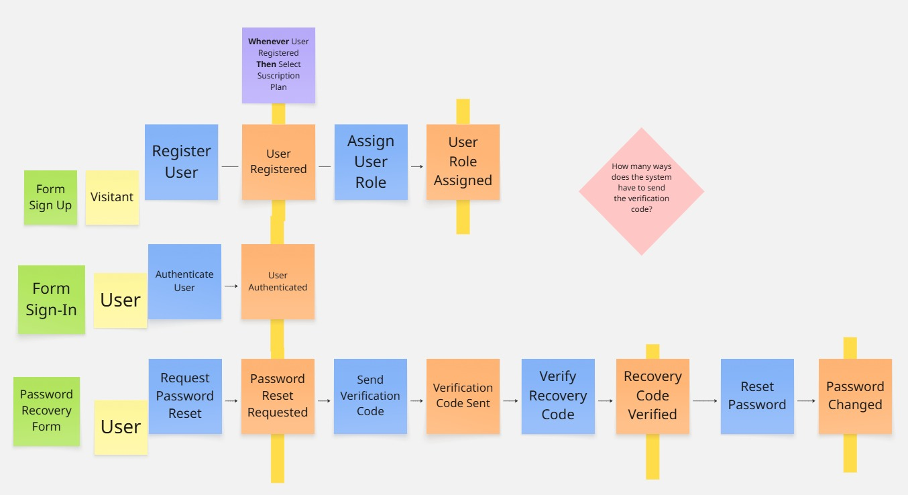

Se identificaron tres Read Models principales que representan la información presentada al usuario durante los procesos
de gestión de acceso. El Form Sign Up permite al visitante ingresar la información necesaria para iniciar su registro en
el sistema. El Form Sign-In presenta los campos requeridos para que un usuario pueda ingresar sus credenciales y
realizar la autenticación. Finalmente, el Password Recovery Form permite al usuario iniciar y continuar el proceso de
recuperación de su contraseña, incluyendo la verificación necesaria antes de establecer una nueva contraseña.

  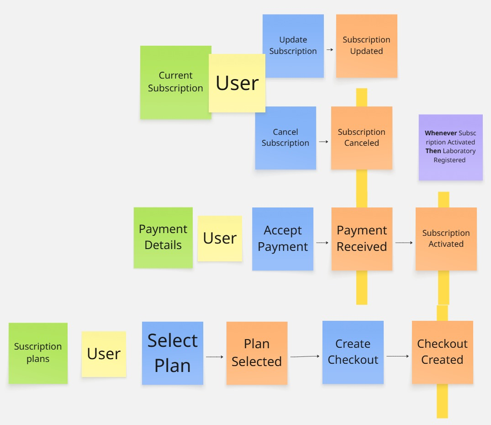

Se identificaron tres Read Models principales que permiten al usuario consultar la información necesaria para gestionar
su suscripción. Subscription Plans presenta los planes disponibles para que el usuario pueda seleccionar la opción que
desea contratar. Payment Details permite visualizar la información necesaria relacionada con el pago durante el proceso
de suscripción. Finalmente, Current Subscription muestra la información correspondiente a la suscripción vigente del
usuario, permitiendo consultar su estado y gestionar acciones posteriores, como su actualización o cancelación.

  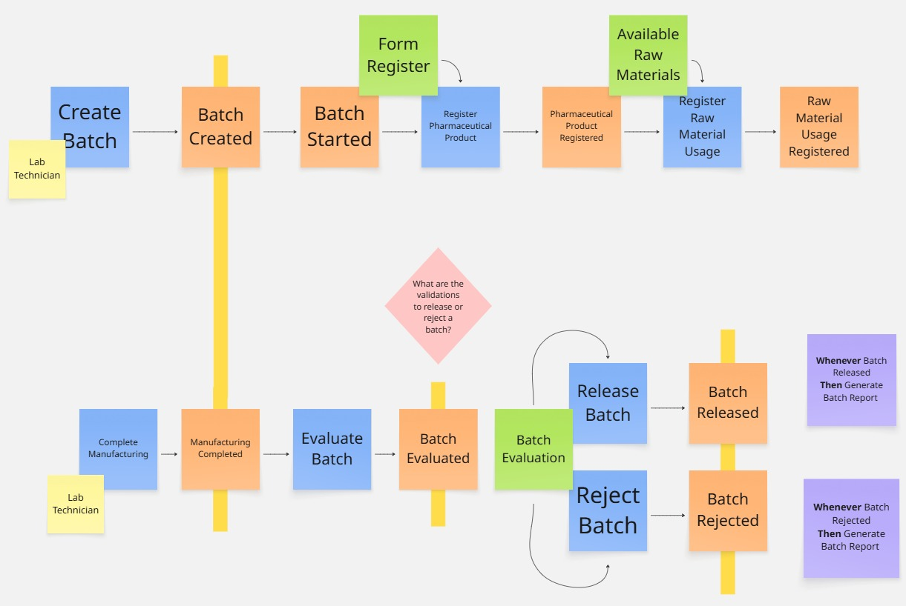

Se identificaron tres Read Models principales que permiten consultar la información necesaria durante la gestión de los
lotes. El Form Register proporciona la información requerida para registrar el producto farmacéutico asociado al lote.
El Available Raw Materials permite consultar las materias primas disponibles antes de registrar su utilización en el
proceso de producción. Finalmente, Batch Evaluation presenta la información necesaria para evaluar el lote y determinar,
de acuerdo con las validaciones correspondientes, si este debe ser liberado o rechazado.

  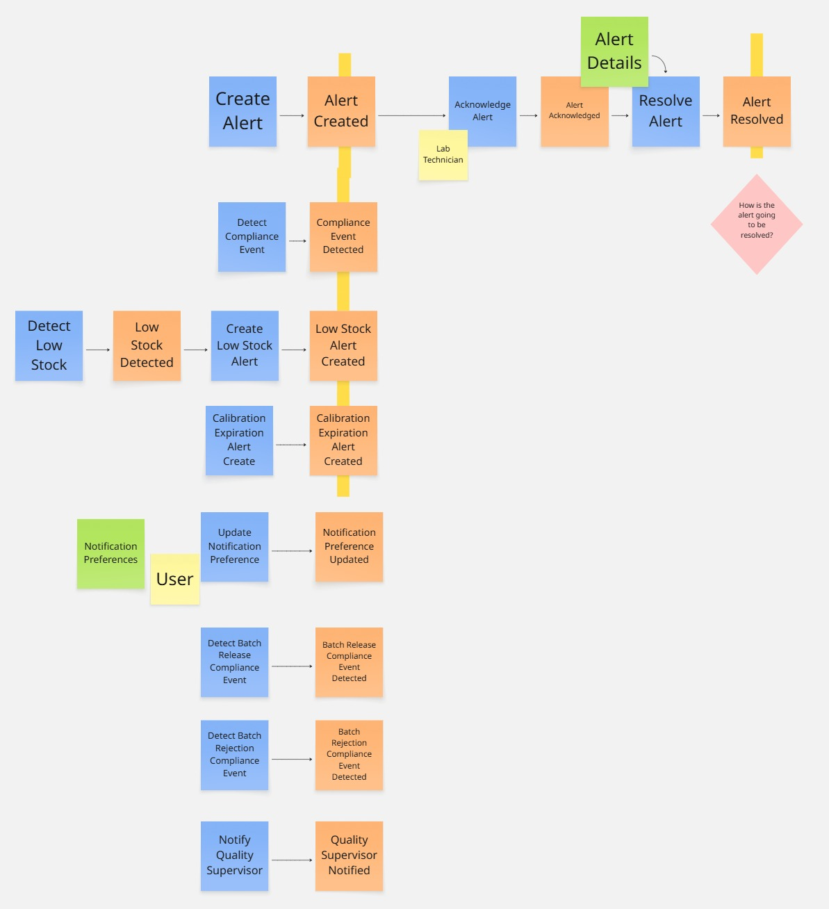

Se identificaron dos Read Models principales. Alert Details permite consultar la información asociada a una alerta,
proporcionando los datos necesarios para su revisión y posterior resolución. Por otro lado, Notification Preferences
permite al usuario consultar las preferencias configuradas para la recepción de notificaciones relacionadas con las
alertas.

  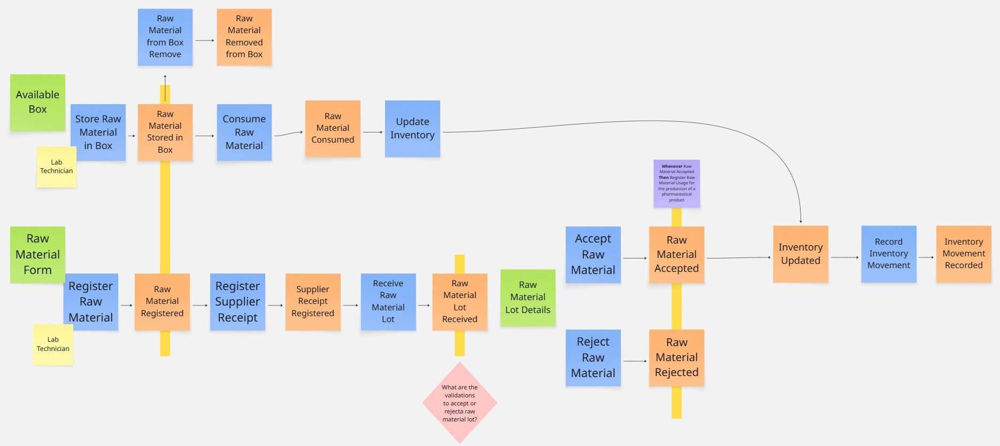

Se identificaron tres Read Models principales. Raw Material Form permite consultar y proporcionar la información
necesaria para registrar una nueva materia prima. Raw Material Lot Details permite consultar la información asociada a
un lote de materia prima recibido, facilitando su evaluación antes de determinar si será aceptado o rechazado.
Finalmente, Available Box permite consultar las materias primas disponibles almacenadas en los contenedores,
proporcionando la información necesaria para realizar su almacenamiento, retiro o consumo.

  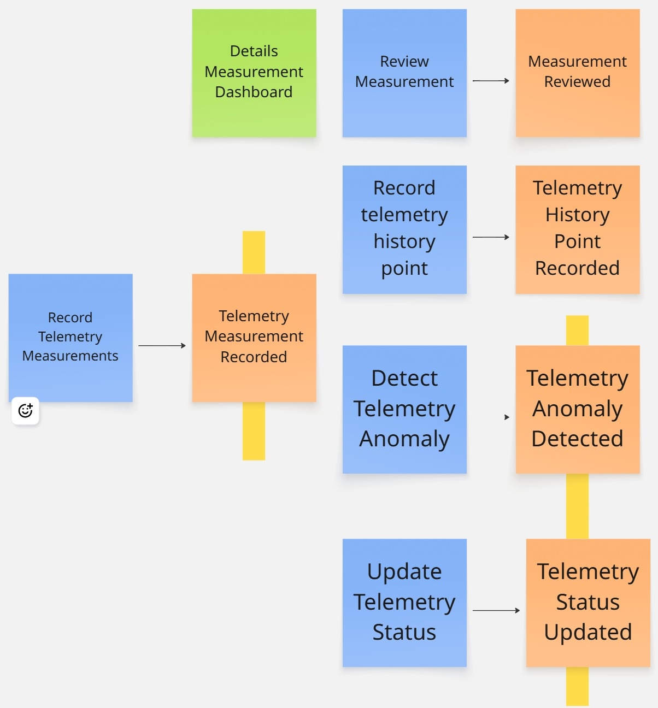

Se identificó el Read Model Details Measurement Dashboard, que permite consultar y visualizar información detallada
sobre las mediciones de telemetría registradas por el sistema como luminosidad, temperatura, humedad y etc.

  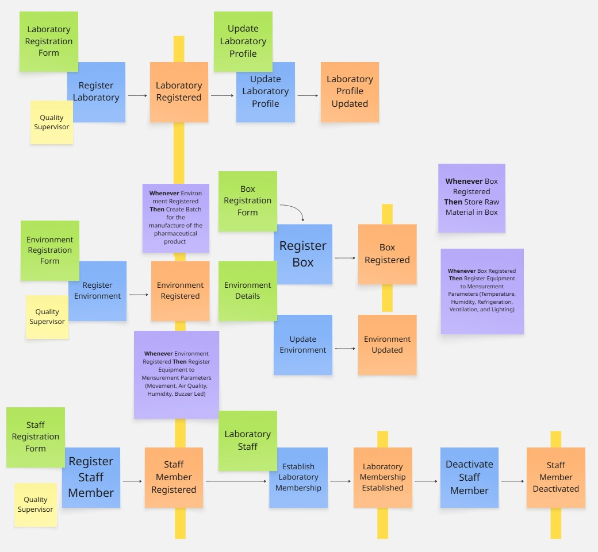

Se identificaron siete Read Models que permiten consultar la información necesaria para gestionar la estructura y los
recursos del laboratorio. Laboratory Registration Form proporciona la información requerida para registrar un nuevo
laboratorio, mientras que Update Laboratory Profile permite consultar y modificar los datos asociados a su perfil. Para
la gestión de los ambientes, Environment Registration Form permite registrar un nuevo ambiente y Environment Details
consultar su información. Asimismo, Box Registration Form permite proporcionar los datos necesarios para registrar una
caja y Staff Registration Form facilita el registro del personal del laboratorio. Finalmente, Laboratory Staff permite
consultar la información del personal asociado al laboratorio.

  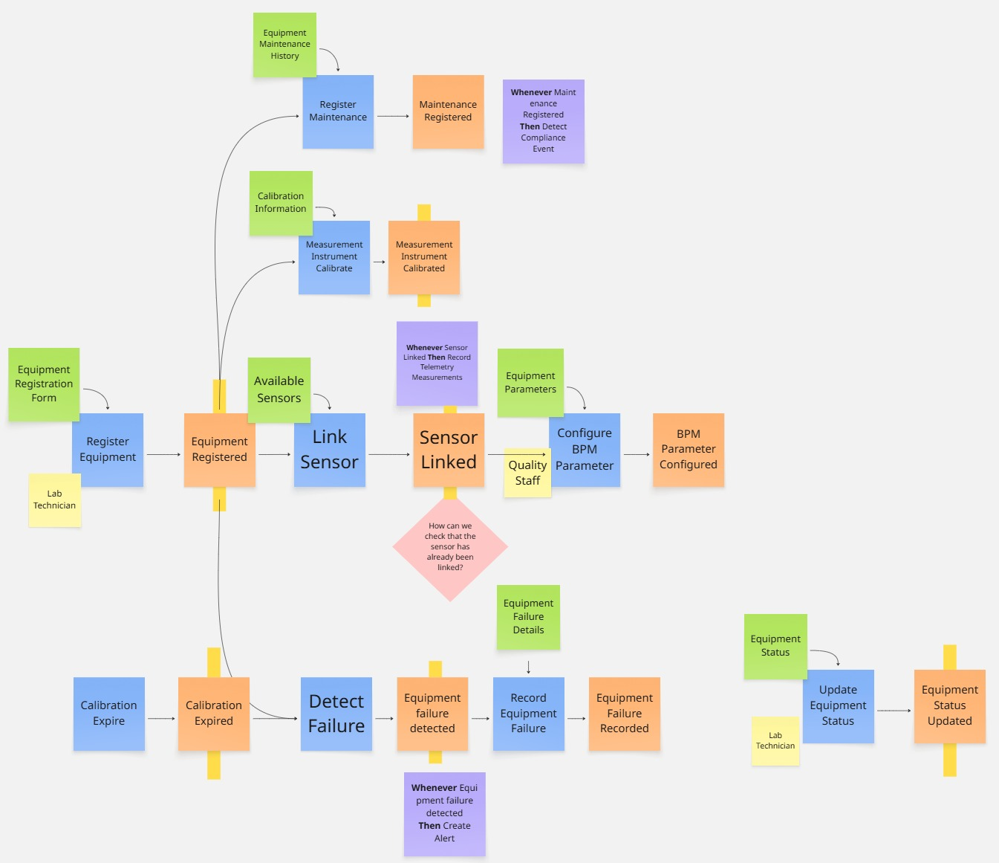

Se identificaron varios Read Models orientados a consultar la información necesaria para administrar los equipos e
instrumentos. Equipment Registration Form proporciona la información requerida para registrar un nuevo equipo, mientras
que Available Sensors permite consultar los sensores disponibles para su vinculación. Equipment Parameters permite
consultar los parámetros asociados al equipo antes de realizar su configuración. Asimismo, Equipment Maintenance History
permite consultar el historial de mantenimientos registrados y Calibration Information presenta la información
relacionada con la calibración del instrumento. Finalmente, Equipment Failure Details permite consultar la información
asociada a una falla registrada y Equipment Status permite visualizar el estado actual del equipo.

**Resumen**

Los Read Models definidos permiten representar la información que los usuarios necesitan consultar durante los
diferentes procesos del sistema. Cada uno está asociado a una necesidad específica de lectura, como el registro y
autenticación de usuarios, la gestión de suscripciones y pagos, el seguimiento de lotes y materias primas, la gestión de
alertas, el monitoreo de mediciones, así como la administración de laboratorios y equipos.

A continuación, se consolidan los Read Models identificados:

| Read Model                        | Descripción                                                                                                         |
|-----------------------------------|---------------------------------------------------------------------------------------------------------------------|
| **Form Sign Up**                  | Vista con la información necesaria para que el visitante pueda realizar el registro de usuario.                     |
| **Form Sign-In**                  | Vista utilizada por el usuario para ingresar sus credenciales e iniciar sesión.                                     |
| **Password Recovery Form**        | Vista que permite al usuario proporcionar la información necesaria para iniciar la recuperación de contraseña.      |
| **Subscription Plans**            | Vista que muestra los planes de suscripción disponibles para que el usuario pueda seleccionar uno.                  |
| **Payment Details**               | Vista que muestra la información necesaria para consultar y verificar los datos del pago                            |
| **Current Subscription**          | Vista que muestra la suscripción vigente del usuario antes de actualizarla o cancelarla.                            |
| **Form Register**                 | Vista con los datos necesarios para registrar un producto farmacéutico asociado a un lote.                          |
| **Available Raw Materials**       | Vista que permite consultar las materias primas disponibles antes de registrar su utilización en un lote.           |
| **Batch Evaluation**              | Vista con la información del lote necesaria para determinar su liberación o rechazo.                                |
| **Alert Details**                 | Vista que presenta la información de una alerta para que pueda ser revisada y gestionada.                           |
| **Notification Preferences**      | Vista que muestra las preferencias actuales de notificación del usuario antes de modificarlas.                      |
| **Raw Material Form**             | Vista con la información necesaria para registrar una materia prima.                                                |
| **Raw Material Lot Details**      | Vista con la información del lote de materia prima necesaria para evaluar su aceptación o rechazo.                  |
| **Available Box**                 | Vista que permite consultar las cajas disponibles antes de almacenar o retirar materia prima.                       |
| **Details Measurement Dashboard** | Vista que presenta información detallada de las mediciones de telemetría para su revisión.                          |
| **Laboratory Registration Form**  | Vista con los datos necesarios para registrar un laboratorio.                                                       |
| **Update Laboratory Profile**     | Vista que permite consultar la información actual del laboratorio antes de actualizar su perfil.                    |
| **Environment Registration Form** | Vista con la información necesaria para registrar un ambiente dentro del laboratorio.                               |
| **Environment Details**           | Vista que permite consultar los datos del ambiente antes de realizar una actualización.                             |
| **Box Registration Form**         | Vista con los datos necesarios para registrar una caja asociada al ambiente.                                        |
| **Staff Registration Form**       | Vista utilizada para ingresar la información necesaria para registrar un miembro del personal.                      |
| **Laboratory Staff**              | Vista que muestra la información del personal asociado al laboratorio y su membresía.                               |
| **Equipment Registration Form**   | Vista con los datos necesarios para registrar un equipo.                                                            |
| **Available Sensors**             | Vista que muestra los sensores disponibles para seleccionar uno antes de vincularlo a un equipo.                    |
| **Equipment Parameters**          | Vista con los parámetros del equipo necesarios para configurar sus parámetros BPM.                                  |
| **Equipment Maintenance History** | Vista que muestra el historial de mantenimiento del equipo antes de registrar una nueva actividad de mantenimiento. |
| **Calibration Information**       | Vista con la información de calibración necesaria antes de calibrar un instrumento de medición.                     |
| **Equipment Failure Details**     | Vista que presenta la información necesaria para consultar y registrar los detalles de una falla del equipo.        |
| **Equipment Status**              | Vista que muestra el estado actual del equipo antes de realizar una actualización.                                  |

**Paso 8: External Systems**

El octavo paso consistió en incorporar al modelo los sistemas externos. Estos se representan mediante tarjetas de color
rosado y corresponden a servicios externos al dominio propio que participan en los flujos de negocio.

  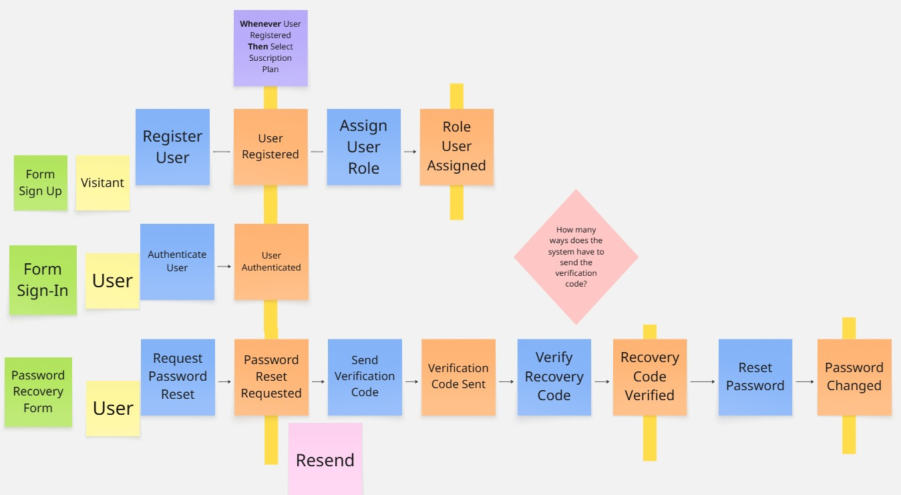
    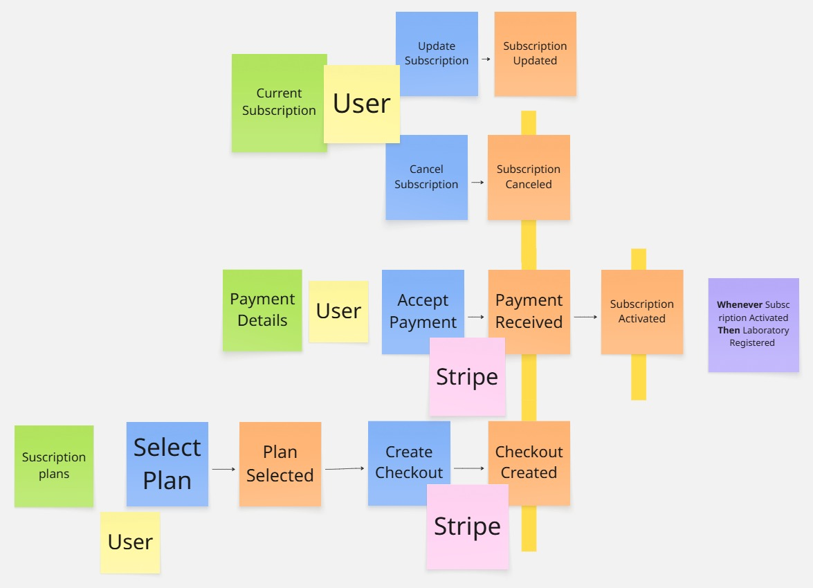

El equipo identificó dos sistemas externos:

- **Resend**, utilizado para el envío del código de verificación durante el proceso de recuperación de contraseña. Se
  activa después del evento Password Reset Requested, mediante la política Whenever Password Reset Requested Then Send
  Verification Code.

- **Stripe**, encargado de procesar los pagos asociados a las suscripciones. Participa en el flujo de pago mediante las
  políticas relacionadas con Checkout Created y Payment Received.

**Paso 9: Add Aggregates**

El noveno paso consistió en identificar los agregados dentro de cada Bounded Context y agrupar alrededor de ellos los
comandos, eventos, read models y políticas correspondientes. Los agregados se representan mediante tarjetas amarillas de
mayor tamaño y constituyen la unidad de consistencia del dominio.

  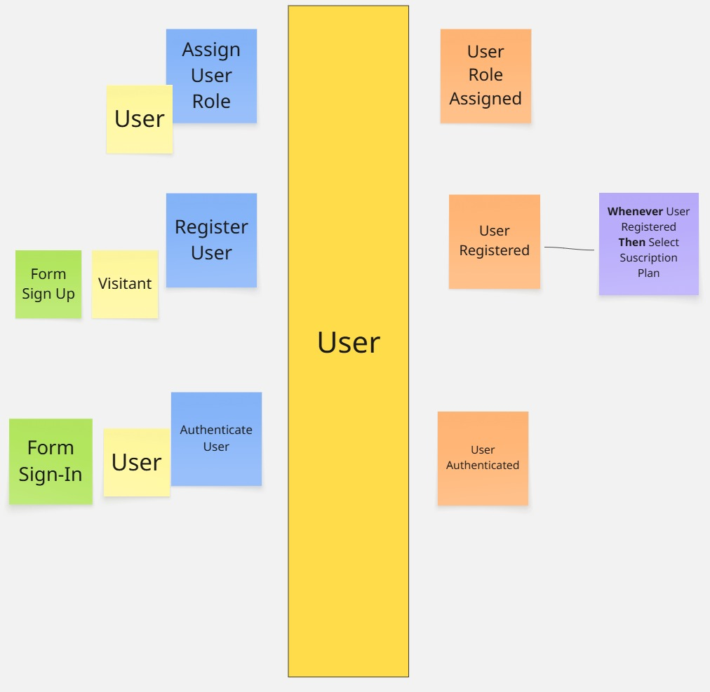
    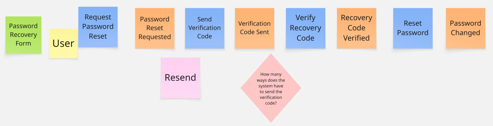

El Aggregate User se identificó porque concentra las operaciones y eventos relacionados con la gestión de la identidad
del usuario, como su registro, asignación de roles y autenticación. Agrupar estas responsabilidades permite mantener la
información del usuario bajo una única raíz de consistencia y controlar de manera centralizada los cambios relacionados
con su ciclo de vida.

  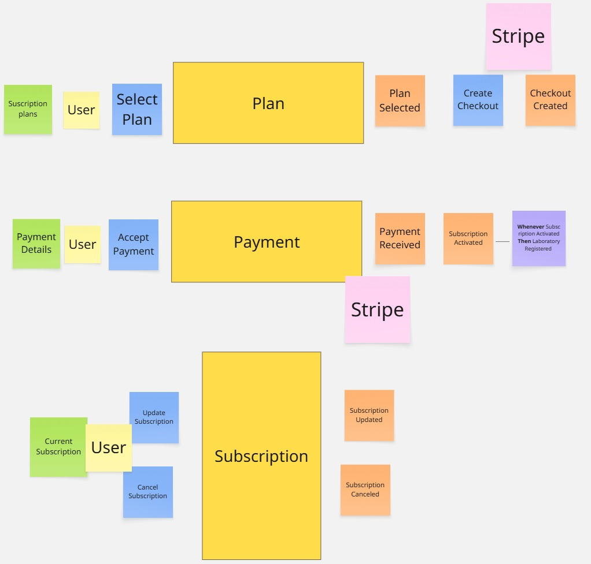

Los Aggregates Plan, Payment y Subscription se identificaron porque cada uno concentra un conjunto de operaciones y
eventos relacionados con una responsabilidad específica. Esta separación permite mantener de forma independiente la
información y las reglas asociadas a la selección de planes, el procesamiento de pagos y la gestión del estado de una
suscripción, evitando mezclar responsabilidades diferentes dentro de un mismo Aggregate.

  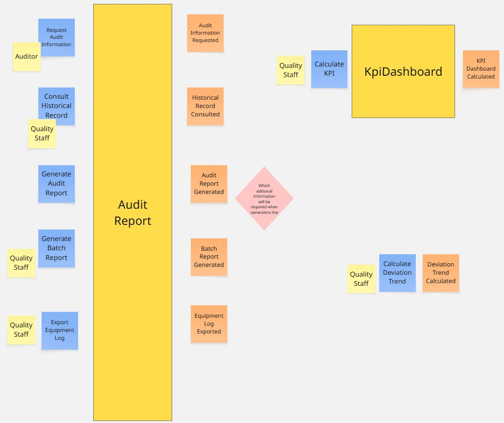

El Aggregate Audit Report se identificó porque reúne las operaciones relacionadas con la consulta de información
histórica y la generación de reportes de auditoría, incluyendo reportes de lotes y registros de equipos. Por su parte,
KPI Dashboard se definió como un Aggregate independiente debido a que concentra específicamente el cálculo de
indicadores clave, mientras que Deviation Trend mantiene separada la responsabilidad de calcular las tendencias de las
desviaciones.

  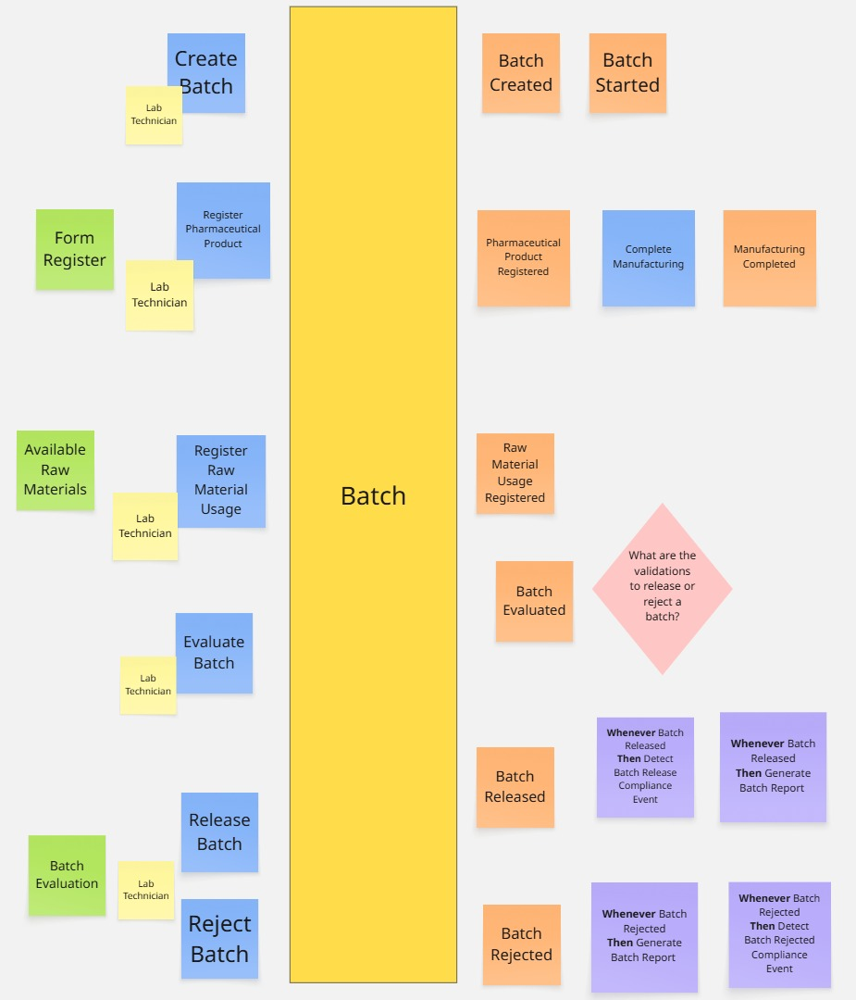

El Aggregate Batch se identificó porque concentra las operaciones y eventos relacionados con el ciclo de vida de un lote
farmacéutico, desde su creación y registro del producto hasta el uso de materias primas, la finalización de la
fabricación y su evaluación. Además, la decisión de liberar o rechazar el lote forma parte de este mismo conjunto de
reglas, por lo que mantener estas operaciones bajo el Aggregate Batch permite gestionar de manera consistente el estado
y la trazabilidad del lote.

  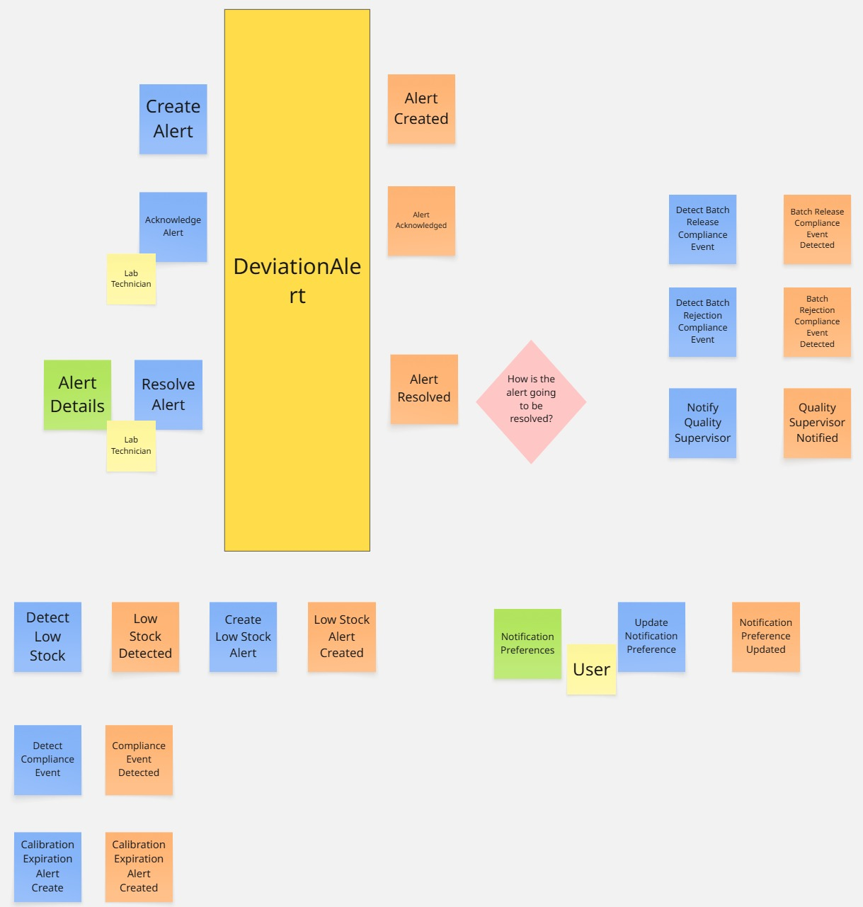

El Aggregate Deviation Alert se identificó porque concentra las operaciones relacionadas con el ciclo de vida de las
alertas de cumplimiento, desde su creación y reconocimiento hasta su resolución. También permite gestionar la
información necesaria para atender una alerta y mantener su estado actualizado.

  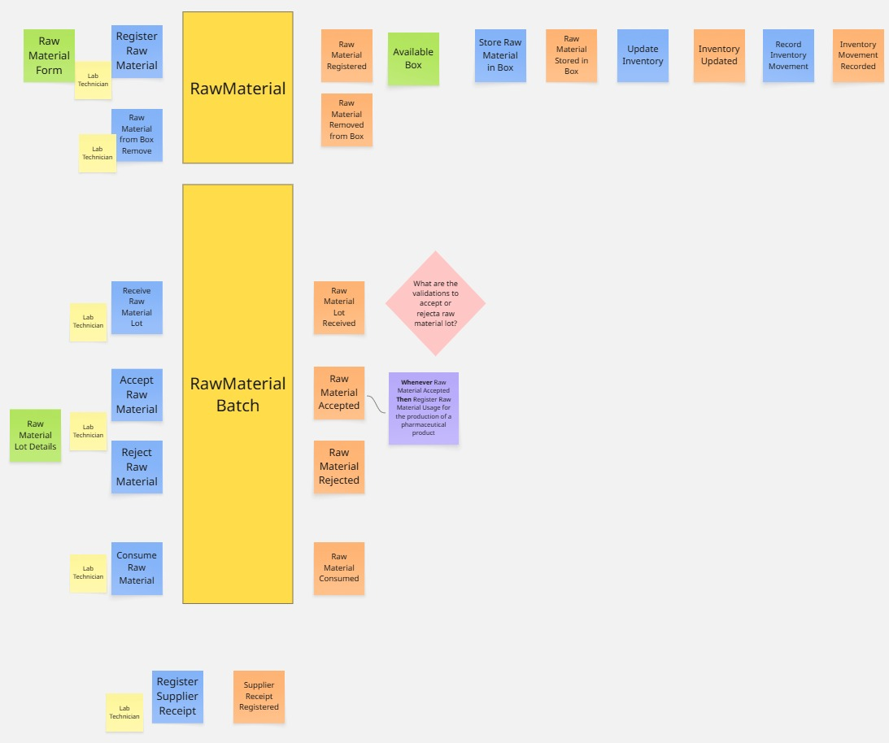

El Aggregate Raw Material se identificó porque concentra las operaciones relacionadas con la gestión de la materia prima
como recurso, incluyendo su registro, almacenamiento, consumo y actualización de inventario. Por otro lado, Raw Material
Batch se definió para agrupar las operaciones asociadas específicamente al lote de materia prima, como su recepción,
aceptación o rechazo, manteniendo separada la información del lote respecto a la materia prima y su disponibilidad en
inventario.

  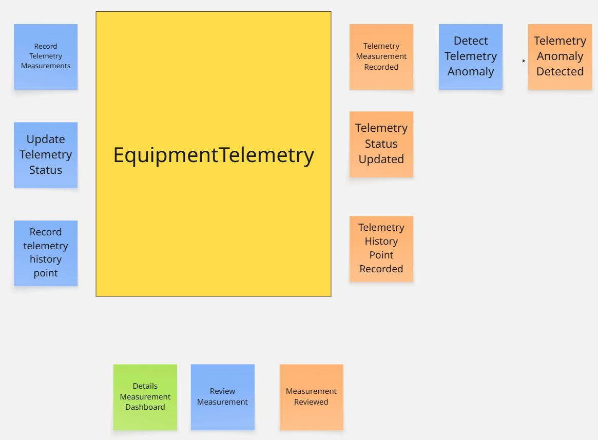

El Aggregate Equipment Telemetry se identificó porque concentra las operaciones relacionadas con la recepción, registro
y seguimiento de las mediciones generadas por los equipos. Dentro de este Aggregate se agrupan los eventos de Telemetry
Measurement Recorded, Telemetry History Point Recorded, Telemetry Anomaly Detected y Telemetry Status Updated,
manteniendo bajo una misma responsabilidad la información sobre el estado y comportamiento de la telemetría. Esto
permite gestionar de forma consistente el historial de mediciones y la detección de anomalías asociadas a los equipos.

  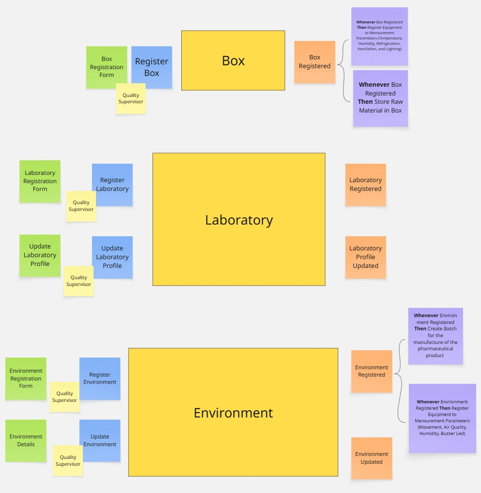
  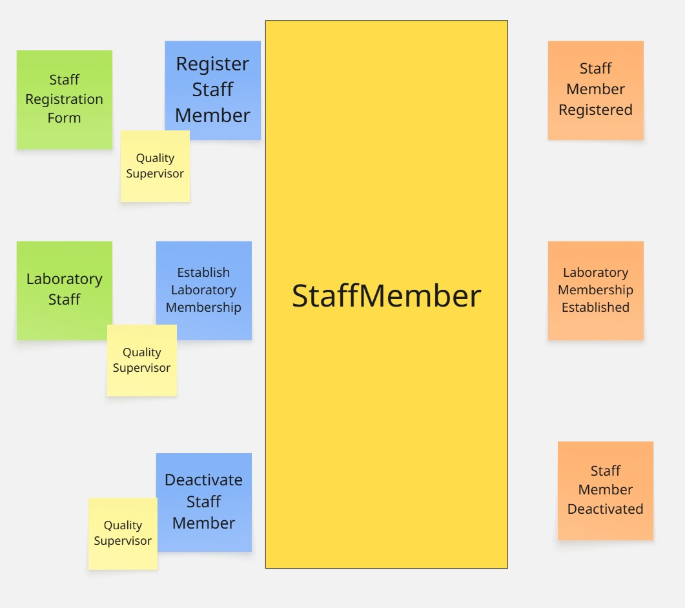

El Aggregate Laboratory se identifica porque concentra la información principal del laboratorio y permite gestionar su
registro y actualización. El Aggregate Environment se define para controlar los ambientes asociados al laboratorio,
incluyendo su registro y actualización, además de servir como referencia para otras operaciones relacionadas con la
producción y los equipos. El Aggregate Box se identifica para gestionar las cajas asociadas a un ambiente, sobre las
cuales posteriormente pueden realizarse acciones como el almacenamiento de materias primas o la configuración de
parámetros de medición. Finalmente, StaffMember se establece para gestionar al personal perteneciente al laboratorio,
incluyendo su registro, membresía y desactivación.

  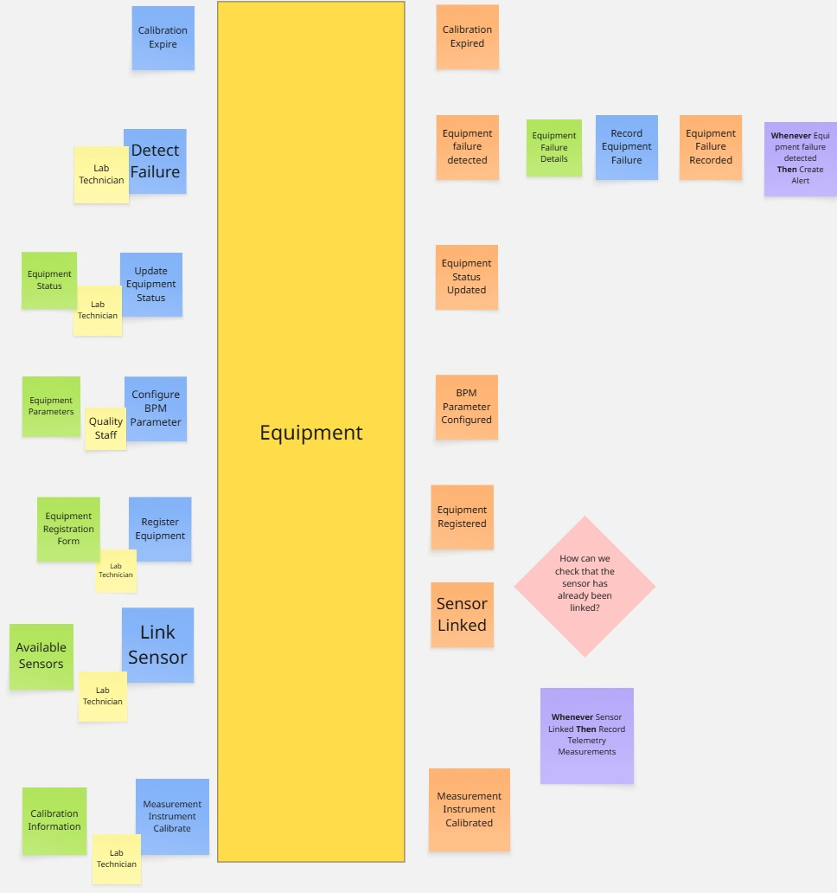

El Aggregate Equipment se identifica porque concentra la información y las operaciones relacionadas con la gestión de
los equipos utilizados dentro del laboratorio. En este Aggregate se agrupan acciones como el registro del equipo, la
vinculación de sensores, la configuración de parámetros BPM, la calibración de instrumentos, el mantenimiento y la
actualización de su estado.

Además, permite gestionar situaciones relacionadas con el ciclo de vida del equipo, como la expiración de una
calibración y el registro de fallas detectadas. Por ello, Equipment actúa como la unidad principal para mantener la
identidad, configuración y estado operativo de cada equipo, manteniendo estas responsabilidades dentro de un mismo
límite de consistencia.

### Bounded Context

A partir del modelo de Event Storming, se llevó a cabo una sesión de Candidate Context Discovery para identificar los
Bounded Contexts de la solución. Se utilizó principalmente la técnica Look-for Pivotal Events, mediante la cual se
identificaron eventos que representan cambios significativos de estado dentro de los diferentes procesos del dominio.

Primero, se identificaron los eventos pivote y se agruparon junto con sus comandos, actores, read models, políticas y
agregados relacionados.

Luego, se analizaron las relaciones entre los diferentes grupos identificados, considerando las dependencias y
comunicaciones existentes entre las distintas responsabilidades del sistema.

Finalmente, se trazaron fronteras alrededor de los grupos resultantes y se asignaron nombres de acuerdo con la
responsabilidad principal de cada grupo. Como resultado, se definieron los siguientes 9 Bounded Contexts:

- Identity and Access Management (IAM)
- Payments & Subscriptions
- Laboratory Management
- Product Batch Management
- Tracking & Telemetry
- Equipment Management
- Compliance & Alerting
- Inventory Management
- Reporting & Audit

  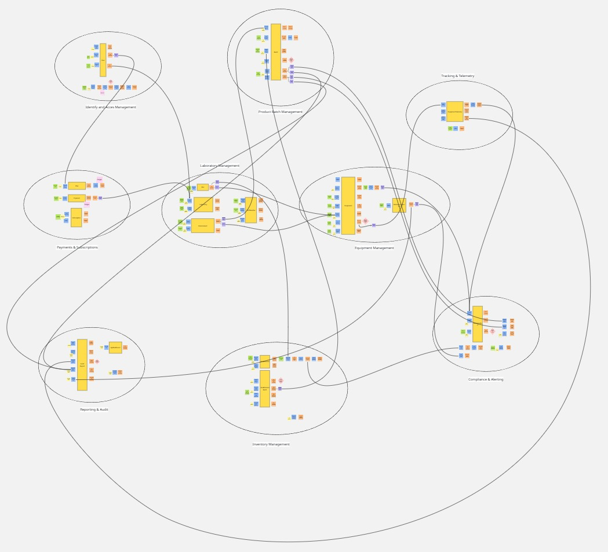

Durante la implementación del Sprint 1 se incorporó un décimo Bounded Context, **Profile Management**. Surgió al separar
de Identity and Access Management los datos personales de cada persona (nombre completo, DNI, teléfono, ubicación y
foto), que cambian por motivos distintos que la cuenta de acceso y que el resto del laboratorio consulta para mostrar
quién atendió una alerta o integra el personal. Su canvas se presenta en la sección 4.1.1.3, sus relaciones en 4.1.2 y
su diseño táctico en 4.2.10.

A continuación se presenta el detalle de cada Bounded Context identificado. Para cada uno se muestra el recorte del
tablero de Design-Level EventStorming correspondiente, junto con una explicación de sus agregados, comandos, eventos,
políticas, read models y sistemas externos, así como de la responsabilidad que cumple dentro del dominio de Qualitrack.
Esta descripción permite comprender cómo se distribuye el comportamiento del sistema entre los distintos contextos y
cómo se relacionan entre sí mediante eventos y políticas.

**Bounded context: Identity and Access Management**

 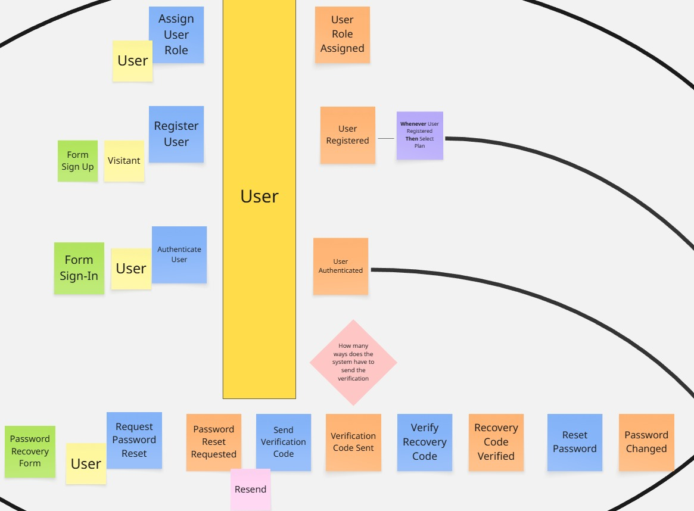 

El Bounded Context de Identity and Access Management (IAM) es responsable de la identidad de las personas que
interactúan con Qualitrack, incluyendo su registro, autenticación, asignación de roles y recuperación de contraseña. Su
modelo se organiza alrededor del agregado **User**, que constituye la unidad de consistencia de este contexto y
concentra los comandos, eventos y reglas relacionados con el acceso al sistema.

En el flujo de **registro**, el Visitor consulta el read model *Form Sign Up* y ejecuta el comando *Register User*, lo
que produce el evento *User Registered*. Este evento activa la política *Whenever User Registered Then Select Plan*, que
conecta IAM con el contexto de Payments & Subscriptions e inicia la selección del plan de suscripción. Posteriormente,
el comando *Assign User Role* genera el evento *User Role Assigned*, que determina los permisos del usuario dentro del
sistema según su rol (Lab Technician, Quality Staff, Quality Supervisor o Auditor).

En el flujo de **autenticación**, el usuario ingresa sus credenciales mediante el read model *Form Sign-In* y ejecuta el
comando *Authenticate User*, cuyo resultado es el evento *User Authenticated*. Este evento permite que los demás
contextos reconozcan al usuario y validen sus accesos.

El flujo de **recuperación de contraseña** es una secuencia de varios pasos. Comienza con el comando *Request Password
Reset*, ejecutado desde el read model *Password Recovery Form*, que genera el evento *Password Reset Requested*. A
continuación se ejecuta *Send Verification Code* mediante el sistema externo **Resend**, que produce *Verification Code
Sent*. El usuario ingresa el código recibido con *Verify Recovery Code*, lo que genera *Recovery Code Verified*, y
finalmente *Reset Password* produce el evento *Password Changed*, que completa el proceso.

¿Dentro de este contexto se identificó el pain point *"How many ways does the system have to send the verification
code?"*, el cual indica que aún debía definirse el mecanismo de envío del código de verificación antes de permitir el
cambio de contraseña.

**Bounded context: Subscriptions and Payments**

 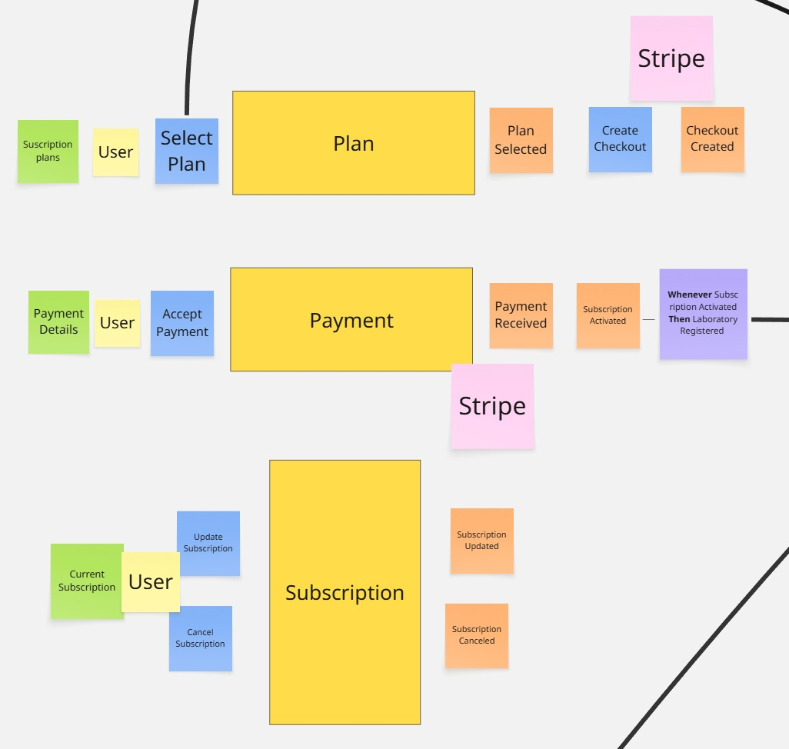 

El Bounded Context de Payments & Subscriptions gestiona el modelo de negocio de Qualitrack: la selección de planes, el
procesamiento de los pagos y el ciclo de vida de las suscripciones. Está compuesto por tres agregados (**Plan**,
**Payment** y **Subscription**), cada uno con responsabilidades diferenciadas. Además, este contexto se integra con el
sistema externo **Stripe** para procesar los pagos de forma segura.

El agregado **Plan** gestiona la selección de los planes disponibles. El usuario consulta el read model *Subscription
Plans* y ejecuta el comando *Select Plan*, que genera el evento *Plan Selected*. Luego, el comando *Create Checkout* se
apoya en Stripe para crear la sesión de pago y produce el evento *Checkout Created*.

El agregado **Payment** centraliza el procesamiento del pago. A partir del read model *Payment Details*, el usuario
ejecuta el comando *Accept Payment*, validado mediante Stripe, lo que genera el evento *Payment Received*. Una vez
confirmado el pago, se produce el evento *Subscription Activated*, que dispara la política *Whenever Subscription
Activated Then Laboratory Registered*. Mediante esta política, este contexto se comunica con Laboratory Management para
iniciar el registro del laboratorio asociado a la suscripción.

El agregado **Subscription** administra el ciclo de vida posterior a la activación. El usuario revisa su suscripción
vigente en el read model *Current Subscription* y puede ejecutar el comando *Update Subscription*, que genera el evento
*Subscription Updated*, o el comando *Cancel Subscription*, que produce el evento *Subscription Canceled*.

De esta manera, el contexto garantiza que un laboratorio solo pueda registrarse cuando existe una suscripción activa y
un pago confirmado.

**Bounded context: Tracking and Telemetry**

 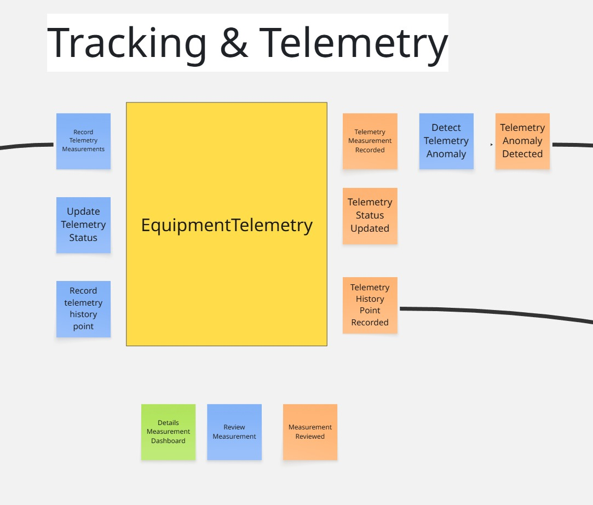 

El Bounded Context de Tracking & Telemetry es responsable de recibir, registrar y dar seguimiento a las mediciones
ambientales generadas por los sensores vinculados a los equipos del laboratorio, como temperatura, humedad, calidad del
aire y luminosidad. En la sesión de EventStorming su modelo se organizó alrededor del agregado **EquipmentTelemetry**,
que concentraba el estado y el historial de las mediciones de cada equipo. En la implementación este modelo evolucionó:
la unidad de consistencia pasó a ser **EnvironmentalProfile** (rangos permitidos y reglas de actuación de un ambiente o
de un Monitor de Contenedor), y las lecturas y acciones se registran como las entidades **Measurement** y
**ActuationEvent**, como se detalla en la sección 4.2.1.

En el flujo de registro de mediciones, el comando Record **Telemetry Measurements** produce el evento Telemetry
Measurement Recorded. Este comando se dispara a partir de la política Whenever Sensor Linked Then Record Telemetry
Measurements, que conecta este contexto con Equipment Management y asegura que solo se registren mediciones de sensores
previamente vinculados a un equipo. A partir de este evento se derivan los procesos de historial, estado y detección de
anomalías.

En el flujo de **historial y estado**, el comando Record Telemetry History Point genera el evento Telemetry History
Point Recorded, que conserva cada medición como un punto del historial de telemetría. Este evento activa la política
Whenever Telemetry History Point Recorded Then Generate Audit Report, que conecta Tracking & Telemetry con Reporting &
Audit. Por su parte, el comando Update Telemetry Status genera el evento Telemetry Status Updated, que mantiene
actualizado el estado vigente de la telemetría del equipo.

En el flujo de **detección de anomalías**, el comando Detect Telemetry Anomaly evalúa los valores registrados y, cuando
identifica una lectura fuera de los parámetros esperados, produce el evento Telemetry Anomaly Detected. Este evento
activa la política Whenever Telemetry Anomaly Detected Then Create Alert, que conecta este contexto con Compliance &
Alerting para iniciar la gestión de la desviación ambiental.

En el flujo de **revisión**, el Quality Staff consulta el read model Details Measurement Dashboard, que presenta la
información detallada de las mediciones, y ejecuta el comando Review Measurement, cuyo resultado es el evento
Measurement Reviewed. Este evento deja constancia de que una medición fue revisada por el personal de calidad.

¿Dentro de este contexto se identificó el pain point "What information is going to be shown in the telemetry?", el cual
indica que aún debía definirse qué datos se presentarían en el dashboard a partir de las mediciones registradas.

**Bounded context: Reporting & Audit**

 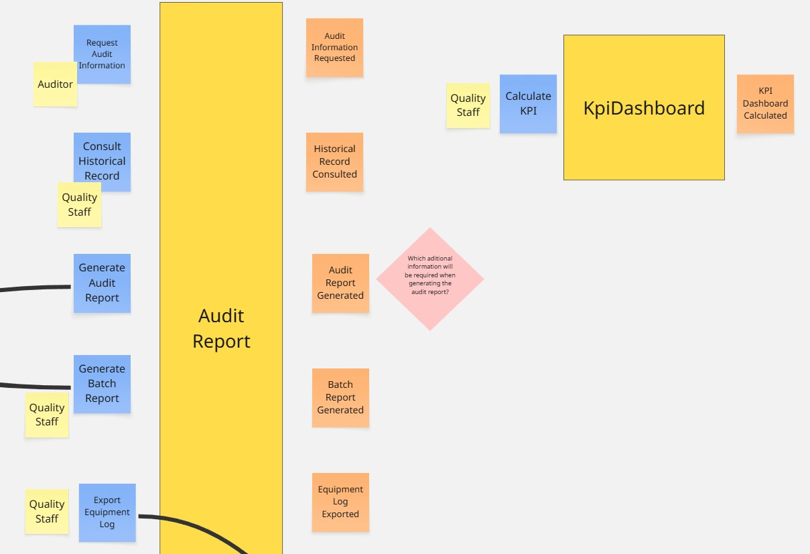 

El Bounded Context de Reporting & Audit es responsable de consolidar la información generada por los demás contextos de
Qualitrack y ponerla a disposición para auditorías, seguimiento y análisis, mediante reportes, exportaciones e
indicadores. Su modelo se organiza alrededor de dos agregados: **Audit Report**, que concentra la consulta de
información histórica y la generación de reportes, y **KpiDashboard**, que se encarga del cálculo de indicadores clave.

En el flujo de **auditoría**, el Auditor ejecuta el comando Request Audit Information, que produce el evento Audit
Information Requested. A continuación, el Quality Staff ejecuta el comando Consult Historical Record, que genera el
evento Historical Record Consulted y permite recuperar los registros históricos relacionados con la auditoría
solicitada. Con esta información, el comando Generate Audit Report produce el evento Audit Report Generated, que
completa el flujo. Este comando también puede ser activado desde otros contextos, como Tracking & Telemetry, mediante la
política Whenever Telemetry History Point Recorded Then Generate Audit Report.

En el flujo de **reportes de lotes**, el Quality Staff ejecuta el comando Generate Batch Report, que genera el evento
Batch Report Generated. Este comando es activado desde Product Batch Management mediante las políticas Whenever Batch
Released Then Generate Batch Report y Whenever Batch Rejected Then Generate Batch Report, de modo que cada decisión
final sobre un lote quede documentada.

En el flujo de **exportación de equipos**, el Quality Staff ejecuta el comando Export Equipment Log, que produce el
evento Equipment Log Exported y permite disponer del registro histórico de los equipos para las auditorías. Este comando
se activa desde Equipment Management mediante la política Whenever Equipment Registered Then Export Equipment Log.

Por su parte, el agregado **KpiDashboard** se mantiene independiente porque su responsabilidad es distinta a la de los
reportes: el Quality Staff ejecuta el comando Calculate KPI, que genera el evento KPI Dashboard Calculated con los
indicadores utilizados para mostrar el estado general del sistema.

¿Dentro de este contexto se identificó el pain point "Which additional information will be required when generating the
audit report?", el cual indica que aún debía definirse qué información adicional debe incluirse en el reporte de
auditoría a partir de los registros históricos consultados y la información solicitada por el auditor.

**Bounded context: Product Batch Management**

 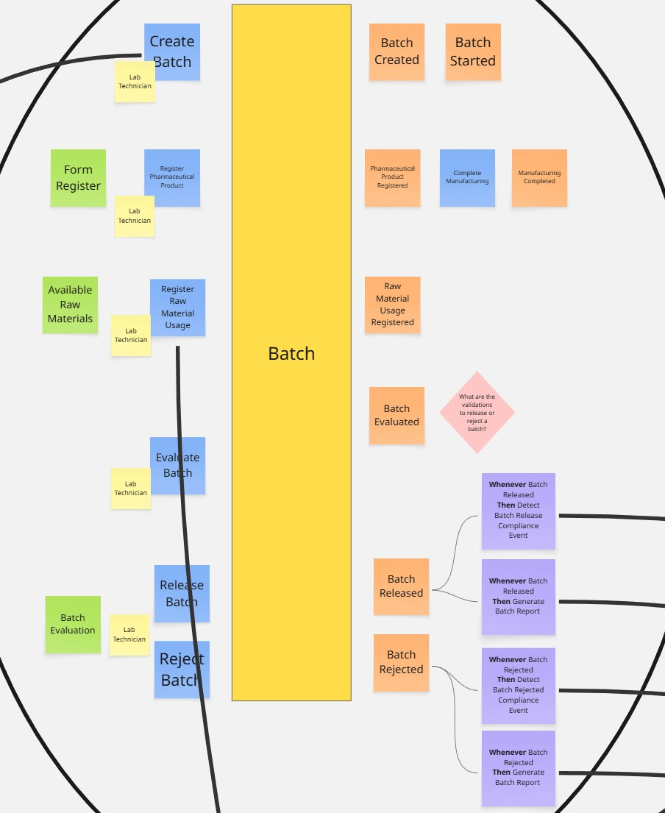 

El Bounded Context de Product Batch Management es responsable de gestionar el ciclo de vida de los lotes de producción
farmacéutica en Qualitrack, desde su creación hasta la decisión final de liberarlos o rechazarlos, garantizando su
trazabilidad. Su modelo se organiza alrededor del agregado **Batch**, que constituye la unidad de consistencia de este
contexto y concentra los comandos, eventos y reglas asociados al estado del lote.

En el flujo de **creación y fabricación**, el Lab Technician ejecuta el comando Create Batch, que produce el evento
Batch Created y da inicio al lote con el evento Batch Started. Este comando se activa desde Laboratory Management
mediante la política Whenever Environment Registered Then Create Batch for the manufacture of the pharmaceutical
product. Luego, a partir del read model Form Register, el Lab Technician ejecuta el comando Register Pharmaceutical
Product, que genera el evento Pharmaceutical Product Registered y asocia el producto farmacéutico al lote. Después,
consultando el read model Available Raw Materials, ejecuta el comando Register Raw Material Usage, cuyo resultado es el
evento Raw Material Usage Registered. Este comando también puede ser activado desde Inventory Management mediante la
política Whenever Raw Material Accepted Then Register Raw Material Usage, de modo que solo se utilicen materias primas
previamente aceptadas. Finalmente, el comando Complete Manufacturing produce el evento Manufacturing Completed, que
marca el cierre de la etapa de fabricación.

En el flujo de **evaluación**, una vez completada la fabricación, el Lab Technician ejecuta el comando Evaluate Batch,
que genera el evento Batch Evaluated. La evaluación se mantiene separada de su resultado, lo que permite distinguir el
análisis del lote de la decisión final sobre este.

En el flujo de **decisión final**, el Lab Technician consulta el read model Batch Evaluation y, según las validaciones
establecidas, ejecuta el comando Release Batch, que genera el evento Batch Released, o el comando Reject Batch, que
genera el evento Batch Rejected. Ambos eventos activan políticas que conectan este contexto con otros:

- Cuando un lote es liberado, la política Whenever Batch Released Then Detect Batch Release Compliance Event conecta con
  Compliance & Alerting, y la política Whenever Batch Released Then Generate Batch Report conecta con Reporting & Audit.
- Cuando un lote es rechazado, la política Whenever Batch Rejected Then Detect Batch Rejected Compliance Event conecta
  con Compliance & Alerting, y la política Whenever Batch Rejected Then Generate Batch Report conecta con Reporting &
  Audit.

De esta manera, el contexto garantiza que toda decisión final sobre un lote quede registrada, genere su reporte
correspondiente y sea notificada como evento de cumplimiento.

¿Dentro de este contexto se identificó el pain point "What are the validations to release or reject a batch?", el cual
indica que aún debía definirse qué criterios y validaciones determinan si un lote es liberado o rechazado.

**Bounded context: Compliance & Alerting**

 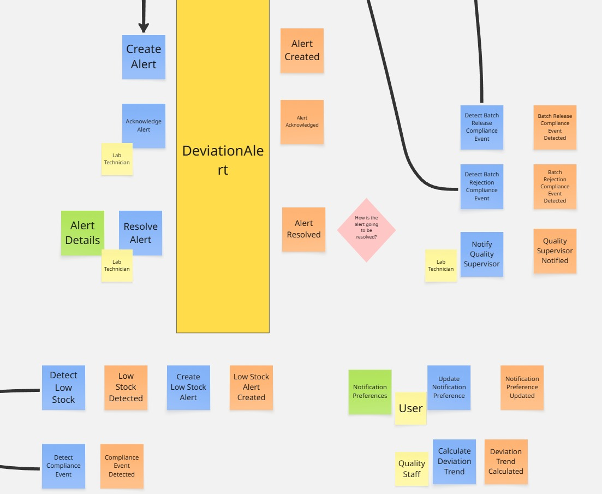 

El Bounded Context de Compliance & Alerting es responsable de detectar, notificar y dar seguimiento a las situaciones
que requieren atención dentro de Qualitrack, como desviaciones ambientales, fallas de equipos, bajo stock de materias
primas y eventos de cumplimiento asociados a los lotes. Su modelo se organiza alrededor del agregado DeviationAlert, que
constituye la unidad de consistencia de este contexto y concentra el ciclo de vida de las alertas, desde su creación
hasta su resolución.

En el flujo de **gestión de alertas**, el comando Create Alert produce el evento Alert Created. Este comando es activado
desde otros contextos mediante las políticas Whenever Telemetry Anomaly Detected Then Create Alert, que proviene de
Tracking & Telemetry, y Whenever Equipment Failure Detected Then Create Alert, que proviene de Equipment Management.
Luego, el Lab Technician ejecuta el comando Acknowledge Alert, que genera el evento Alert Acknowledged y registra que la
alerta fue reconocida por el responsable. Finalmente, a partir del read model Alert Details, que presenta la información
necesaria para revisar la situación, el Lab Technician ejecuta el comando Resolve Alert, cuyo resultado es el evento
Alert Resolved, con el cual se cierra el ciclo de la alerta.

En el flujo de **bajo stock**, el comando Detect Low Stock produce el evento Low Stock Detected, que se origina a partir
de la actualización del inventario en Inventory Management. Posteriormente, el comando Create Low Stock Alert genera el
evento Low Stock Alert Created, que alerta sobre la necesidad de reponer la materia prima.

En el flujo de **cumplimiento**, el comando Detect Compliance Event produce el evento Compliance Event Detected, y se
activa desde Equipment Management mediante la política Whenever Maintenance Registered Then Detect Compliance Event.
Asimismo, los comandos Detect Batch Release Compliance Event y Detect Batch Rejection Compliance Event generan los
eventos Batch Release Compliance Event Detected y Batch Rejection Compliance Event Detected, y se activan desde Product
Batch Management a través de las políticas asociadas a la liberación y al rechazo de lotes. Cuando corresponde, el Lab
Technician ejecuta el comando Notify Quality Supervisor, que produce el evento Quality Supervisor Notified y asegura que
el responsable de calidad conozca la situación.

En el flujo de **preferencias de notificación**, el User consulta el read model Notification Preferences y ejecuta el
comando Update Notification Preference, que genera el evento Notification Preference Updated, permitiendo configurar
cómo desea recibir las notificaciones relacionadas con las alertas.

Por último, el Quality Staff ejecuta el comando Calculate Deviation Trend, que produce el evento Deviation Trend
Calculated y permite analizar la evolución histórica de las desviaciones registradas.

¿Dentro de este contexto se identificó el pain point "How is the alert going to be resolved?", el cual indica que aún
debía definirse el proceso necesario para llevar una alerta desde su reconocimiento hasta su resolución.

**Bounded context: Equipment Management**

 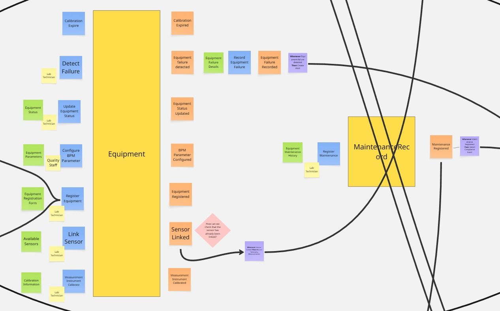 

El Bounded Context de Equipment Management es responsable de gestionar los equipos e instrumentos de medición del
laboratorio, incluyendo su registro, la vinculación de sensores, la configuración de parámetros, la calibración, el
mantenimiento y el seguimiento de fallas. Su modelo se organiza alrededor de dos agregados: Equipment, que mantiene la
identidad, configuración y estado operativo de cada equipo, y MaintenanceRecord, que concentra el registro de las
actividades de mantenimiento. Ambos se comunican con otros contextos mediante políticas: Whenever Sensor Linked Then
Record Telemetry Measurements (hacia Tracking & Telemetry), Whenever Equipment Failure Detected Then Create Alert y
Whenever Maintenance Registered Then Detect Compliance Event (hacia Compliance & Alerting).

* **Equipment**

 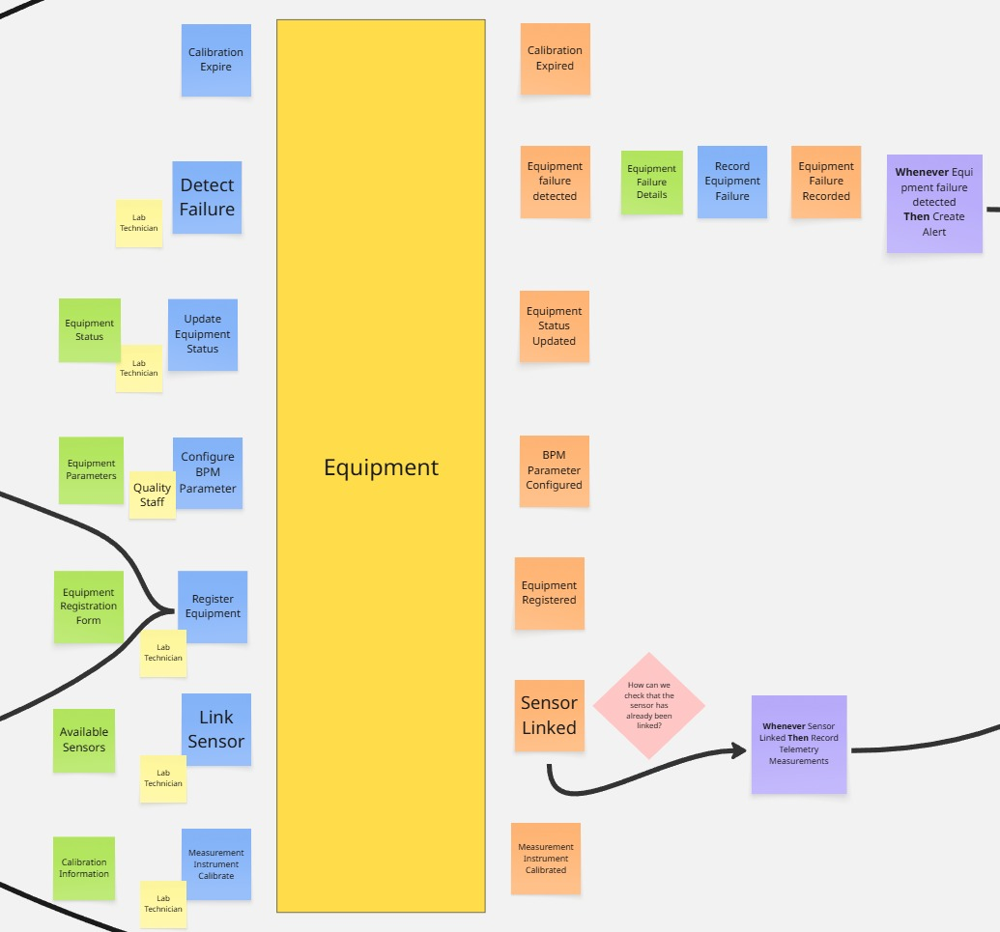 

El agregado Equipment concentra el ciclo de vida del equipo. El Lab Technician ejecuta el comando Register Equipment
desde el read model Equipment Registration Form, lo que produce el evento Equipment Registered, y luego Link Sensor
desde el read model Available Sensors, que genera Sensor Linked y activa el registro de telemetría. El Quality Staff
configura los parámetros del equipo con Configure BPM Parameter, que genera BPM Parameter Configured. El Lab Technician
también actualiza el estado operativo con Update Equipment Status (Equipment Status Updated) y registra la calibración
con Measurement Instrument Calibrate (Measurement Instrument Calibrated). Cuando vence el periodo de calibración,
Calibration Expire produce Calibration Expired. Finalmente, Detect Failure genera Equipment Failure Detected y, a partir
del read model Equipment Failure Details, Record Equipment Failure produce Equipment Failure Recorded. Aquí se
identificó el pain point "How can we check that the sensor has already been linked?", que indica que debía definirse
cómo verificar que un sensor no esté vinculado a otro equipo antes de asociarlo.

* **Maintenance Record**

 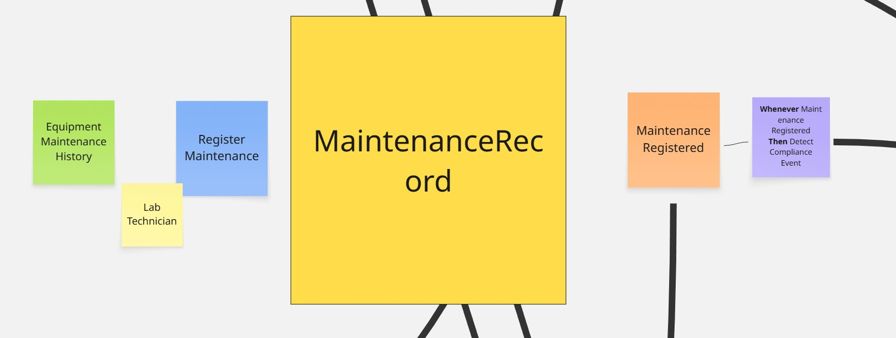 

El agregado MaintenanceRecord conserva el historial de mantenimientos de los equipos. El Lab Technician consulta el read
model Equipment Maintenance History y ejecuta el comando Register Maintenance, que produce el evento Maintenance
Registered. Este evento activa la política Whenever Maintenance Registered Then Detect Compliance Event, que conecta con
Compliance & Alerting para dejar constancia del cumplimiento. Separarlo de Equipment permite mantener el historial sin
sobrecargar las reglas de configuración y estado del equipo.

**Bounded context: Inventory Management**

 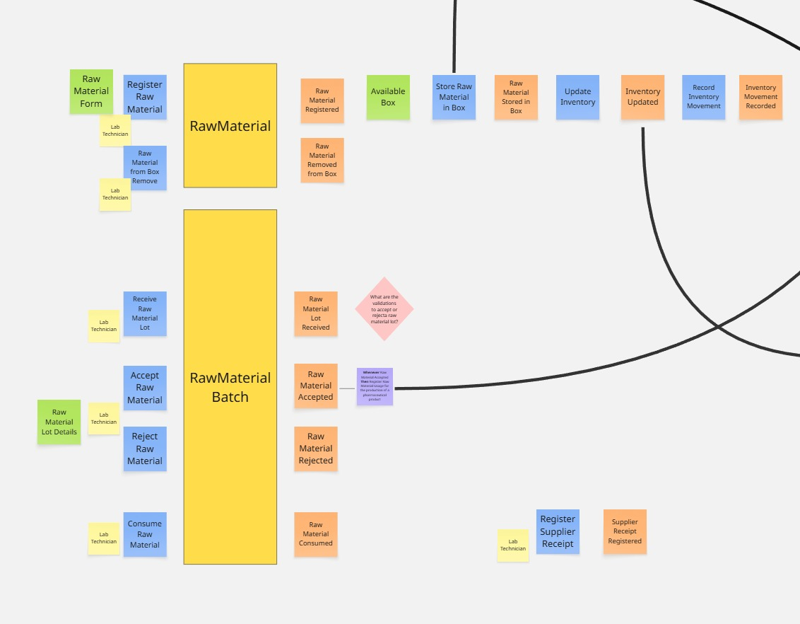 

El Bounded Context de Inventory Management es responsable de gestionar las materias primas del laboratorio, desde su
registro y recepción hasta su almacenamiento, consumo y control de existencias. Su modelo se organiza alrededor de dos
agregados: RawMaterial, que administra la materia prima como recurso y su disponibilidad en inventario, y
RawMaterialBatch, que gestiona los lotes recibidos de proveedores y su aceptación o rechazo. Este contexto se comunica
con otros mediante la política Whenever Raw Material Accepted Then Register Raw Material Usage for the production of a
pharmaceutical product (hacia Product Batch Management) y mediante el evento Inventory Updated, que permite detectar
bajo stock en Compliance & Alerting. Dentro del contexto se identificó el pain point "What are the validations to accept
or reject raw material lot?", que indica que debían definirse los criterios para aceptar o rechazar un lote recibido.

* **Raw Material**

 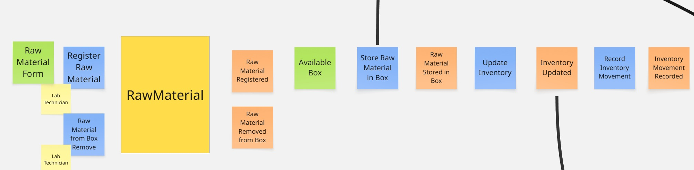 

El agregado RawMaterial concentra el registro, almacenamiento y control de existencias de la materia prima. El Lab
Technician consulta el read model Raw Material Form y ejecuta el comando Register Raw Material, que produce el evento
Raw Material Registered. A partir del read model Available Box, ejecuta Store Raw Material in Box, que genera Raw
Material Stored in Box, o Remove Raw Material from Box, que genera Raw Material Removed from Box. Estas operaciones
llevan a Update Inventory, que produce el evento Inventory Updated, y luego Record Inventory Movement genera Inventory
Movement Recorded, dejando trazabilidad de cada movimiento. El almacenamiento en box se activa desde Laboratory
Management mediante la política Whenever Box Registered Then Store Raw Material in Box.

* **Raw Material Batch**

 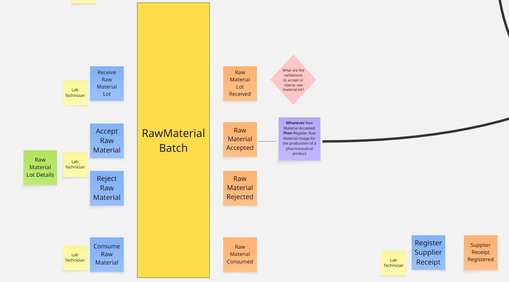 

El agregado RawMaterialBatch gestiona el ciclo de vida del lote recibido. El Lab Technician ejecuta Register Supplier
Receipt (Supplier Receipt Registered) y Receive Raw Material Lot (Raw Material Lot Received). Luego, con el read model
Raw Material Lot Details, evalúa el lote y ejecuta Accept Raw Material, que genera Raw Material Accepted, o Reject Raw
Material, que genera Raw Material Rejected. Al aceptarse, se activa la política hacia Product Batch Management para
registrar su uso en la producción. Finalmente, Consume Raw Material produce Raw Material Consumed, descontando la
cantidad utilizada.

**Bounded context: Laboratory Management**

 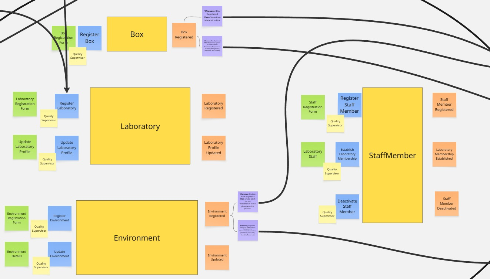 

El Bounded Context de Laboratory Management es responsable de gestionar la estructura física y organizativa del
laboratorio dentro de Qualitrack: el laboratorio, sus ambientes, los boxes donde se almacenan y monitorean los productos
farmacéuticos y el personal que forma parte de él. Su modelo se organiza alrededor de cuatro agregados: Laboratory,
Environment, Box y StaffMember. Este contexto se activa desde Payments & Subscriptions mediante la política Whenever
Subscription Activated Then Laboratory Registered, de modo que un laboratorio solo se registra cuando existe una
suscripción activa. A su vez, se comunica con otros contextos mediante las políticas Whenever Environment Registered
Then Create Batch for the manufacture of the pharmaceutical product (hacia Product Batch Management), Whenever Box
Registered Then Store Raw Material in Box (hacia Inventory Management) y las políticas de registro de equipos de
medición para ambientes y boxes (hacia Equipment Management).

* **Box**

 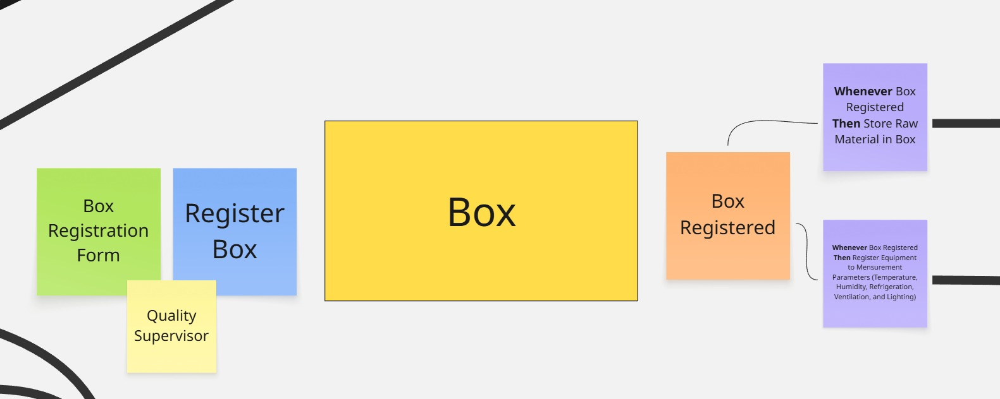 

El agregado Box gestiona los contenedores de productos farmacéuticos asociados a un ambiente. El Quality Supervisor
consulta el read model Box Registration Form y ejecuta el comando Register Box, que produce el evento Box Registered.
Este evento activa dos políticas: Whenever Box Registered Then Store Raw Material in Box, que conecta con Inventory
Management, y Whenever Box Registered Then Register Equipment to Measurement Parameters (Temperature, Humidity,
Refrigeration, Ventilation, and Lighting), que conecta con Equipment Management para registrar los equipos que
monitorearán las condiciones del box.

* **Environment**

 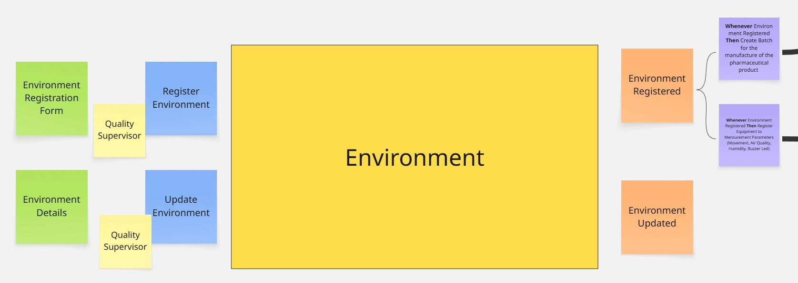 

El agregado Environment controla los ambientes o áreas del laboratorio. El Quality Supervisor consulta el read model
Environment Registration Form y ejecuta el comando Register Environment, que produce el evento Environment Registered.
Con el read model Environment Details puede ejecutar Update Environment, que genera el evento Environment Updated. El
evento Environment Registered activa dos políticas: Whenever Environment Registered Then Create Batch for the
manufacture of the pharmaceutical product, que conecta con Product Batch Management, y Whenever Environment Registered
Then Register Equipment to Measurement Parameters (Movement, Air Quality, Humidity, Buzzer Led), que conecta con
Equipment Management para dotar al ambiente de los equipos de medición necesarios.

* **Laboratory**

 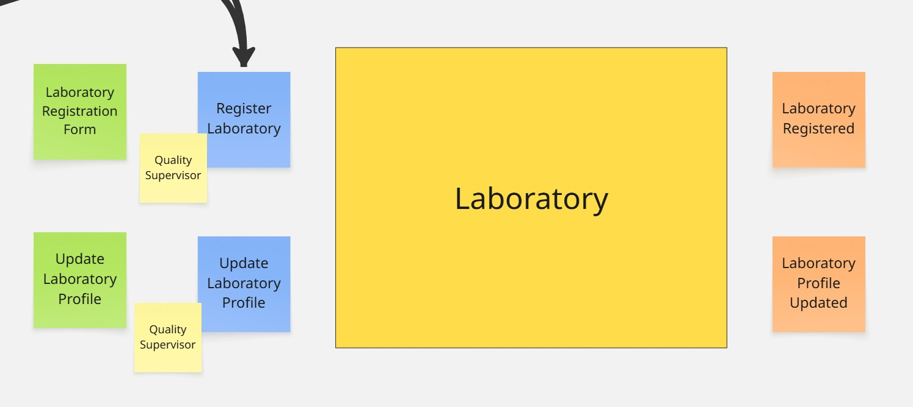 

El agregado Laboratory concentra la información principal del laboratorio. El Quality Supervisor consulta el read model
Laboratory Registration Form y ejecuta el comando Register Laboratory, que produce el evento Laboratory Registered.
Posteriormente, a partir del read model Update Laboratory Profile, ejecuta el comando Update Laboratory Profile, que
genera el evento Laboratory Profile Updated y mantiene actualizada la información y configuración básica del
laboratorio.

* **Staff Member**

 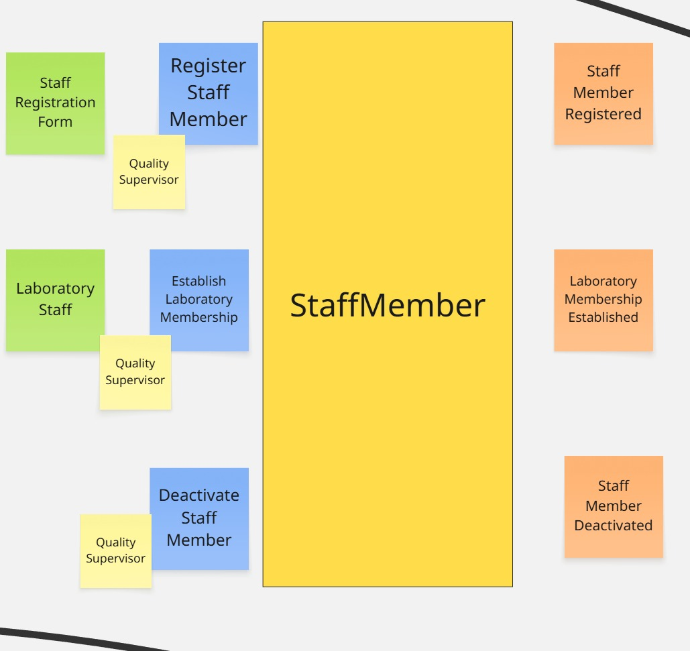 

El agregado StaffMember administra al personal del laboratorio. El Quality Supervisor consulta el read model Staff
Registration Form y ejecuta el comando Register Staff Member, que produce el evento Staff Member Registered. Luego, con
el read model Laboratory Staff, ejecuta Establish Laboratory Membership, que genera el evento Laboratory Membership
Established y vincula al miembro con el laboratorio. Finalmente, el comando Deactivate Staff Member produce el evento
Staff Member Deactivated cuando la persona deja de formar parte del laboratorio.

#### 4.1.1.2 Domain Message Flows Modeling.

Una vez descubiertos los Bounded Contexts candidatos, el equipo necesitaba validar que dichos límites permitieran
resolver los casos reales del negocio. Para ello se aplicó la técnica de visualización *Domain Storytelling*, con la
cual se narran escenarios completos del dominio mostrando quién inicia la historia, qué sistemas participan, qué Bounded
Contexts colaboran y qué mensaje viaja entre ellos en cada paso.

El proceso seguido fue el siguiente:

1. *Selección de escenarios.* A partir de los pivotal points, políticas y líneas de tiempo del Design-Level
   EventStorming se eligieron seis escenarios representativos que atraviesan el sistema de extremo a extremo y que, en
   conjunto, involucran a los nueve Bounded Contexts de QualiTrack.
2. *Identificación de participantes.* Para cada escenario se determinaron los actores (Lab Technician, Quality
   Supervisor, Production Staff, Warehouse Staff, Auditor, Maintenance, Country Manager, IoT Device), los sistemas (la
   aplicación web y móvil de QualiTrack, Stripe) y los Bounded Contexts involucrados.
3. *Definición de los mensajes.* Cada interacción se expresó como un mensaje explícito tomado del Ubiquitous Language ya
   declarado en los Bounded Context Canvases y en el EventStorming: commands (una intención dirigida a un contexto),
   events (un hecho que ya ocurrió dentro de un contexto) y queries (una solicitud de información que no modifica el
   estado).
4. *Ordenamiento y numeración.* Los mensajes se numeraron secuencialmente para reflejar el orden temporal de la
   historia, indicando además los datos que transporta cada mensaje.
5. *Diagramación en Miro.* Cada escenario se modeló en el tablero del equipo utilizando la notación de Domain Message
   Flow Modelling, incluyendo en cada diagrama su propia leyenda de notación.
6. *Validación de los límites.* Se revisó que ningún mensaje obligara a un contexto a conocer conceptos internos de
   otro. Los casos en los que esto ocurría se resolvieron sustituyendo el acceso directo por una query de referencia
   hacia el contexto propietario del dato, lo que confirmó las relaciones Customer/Supplier y ACL definidas en el
   Context Mapping.

La notación empleada en los diagramas es la siguiente:

| Elemento             | Representación           | Significado                                                                       |
|----------------------|--------------------------|-----------------------------------------------------------------------------------|
| Actor / User         | Ícono de persona         | Persona o dispositivo que inicia o recibe una interacción.                        |
| System               | Ícono de engranaje       | Sistema que participa en el flujo (aplicación web y móvil de QualiTrack, Stripe). |
| Bounded Context      | Nube morada              | Contexto delimitado que recibe o emite el mensaje.                                |
| Command              | Tarjeta azul numerada    | Intención: se solicita a un Bounded Context que realice algo.                     |
| Event                | Tarjeta naranja numerada | Hecho: algo que ya ocurrió dentro de un Bounded Context.                          |
| Query                | Tarjeta verde numerada   | Solicitud de información que no modifica el estado.                               |
| Direction of message | Flecha punteada          | Sentido del mensaje, del emisor al receptor.                                      |

A continuación se presentan los seis escenarios modelados.

##### Scenario 1: Environmental deviation detected and alert reviewed

Este escenario evidencia cómo una lectura ambiental fuera de rango se propaga desde los dispositivos IoT hasta la
gestión del ciclo de vida de la alerta y su posterior consolidación analítica.

| # | Mensaje                    | Tipo    | Emisor                                | Receptor                              |
|---|----------------------------|---------|---------------------------------------|---------------------------------------|
| 1 | Record Measurement         | Command | IoT Device                            | Tracking & Telemetry                  |
| 2 | Telemetry Anomaly Detected | Event   | Tracking & Telemetry                  | Compliance & Alerting                 |
| 3 | Get Device Reference       | Query   | Compliance & Alerting                 | Equipment Management                  |
| 4 | Get Environment Reference  | Query   | Compliance & Alerting                 | Laboratory Management                 |
| 5 | Alert Created              | Event   | Compliance & Alerting                 | QualiTrack web and mobile application |
| 6 | Acknowledge Alert          | Command | Quality Supervisor                    | QualiTrack web and mobile application |
| 7 | Acknowledge Alert          | Command | QualiTrack web and mobile application | Compliance & Alerting                 |
| 8 | Resolve Alert              | Command | QualiTrack web and mobile application | Compliance & Alerting                 |
| 9 | Get Alert Lifecycle Data   | Query   | Reporting & Audit                     | Compliance & Alerting                 |

Compliance & Alerting no almacena ni interpreta datos de equipos ni de ambientes: los obtiene mediante queries de
referencia hacia Equipment Management y Laboratory Management, conservando la autoridad de cada contexto sobre su propio
modelo.

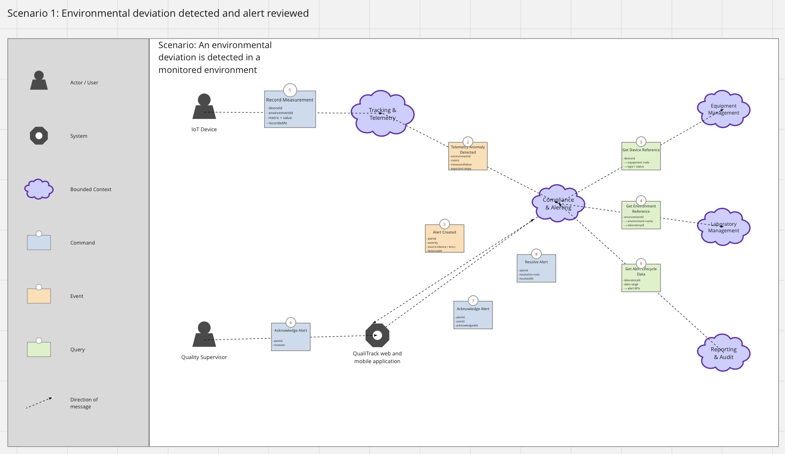

##### Scenario 2: Manufacturing a product batch with raw-material traceability

Este escenario muestra la fabricación de un lote de producto y el registro del consumo de materias primas necesario para
sostener la trazabilidad exigida por el negocio.

| # | Mensaje                                | Tipo    | Emisor                                | Receptor                              |
|---|----------------------------------------|---------|---------------------------------------|---------------------------------------|
| 1 | Create Product Batch                   | Command | Production Staff                      | QualiTrack web and mobile application |
| 2 | Create Product Batch                   | Command | QualiTrack web and mobile application | Product Batch Management              |
| 3 | Get Laboratory and Personnel Reference | Query   | Product Batch Management              | Laboratory Management                 |
| 4 | Get Equipment Availability             | Query   | Product Batch Management              | Equipment Management                  |
| 5 | Get RawMaterialBatch Availability      | Query   | Product Batch Management              | Inventory Management                  |
| 6 | Register Material Consumption          | Command | Product Batch Management              | Inventory Management                  |
| 7 | Raw Material Consumed                  | Event   | Inventory Management                  | Product Batch Management              |
| 8 | Close Product Batch                    | Command | QualiTrack web and mobile application | Product Batch Management              |
| 9 | Get Product Batch Traceability         | Query   | Reporting & Audit                     | Product Batch Management              |

Product Batch Management se mantiene como fuente de verdad de la trazabilidad del lote fabricado, mientras que la
disponibilidad y el descuento de materias primas permanecen bajo la autoridad de Inventory Management.

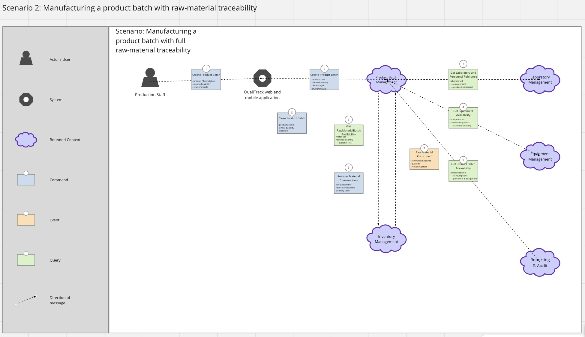

##### Scenario 3: Onboarding, subscription payment and laboratory registration

Este escenario describe la incorporación de una nueva organización a la plataforma, desde el registro del usuario hasta
la activación de la suscripción y el alta del laboratorio.

| # | Mensaje                      | Tipo    | Emisor                                | Receptor                              |
|---|------------------------------|---------|---------------------------------------|---------------------------------------|
| 1 | Register User                | Command | Visitant                              | QualiTrack web and mobile application |
| 2 | Register User                | Command | QualiTrack web and mobile application | Identity & Access Management          |
| 3 | Create Subscription          | Command | QualiTrack web and mobile application | Payments & Subscriptions              |
| 4 | Create Checkout Session      | Command | Payments & Subscriptions              | Stripe                                |
| 5 | Payment Received             | Event   | Stripe                                | Payments & Subscriptions              |
| 6 | Subscription Activated       | Event   | Payments & Subscriptions              | QualiTrack web and mobile application |
| 7 | Register Laboratory          | Command | Country Manager                       | QualiTrack web and mobile application |
| 8 | Register Laboratory          | Command | QualiTrack web and mobile application | Laboratory Management                 |
| 9 | Assign Laboratory Membership | Command | QualiTrack web and mobile application | Laboratory Management                 |

Stripe se modela como sistema externo y la confirmación del pago ingresa al dominio como un evento, evitando que
Payments & Subscriptions dependa de la disponibilidad síncrona del proveedor.

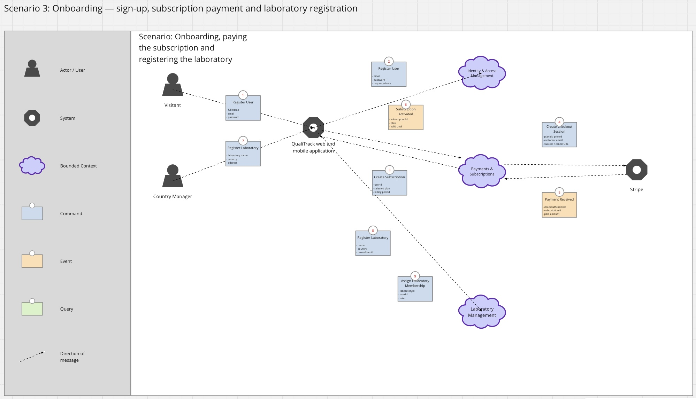

##### Scenario 4: Building the compliance report for a regulatory audit

Este escenario evidencia el carácter downstream de Reporting & Audit, que consolida información proveniente de los demás
Bounded Contexts sin ser propietario de ninguno de sus modelos.

| #  | Mensaje                        | Tipo  | Emisor                                | Receptor                              |
|----|--------------------------------|-------|---------------------------------------|---------------------------------------|
| 1  | Generate Report                | Query | Auditor                               | QualiTrack web and mobile application |
| 2  | Generate Report                | Query | QualiTrack web and mobile application | Reporting & Audit                     |
| 3  | Get Alert Lifecycle Data       | Query | Reporting & Audit                     | Compliance & Alerting                 |
| 4  | Get Product Batch Traceability | Query | Reporting & Audit                     | Product Batch Management              |
| 5  | Get Environmental Information  | Query | Reporting & Audit                     | Tracking & Telemetry                  |
| 6  | Get Equipment Audit Data       | Query | Reporting & Audit                     | Equipment Management                  |
| 7  | Get Inventory Audit Data       | Query | Reporting & Audit                     | Inventory Management                  |
| 8  | Get Subscription Information   | Query | Reporting & Audit                     | Payments & Subscriptions              |
| 9  | Get User Identity              | Query | Reporting & Audit                     | Identity & Access Management          |
| 10 | Get Laboratory Reference       | Query | Reporting & Audit                     | Laboratory Management                 |

Todas las interacciones de este escenario son queries: Reporting & Audit únicamente lee información y la traduce a
indicadores y evidencia de auditoría, lo que confirma su clasificación como contexto de soporte analítico.

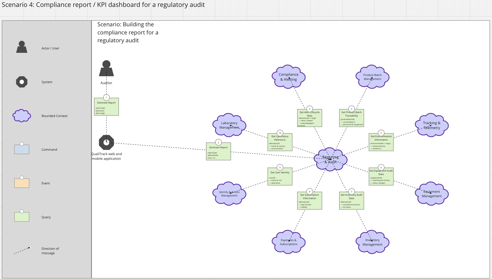

##### Scenario 5: Receiving a raw material lot and raising a low-stock alert

Este escenario muestra la recepción de un lote de materia prima, la validación del estado de la suscripción y la
generación automática de una alerta cuando el stock cae por debajo del mínimo definido.

| # | Mensaje                     | Tipo    | Emisor                                | Receptor                              |
|---|-----------------------------|---------|---------------------------------------|---------------------------------------|
| 1 | Register Raw Material Batch | Command | Warehouse Staff                       | QualiTrack web and mobile application |
| 2 | Register Raw Material Batch | Command | QualiTrack web and mobile application | Inventory Management                  |
| 3 | Get User Reference          | Query   | Inventory Management                  | Identity & Access Management          |
| 4 | Get Subscription Status     | Query   | Inventory Management                  | Payments & Subscriptions              |
| 5 | Low Stock Detected          | Event   | Inventory Management                  | Compliance & Alerting                 |
| 6 | Low Stock Alert Created     | Event   | Compliance & Alerting                 | QualiTrack web and mobile application |
| 7 | Change Batch Status         | Command | Quality Staff                         | QualiTrack web and mobile application |
| 8 | Change Batch Status         | Command | QualiTrack web and mobile application | Inventory Management                  |
| 9 | Get Inventory Audit Data    | Query   | Reporting & Audit                     | Inventory Management                  |

La cuarentena o liberación de un lote de materia prima permanece dentro de Inventory Management, mientras que el ciclo
de vida de la alerta generada es responsabilidad exclusiva de Compliance & Alerting.

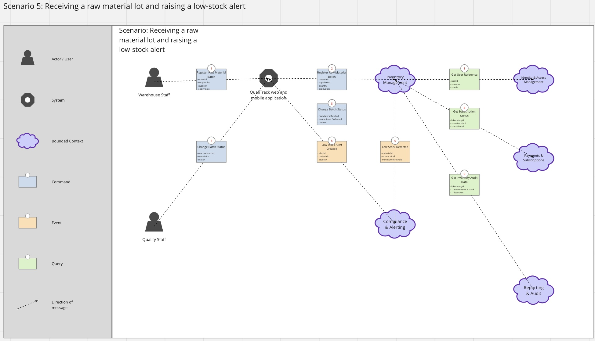

##### Scenario 6: Equipment maintenance and calibration expiry

Este escenario describe el registro del mantenimiento de un equipo y la alerta generada cuando su calibración vence, así
como el uso de esa información por parte de la fabricación y la auditoría.

| # | Mensaje                              | Tipo    | Emisor                                | Receptor                              |
|---|--------------------------------------|---------|---------------------------------------|---------------------------------------|
| 1 | Register Equipment                   | Command | Maintenance                           | QualiTrack web and mobile application |
| 2 | Register Equipment                   | Command | QualiTrack web and mobile application | Equipment Management                  |
| 3 | Register Maintenance                 | Command | QualiTrack web and mobile application | Equipment Management                  |
| 4 | Change Equipment Status              | Command | Quality Supervisor                    | QualiTrack web and mobile application |
| 5 | Calibration Expired                  | Event   | Equipment Management                  | Compliance & Alerting                 |
| 6 | Calibration Expiration Alert Created | Event   | Compliance & Alerting                 | QualiTrack web and mobile application |
| 7 | Get Environment Reference            | Query   | Compliance & Alerting                 | Laboratory Management                 |
| 8 | Get Equipment Audit Data             | Query   | Reporting & Audit                     | Equipment Management                  |
| 9 | Get Equipment Availability           | Query   | Product Batch Management              | Equipment Management                  |

Equipment Management conserva la autoridad sobre el estado y la calibración de los equipos; tanto Product Batch
Management como Reporting & Audit consumen esa información mediante queries explícitas, sin replicar el modelo.

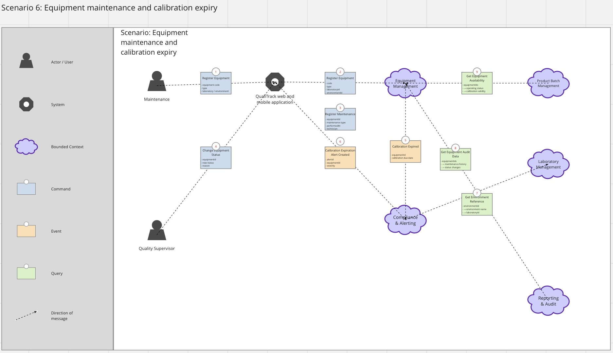

El modelado de estos seis escenarios permitió verificar que los Bounded Contexts definidos son suficientes para resolver
los casos de negocio de QualiTrack y que las colaboraciones entre ellos pueden expresarse mediante contratos explícitos.
Asimismo, evidenció que la mayor parte de las dependencias corresponde a queries de referencia hacia el contexto
propietario del dato y a events que comunican hechos ya ocurridos, patrón que sustenta las relaciones Customer/Supplier
y Anti-Corruption Layer documentadas posteriormente en el Context Mapping.

#### 4.1.1.3 Bounded Context Canvases.

A partir del análisis estratégico del dominio de QualiTrack, se documentaron los Bounded Contexts identificados mediante
**Bounded Context Canvases**. Estos artefactos permiten describir individualmente el propósito de cada contexto, su
clasificación estratégica, sus roles dentro del dominio, las comunicaciones entrantes y salientes, su Ubiquitous
Language, las principales decisiones de negocio, los supuestos considerados, las métricas de verificación y las
preguntas abiertas.

Los Bounded Context Canvases se presentan de acuerdo con su prioridad estratégica dentro del dominio. En primer lugar se
muestran los contextos que concentran las capacidades principales de QualiTrack, posteriormente aquellos que brindan
soporte a dichas capacidades y, finalmente, los contextos correspondientes a capacidades transversales o ampliamente
estandarizadas.

El orden definido es el siguiente:

1. Product Batch Management
2. Tracking & Telemetry
3. Compliance & Alerting
4. Inventory Management
5. Laboratory Management
6. Equipment Management
7. Payments & Subscriptions
8. Reporting & Audit
9. Identity & Access Management (IAM)
10. Profile Management

El orden definido responde a la relevancia estratégica de cada Bounded Context para la propuesta de valor de QualiTrack,
priorizando las capacidades directamente relacionadas con la trazabilidad, monitoreo, cumplimiento y control de los
procesos del laboratorio.

##### Product Batch Management Context - Canvas

Product Batch Management administra los productos y lotes fabricados, así como la información necesaria para mantener su
trazabilidad.

Cada `ProductBatch` puede relacionarse con las materias primas, equipos, laboratorio y personal involucrado durante el
proceso de fabricación, manteniendo separadas las responsabilidades pertenecientes a dichos dominios.

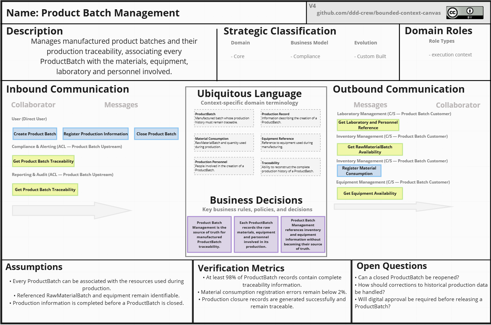

##### Tracking & Telemetry Context - Canvas

Tracking & Telemetry administra las mediciones ambientales, configuraciones de monitoreo, estados interpretados y
actuaciones asociadas a los dispositivos IoT.

Este contexto representa el estado físico observado dentro de los ambientes mediante conceptos como `Measurement`,
`Environmental Profile`, estados `NORMAL`, `WARNING` o `CRITICAL` y `ActuationEvent`.

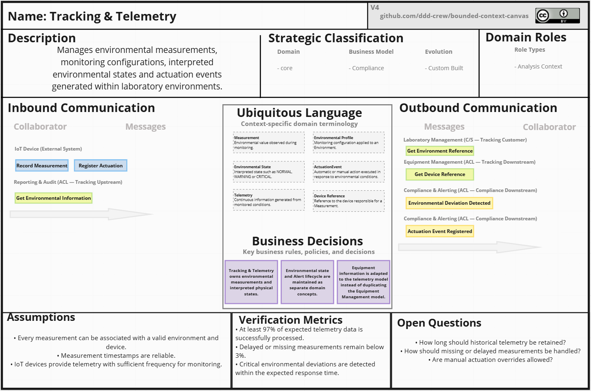

##### Compliance & Alerting Context - Canvas

Compliance & Alerting administra el ciclo de vida de las alertas e incidentes identificados dentro de QualiTrack.

El contexto transforma información proveniente de otros dominios en conceptos propios como `Alert`, `Severity`,
`Acknowledgement`, `Resolution` e `Impact Assessment`.

De esta manera se mantiene separada la detección física de una condición respecto de su evaluación, seguimiento y
resolución.

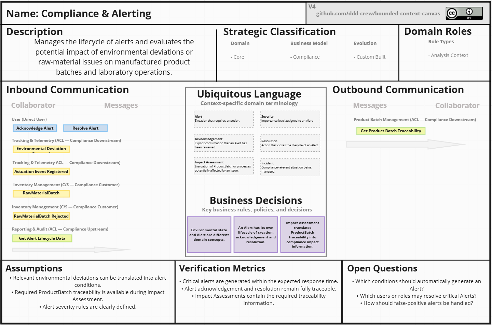

##### Inventory Management Context - Canvas

Inventory Management administra las materias primas, `RawMaterialBatch`, cantidades disponibles, stock y estados
asociados con los lotes de materia prima.

Este contexto constituye la fuente de verdad respecto a la disponibilidad y estado de los materiales utilizados durante
los procesos de fabricación.

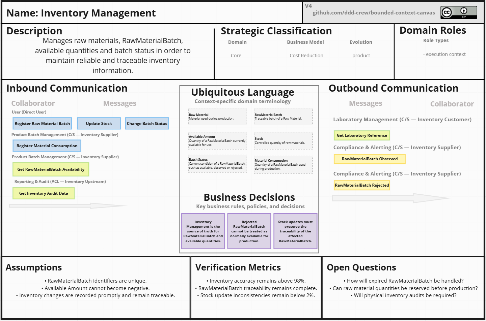

##### Laboratory Management Context - Canvas

Laboratory Management administra los laboratorios, sus ambientes físicos y la relación existente entre los usuarios y la
organización mediante conceptos como `Laboratory Membership`.

Este contexto proporciona la estructura organizacional utilizada como referencia por otros dominios sin transferirles la
responsabilidad de administrar laboratorios y ambientes.

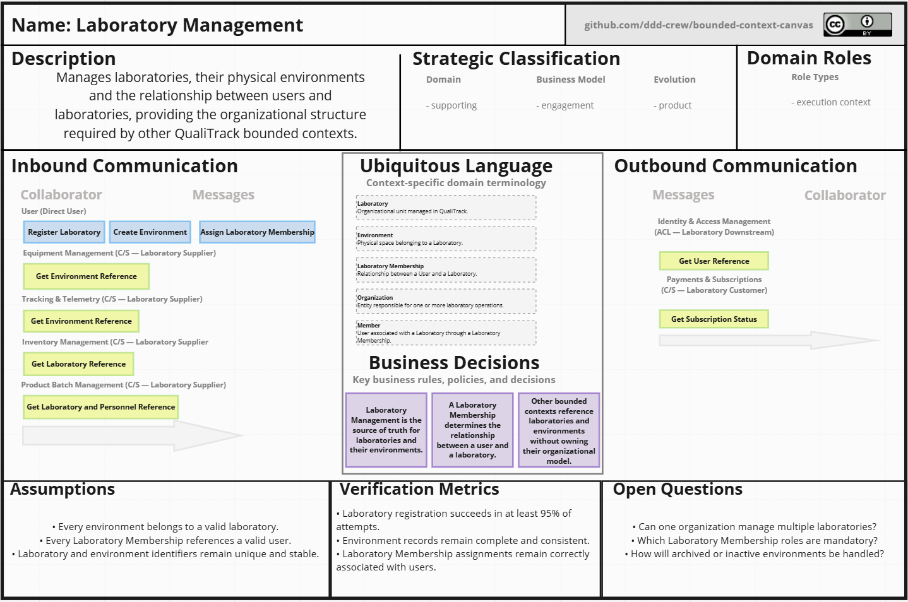

##### Equipment Management Context - Canvas

Equipment Management administra los equipos, instrumentos y dispositivos IoT registrados dentro de los laboratorios,
incluyendo su identidad, ubicación y estado operativo.

Otros Bounded Contexts utilizan referencias de los equipos cuando requieren relacionarlos con procesos de telemetría,
fabricación o reporting, sin asumir la responsabilidad de administrar dichos activos.

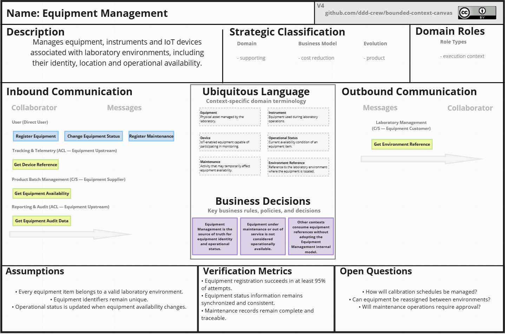

##### Payments & Subscriptions Context - Canvas

Payments & Subscriptions administra los planes, pagos, suscripciones y estados relacionados con la relación comercial
entre los usuarios u organizaciones y QualiTrack.

Este contexto mantiene separadas las reglas comerciales de las responsabilidades operativas del laboratorio y actúa como
fuente de verdad respecto al estado de las suscripciones.

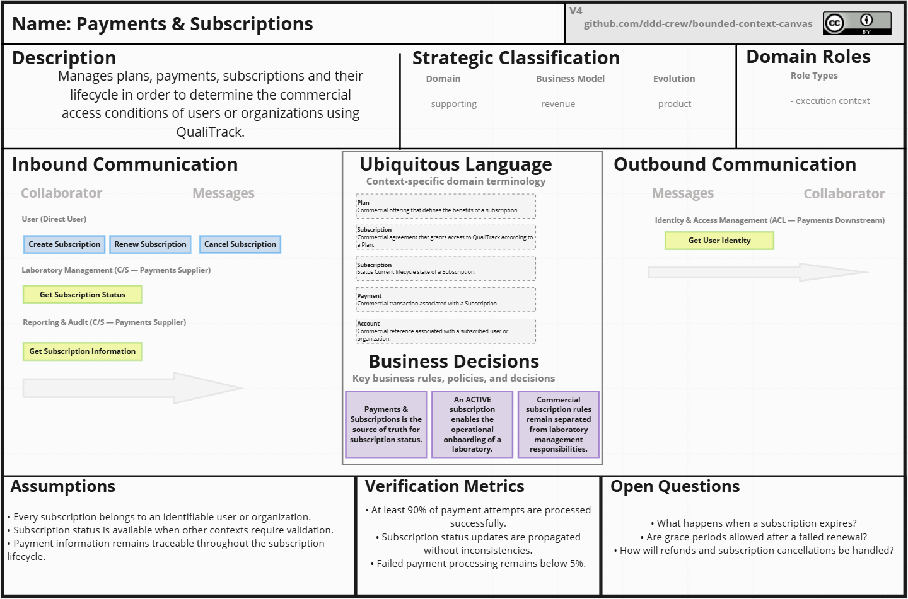

##### Reporting & Audit Context - Canvas

Reporting & Audit administra reportes, indicadores, información histórica, evidencia de auditoría y vistas de
trazabilidad.

Consume información proveniente de distintos Bounded Contexts y la transforma en conceptos propios como `Report`,
`Audit Record`, `Traceability View`, `KPI` y `Environmental Metrics`, sin convertirse en una segunda fuente de verdad de
los datos operativos.

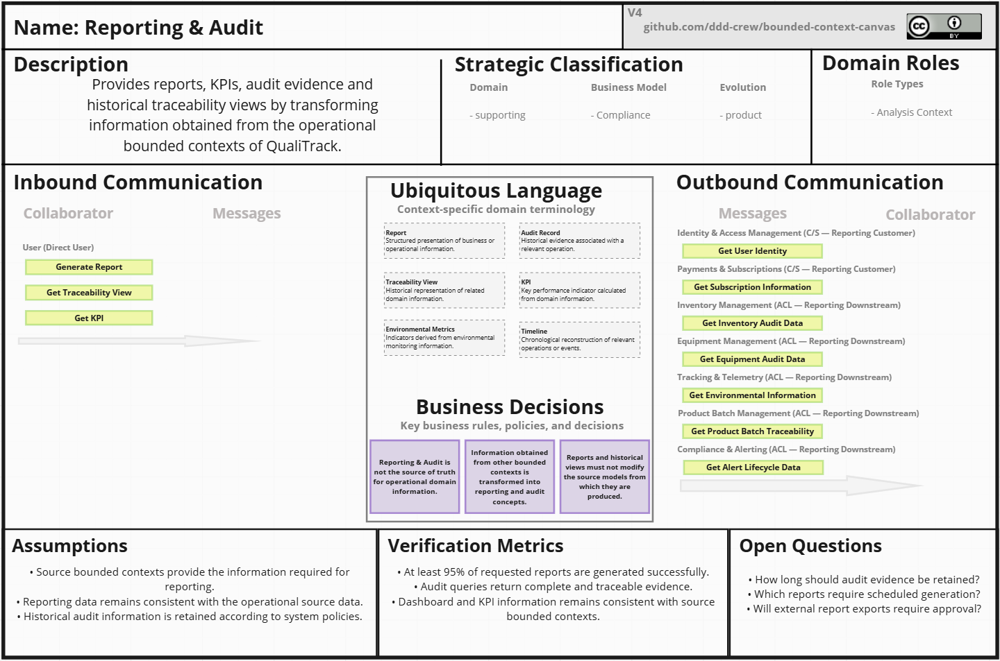

##### Identity & Access Management (IAM) Context - Canvas

Identity & Access Management administra la identidad utilizada por los diferentes contextos de QualiTrack.

Su principal responsabilidad consiste en mantener separados los conceptos relacionados con identidad y autenticación
respecto de los modelos específicos utilizados por los demás dominios.

Otros Bounded Contexts utilizan únicamente referencias como `UserId` para identificar usuarios sin incorporar
directamente las entidades internas de IAM.

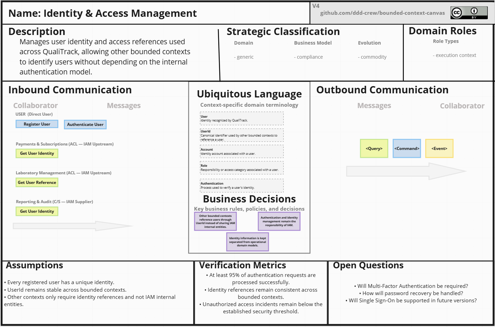

##### Profile Management Context - Canvas

Profile Management administra los datos personales que cada persona mantiene sobre sí misma en QualiTrack, separados de
la cuenta de acceso que conserva Identity & Access Management. Otros contextos lo consultan para mostrar el nombre de
las personas, sin incorporar su modelo.

| Elemento                     | Descripción                                                                                                                                                                                                                                                                |
|------------------------------|----------------------------------------------------------------------------------------------------------------------------------------------------------------------------------------------------------------------------------------------------------------------------|
| **Name**                     | Profile Management                                                                                                                                                                                                                                                         |
| **Purpose**                  | Conservar el nombre completo, DNI, teléfono, ubicación y foto de cada cuenta, y entregar a los demás contextos el nombre con que se muestra a una persona.                                                                                                                 |
| **Strategic Classification** | Generic subdomain (Profiles and Preferences Management). No diferencia a QualiTrack frente a la competencia, pero es necesario para identificar a las personas en la trazabilidad.                                                                                         |
| **Domain Roles**             | Specification model: guarda datos que las personas actualizan y que otros contextos leen.                                                                                                                                                                                  |
| **Inbound Communication**    | La Single-Page Application consulta y actualiza el perfil y la foto del usuario autenticado y consulta el perfil del personal (`GET/PUT /users/me/profile`, `GET .../staff/{staffId}/profile`). Compliance & Alerting solicita el nombre de una persona (`displayNameOf`). |
| **Outbound Communication**   | Consulta en IAM la cuenta del perfil y en Laboratory Management el registro del personal vinculado. Publica `ProfileUpdatedIntegrationEvent` para que Laboratory Management actualice el nombre en la lista del personal.                                                  |
| **Ubiquitous Language**      | Profile, Person Name, DNI, Phone Number, Location, Profile Photo, Staff Profile.                                                                                                                                                                                           |
| **Business Decisions**       | El perfil se crea la primera vez que la persona lo guarda. La foto admite JPEG, PNG o WebP de hasta 2 MB y se guarda aparte del perfil. Si una persona no registró su nombre, se muestra su usuario.                                                                       |
| **Assumptions**              | Cada cuenta tiene a lo sumo un perfil. El responsable de calidad solo consulta, sin modificar, el perfil de su personal.                                                                                                                                                   |
| **Verification Metrics**     | Porcentaje de personas del laboratorio con nombre completo registrado; alertas y decisiones de lote que muestran el nombre de quien las atendió.                                                                                                                           |
| **Open Questions**           | ¿Se trasladarán aquí las preferencias de notificación, hoy en Compliance & Alerting, si crecen las preferencias del usuario?                                                                                                                                               |