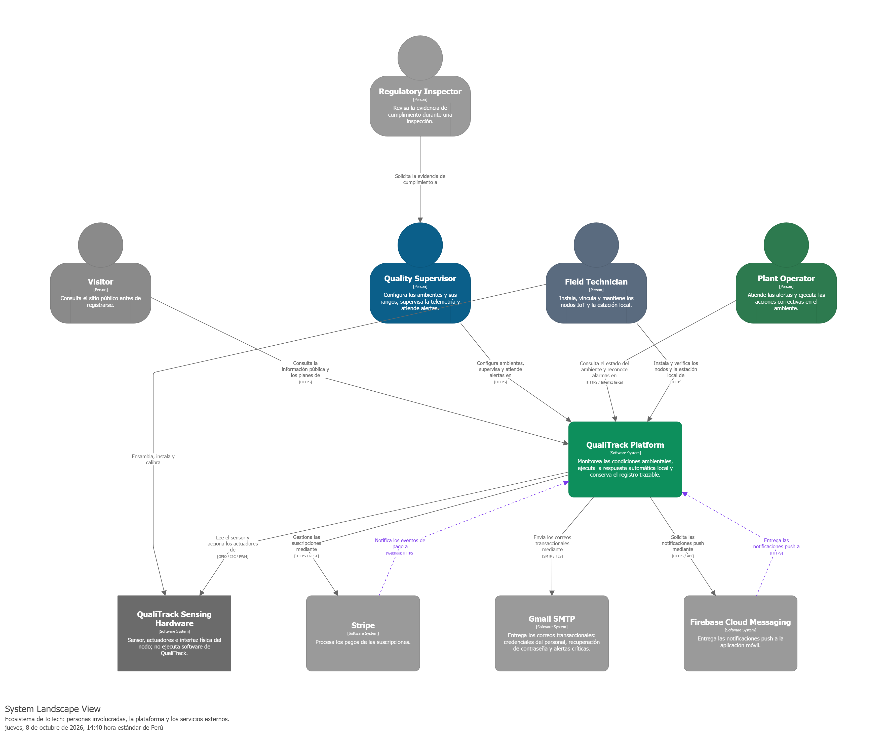
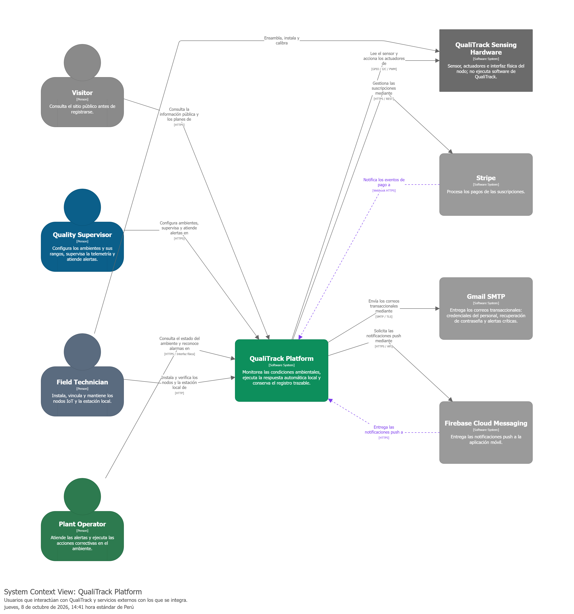
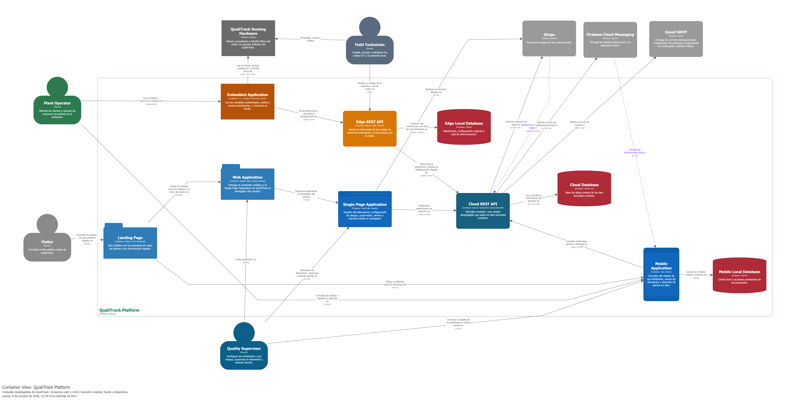

### 4.1.3. Software Architecture.

En esta sección se presenta la arquitectura de software de QualiTrack documentada mediante el C4 Model propuesto por
Simon Brown, utilizando Structurizr DSL como fuente única de verdad. El modelo se define una sola vez en el archivo
`../../../docs/c4/qualitrack-workspace.dsl`, versionado en el repositorio del informe dentro de la organización, y a
partir de él se generan las vistas que se exportan como imágenes para este informe; el código DSL no forma parte del
documento.

#### 4.1.3.1. Software Architecture System Landscape Diagram.

La vista System Landscape presenta el panorama general del ecosistema en el que opera IoTech. A diferencia del Context
Diagram, esta vista no se restringe a los elementos conectados directamente con el sistema de interés: incorpora actores
y relaciones del entorno del laboratorio farmacéutico que explican cómo se realiza hoy el control de condiciones
ambientales y qué dependencias forman parte del panorama operativo, aun cuando no pasen por la plataforma.

##### Personas del ecosistema:

Visitor: persona que consulta el sitio público de IoTech para conocer la propuesta de valor, los planes y los documentos
legales antes de registrarse.
Quality Supervisor: responsable de calidad del laboratorio o almacén. Configura los ambientes monitoreados y sus rangos
permitidos, supervisa la telemetría, atiende las alertas por desviación y genera la evidencia de trazabilidad.
Plant Operator: operario de planta. Atiende las alertas en sitio y ejecuta las acciones correctivas sobre el ambiente,
tanto desde la aplicación móvil como desde la interfaz física del nodo IoT.
Field Technician: técnico de campo de IoTech. Instala, vincula y mantiene los nodos IoT y la estación local, y verifica
su estado operativo.
Regulatory Inspector: inspector regulatorio (DIGEMID u organismo equivalente). No es usuario del sistema: solicita la
evidencia de cumplimiento al Quality Supervisor durante una inspección. Se incluye en el landscape porque su exigencia
es el driver de negocio que justifica el registro trazable.

##### Sistemas del ecosistema:

QualiTrack Platform: sistema de interés. Monitorea las condiciones ambientales, ejecuta la respuesta automática local y
conserva el registro trazable de mediciones, desviaciones y acciones correctivas.
Stripe: procesa los pagos de las suscripciones de los laboratorios clientes.
Gmail SMTP: entrega los correos transaccionales (credenciales del personal, códigos de recuperación de contraseña y
aviso de desviación crítica). El backend también admite Resend API como proveedor alternativo, configurable sin cambiar
el código.
Firebase Cloud Messaging: entrega las notificaciones push a la aplicación móvil.
QualiTrack Sensing Hardware: sensor BME680, actuadores e interfaz física del nodo. Se modela como sistema externo porque
no ejecuta software de QualiTrack: la Embedded Application lo gobierna a través de GPIO, I2C y PWM, pero el hardware en
sí queda fuera del límite del sistema de software.

En conjunto, el landscape muestra que QualiTrack se ubica entre un plano físico (el ambiente monitoreado y su hardware)
y un plano de cumplimiento normativo (la evidencia exigida al laboratorio), integrando servicios externos únicamente
para capacidades genéricas: cobro, correo y notificación push.

#### 4.1.3.2. Software Architecture Context Level Diagrams.

La vista **System Context** centra la representación en QualiTrack Platform como caja negra y muestra únicamente las
personas y los sistemas externos que mantienen una relación directa con él. Su propósito es delimitar la frontera del
sistema y las responsabilidades que quedan fuera de ella, sin exponer decisiones de tecnología interna.

**Relaciones con las personas:**

- **Visitor → QualiTrack Platform** *(HTTPS)*: consulta la información pública y los planes.
- **Quality Supervisor → QualiTrack Platform** *(HTTPS)*: configura los ambientes monitoreados y sus rangos, supervisa
  la telemetría y atiende las alertas.
- **Plant Operator → QualiTrack Platform** *(HTTPS / interfaz física)*: consulta el estado del ambiente y reconoce las
  alarmas. Es el único actor con dos canales de interacción: digital, desde la aplicación móvil, y físico, desde el
  pulsador y el display del nodo IoT.
- **Field Technician → QualiTrack Platform** *(HTTP)*: instala y verifica los nodos y la estación local dentro de la red
  de la sede.

**Relaciones con los sistemas externos:**

- **QualiTrack Platform → Stripe** *(HTTPS / REST)*: gestiona la contratación y el estado de las suscripciones.
- **Stripe → QualiTrack Platform** *(Webhook HTTPS, asíncrona)*: notifica los eventos de pago. Se modela como relación
  de retorno y no como simple respuesta, porque la confirmación del pago llega fuera del ciclo de la solicitud original.
- **QualiTrack Platform → Gmail SMTP** *(SMTP / TLS)*: solicita el envío de los correos transaccionales.
- **QualiTrack Platform → Firebase Cloud Messaging** *(HTTPS / API)*: solicita el envío de las notificaciones push.
- **Firebase Cloud Messaging → QualiTrack Platform** *(HTTPS, asíncrona)*: entrega la notificación al dispositivo del
  usuario.
- **QualiTrack Platform → QualiTrack Sensing Hardware** *(GPIO / I2C / PWM)*: lee el sensor y acciona los actuadores del
  nodo.

#### 4.1.3.3. Software Architecture Container Level Diagrams.

La vista Container descompone QualiTrack Platform en sus unidades desplegables de forma independiente, mostrando la
distribución de responsabilidades entre ellas, las decisiones principales de tecnología y los protocolos de
comunicación. Siguiendo la definición de C4, un contenedor es una unidad ejecutable o almacén de datos desplegable por
separado, no un contenedor de Docker.

**Productos web:**

- **Landing Page** — *HTML5, CSS3, JavaScript.* Sitio estático público con la propuesta de valor, los planes y los
  documentos legales. Sus call-to-action dirigen al visitante hacia el registro y el inicio de sesión en la Web
  Application, o hacia la descarga de la Mobile Application.
- **Web Application** — *Angular build, Firebase Hosting.* Es el punto de acceso web de QualiTrack: el Quality
  Supervisor la visita por HTTPS y esta entrega a su navegador el contenido estático y la Single-Page Application. No
  contiene lógica de negocio; su responsabilidad es servir la aplicación compilada.
- **Single-Page Application** — *TypeScript, Angular.* Se ejecuta en el navegador del Quality Supervisor una vez que la
  Web Application la entrega. Cubre la gestión de la instalación, sus ambientes y su personal, el perfil del usuario, el
  inventario de materia prima, los equipos y la vinculación de nodos, la configuración de rangos, la supervisión de
  telemetría, los productos y lotes, la atención de alertas y los reportes de trazabilidad. Consume el Cloud REST API
  mediante JSON sobre HTTPS y redirige al checkout alojado de Stripe.

La separación entre **Web Application** y **Single-Page Application** sigue la convención de C4 para aplicaciones de una
sola página: el usuario visita la Web Application (relación *Visita QualiTrack en*), esta entrega la SPA al navegador
(relación *Entrega la aplicación al navegador del usuario*) y, desde ese momento, el usuario trabaja sobre la SPA, que
es la que se comunica con el Cloud REST API. Por eso la Landing Page dirige al visitante hacia la Web Application y no
directamente hacia la SPA.

**Producto móvil:**

- **Mobile Application** — *Dart, Flutter.* Permite consultar el estado de los ambientes, recibir avisos de desviación y
  registrar la atención de alertas en sitio. Consume el Cloud REST API vía JSON sobre HTTPS y recibe las notificaciones
  push desde Firebase Cloud Messaging.
- **Mobile Local Database** — *SQLite.* Conserva el último estado conocido de los ambientes y las acciones pendientes de
  sincronización, de modo que el operario pueda consultar información dentro de zonas de la planta sin cobertura
  estable.

**Servicio central:**

- **Cloud REST API** — *Java 26, Spring Boot, Spring Data JPA.* Monolito modular: una única unidad desplegable que aloja
  los diez bounded contexts identificados en el Strategic-Level DDD (Identity & Access Management, Profile Management,
  Payments & Subscriptions, Laboratory Management, Inventory Management, Equipment Management, Tracking & Telemetry,
  Product Batch Management, Compliance & Alerting, Reporting & Audit). La decisión de mantener un solo contenedor en
  lugar de un despliegue por contexto responde al tamaño del equipo y al alcance del ciclo: los límites se preservan en
  el código mediante módulos y Anti-Corruption Layers, no mediante procesos separados, y la descomposición interna se
  documenta en las vistas de componentes de la sección 4.2.
- **Cloud Database** — *MySQL 8.4.* Persistencia central de los diez bounded contexts. Se accede mediante JPA sobre TCP
    3306.

**Borde:**

- **Edge REST API** — *Python, Flask, Peewee.* Se ejecuta en la sede del cliente. Recibe la telemetría y los eventos de
  actuación de los nodos, los conserva localmente, entrega a cada nodo la configuración vigente y sincroniza con la
  nube. Su existencia garantiza que la pérdida de conectividad a internet no interrumpa la captura de datos ni el
  control local.
- **Edge Local Database** — *SQLite.* Almacena las mediciones, la configuración vigente y la cola de sincronización
  pendiente.

**Dispositivo:**

- **Embedded Application** — *C++, Arduino Framework, ESP32.* Lee las variables ambientales, evalúa cada lectura contra
  la configuración vigente, acciona los actuadores localmente, gobierna la interfaz física (display, indicador, alarma y
  pulsador) y comunica la telemetría al Edge REST API mediante JSON sobre HTTP. El lazo de control se cierra en el
  dispositivo y no en la nube, de modo que la respuesta ante una desviación no depende de la disponibilidad de la red.

#### 4.1.3.4. Software Architecture Deployment Diagrams.

La vista **Deployment** muestra cómo las instancias de los contenedores descritos se distribuyen sobre la
infraestructura de ejecución del entorno **Production**, cubriendo tres planos: la sede farmacéutica del cliente, la
infraestructura cloud (backend, base de datos y hosting de los productos web) y los dispositivos del usuario.

**Pharmaceutical Facility** — sede del laboratorio o almacén cliente, sobre red local Ethernet / WiFi:

- **QualiTrack Sensing Node** — ESP32 DevKit v1 con sensor BME680, ventilador, servomotor SG90, display, LED indicador,
  buzzer y pulsador. Aloja la instancia de la Embedded Application y el QualiTrack Sensing Hardware que esta gobierna.
- **QualiTrack Local Station** — Raspberry Pi 4 con Raspberry Pi OS Lite, que ejecuta **Docker Engine** mediante Docker
  Compose. Dentro de él, el servicio `qualitrack-edge` corre la Edge REST API sobre Gunicorn, y el volumen persistente
  `qualitrack-data` conserva la Edge Local Database, de modo que las mediciones sobreviven al reinicio o la recreación
  del contenedor.

**Infraestructura cloud:**

- **Microsoft Azure** — *región Chile Central, grupo de recursos `iotech-qualitrack-rg`.* Concentra el backend y su base
  de datos:
    - **Container Apps Environment** con la Container App **`iotech-qualitrack-api`**, que ejecuta el monolito modular
      empaquetado en Docker (Java 26, Spring Boot), expone el puerto 8080 y publica la documentación OpenAPI.
    - **Azure Container Registry `iotechqualitrack`** — almacena la imagen Docker del backend. El workflow de GitHub
      Actions la construye y la publica con cada integración en `main`, y la Container App la descarga mediante su
      identidad administrada.
    - **Azure Database for MySQL Flexible Server `iotech-qualitrack-mysql`** — *MySQL 8.4, Burstable B1ms.* Aloja la
      Cloud Database `iotech_qualitrack`.
- **GitHub Pages** — hosting estático donde se publica la instancia del Landing Page.
- **Firebase** — plataforma de Google que concentra tres nodos: **Firebase Hosting**, que aloja la instancia de la Web
  Application y entrega el build de producción de la aplicación Angular; **Firebase App Distribution**, que entrega el
  APK a los evaluadores registrados; y **Firebase Cloud Messaging**, que entrega las notificaciones push a los
  dispositivos registrados.
- **Third-Party SaaS Providers** — agrupa las instancias de Stripe y Gmail SMTP consumidas por el backend.

**Dispositivos del usuario:**

- **User Computer** — computador del responsable de calidad (Windows, macOS o Linux). La Single-Page Application se
  ejecuta como instancia dentro del navegador (Chrome, Edge o Safari) después de que la Web Application alojada en
  Firebase Hosting la entrega, coherente con el hecho de que una SPA se ejecuta en el cliente y no en el servidor.
- **User Mobile Device** — teléfono Android 10 o superior del responsable de calidad o del operario. Sobre Android OS se
  instalan la Mobile Application y su Mobile Local Database.

La relación **Firebase App Distribution → Mobile Application** representa la entrega e instalación de la compilación de
prueba en el dispositivo del evaluador, tal como exige el alcance del curso para la distribución de aplicaciones
móviles.

El diagrama evidencia la naturaleza distribuida de la solución en los tres niveles exigidos por el logro del curso:
**Embedded Systems** en el nodo ESP32, **Edge Computing** en la estación local de la sede y **Cloud Computing** en
Microsoft Azure, con los productos de usuario ejecutándose en navegador y dispositivo móvil.